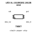
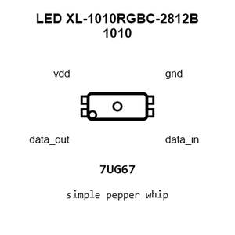
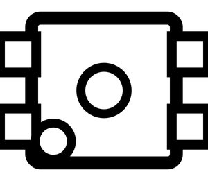
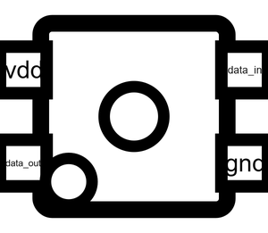
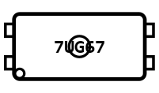
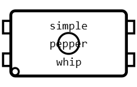
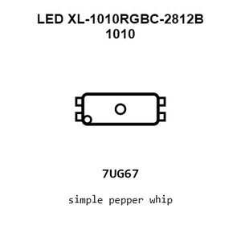
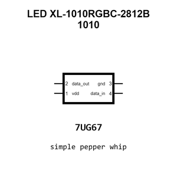
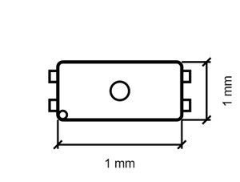
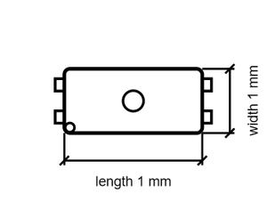

# LED XL-1010RGBC-2812B 1010

`electronic_led_1010_rgb_ws2812b_xinglight_1010rgbc`

LED XL-1010RGBC-2812B 1010 is an OOMP electronic led definition. It uses the 1010 package or form factor. Its nominal drawing size is 1.0 &#x00D7; 1.0 mm. The definition includes 4 documented pins.

## At a glance

| Detail | Value |
| --- | --- |
| OOMP ID | `electronic_led_1010_rgb_ws2812b_xinglight_1010rgbc` |
| Type | Led |
| Package / style | 1010 |
| Nominal size | 1.0 &#x00D7; 1.0 mm |
| Documented pins | 4 |

## Classification

| Level | Value |
| --- | --- |
| 1 | `electronic` |
| 2 | `led` |
| 3 | `1010` |
| 4 | `rgb` |
| 5 | `ws2812b` |
| 6 | `xinglight` |
| 7 | `1010rgbc` |

## Nominal dimensions

| Measurement | Value |
| --- | ---: |
| Length | 1.0 mm |
| Width | 1.0 mm |

## Identifiers

| Identifier | Value |
| --- | --- |
| Manufacturer part number | `XL-1010RGBC-2812B` |
| LCSC | [`C5349953`](https://www.lcsc.com/product-detail/C5349953.html) |

## Pins

| Pin | Name | Type |
| ---: | --- | --- |
| 1 | vdd | signal |
| 2 | data_out | signal |
| 3 | gnd | signal |
| 4 | data_in | signal |

## Files

[KiCad symbol, machine-solder and hand-solder footprints](data/kicad/README.md) · [Availability and source masters](data/kicad/manifest.yaml)

[View this part on GitHub](https://github.com/oomlout/oomp_electronic_version_5/tree/main/parts/electronic_led_1010_rgb_ws2812b_xinglight_1010rgbc)

[Browse this category](../../navigation/electronic/led/1010/rgb/ws2812b/xinglight/README.md)

---

This page is generated from the OOMP part definition by a Roboclick Jinja template. Edit the source taxonomy or template rather than this generated file.