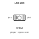
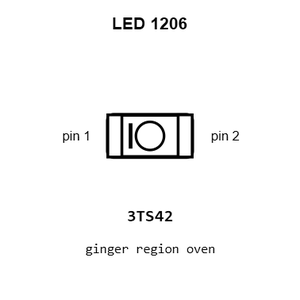
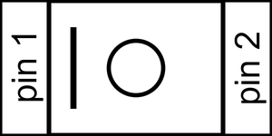
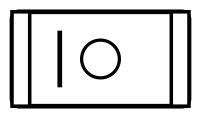
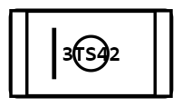
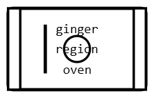
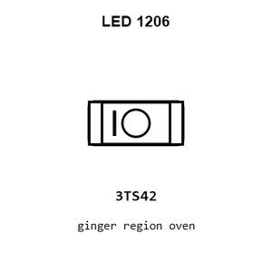
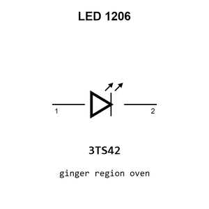
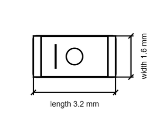

# LED  1206

`electronic_led_1206`

LED  1206 is an OOMP electronic led definition. It uses the 1206 package or form factor. Its nominal drawing size is 3.2 &#x00D7; 1.6 mm.

## At a glance

| Detail | Value |
| --- | --- |
| OOMP ID | `electronic_led_1206` |
| Type | Led |
| Package / style | 1206 |
| Nominal size | 3.2 &#x00D7; 1.6 mm |

## Classification

| Level | Value |
| --- | --- |
| 1 | `electronic` |
| 2 | `led` |
| 3 | `1206` |

## Nominal dimensions

| Measurement | Value |
| --- | ---: |
| Length | 3.2 mm |
| Width | 1.6 mm |

## Used in projects

| Project | Quantity | References | Explore |
| --- | ---: | --- | --- |
| [Project adafruit/Adafruit-Circuit-Playground-Express-PCB Adafruit Circuit Playground Express current](https://github.com/adafruit/Adafruit-Circuit-Playground-Express-PCB/blob/master/Adafruit%20Circuit%20Playground%20Express.brd) | 2 | D3, D5 | [Board explorer](https://oomlout.github.io/oomp_electronic_version_5/parts/oomp_project_github_adafruit_adafruit_circuit_playground_express_pcb_adafruit_circuit_playground_express_current/board_explorer.html) · [OOMP project](https://github.com/oomlout/oomp_electronic_version_5/tree/main/parts/oomp_project_github_adafruit_adafruit_circuit_playground_express_pcb_adafruit_circuit_playground_express_current) |
| [Project adafruit/Adafruit-High-Power-Infrared-LED-Emitter-PCB IR STEMMA LED Emitter current](https://github.com/adafruit/Adafruit-High-Power-Infrared-LED-Emitter-PCB/blob/main/IR%20STEMMA%20LED%20Emitter.brd) | 2 | D3, D4 | [Board explorer](https://oomlout.github.io/oomp_electronic_version_5/parts/oomp_project_github_adafruit_adafruit_high_power_infrared_led_emitter_pcb_ir_stemma_led_emitter_current/board_explorer.html) · [OOMP project](https://github.com/oomlout/oomp_electronic_version_5/tree/main/parts/oomp_project_github_adafruit_adafruit_high_power_infrared_led_emitter_pcb_ir_stemma_led_emitter_current) |
| [Project adafruit/Adafruit-Infrared-IR-Remote-Transceiver Adafruit Infrared IR Remote Transceiver current](https://github.com/adafruit/Adafruit-Infrared-IR-Remote-Transceiver/blob/main/Adafruit%20Infrared%20IR%20Remote%20Transceiver.brd) | 2 | D4, D5 | [Board explorer](https://oomlout.github.io/oomp_electronic_version_5/parts/oomp_project_github_adafruit_adafruit_infrared_ir_remote_transceiver_adafruit_infrared_ir_remote_transceiver_current/board_explorer.html) · [OOMP project](https://github.com/oomlout/oomp_electronic_version_5/tree/main/parts/oomp_project_github_adafruit_adafruit_infrared_ir_remote_transceiver_adafruit_infrared_ir_remote_transceiver_current) |
| [Project adafruit/Adafruit-LED-Sequin-PCB Adafruit LED Sequin current](https://github.com/adafruit/Adafruit-LED-Sequin-PCB/blob/master/Adafruit%20LED%20Sequin.brd) | 1 | LED1 | [Board explorer](https://oomlout.github.io/oomp_electronic_version_5/parts/oomp_project_github_adafruit_adafruit_led_sequin_pcb_adafruit_led_sequin_current/board_explorer.html) · [OOMP project](https://github.com/oomlout/oomp_electronic_version_5/tree/main/parts/oomp_project_github_adafruit_adafruit_led_sequin_pcb_adafruit_led_sequin_current) |

## Files

[KiCad symbol, machine-solder and hand-solder footprints](data/kicad/README.md) · [Availability and source masters](data/kicad/manifest.yaml)

[View this part on GitHub](https://github.com/oomlout/oomp_electronic_version_5/tree/main/parts/electronic_led_1206)

[Browse this category](../../navigation/electronic/led/README.md)

---

This page is generated from the OOMP part definition by a Roboclick Jinja template. Edit the source taxonomy or template rather than this generated file.