# LED IN-S126ATG 1206 BOTTOM

`electronic_led_1206_bottom_green`

LED IN-S126ATG 1206 BOTTOM is an OOMP electronic led definition. It uses the 1206 bottom package or form factor. Its nominal drawing size is 3.2 &#x00D7; 1.5 mm. The definition includes 2 documented pins.

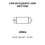

## At a glance

| Detail | Value |
| --- | --- |
| OOMP ID | `electronic_led_1206_bottom_green` |
| Type | Led |
| Package / style | 1206 bottom |
| Nominal size | 3.2 &#x00D7; 1.5 mm |
| Documented pins | 2 |

## Classification

| Level | Value |
| --- | --- |
| 1 | `electronic` |
| 2 | `led` |
| 3 | `1206_bottom` |
| 4 | `green` |

## Nominal dimensions

| Measurement | Value |
| --- | ---: |
| Height | 1.1 mm |
| Length | 3.2 mm |
| Width | 1.5 mm |

## Identifiers

| Identifier | Value |
| --- | --- |
| Manufacturer part number | `IN-S126ATG` |

## Pins

| Pin | Name | Type |
| ---: | --- | --- |
| 1 | K | signal |
| 2 | A | signal |

## Files

[KiCad symbol, machine-solder and hand-solder footprints](data/kicad/README.md) · [Availability and source masters](data/kicad/manifest.yaml)

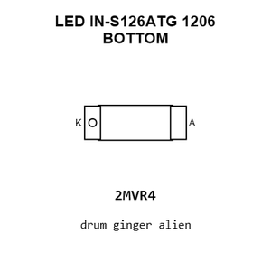

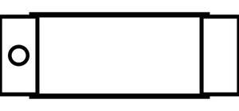

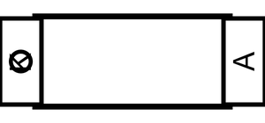

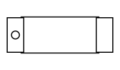

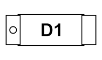

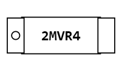

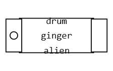

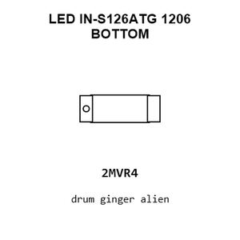

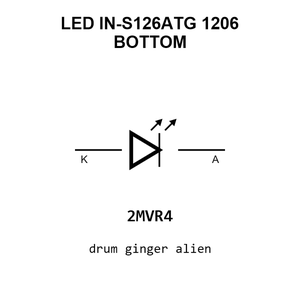

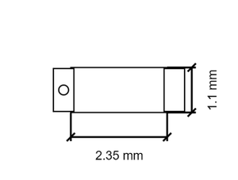

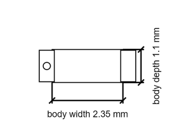

[View this part on GitHub](https://github.com/oomlout/oomp_electronic_version_5/tree/main/parts/electronic_led_1206_bottom_green)

[Browse this category](../../navigation/electronic/led/1206_bottom/README.md)

---

This page is generated from the OOMP part definition by a Roboclick Jinja template. Edit the source taxonomy or template rather than this generated file.