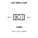
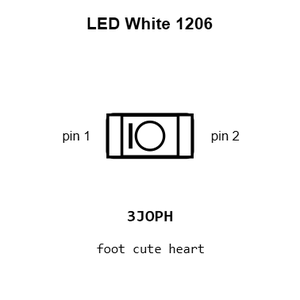
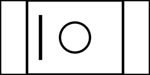
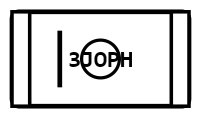
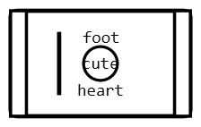
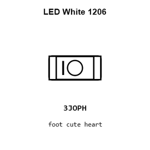
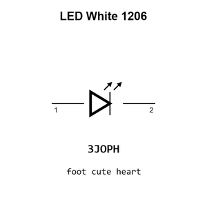
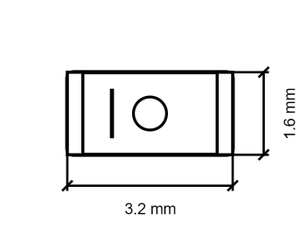

# LED White 1206

`electronic_led_1206_white`

LED White 1206 is an OOMP electronic led definition. It uses the 1206 package or form factor. Its nominal drawing size is 3.2 &#x00D7; 1.6 mm.

## At a glance

| Detail | Value |
| --- | --- |
| OOMP ID | `electronic_led_1206_white` |
| Type | Led |
| Package / style | 1206 |
| Nominal size | 3.2 &#x00D7; 1.6 mm |

## Classification

| Level | Value |
| --- | --- |
| 1 | `electronic` |
| 2 | `led` |
| 3 | `1206` |
| 4 | `white` |

## Nominal dimensions

| Measurement | Value |
| --- | ---: |
| Length | 3.2 mm |
| Width | 1.6 mm |

## Used in projects

| Project | Quantity | References | Explore |
| --- | ---: | --- | --- |
| [Project sparkfun/Digital_Sandbox Digital Sandbox current](https://github.com/sparkfun/Digital_Sandbox/blob/master/Hardware/DigitalSandbox.brd) | 5 | LED1, LED2, LED3, LED4, LED5 | [Board explorer](https://oomlout.github.io/oomp_electronic_version_5/parts/oomp_project_github_sparkfun_digital_sandbox_digital_sandbox_current/board_explorer.html) · [OOMP project](https://github.com/oomlout/oomp_electronic_version_5/tree/main/parts/oomp_project_github_sparkfun_digital_sandbox_digital_sandbox_current) |
| [Project sparkfun/LilyPad_LilyMini_ProtoSnap Lily Mini Protosnap current](https://github.com/sparkfun/LilyPad_LilyMini_ProtoSnap/blob/master/Hardware/LilyMini_Protosnap.brd) | 4 | D3, D4, D5, D6 | [Board explorer](https://oomlout.github.io/oomp_electronic_version_5/parts/oomp_project_github_sparkfun_lily_pad_lily_mini_proto_snap_lily_mini_protosnap_current/board_explorer.html) · [OOMP project](https://github.com/oomlout/oomp_electronic_version_5/tree/main/parts/oomp_project_github_sparkfun_lily_pad_lily_mini_proto_snap_lily_mini_protosnap_current) |
| [Project sparkfun/ProtoSnap-LilyPad_Development_Board Lily Pad Dev current](https://github.com/sparkfun/ProtoSnap-LilyPad_Development_Board/blob/master/Hardware/LilyPad-Dev-v34.brd) | 5 | LED0, LED1, LED2, LED3, LED4 | [Board explorer](https://oomlout.github.io/oomp_electronic_version_5/parts/oomp_project_github_sparkfun_proto_snap_lily_pad_development_board_lily_pad_dev_current/board_explorer.html) · [OOMP project](https://github.com/oomlout/oomp_electronic_version_5/tree/main/parts/oomp_project_github_sparkfun_proto_snap_lily_pad_development_board_lily_pad_dev_current) |

## Files

[KiCad symbol, machine-solder and hand-solder footprints](data/kicad/README.md) · [Availability and source masters](data/kicad/manifest.yaml)

[View this part on GitHub](https://github.com/oomlout/oomp_electronic_version_5/tree/main/parts/electronic_led_1206_white)

[Browse this category](../../navigation/electronic/led/1206/README.md)

---

This page is generated from the OOMP part definition by a Roboclick Jinja template. Edit the source taxonomy or template rather than this generated file.