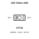
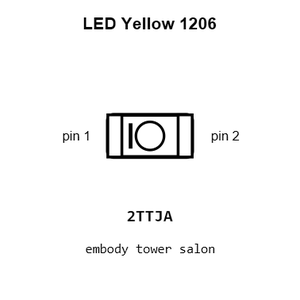
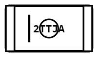
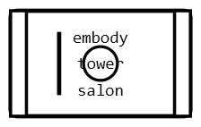
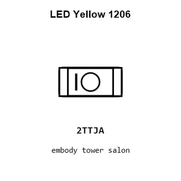
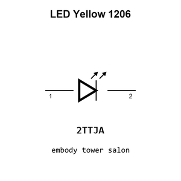

# LED Yellow 1206

`electronic_led_1206_yellow`

LED Yellow 1206 is an OOMP electronic led definition. It uses the 1206 package or form factor. Its nominal drawing size is 3.2 &#x00D7; 1.6 mm.

## At a glance

| Detail | Value |
| --- | --- |
| OOMP ID | `electronic_led_1206_yellow` |
| Type | Led |
| Package / style | 1206 |
| Nominal size | 3.2 &#x00D7; 1.6 mm |

## Classification

| Level | Value |
| --- | --- |
| 1 | `electronic` |
| 2 | `led` |
| 3 | `1206` |
| 4 | `yellow` |

## Nominal dimensions

| Measurement | Value |
| --- | ---: |
| Length | 3.2 mm |
| Width | 1.6 mm |

## Used in projects

| Project | Quantity | References | Explore |
| --- | ---: | --- | --- |
| [Project sparkfun/MicroView_USB_Programmer Spark Fun Micro View USB current](https://github.com/sparkfun/MicroView_USB_Programmer/blob/master/Hardware/SparkFun_MicroViewUSB.brd) | 1 | D3 | [Board explorer](https://oomlout.github.io/oomp_electronic_version_5/parts/oomp_project_github_sparkfun_micro_view_usb_programmer_spark_fun_micro_view_usb_current/board_explorer.html) · [OOMP project](https://github.com/oomlout/oomp_electronic_version_5/tree/main/parts/oomp_project_github_sparkfun_micro_view_usb_programmer_spark_fun_micro_view_usb_current) |
| [Project sparkfun/OpenScale Spark Fun open Scale current](https://github.com/sparkfun/OpenScale/blob/master/hardware/SparkFun_openScale.brd) | 1 | D1 | [Board explorer](https://oomlout.github.io/oomp_electronic_version_5/parts/oomp_project_github_sparkfun_open_scale_spark_fun_open_scale_current/board_explorer.html) · [OOMP project](https://github.com/oomlout/oomp_electronic_version_5/tree/main/parts/oomp_project_github_sparkfun_open_scale_spark_fun_open_scale_current) |
| [Project sparkfun/RedBoard Red Board current](https://github.com/sparkfun/RedBoard/blob/master/Hardware/RedBoard.brd) | 1 | LED4 | [Board explorer](https://oomlout.github.io/oomp_electronic_version_5/parts/oomp_project_github_sparkfun_red_board_red_board_current/board_explorer.html) · [OOMP project](https://github.com/oomlout/oomp_electronic_version_5/tree/main/parts/oomp_project_github_sparkfun_red_board_red_board_current) |
| [Project sparkfun/Red_V Red Five current](https://github.com/sparkfun/Red_V/blob/master/Hardware/RedFive.brd) | 1 | LED3 | [Board explorer](https://oomlout.github.io/oomp_electronic_version_5/parts/oomp_project_github_sparkfun_red_v_red_five_current/board_explorer.html) · [OOMP project](https://github.com/oomlout/oomp_electronic_version_5/tree/main/parts/oomp_project_github_sparkfun_red_v_red_five_current) |

## Files

[KiCad symbol, machine-solder and hand-solder footprints](data/kicad/README.md) · [Availability and source masters](data/kicad/manifest.yaml)

[View this part on GitHub](https://github.com/oomlout/oomp_electronic_version_5/tree/main/parts/electronic_led_1206_yellow)

[Browse this category](../../navigation/electronic/led/1206/README.md)

---

This page is generated from the OOMP part definition by a Roboclick Jinja template. Edit the source taxonomy or template rather than this generated file.