# LED HIR204C 3 MM

`electronic_led_3_mm_infrared_850nm_clear_everlight_hir204c`

LED HIR204C 3 MM is an OOMP electronic led definition. It uses the 3 mm package or form factor. Its nominal drawing size is 3.0 &#x00D7; 3.0 mm. The definition includes 2 documented pins.

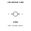

## At a glance

| Detail | Value |
| --- | --- |
| OOMP ID | `electronic_led_3_mm_infrared_850nm_clear_everlight_hir204c` |
| Type | Led |
| Package / style | 3 mm |
| Nominal size | 3.0 &#x00D7; 3.0 mm |
| Documented pins | 2 |

## Classification

| Level | Value |
| --- | --- |
| 1 | `electronic` |
| 2 | `led` |
| 3 | `3_mm` |
| 4 | `infrared_850nm` |
| 5 | `clear` |
| 14 | `everlight` |
| 15 | `hir204c` |

## Nominal dimensions

| Measurement | Value |
| --- | ---: |
| Height | 4.5 mm |
| Length | 3.0 mm |
| Width | 3.0 mm |

## Identifiers

| Identifier | Value |
| --- | --- |
| Manufacturer part number | `HIR204C` |
| LCSC | [`C5118`](https://www.lcsc.com/product-detail/C5118.html) |
| JLCPCB | [`C5118`](https://jlcpcb.com/partdetail/EverlightElec-HIR204C/C5118) |

## Pins

| Pin | Name | Type |
| ---: | --- | --- |
| 1 | K | passive |
| 2 | A | passive |

## Datasheet

[View the datasheet](data/datasheet.pdf)

## Files

[KiCad symbol, machine-solder and hand-solder footprints](data/kicad/README.md) · [Availability and source masters](data/kicad/manifest.yaml)

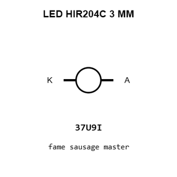

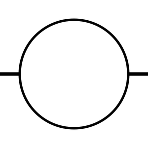

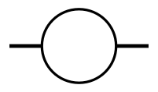

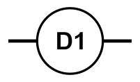

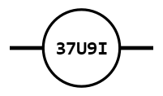

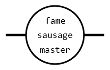

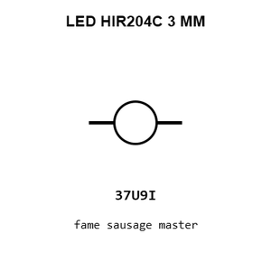

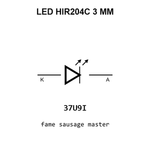

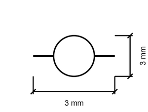

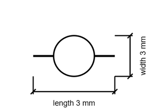

[View this part on GitHub](https://github.com/oomlout/oomp_electronic_version_5/tree/main/parts/electronic_led_3_mm_infrared_850nm_clear_everlight_hir204c)

[Browse this category](../../navigation/electronic/led/3_mm/infrared_850nm/clear/everlight/README.md)

---

This page is generated from the OOMP part definition by a Roboclick Jinja template. Edit the source taxonomy or template rather than this generated file.