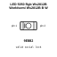
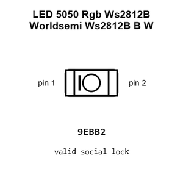
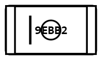
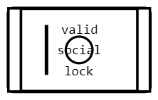
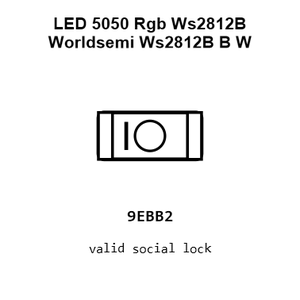
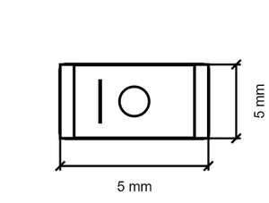
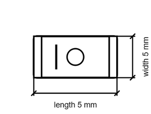

# LED 5050 Rgb Ws2812B Worldsemi Ws2812B B W

`electronic_led_5050_rgb_ws2812b_worldsemi_ws2812b_b_w`

LED 5050 Rgb Ws2812B Worldsemi Ws2812B B W is an OOMP electronic led definition. It uses the 5050 package or form factor. Its nominal drawing size is 5.0 × 5.0 mm.

## At a glance

| Detail | Value |
| --- | --- |
| OOMP ID | `electronic_led_5050_rgb_ws2812b_worldsemi_ws2812b_b_w` |
| Type | Led |
| Package / style | 5050 |
| Nominal size | 5.0 × 5.0 mm |

## Classification

| Level | Value |
| --- | --- |
| 1 | `electronic` |
| 2 | `led` |
| 3 | `5050` |
| 4 | `rgb` |
| 5 | `ws2812b` |
| 6 | `worldsemi` |
| 7 | `ws2812b_b_w` |

## Nominal dimensions

| Measurement | Value |
| --- | ---: |
| Length | 5.0 mm |
| Width | 5.0 mm |

## Files

[View this part on GitHub](https://github.com/oomlout/oomp_electronic_version_5/tree/main/parts/electronic_led_5050_rgb_ws2812b_worldsemi_ws2812b_b_w)

---

This page is generated from the OOMP part definition by a Roboclick Jinja template. Edit the source taxonomy or template rather than this generated file.
