# LED RGB WS2812B Worldsemi 5050

`electronic_led_5050_rgb_ws2812b_worldsemi_ws2812b_b_w`

LED RGB WS2812B Worldsemi 5050 is an OOMP electronic led definition. It uses the 5050 package or form factor. Its nominal drawing size is 5.0 &#x00D7; 5.0 mm. The definition includes 4 documented pins.

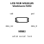

## At a glance

| Detail | Value |
| --- | --- |
| OOMP ID | `electronic_led_5050_rgb_ws2812b_worldsemi_ws2812b_b_w` |
| Type | Led |
| Package / style | 5050 |
| Nominal size | 5.0 &#x00D7; 5.0 mm |
| Documented pins | 4 |

## Classification

| Level | Value |
| --- | --- |
| 1 | `electronic` |
| 2 | `led` |
| 3 | `5050` |
| 4 | `rgb` |
| 5 | `ws2812b` |
| 6 | `worldsemi` |
| 7 | `ws2812b_b_w` |

## Nominal dimensions

| Measurement | Value |
| --- | ---: |
| Length | 5.0 mm |
| Width | 5.0 mm |

## Pins

| Pin | Name | Type |
| ---: | --- | --- |
| 1 | vdd | signal |
| 2 | data_out | signal |
| 3 | gnd | signal |
| 4 | data_in | signal |

## Used in projects

| Project | Quantity | References | Explore |
| --- | ---: | --- | --- |
| [Project adafruit/Adafruit-MEMENTO-PCB Adafruit MEMENTO Camera LED Ring current](https://github.com/adafruit/Adafruit-MEMENTO-PCB/blob/main/Adafruit%20MEMENTO%20Camera%20LED%20Ring.brd) | 8 | LED1, LED3, LED5, LED7, LED9, LED11, LED13, LED15 | [Board explorer](https://oomlout.github.io/oomp_electronic_version_5/parts/oomp_project_github_adafruit_adafruit_memento_pcb_adafruit_memento_camera_led_ring_current/board_explorer.html) · [OOMP project](https://github.com/oomlout/oomp_electronic_version_5/tree/main/parts/oomp_project_github_adafruit_adafruit_memento_pcb_adafruit_memento_camera_led_ring_current) |
| [Project adafruit/Adafruit-NeoPixel-8x8-Matrix Adafruit Neo Matrix 8x8 current](https://github.com/adafruit/Adafruit-NeoPixel-8x8-Matrix/blob/master/Adafruit_NeoMatrix_8x8%20v2.brd) | 64 | LED1, LED2, LED3, LED4, LED5, LED6, LED7, LED8, LED9, LED10, LED11, LED12, LED13, LED14, LED15, LED16, LED17, LED18, LED19, LED20, LED21, LED22, LED23, LED24, LED25, LED26, LED27, LED28, LED29, LED30, LED31, LED32, LED33, LED34, LED35, LED36, LED37, LED38, LED39, LED40, LED41, LED42, LED43, LED44, LED45, LED46, LED47, LED48, LED49, LED50, LED51, LED52, LED53, LED54, LED55, LED56, LED57, LED58, LED59, LED60, LED61, LED62, LED63, LED64 | [Board explorer](https://oomlout.github.io/oomp_electronic_version_5/parts/oomp_project_github_adafruit_adafruit_neo_pixel_8x8_matrix_adafruit_neo_matrix_8x8_current/board_explorer.html) · [OOMP project](https://github.com/oomlout/oomp_electronic_version_5/tree/main/parts/oomp_project_github_adafruit_adafruit_neo_pixel_8x8_matrix_adafruit_neo_matrix_8x8_current) |
| [Project adafruit/Adafruit-NeoPixel-8x8-Matrix Adafruit Neo Matrix 8x8 SK6812 current](https://github.com/adafruit/Adafruit-NeoPixel-8x8-Matrix/blob/master/Adafruit_NeoMatrix_8x8%20SK6812.brd) | 64 | LED1, LED2, LED3, LED4, LED5, LED6, LED7, LED8, LED9, LED10, LED11, LED12, LED13, LED14, LED15, LED16, LED17, LED18, LED19, LED20, LED21, LED22, LED23, LED24, LED25, LED26, LED27, LED28, LED29, LED30, LED31, LED32, LED33, LED34, LED35, LED36, LED37, LED38, LED39, LED40, LED41, LED42, LED43, LED44, LED45, LED46, LED47, LED48, LED49, LED50, LED51, LED52, LED53, LED54, LED55, LED56, LED57, LED58, LED59, LED60, LED61, LED62, LED63, LED64 | [Board explorer](https://oomlout.github.io/oomp_electronic_version_5/parts/oomp_project_github_adafruit_adafruit_neo_pixel_8x8_matrix_adafruit_neo_matrix_8x8_sk6812_current/board_explorer.html) · [OOMP project](https://github.com/oomlout/oomp_electronic_version_5/tree/main/parts/oomp_project_github_adafruit_adafruit_neo_pixel_8x8_matrix_adafruit_neo_matrix_8x8_sk6812_current) |
| [Project adafruit/Adafruit-NeoPixel-Jewel-7 Adafruit Neo Jewel 7 current](https://github.com/adafruit/Adafruit-NeoPixel-Jewel-7/blob/master/Adafruit%20NeoJewel%207.brd) | 7 | LED1, LED2, LED3, LED4, LED5, LED6, LED7 | [Board explorer](https://oomlout.github.io/oomp_electronic_version_5/parts/oomp_project_github_adafruit_adafruit_neo_pixel_jewel_7_adafruit_neo_jewel_7_current/board_explorer.html) · [OOMP project](https://github.com/oomlout/oomp_electronic_version_5/tree/main/parts/oomp_project_github_adafruit_adafruit_neo_pixel_jewel_7_adafruit_neo_jewel_7_current) |
| [Project adafruit/Adafruit-NeoPixel-Jewel-7 Adafruit Neo Jewel 7 SK6812 current](https://github.com/adafruit/Adafruit-NeoPixel-Jewel-7/blob/master/Adafruit%20NeoJewel%207%20SK6812.brd) | 7 | LED1, LED2, LED3, LED4, LED5, LED6, LED7 | [Board explorer](https://oomlout.github.io/oomp_electronic_version_5/parts/oomp_project_github_adafruit_adafruit_neo_pixel_jewel_7_adafruit_neo_jewel_7_sk6812_current/board_explorer.html) · [OOMP project](https://github.com/oomlout/oomp_electronic_version_5/tree/main/parts/oomp_project_github_adafruit_adafruit_neo_pixel_jewel_7_adafruit_neo_jewel_7_sk6812_current) |
| [Project adafruit/Adafruit-NeoPixel-Ring Adafruit Neo Pixel Ring 16 B current](https://github.com/adafruit/Adafruit-NeoPixel-Ring/blob/master/Adafruit%20NeoPixel%20Ring%2016%20B.brd) | 16 | LED1, LED2, LED3, LED4, LED5, LED6, LED7, LED8, LED9, LED10, LED11, LED12, LED13, LED14, LED15, LED16 | [Board explorer](https://oomlout.github.io/oomp_electronic_version_5/parts/oomp_project_github_adafruit_adafruit_neo_pixel_ring_adafruit_neo_pixel_ring_16_b_current/board_explorer.html) · [OOMP project](https://github.com/oomlout/oomp_electronic_version_5/tree/main/parts/oomp_project_github_adafruit_adafruit_neo_pixel_ring_adafruit_neo_pixel_ring_16_b_current) |
| [Project adafruit/Adafruit-NeoPixel-Ring Adafruit Neo Pixel Ring 24 B current](https://github.com/adafruit/Adafruit-NeoPixel-Ring/blob/master/Adafruit%20NeoPixel%20Ring%2024%20B.brd) | 24 | LED1, LED2, LED3, LED4, LED5, LED6, LED7, LED8, LED9, LED10, LED11, LED12, LED13, LED14, LED15, LED16, LED17, LED18, LED19, LED20, LED21, LED22, LED23, LED24 | [Board explorer](https://oomlout.github.io/oomp_electronic_version_5/parts/oomp_project_github_adafruit_adafruit_neo_pixel_ring_adafruit_neo_pixel_ring_24_b_current/board_explorer.html) · [OOMP project](https://github.com/oomlout/oomp_electronic_version_5/tree/main/parts/oomp_project_github_adafruit_adafruit_neo_pixel_ring_adafruit_neo_pixel_ring_24_b_current) |
| [Project adafruit/Adafruit-NeoPixel-Ring Adafruit Neo Pixel Ring 60 Quarter current](https://github.com/adafruit/Adafruit-NeoPixel-Ring/blob/master/Adafruit%20NeoPixel%20Ring%2060%20Quarter.brd) | 15 | LED1, LED2, LED3, LED4, LED5, LED6, LED7, LED8, LED9, LED10, LED11, LED12, LED13, LED14, LED15 | [Board explorer](https://oomlout.github.io/oomp_electronic_version_5/parts/oomp_project_github_adafruit_adafruit_neo_pixel_ring_adafruit_neo_pixel_ring_60_quarter_current/board_explorer.html) · [OOMP project](https://github.com/oomlout/oomp_electronic_version_5/tree/main/parts/oomp_project_github_adafruit_adafruit_neo_pixel_ring_adafruit_neo_pixel_ring_60_quarter_current) |
| [Project electrolama/oshcamp23-badge OSHCamp 2023 Badge current](https://github.com/electrolama/oshcamp23-badge/tree/main/oomp/version_current/working) | 1 | LED1 | [Board explorer](https://oomlout.github.io/oomp_electronic_version_5/parts/oomp_project_github_electrolama_oshcamp23_badge_oshcamp23_badge_current/board_explorer.html) · [OOMP project](https://github.com/oomlout/oomp_electronic_version_5/tree/main/parts/oomp_project_github_electrolama_oshcamp23_badge_oshcamp23_badge_current) |

## Files

[KiCad symbol, machine-solder and hand-solder footprints](data/kicad/README.md) · [Availability and source masters](data/kicad/manifest.yaml)

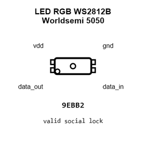

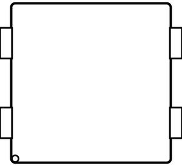

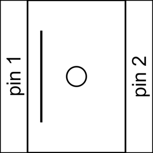

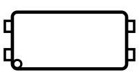

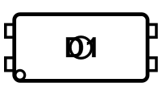

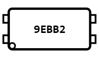

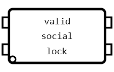

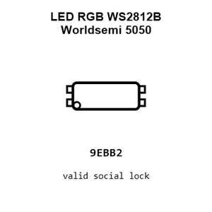

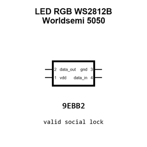

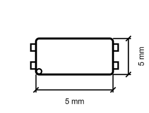

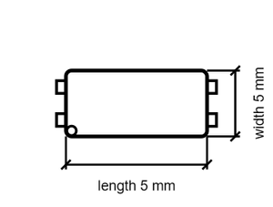

[View this part on GitHub](https://github.com/oomlout/oomp_electronic_version_5/tree/main/parts/electronic_led_5050_rgb_ws2812b_worldsemi_ws2812b_b_w)

[Browse this category](../../navigation/electronic/led/5050/rgb/ws2812b/worldsemi/README.md)

---

This page is generated from the OOMP part definition by a Roboclick Jinja template. Edit the source taxonomy or template rather than this generated file.