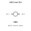
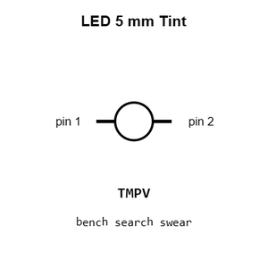
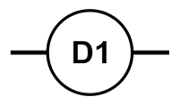
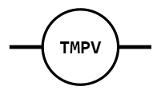
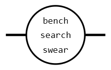
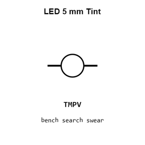
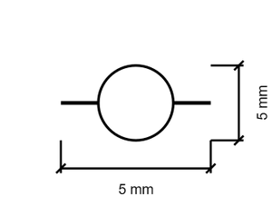
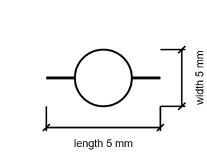

# LED Tint 5_MM

`electronic_led_5_mm_tint`

LED Tint 5_MM is an OOMP electronic led definition. It uses the 5 mm package or form factor. Its nominal drawing size is 5.0 &#x00D7; 5.0 mm.

## At a glance

| Detail | Value |
| --- | --- |
| OOMP ID | `electronic_led_5_mm_tint` |
| Type | Led |
| Package / style | 5 mm |
| Nominal size | 5.0 &#x00D7; 5.0 mm |

## Classification

| Level | Value |
| --- | --- |
| 1 | `electronic` |
| 2 | `led` |
| 3 | `5_mm` |
| 5 | `tint` |

## Nominal dimensions

| Measurement | Value |
| --- | ---: |
| Length | 5.0 mm |
| Width | 5.0 mm |

## Files

[View this part on GitHub](https://github.com/oomlout/oomp_electronic_version_5/tree/main/parts/electronic_led_5_mm_tint)

[Browse this category](../../navigation/electronic/led/5_mm/README.md)

---

This page is generated from the OOMP part definition by a Roboclick Jinja template. Edit the source taxonomy or template rather than this generated file.