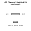
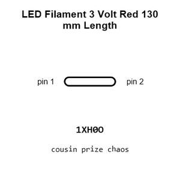
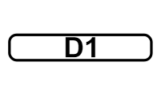
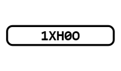
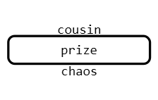
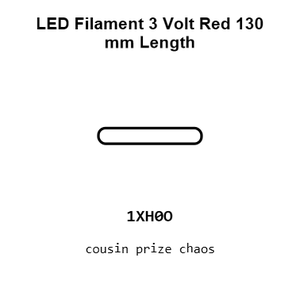
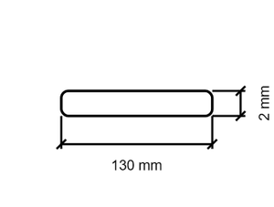
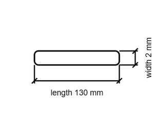

# LED Filament 3 Volt Red 130 mm Length

`electronic_led_filament_3_volt_red_130_mm_length`

LED Filament 3 Volt Red 130 mm Length is an OOMP electronic led definition. It uses the filament 3 volt package or form factor. Its nominal drawing size is 130 × 2.0 mm.

## At a glance

| Detail | Value |
| --- | --- |
| OOMP ID | `electronic_led_filament_3_volt_red_130_mm_length` |
| Type | Led |
| Package / style | filament 3 volt |
| Nominal size | 130 × 2.0 mm |

## Classification

| Level | Value |
| --- | --- |
| 1 | `electronic` |
| 2 | `led` |
| 3 | `filament_3_volt` |
| 4 | `red` |
| 5 | `130_mm_length` |

## Nominal dimensions

| Measurement | Value |
| --- | ---: |
| Length | 130 mm |
| Width | 2.0 mm |

## Files

[View this part on GitHub](https://github.com/oomlout/oomp_electronic_version_5/tree/main/parts/electronic_led_filament_3_volt_red_130_mm_length)

---

This page is generated from the OOMP part definition by a Roboclick Jinja template. Edit the source taxonomy or template rather than this generated file.
