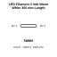
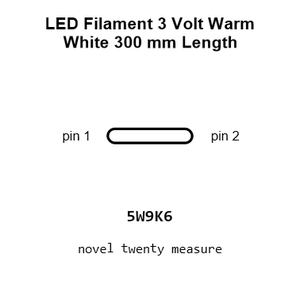
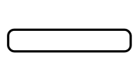
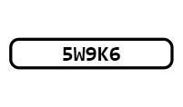
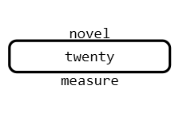
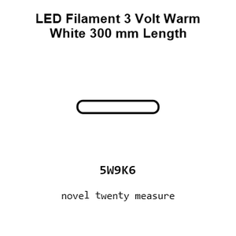
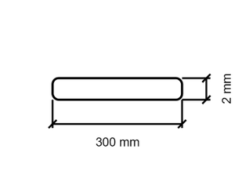
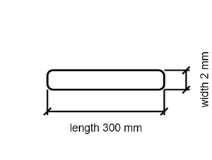

# LED Warm White 300 Mm Length FILAMENT_3_VOLT

`electronic_led_filament_3_volt_warm_white_300_mm_length`

LED Warm White 300 Mm Length FILAMENT_3_VOLT is an OOMP electronic led definition. It uses the filament 3 volt package or form factor. Its nominal drawing size is 300 &#x00D7; 2.0 mm.

## At a glance

| Detail | Value |
| --- | --- |
| OOMP ID | `electronic_led_filament_3_volt_warm_white_300_mm_length` |
| Type | Led |
| Package / style | filament 3 volt |
| Nominal size | 300 &#x00D7; 2.0 mm |

## Classification

| Level | Value |
| --- | --- |
| 1 | `electronic` |
| 2 | `led` |
| 3 | `filament_3_volt` |
| 4 | `warm_white` |
| 5 | `300_mm_length` |

## Nominal dimensions

| Measurement | Value |
| --- | ---: |
| Length | 300 mm |
| Width | 2.0 mm |

## Files

[View this part on GitHub](https://github.com/oomlout/oomp_electronic_version_5/tree/main/parts/electronic_led_filament_3_volt_warm_white_300_mm_length)

[Browse this category](../../navigation/electronic/led/filament_3_volt/warm_white/README.md)

---

This page is generated from the OOMP part definition by a Roboclick Jinja template. Edit the source taxonomy or template rather than this generated file.