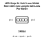
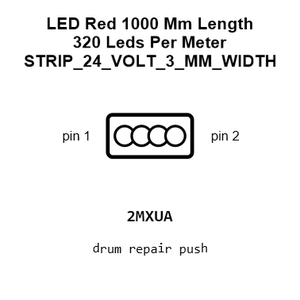
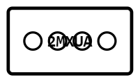
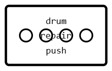
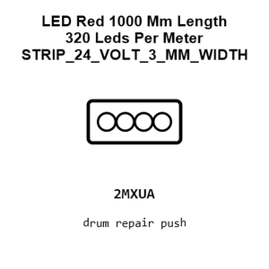
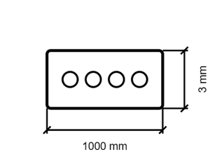
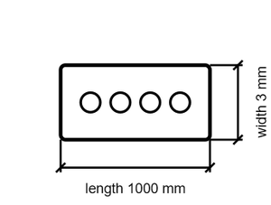

# LED Red 1000 Mm Length 320 Leds Per Meter STRIP_24_VOLT_3_MM_WIDTH

`electronic_led_strip_24_volt_3_mm_width_red_1000_mm_length_320_leds_per_meter`

LED Red 1000 Mm Length 320 Leds Per Meter STRIP_24_VOLT_3_MM_WIDTH is an OOMP electronic led definition. It uses the strip 24 volt 3 mm width package or form factor. Its nominal drawing size is 1000 &#x00D7; 3 mm.

## At a glance

| Detail | Value |
| --- | --- |
| OOMP ID | `electronic_led_strip_24_volt_3_mm_width_red_1000_mm_length_320_leds_per_meter` |
| Type | Led |
| Package / style | strip 24 volt 3 mm width |
| Nominal size | 1000 &#x00D7; 3 mm |

## Classification

| Level | Value |
| --- | --- |
| 1 | `electronic` |
| 2 | `led` |
| 3 | `strip_24_volt_3_mm_width` |
| 4 | `red` |
| 5 | `1000_mm_length` |
| 6 | `320_leds_per_meter` |

## Nominal dimensions

| Measurement | Value |
| --- | ---: |
| Length | 1000 mm |
| Width | 3 mm |

## Files

[KiCad symbol, machine-solder and hand-solder footprints](data/kicad/README.md) · [Availability and source masters](data/kicad/manifest.yaml)

[View this part on GitHub](https://github.com/oomlout/oomp_electronic_version_5/tree/main/parts/electronic_led_strip_24_volt_3_mm_width_red_1000_mm_length_320_leds_per_meter)

[Browse this category](../../navigation/electronic/led/strip_24_volt_3_mm_width/red/1000_mm_length/README.md)

---

This page is generated from the OOMP part definition by a Roboclick Jinja template. Edit the source taxonomy or template rather than this generated file.