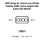
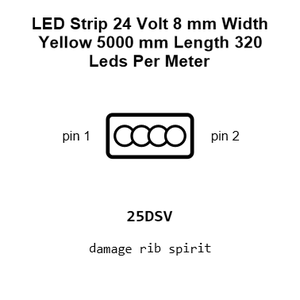
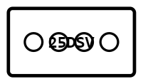
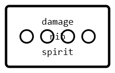
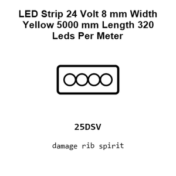
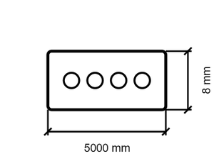
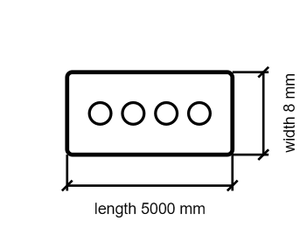

# LED Strip 24 Volt 8 mm Width Yellow 5000 mm Length 320 Leds Per Meter

`electronic_led_strip_24_volt_8_mm_width_yellow_5000_mm_length_320_leds_per_meter`

LED Strip 24 Volt 8 mm Width Yellow 5000 mm Length 320 Leds Per Meter is an OOMP electronic led definition. It uses the strip 24 volt 8 mm width package or form factor. Its nominal drawing size is 5000 × 8 mm.

## At a glance

| Detail | Value |
| --- | --- |
| OOMP ID | `electronic_led_strip_24_volt_8_mm_width_yellow_5000_mm_length_320_leds_per_meter` |
| Type | Led |
| Package / style | strip 24 volt 8 mm width |
| Nominal size | 5000 × 8 mm |

## Classification

| Level | Value |
| --- | --- |
| 1 | `electronic` |
| 2 | `led` |
| 3 | `strip_24_volt_8_mm_width` |
| 4 | `yellow` |
| 5 | `5000_mm_length` |
| 6 | `320_leds_per_meter` |

## Nominal dimensions

| Measurement | Value |
| --- | ---: |
| Length | 5000 mm |
| Width | 8 mm |

## Files

[View this part on GitHub](https://github.com/oomlout/oomp_electronic_version_5/tree/main/parts/electronic_led_strip_24_volt_8_mm_width_yellow_5000_mm_length_320_leds_per_meter)

---

This page is generated from the OOMP part definition by a Roboclick Jinja template. Edit the source taxonomy or template rather than this generated file.
