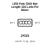
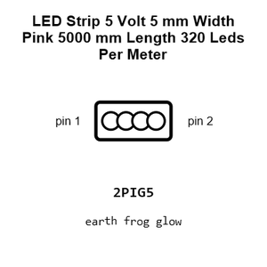
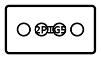
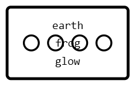
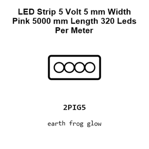
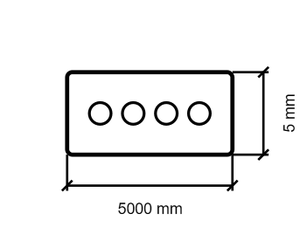
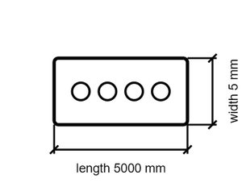

# LED Pink 5000 Mm Length 320 Leds Per Meter STRIP_5_VOLT_5_MM_WIDTH

`electronic_led_strip_5_volt_5_mm_width_pink_5000_mm_length_320_leds_per_meter`

LED Pink 5000 Mm Length 320 Leds Per Meter STRIP_5_VOLT_5_MM_WIDTH is an OOMP electronic led definition. It uses the strip 5 volt 5 mm width package or form factor. Its nominal drawing size is 5000 &#x00D7; 5 mm.

## At a glance

| Detail | Value |
| --- | --- |
| OOMP ID | `electronic_led_strip_5_volt_5_mm_width_pink_5000_mm_length_320_leds_per_meter` |
| Type | Led |
| Package / style | strip 5 volt 5 mm width |
| Nominal size | 5000 &#x00D7; 5 mm |

## Classification

| Level | Value |
| --- | --- |
| 1 | `electronic` |
| 2 | `led` |
| 3 | `strip_5_volt_5_mm_width` |
| 4 | `pink` |
| 5 | `5000_mm_length` |
| 6 | `320_leds_per_meter` |

## Nominal dimensions

| Measurement | Value |
| --- | ---: |
| Length | 5000 mm |
| Width | 5 mm |

## Files

[View this part on GitHub](https://github.com/oomlout/oomp_electronic_version_5/tree/main/parts/electronic_led_strip_5_volt_5_mm_width_pink_5000_mm_length_320_leds_per_meter)

[Browse this category](../../navigation/electronic/led/strip_5_volt_5_mm_width/pink/5000_mm_length/README.md)

---

This page is generated from the OOMP part definition by a Roboclick Jinja template. Edit the source taxonomy or template rather than this generated file.