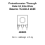
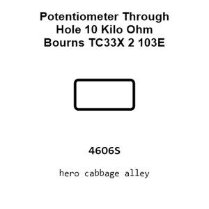
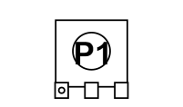
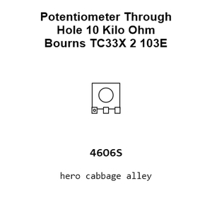
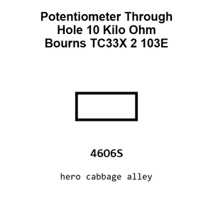

# Potentiometer Through Hole 10 Kilo Ohm Bourns TC33X 2 103E TRIMMER

`electronic_potentiometer_trimmer_through_hole_10_kilo_ohm_bourns_tc33x_2_103e`

Potentiometer Through Hole 10 Kilo Ohm Bourns TC33X 2 103E TRIMMER is an OOMP electronic potentiometer definition. It uses the trimmer package or form factor. Its nominal drawing size is 3.8 &#x00D7; 3.6 mm. The definition includes 3 documented pins.

## At a glance

| Detail | Value |
| --- | --- |
| OOMP ID | `electronic_potentiometer_trimmer_through_hole_10_kilo_ohm_bourns_tc33x_2_103e` |
| Type | Potentiometer |
| Package / style | trimmer |
| Nominal size | 3.8 &#x00D7; 3.6 mm |
| Documented pins | 3 |

## Classification

| Level | Value |
| --- | --- |
| 1 | `electronic` |
| 2 | `potentiometer` |
| 3 | `trimmer` |
| 4 | `through_hole` |
| 5 | `10_kilo_ohm` |
| 14 | `bourns` |
| 15 | `tc33x_2_103e` |

## Nominal dimensions

| Measurement | Value |
| --- | ---: |
| Length | 3.8 mm |
| Width | 3.6 mm |

## Pins

| Pin | Name | Type |
| ---: | --- | --- |
| 1 | CW | signal |
| 2 | WIPER | signal |
| 3 | CCW | signal |

## Used in projects

| Project | Quantity | References | Explore |
| --- | ---: | --- | --- |
| [Project soldered_electronics/Air-quality-sensor-MQ135-breakout-hardware-design MQ135 Breakout current](https://github.com/SolderedElectronics/Air-quality-sensor-MQ135-breakout-hardware-design) | 1 | R2 | [Board explorer](https://oomlout.github.io/oomp_electronic_version_5/parts/oomp_project_github_soldered_electronics_air_quality_sensor_mq135_breakout_hardware_design_sensor_gas_mq135_breakout_current/board_explorer.html) · [OOMP project](https://github.com/oomlout/oomp_electronic_version_5/tree/main/parts/oomp_project_github_soldered_electronics_air_quality_sensor_mq135_breakout_hardware_design_sensor_gas_mq135_breakout_current) |
| [Project soldered_electronics/Alcohol--Ethanol-sensor-MQ3-breakout-hardware-design MQ3 Breakout current](https://github.com/SolderedElectronics/Alcohol--Ethanol-sensor-MQ3-breakout-hardware-design) | 1 | R2 | [Board explorer](https://oomlout.github.io/oomp_electronic_version_5/parts/oomp_project_github_soldered_electronics_alcohol_ethanol_sensor_mq3_breakout_hardware_design_sensor_gas_mq3_breakout_current/board_explorer.html) · [OOMP project](https://github.com/oomlout/oomp_electronic_version_5/tree/main/parts/oomp_project_github_soldered_electronics_alcohol_ethanol_sensor_mq3_breakout_hardware_design_sensor_gas_mq3_breakout_current) |
| [Project soldered_electronics/Ammonia-sensor-MQ137-breakout-hardware-design MQ137 Breakout current](https://github.com/SolderedElectronics/Ammonia-sensor-MQ137-breakout-hardware-design) | 1 | R2 | [Board explorer](https://oomlout.github.io/oomp_electronic_version_5/parts/oomp_project_github_soldered_electronics_ammonia_sensor_mq137_breakout_hardware_design_sensor_gas_mq137_breakout_current/board_explorer.html) · [OOMP project](https://github.com/oomlout/oomp_electronic_version_5/tree/main/parts/oomp_project_github_soldered_electronics_ammonia_sensor_mq137_breakout_hardware_design_sensor_gas_mq137_breakout_current) |
| [Project soldered_electronics/Benzene--Toluene--Acetone--Formaldehyde-sensor-MQ138-breakout-hardware-design MQ138 Breakout current](https://github.com/SolderedElectronics/Benzene--Toluene--Acetone--Formaldehyde-sensor-MQ138-breakout-hardware-design) | 1 | R2 | [Board explorer](https://oomlout.github.io/oomp_electronic_version_5/parts/oomp_project_github_soldered_electronics_benzene_toluene_acetone_formaldehyde_sensor_mq138_breakout_hardware_design_sensor_gas_mq138_breakout_current/board_explorer.html) · [OOMP project](https://github.com/oomlout/oomp_electronic_version_5/tree/main/parts/oomp_project_github_soldered_electronics_benzene_toluene_acetone_formaldehyde_sensor_mq138_breakout_hardware_design_sensor_gas_mq138_breakout_current) |
| [Project soldered_electronics/Butane--LPG---Smoke-sensor-MQ2-breakout-hardware-design MQ2 Breakout current](https://github.com/SolderedElectronics/Butane--LPG---Smoke-sensor-MQ2-breakout-hardware-design) | 1 | R2 | [Board explorer](https://oomlout.github.io/oomp_electronic_version_5/parts/oomp_project_github_soldered_electronics_butane_lpg_smoke_sensor_mq2_breakout_hardware_design_sensor_gas_mq2_breakout_current/board_explorer.html) · [OOMP project](https://github.com/oomlout/oomp_electronic_version_5/tree/main/parts/oomp_project_github_soldered_electronics_butane_lpg_smoke_sensor_mq2_breakout_hardware_design_sensor_gas_mq2_breakout_current) |
| [Project soldered_electronics/Capacitive-soil-sensor-hardware-design Capacitive Soil Sensor current](https://github.com/SolderedElectronics/Capacitive-soil-sensor-hardware-design) | 1 | R8 | [Board explorer](https://oomlout.github.io/oomp_electronic_version_5/parts/oomp_project_github_soldered_electronics_capacitive_soil_sensor_hardware_design_sensor_capacitive_soil_current/board_explorer.html) · [OOMP project](https://github.com/oomlout/oomp_electronic_version_5/tree/main/parts/oomp_project_github_soldered_electronics_capacitive_soil_sensor_hardware_design_sensor_capacitive_soil_current) |
| [Project soldered_electronics/CO--flammable-gasses-sensor-MQ9-breakout-hardware-design MQ9 Breakout current](https://github.com/SolderedElectronics/CO--flammable-gasses-sensor-MQ9-breakout-hardware-design) | 1 | R2 | [Board explorer](https://oomlout.github.io/oomp_electronic_version_5/parts/oomp_project_github_soldered_electronics_co_flammable_gasses_sensor_mq9_breakout_hardware_design_sensor_gas_mq9_breakout_current/board_explorer.html) · [OOMP project](https://github.com/oomlout/oomp_electronic_version_5/tree/main/parts/oomp_project_github_soldered_electronics_co_flammable_gasses_sensor_mq9_breakout_hardware_design_sensor_gas_mq9_breakout_current) |
| [Project soldered_electronics/CO-sensor-MQ7-breakout-hardware-design MQ7 Breakout current](https://github.com/SolderedElectronics/CO-sensor-MQ7-breakout-hardware-design) | 1 | R2 | [Board explorer](https://oomlout.github.io/oomp_electronic_version_5/parts/oomp_project_github_soldered_electronics_co_sensor_mq7_breakout_hardware_design_sensor_gas_mq7_breakout_current/board_explorer.html) · [OOMP project](https://github.com/oomlout/oomp_electronic_version_5/tree/main/parts/oomp_project_github_soldered_electronics_co_sensor_mq7_breakout_hardware_design_sensor_gas_mq7_breakout_current) |
| [Project soldered_electronics/Hydrogen-sensor-MQ8-breakout-hardware-design MQ8 Breakout current](https://github.com/SolderedElectronics/Hydrogen-sensor-MQ8-breakout-hardware-design) | 1 | R2 | [Board explorer](https://oomlout.github.io/oomp_electronic_version_5/parts/oomp_project_github_soldered_electronics_hydrogen_sensor_mq8_breakout_hardware_design_sensor_gas_mq8_breakout_current/board_explorer.html) · [OOMP project](https://github.com/oomlout/oomp_electronic_version_5/tree/main/parts/oomp_project_github_soldered_electronics_hydrogen_sensor_mq8_breakout_hardware_design_sensor_gas_mq8_breakout_current) |
| [Project soldered_electronics/Hydrogen-Sulfide-sensor-MQ136-breakout-hardware-design MQ136 Breakout current](https://github.com/SolderedElectronics/Hydrogen-Sulfide-sensor-MQ136-breakout-hardware-design) | 1 | R2 | [Board explorer](https://oomlout.github.io/oomp_electronic_version_5/parts/oomp_project_github_soldered_electronics_hydrogen_sulfide_sensor_mq136_breakout_hardware_design_sensor_gas_mq136_breakout_current/board_explorer.html) · [OOMP project](https://github.com/oomlout/oomp_electronic_version_5/tree/main/parts/oomp_project_github_soldered_electronics_hydrogen_sulfide_sensor_mq136_breakout_hardware_design_sensor_gas_mq136_breakout_current) |
| [Project soldered_electronics/LPG--Butane-sensor-MQ6-breakout-hardware-design MQ6 Breakout current](https://github.com/SolderedElectronics/LPG--Butane-sensor-MQ6-breakout-hardware-design) | 1 | R2 | [Board explorer](https://oomlout.github.io/oomp_electronic_version_5/parts/oomp_project_github_soldered_electronics_lpg_butane_sensor_mq6_breakout_hardware_design_sensor_gas_mq6_breakout_current/board_explorer.html) · [OOMP project](https://github.com/oomlout/oomp_electronic_version_5/tree/main/parts/oomp_project_github_soldered_electronics_lpg_butane_sensor_mq6_breakout_hardware_design_sensor_gas_mq6_breakout_current) |
| [Project soldered_electronics/Methane.-CNG-sensor-MQ4-breakout-hardware-design MQ4 Breakout current](https://github.com/SolderedElectronics/Methane.-CNG-sensor-MQ4-breakout-hardware-design) | 1 | R2 | [Board explorer](https://oomlout.github.io/oomp_electronic_version_5/parts/oomp_project_github_soldered_electronics_methane_cng_sensor_mq4_breakout_hardware_design_sensor_gas_mq4_breakout_current/board_explorer.html) · [OOMP project](https://github.com/oomlout/oomp_electronic_version_5/tree/main/parts/oomp_project_github_soldered_electronics_methane_cng_sensor_mq4_breakout_hardware_design_sensor_gas_mq4_breakout_current) |
| [Project soldered_electronics/Methane--Natural-gas-sensor-MQ214-breakout-hardware-design MQ214 Breakout current](https://github.com/SolderedElectronics/Methane--Natural-gas-sensor-MQ214-breakout-hardware-design) | 1 | R2 | [Board explorer](https://oomlout.github.io/oomp_electronic_version_5/parts/oomp_project_github_soldered_electronics_methane_natural_gas_sensor_mq214_breakout_hardware_design_sensor_gas_mq214_breakout_current/board_explorer.html) · [OOMP project](https://github.com/oomlout/oomp_electronic_version_5/tree/main/parts/oomp_project_github_soldered_electronics_methane_natural_gas_sensor_mq214_breakout_hardware_design_sensor_gas_mq214_breakout_current) |
| [Project soldered_electronics/Natural-gas--LPG-sensor-MQ5-breakout-hardware-design MQ5 Breakout current](https://github.com/SolderedElectronics/Natural-gas--LPG-sensor-MQ5-breakout-hardware-design) | 1 | R2 | [Board explorer](https://oomlout.github.io/oomp_electronic_version_5/parts/oomp_project_github_soldered_electronics_natural_gas_lpg_sensor_mq5_breakout_hardware_design_sensor_gas_mq5_breakout_current/board_explorer.html) · [OOMP project](https://github.com/oomlout/oomp_electronic_version_5/tree/main/parts/oomp_project_github_soldered_electronics_natural_gas_lpg_sensor_mq5_breakout_hardware_design_sensor_gas_mq5_breakout_current) |
| [Project soldered_electronics/Obstacle-sensor-TCRT5000-breakout-hardware-design Obstacle Sensor TCRT5000 current](https://github.com/SolderedElectronics/Obstacle-sensor-TCRT5000-breakout-hardware-design) | 1 | R2 | [Board explorer](https://oomlout.github.io/oomp_electronic_version_5/parts/oomp_project_github_soldered_electronics_obstacle_sensor_tcrt5000_breakout_hardware_design_sensor_obstacle_tcrt5000_current/board_explorer.html) · [OOMP project](https://github.com/oomlout/oomp_electronic_version_5/tree/main/parts/oomp_project_github_soldered_electronics_obstacle_sensor_tcrt5000_breakout_hardware_design_sensor_obstacle_tcrt5000_current) |
| [Project soldered_electronics/Ozone-sensor-MQ131-breakout-hardware-design MQ131 Breakout current](https://github.com/SolderedElectronics/Ozone-sensor-MQ131-breakout-hardware-design) | 1 | R2 | [Board explorer](https://oomlout.github.io/oomp_electronic_version_5/parts/oomp_project_github_soldered_electronics_ozone_sensor_mq131_breakout_hardware_design_sensor_gas_mq131_breakout_current/board_explorer.html) · [OOMP project](https://github.com/oomlout/oomp_electronic_version_5/tree/main/parts/oomp_project_github_soldered_electronics_ozone_sensor_mq131_breakout_hardware_design_sensor_gas_mq131_breakout_current) |
| [Project soldered_electronics/Simple-fire-sensor-board-hardware-design Simple Fire Sensor current](https://github.com/SolderedElectronics/Simple-fire-sensor-board-hardware-design) | 1 | R4 | [Board explorer](https://oomlout.github.io/oomp_electronic_version_5/parts/oomp_project_github_soldered_electronics_simple_fire_sensor_board_hardware_design_sensor_fire_simple_current/board_explorer.html) · [OOMP project](https://github.com/oomlout/oomp_electronic_version_5/tree/main/parts/oomp_project_github_soldered_electronics_simple_fire_sensor_board_hardware_design_sensor_fire_simple_current) |
| [Project soldered_electronics/Simple-light-sensor-board-hardware-design Simple Light Sensor current](https://github.com/SolderedElectronics/Simple-light-sensor-board-hardware-design) | 1 | R4 | [Board explorer](https://oomlout.github.io/oomp_electronic_version_5/parts/oomp_project_github_soldered_electronics_simple_light_sensor_board_hardware_design_sensor_light_simple_current/board_explorer.html) · [OOMP project](https://github.com/oomlout/oomp_electronic_version_5/tree/main/parts/oomp_project_github_soldered_electronics_simple_light_sensor_board_hardware_design_sensor_light_simple_current) |
| [Project soldered_electronics/VOC-sensor-MQ138-breakout-hardware-design MQ138 Breakout current](https://github.com/SolderedElectronics/VOC-sensor-MQ138-breakout-hardware-design) | 1 | R2 | [Board explorer](https://oomlout.github.io/oomp_electronic_version_5/parts/oomp_project_github_soldered_electronics_voc_sensor_mq138_breakout_hardware_design_sensor_gas_mq138_breakout_current/board_explorer.html) · [OOMP project](https://github.com/oomlout/oomp_electronic_version_5/tree/main/parts/oomp_project_github_soldered_electronics_voc_sensor_mq138_breakout_hardware_design_sensor_gas_mq138_breakout_current) |

## Files

[KiCad symbol, machine-solder and hand-solder footprints](data/kicad/README.md) · [Availability and source masters](data/kicad/manifest.yaml)

[View this part on GitHub](https://github.com/oomlout/oomp_electronic_version_5/tree/main/parts/electronic_potentiometer_trimmer_through_hole_10_kilo_ohm_bourns_tc33x_2_103e)

[Browse this category](../../navigation/electronic/potentiometer/trimmer/through_hole/10_kilo_ohm/bourns/README.md)

---

This page is generated from the OOMP part definition by a Roboclick Jinja template. Edit the source taxonomy or template rather than this generated file.