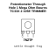
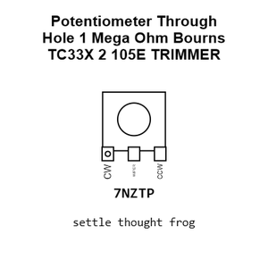
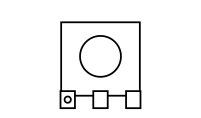
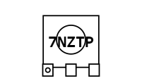
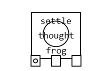
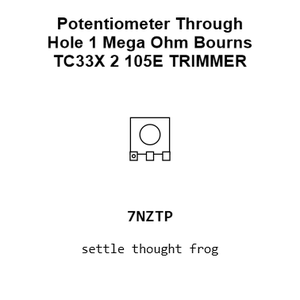
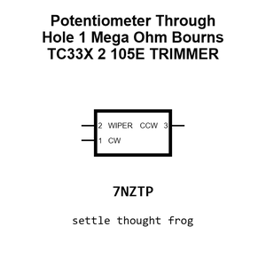
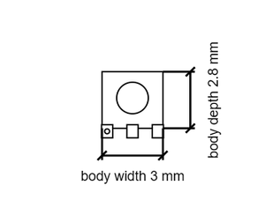

# Potentiometer Through Hole 1 Mega Ohm Bourns TC33X 2 105E TRIMMER

`electronic_potentiometer_trimmer_through_hole_1_mega_ohm_bourns_tc33x_2_105e`

Potentiometer Through Hole 1 Mega Ohm Bourns TC33X 2 105E TRIMMER is an OOMP electronic potentiometer definition. It uses the trimmer package or form factor. Its nominal drawing size is 3.8 &#x00D7; 3.6 mm. The definition includes 3 documented pins.

## At a glance

| Detail | Value |
| --- | --- |
| OOMP ID | `electronic_potentiometer_trimmer_through_hole_1_mega_ohm_bourns_tc33x_2_105e` |
| Type | Potentiometer |
| Package / style | trimmer |
| Nominal size | 3.8 &#x00D7; 3.6 mm |
| Documented pins | 3 |

## Classification

| Level | Value |
| --- | --- |
| 1 | `electronic` |
| 2 | `potentiometer` |
| 3 | `trimmer` |
| 4 | `through_hole` |
| 5 | `1_mega_ohm` |
| 14 | `bourns` |
| 15 | `tc33x_2_105e` |

## Nominal dimensions

| Measurement | Value |
| --- | ---: |
| Length | 3.8 mm |
| Width | 3.6 mm |

## Pins

| Pin | Name | Type |
| ---: | --- | --- |
| 1 | CW | signal |
| 2 | WIPER | signal |
| 3 | CCW | signal |

## Used in projects

| Project | Quantity | References | Explore |
| --- | ---: | --- | --- |
| [Project soldered_electronics/PIR-Movement-sensor-board-hardware-design PIR Movement Sensor current](https://github.com/SolderedElectronics/PIR-Movement-sensor-board-hardware-design) | 1 | R1 | [Board explorer](https://oomlout.github.io/oomp_electronic_version_5/parts/oomp_project_github_soldered_electronics_pir_movement_sensor_board_hardware_design_sensor_pir_movement_current/board_explorer.html) · [OOMP project](https://github.com/oomlout/oomp_electronic_version_5/tree/main/parts/oomp_project_github_soldered_electronics_pir_movement_sensor_board_hardware_design_sensor_pir_movement_current) |

## Files

[KiCad symbol, machine-solder and hand-solder footprints](data/kicad/README.md) · [Availability and source masters](data/kicad/manifest.yaml)

[View this part on GitHub](https://github.com/oomlout/oomp_electronic_version_5/tree/main/parts/electronic_potentiometer_trimmer_through_hole_1_mega_ohm_bourns_tc33x_2_105e)

[Browse this category](../../navigation/electronic/potentiometer/trimmer/through_hole/1_mega_ohm/bourns/README.md)

---

This page is generated from the OOMP part definition by a Roboclick Jinja template. Edit the source taxonomy or template rather than this generated file.