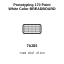
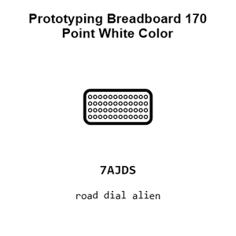
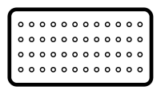
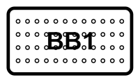
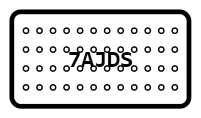
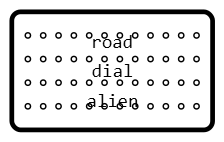
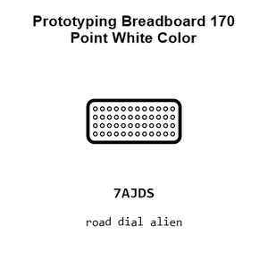
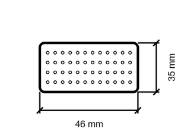
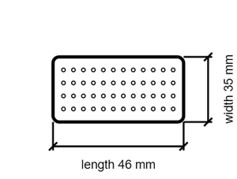

# Prototyping 170 Point White Color BREADBOARD

`electronic_prototyping_breadboard_170_point_white_color`

Prototyping 170 Point White Color BREADBOARD is an OOMP electronic prototyping definition. It uses the breadboard package or form factor. Its nominal drawing size is 46.0 &#x00D7; 35.0 mm.

## At a glance

| Detail | Value |
| --- | --- |
| OOMP ID | `electronic_prototyping_breadboard_170_point_white_color` |
| Type | Prototyping |
| Package / style | breadboard |
| Nominal size | 46.0 &#x00D7; 35.0 mm |

## Classification

| Level | Value |
| --- | --- |
| 1 | `electronic` |
| 2 | `prototyping` |
| 3 | `breadboard` |
| 4 | `170_point` |
| 5 | `white_color` |

## Nominal dimensions

| Measurement | Value |
| --- | ---: |
| Length | 46.0 mm |
| Width | 35.0 mm |

## Files

[View this part on GitHub](https://github.com/oomlout/oomp_electronic_version_5/tree/main/parts/electronic_prototyping_breadboard_170_point_white_color)

[Browse this category](../../navigation/electronic/prototyping/breadboard/170_point/README.md)

---

This page is generated from the OOMP part definition by a Roboclick Jinja template. Edit the source taxonomy or template rather than this generated file.