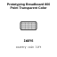
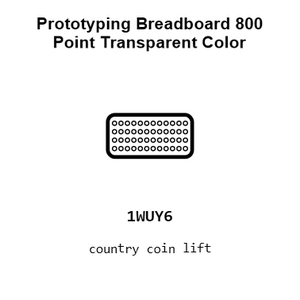
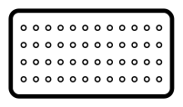
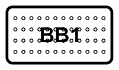
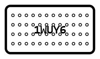
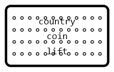
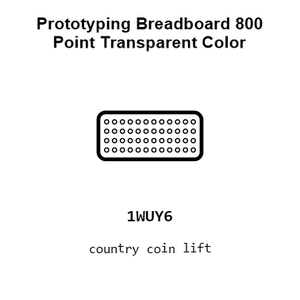
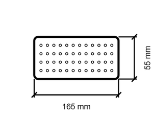
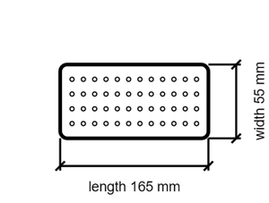

# Prototyping Breadboard 800 Point Transparent Color

`electronic_prototyping_breadboard_800_point_transparent_color`

Prototyping Breadboard 800 Point Transparent Color is an OOMP electronic prototyping definition. It uses the breadboard package or form factor. Its nominal drawing size is 165.0 × 55.0 mm.

## At a glance

| Detail | Value |
| --- | --- |
| OOMP ID | `electronic_prototyping_breadboard_800_point_transparent_color` |
| Type | Prototyping |
| Package / style | breadboard |
| Nominal size | 165.0 × 55.0 mm |

## Classification

| Level | Value |
| --- | --- |
| 1 | `electronic` |
| 2 | `prototyping` |
| 3 | `breadboard` |
| 4 | `800_point` |
| 5 | `transparent_color` |

## Nominal dimensions

| Measurement | Value |
| --- | ---: |
| Length | 165.0 mm |
| Width | 55.0 mm |

## Files

[View this part on GitHub](https://github.com/oomlout/oomp_electronic_version_5/tree/main/parts/electronic_prototyping_breadboard_800_point_transparent_color)

---

This page is generated from the OOMP part definition by a Roboclick Jinja template. Edit the source taxonomy or template rather than this generated file.
