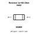
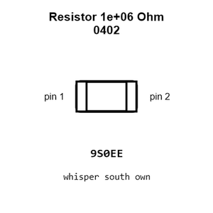
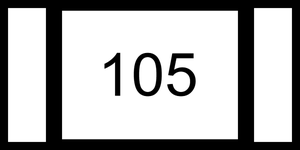
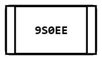
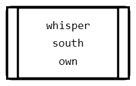
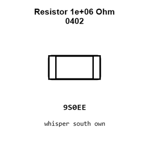
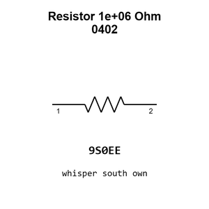

# Resistor 1e+06 Ohm 0402

`electronic_resistor_0402_1000000_ohm`

Resistor 1e+06 Ohm 0402 is an OOMP electronic resistor definition. It uses the 0402 package or form factor. Its nominal drawing size is 1.0 &#x00D7; 0.5 mm.

## At a glance

| Detail | Value |
| --- | --- |
| OOMP ID | `electronic_resistor_0402_1000000_ohm` |
| Type | Resistor |
| Package / style | 0402 |
| Nominal size | 1.0 &#x00D7; 0.5 mm |

## Classification

| Level | Value |
| --- | --- |
| 1 | `electronic` |
| 2 | `resistor` |
| 3 | `0402` |
| 4 | `1000000_ohm` |

## Nominal dimensions

| Measurement | Value |
| --- | ---: |
| Length | 1.0 mm |
| Width | 0.5 mm |

## Identifiers

| Identifier | Value |
| --- | --- |
| Manufacturer part number | `FRC0402J105 TS` |
| LCSC | [`C2906900`](https://www.lcsc.com/product-detail/C2906900.html) |
| LCSC | [`C138033`](https://www.lcsc.com/product-detail/C138033.html) |
| LCSC | [`C26083`](https://www.lcsc.com/product-detail/C26083.html) |

## Used in projects

| Project | Quantity | References | Explore |
| --- | ---: | --- | --- |
| [Project adafruit/Adafruit-QT-Py-ESP32-S3-PCB Adafruit QT Py ESP32 S3 current](https://github.com/adafruit/Adafruit-QT-Py-ESP32-S3-PCB/blob/main/Adafruit%20QT%20Py%20ESP32-S3.brd) | 1 | R17 | [Board explorer](https://oomlout.github.io/oomp_electronic_version_5/parts/oomp_project_github_adafruit_adafruit_qt_py_esp32_s3_pcb_adafruit_qt_py_esp32_s3_current/board_explorer.html) · [OOMP project](https://github.com/oomlout/oomp_electronic_version_5/tree/main/parts/oomp_project_github_adafruit_adafruit_qt_py_esp32_s3_pcb_adafruit_qt_py_esp32_s3_current) |
| [Project adafruit/Adafruit-RP2040-Prop-Maker-Feather-PCB Adafruit Feather RP2040 Prop Maker current](https://github.com/adafruit/Adafruit-RP2040-Prop-Maker-Feather-PCB/blob/main/Adafruit%20Feather%20RP2040%20Prop-Maker.brd) | 1 | R18 | [Board explorer](https://oomlout.github.io/oomp_electronic_version_5/parts/oomp_project_github_adafruit_adafruit_rp2040_prop_maker_feather_pcb_adafruit_feather_rp2040_prop_maker_current/board_explorer.html) · [OOMP project](https://github.com/oomlout/oomp_electronic_version_5/tree/main/parts/oomp_project_github_adafruit_adafruit_rp2040_prop_maker_feather_pcb_adafruit_feather_rp2040_prop_maker_current) |
| [Project sparkfun/LilyPad_MP3_Player Lily Pad MP3a current](https://github.com/sparkfun/LilyPad_MP3_Player/blob/master/hardware/LilyPad-MP3-v15a.brd) | 1 | R4 | [Board explorer](https://oomlout.github.io/oomp_electronic_version_5/parts/oomp_project_github_sparkfun_lily_pad_mp3_player_lily_pad_mp3a_current/board_explorer.html) · [OOMP project](https://github.com/oomlout/oomp_electronic_version_5/tree/main/parts/oomp_project_github_sparkfun_lily_pad_mp3_player_lily_pad_mp3a_current) |
| [Project sparkfun/MP3_Breakout-VS1063 Spark Fun MP3 Breakout VS1063 current](https://github.com/sparkfun/MP3_Breakout-VS1063/blob/master/Hardware/SparkFun_MP3_Breakout-VS1063.brd) | 1 | R1 | [Board explorer](https://oomlout.github.io/oomp_electronic_version_5/parts/oomp_project_github_sparkfun_mp3_breakout_vs1063_spark_fun_mp3_breakout_vs1063_current/board_explorer.html) · [OOMP project](https://github.com/oomlout/oomp_electronic_version_5/tree/main/parts/oomp_project_github_sparkfun_mp3_breakout_vs1063_spark_fun_mp3_breakout_vs1063_current) |
| [Project sparkfun/OpenLog_Artemis Spark Fun Artemis Open Log current](https://github.com/sparkfun/OpenLog_Artemis/blob/main/Hardware/SparkFun_Artemis_OpenLog.brd) | 1 | R6 | [Board explorer](https://oomlout.github.io/oomp_electronic_version_5/parts/oomp_project_github_sparkfun_open_log_artemis_spark_fun_artemis_open_log_current/board_explorer.html) · [OOMP project](https://github.com/oomlout/oomp_electronic_version_5/tree/main/parts/oomp_project_github_sparkfun_open_log_artemis_spark_fun_artemis_open_log_current) |
| [Project sparkfun/SparkFun_Qwiic_Pocket_Dev_Board_ESP32_C6 Qwiic Pocket Dev ESP32 C6 current](https://github.com/sparkfun/SparkFun_Qwiic_Pocket_Dev_Board_ESP32_C6/blob/main/Hardware/Qwiic_Pocket_Dev_ESP32_C6.brd) | 2 | R13, R14 | [Board explorer](https://oomlout.github.io/oomp_electronic_version_5/parts/oomp_project_github_sparkfun_spark_fun_qwiic_pocket_dev_board_esp32_c6_qwiic_pocket_dev_esp32_c6_current/board_explorer.html) · [OOMP project](https://github.com/oomlout/oomp_electronic_version_5/tree/main/parts/oomp_project_github_sparkfun_spark_fun_qwiic_pocket_dev_board_esp32_c6_qwiic_pocket_dev_esp32_c6_current) |
| [Project sparkfun/WiFly-Shield WiFly Shield current](https://github.com/sparkfun/WiFly-Shield/blob/master/Hardware/SparkFun_WiFly_Shield.brd) | 1 | R9 | [Board explorer](https://oomlout.github.io/oomp_electronic_version_5/parts/oomp_project_github_sparkfun_wi_fly_shield_wifly_shield_current/board_explorer.html) · [OOMP project](https://github.com/oomlout/oomp_electronic_version_5/tree/main/parts/oomp_project_github_sparkfun_wi_fly_shield_wifly_shield_current) |

## Files

[KiCad symbol, machine-solder and hand-solder footprints](data/kicad/README.md) · [Availability and source masters](data/kicad/manifest.yaml)

[View this part on GitHub](https://github.com/oomlout/oomp_electronic_version_5/tree/main/parts/electronic_resistor_0402_1000000_ohm)

[Browse this category](../../navigation/electronic/resistor/0402/README.md)

---

This page is generated from the OOMP part definition by a Roboclick Jinja template. Edit the source taxonomy or template rather than this generated file.