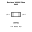
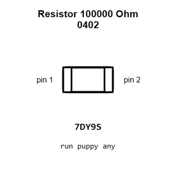
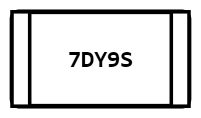
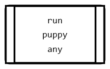
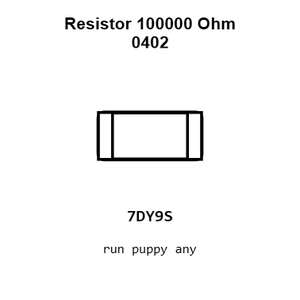
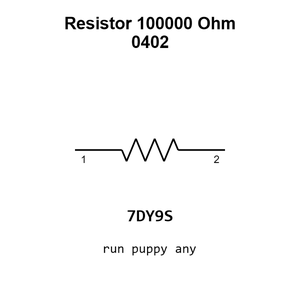

# Resistor 100000 Ohm 0402

`electronic_resistor_0402_100000_ohm`

Resistor 100000 Ohm 0402 is an OOMP electronic resistor definition. It uses the 0402 package or form factor. Its nominal drawing size is 1.0 &#x00D7; 0.5 mm.

## At a glance

| Detail | Value |
| --- | --- |
| OOMP ID | `electronic_resistor_0402_100000_ohm` |
| Type | Resistor |
| Package / style | 0402 |
| Nominal size | 1.0 &#x00D7; 0.5 mm |

## Classification

| Level | Value |
| --- | --- |
| 1 | `electronic` |
| 2 | `resistor` |
| 3 | `0402` |
| 4 | `100000_ohm` |

## Nominal dimensions

| Measurement | Value |
| --- | ---: |
| Length | 1.0 mm |
| Width | 0.5 mm |

## Identifiers

| Identifier | Value |
| --- | --- |
| Manufacturer part number | `0402WGJ0104TCE` |
| LCSC | [`C25530`](https://www.lcsc.com/product-detail/C25530.html) |
| LCSC | [`C25741`](https://www.lcsc.com/product-detail/C25741.html) |
| LCSC | [`C60491`](https://www.lcsc.com/product-detail/C60491.html) |

## Used in projects

| Project | Quantity | References | Explore |
| --- | ---: | --- | --- |
| [Project adafruit/Adafruit-bq25185-with-3.3V-Buck-PCB Adafruit bq25185 with 3.3 V Output current](https://github.com/adafruit/Adafruit-bq25185-with-3.3V-Buck-PCB/blob/main/Adafruit%20bq25185%20with%203.3V%20Output.brd) | 2 | R7, R9 | [Board explorer](https://oomlout.github.io/oomp_electronic_version_5/parts/oomp_project_github_adafruit_adafruit_bq25185_with_3_3_v_buck_pcb_adafruit_bq25185_with_3_3_v_output_current/board_explorer.html) · [OOMP project](https://github.com/oomlout/oomp_electronic_version_5/tree/main/parts/oomp_project_github_adafruit_adafruit_bq25185_with_3_3_v_buck_pcb_adafruit_bq25185_with_3_3_v_output_current) |
| [Project adafruit/Adafruit-bq25185-with-5V-Boost-PCB Adafruit bq25185 with 5 V Boost Breakout current](https://github.com/adafruit/Adafruit-bq25185-with-5V-Boost-PCB/blob/main/Adafruit%20bq25185%20with%205V%20Boost%20Breakout.brd) | 2 | R2, R4 | [Board explorer](https://oomlout.github.io/oomp_electronic_version_5/parts/oomp_project_github_adafruit_adafruit_bq25185_with_5_v_boost_pcb_adafruit_bq25185_with_5_v_boost_breakout_current/board_explorer.html) · [OOMP project](https://github.com/oomlout/oomp_electronic_version_5/tree/main/parts/oomp_project_github_adafruit_adafruit_bq25185_with_5_v_boost_pcb_adafruit_bq25185_with_5_v_boost_breakout_current) |
| [Project adafruit/Adafruit-Feather-RP2040-DVI-PCB Adafruit Feather RP2040 DVI current](https://github.com/adafruit/Adafruit-Feather-RP2040-DVI-PCB/blob/main/Adafruit%20Feather%20RP2040%20DVI.brd) | 2 | R16, R17 | [Board explorer](https://oomlout.github.io/oomp_electronic_version_5/parts/oomp_project_github_adafruit_adafruit_feather_rp2040_dvi_pcb_adafruit_feather_rp2040_dvi_current/board_explorer.html) · [OOMP project](https://github.com/oomlout/oomp_electronic_version_5/tree/main/parts/oomp_project_github_adafruit_adafruit_feather_rp2040_dvi_pcb_adafruit_feather_rp2040_dvi_current) |
| [Project adafruit/Adafruit-Feather-RP2040-USB-Host-PCB Adafruit Feather RP2040 USB Host current](https://github.com/adafruit/Adafruit-Feather-RP2040-USB-Host-PCB/blob/main/Adafruit%20Feather%20RP2040%20USB%20Host.brd) | 2 | R14, R16 | [Board explorer](https://oomlout.github.io/oomp_electronic_version_5/parts/oomp_project_github_adafruit_adafruit_feather_rp2040_usb_host_pcb_adafruit_feather_rp2040_usb_host_current/board_explorer.html) · [OOMP project](https://github.com/oomlout/oomp_electronic_version_5/tree/main/parts/oomp_project_github_adafruit_adafruit_feather_rp2040_usb_host_pcb_adafruit_feather_rp2040_usb_host_current) |
| [Project adafruit/Adafruit-RP2040-Prop-Maker-Feather-PCB Adafruit Feather RP2040 Prop Maker current](https://github.com/adafruit/Adafruit-RP2040-Prop-Maker-Feather-PCB/blob/main/Adafruit%20Feather%20RP2040%20Prop-Maker.brd) | 2 | R16, R17 | [Board explorer](https://oomlout.github.io/oomp_electronic_version_5/parts/oomp_project_github_adafruit_adafruit_rp2040_prop_maker_feather_pcb_adafruit_feather_rp2040_prop_maker_current/board_explorer.html) · [OOMP project](https://github.com/oomlout/oomp_electronic_version_5/tree/main/parts/oomp_project_github_adafruit_adafruit_rp2040_prop_maker_feather_pcb_adafruit_feather_rp2040_prop_maker_current) |
| [Project dangerousprototypes/buspirate5_hardware 5_rev10a](https://github.com/DangerousPrototypes/BusPirate5-hardware) | 3 | R319, R401, R412 | [Board explorer](https://oomlout.github.io/oomp_electronic_version_5/parts/oomp_project_github_dangerousprototypes_buspirate5_hardware_5_rev10a/board_explorer.html) · [OOMP project](https://github.com/oomlout/oomp_electronic_version_5/tree/main/parts/oomp_project_github_dangerousprototypes_buspirate5_hardware_5_rev10a) |
| [Project dangerousprototypes/buspirate5_hardware current](https://github.com/DangerousPrototypes/BusPirate5-hardware) | 3 | R319, R401, R412 | [Board explorer](https://oomlout.github.io/oomp_electronic_version_5/parts/oomp_project_github_dangerousprototypes_buspirate5_hardware_current/board_explorer.html) · [OOMP project](https://github.com/oomlout/oomp_electronic_version_5/tree/main/parts/oomp_project_github_dangerousprototypes_buspirate5_hardware_current) |
| [Project electrolama/pt1 current](https://github.com/electrolama/pt1) | 2 | R5, R6 | [Board explorer](https://oomlout.github.io/oomp_electronic_version_5/parts/oomp_project_github_electrolama_pt1_current/board_explorer.html) · [OOMP project](https://github.com/oomlout/oomp_electronic_version_5/tree/main/parts/oomp_project_github_electrolama_pt1_current) |
| [Project sparkfun/ESP32_Thing_Plus ESP32 Thing Plus current](https://github.com/sparkfun/ESP32_Thing_Plus/blob/master/Hardware/ESP32_Thing_Plus.brd) | 1 | R8 | [Board explorer](https://oomlout.github.io/oomp_electronic_version_5/parts/oomp_project_github_sparkfun_esp32_thing_plus_esp32_thing_plus_current/board_explorer.html) · [OOMP project](https://github.com/oomlout/oomp_electronic_version_5/tree/main/parts/oomp_project_github_sparkfun_esp32_thing_plus_esp32_thing_plus_current) |
| [Project sparkfun/LilyPad_MP3_Player Lily Pad MP3a current](https://github.com/sparkfun/LilyPad_MP3_Player/blob/master/hardware/LilyPad-MP3-v15a.brd) | 7 | R5, R6, R7, R13, R14, R15, R16 | [Board explorer](https://oomlout.github.io/oomp_electronic_version_5/parts/oomp_project_github_sparkfun_lily_pad_mp3_player_lily_pad_mp3a_current/board_explorer.html) · [OOMP project](https://github.com/oomlout/oomp_electronic_version_5/tree/main/parts/oomp_project_github_sparkfun_lily_pad_mp3_player_lily_pad_mp3a_current) |
| [Project sparkfun/MicroMod_Artemis_Processor Micro Mod Artemis Processor Board current](https://github.com/sparkfun/MicroMod_Artemis_Processor/blob/master/Hardware/MicroMod-Artemis-ProcessorBoard.brd) | 4 | R2, R3, R6, R14 | [Board explorer](https://oomlout.github.io/oomp_electronic_version_5/parts/oomp_project_github_sparkfun_micro_mod_artemis_processor_micro_mod_artemis_processor_board_current/board_explorer.html) · [OOMP project](https://github.com/oomlout/oomp_electronic_version_5/tree/main/parts/oomp_project_github_sparkfun_micro_mod_artemis_processor_micro_mod_artemis_processor_board_current) |
| [Project sparkfun/MicroMod_STM32_Processor Micro Mod STM32 Processor current](https://github.com/sparkfun/MicroMod_STM32_Processor/blob/main/Hardware/MicroMod_STM32_Processor.brd) | 3 | R1, R5, R11 | [Board explorer](https://oomlout.github.io/oomp_electronic_version_5/parts/oomp_project_github_sparkfun_micro_mod_stm32_processor_micro_mod_stm32_processor_current/board_explorer.html) · [OOMP project](https://github.com/oomlout/oomp_electronic_version_5/tree/main/parts/oomp_project_github_sparkfun_micro_mod_stm32_processor_micro_mod_stm32_processor_current) |
| [Project sparkfun/MicroMod_Teensy_Processor Micro Mod Teensy current](https://github.com/sparkfun/MicroMod_Teensy_Processor/blob/main/Hardware/MicroMod-Teensy.brd) | 3 | R2, R5, R6 | [Board explorer](https://oomlout.github.io/oomp_electronic_version_5/parts/oomp_project_github_sparkfun_micro_mod_teensy_processor_micro_mod_teensy_current/board_explorer.html) · [OOMP project](https://github.com/oomlout/oomp_electronic_version_5/tree/main/parts/oomp_project_github_sparkfun_micro_mod_teensy_processor_micro_mod_teensy_current) |
| [Project sparkfun/MicroMod_Teensy_Processor Micro Mod Teensy Lockable current](https://github.com/sparkfun/MicroMod_Teensy_Processor/blob/main/Hardware/Lockable/MicroMod-Teensy-Lockable.brd) | 3 | R2, R5, R6 | [Board explorer](https://oomlout.github.io/oomp_electronic_version_5/parts/oomp_project_github_sparkfun_micro_mod_teensy_processor_micro_mod_teensy_lockable_current/board_explorer.html) · [OOMP project](https://github.com/oomlout/oomp_electronic_version_5/tree/main/parts/oomp_project_github_sparkfun_micro_mod_teensy_processor_micro_mod_teensy_lockable_current) |
| [Project sparkfun/MP3_Breakout-VS1063 Spark Fun MP3 Breakout VS1063 current](https://github.com/sparkfun/MP3_Breakout-VS1063/blob/master/Hardware/SparkFun_MP3_Breakout-VS1063.brd) | 10 | R2, R3, R4, R5, R10, R11, R14, R15, R16, R17 | [Board explorer](https://oomlout.github.io/oomp_electronic_version_5/parts/oomp_project_github_sparkfun_mp3_breakout_vs1063_spark_fun_mp3_breakout_vs1063_current/board_explorer.html) · [OOMP project](https://github.com/oomlout/oomp_electronic_version_5/tree/main/parts/oomp_project_github_sparkfun_mp3_breakout_vs1063_spark_fun_mp3_breakout_vs1063_current) |
| [Project sparkfun/OpenLog_Artemis Spark Fun Artemis Open Log current](https://github.com/sparkfun/OpenLog_Artemis/blob/main/Hardware/SparkFun_Artemis_OpenLog.brd) | 1 | R28 | [Board explorer](https://oomlout.github.io/oomp_electronic_version_5/parts/oomp_project_github_sparkfun_open_log_artemis_spark_fun_artemis_open_log_current/board_explorer.html) · [OOMP project](https://github.com/oomlout/oomp_electronic_version_5/tree/main/parts/oomp_project_github_sparkfun_open_log_artemis_spark_fun_artemis_open_log_current) |
| [Project sparkfun/SparkFun_Audio_Codec_Breakout_WM8960 Stereo Audio Codec Breakout WM8960 current](https://github.com/sparkfun/SparkFun_Audio_Codec_Breakout_WM8960/blob/main/Hardware/Stereo_Audio_Codec_Breakout_WM8960.brd) | 1 | R18 | [Board explorer](https://oomlout.github.io/oomp_electronic_version_5/parts/oomp_project_github_sparkfun_spark_fun_audio_codec_breakout_wm8960_stereo_audio_codec_breakout_wm8960_current/board_explorer.html) · [OOMP project](https://github.com/oomlout/oomp_electronic_version_5/tree/main/parts/oomp_project_github_sparkfun_spark_fun_audio_codec_breakout_wm8960_stereo_audio_codec_breakout_wm8960_current) |
| [Project sparkfun/SparkFun_DataLogger_IoT_9DoF Spark Fun Data Logger Io T 9 DOF current](https://github.com/sparkfun/SparkFun_DataLogger_IoT_9DoF/blob/main/Hardware/SparkFun_DataLogger_IoT_9DOF.brd) | 5 | R15, R17, R18, R20, R21 | [Board explorer](https://oomlout.github.io/oomp_electronic_version_5/parts/oomp_project_github_sparkfun_spark_fun_data_logger_io_t_9_do_f_spark_fun_data_logger_io_t_9_dof_current/board_explorer.html) · [OOMP project](https://github.com/oomlout/oomp_electronic_version_5/tree/main/parts/oomp_project_github_sparkfun_spark_fun_data_logger_io_t_9_do_f_spark_fun_data_logger_io_t_9_dof_current) |
| [Project sparkfun/SparkFun_Environmental_Combo_Breakout_ENS160_BME280_QWIIC Spark Fun ENS160 BME280 Breakout current](https://github.com/sparkfun/SparkFun_Environmental_Combo_Breakout_ENS160_BME280_QWIIC/blob/main/Hardware/SparkFun_ENS160_BME280_Breakout.brd) | 1 | R3 | [Board explorer](https://oomlout.github.io/oomp_electronic_version_5/parts/oomp_project_github_sparkfun_spark_fun_environmental_combo_breakout_ens160_bme280_qwiic_spark_fun_ens160_bme280_breakout_current/board_explorer.html) · [OOMP project](https://github.com/oomlout/oomp_electronic_version_5/tree/main/parts/oomp_project_github_sparkfun_spark_fun_environmental_combo_breakout_ens160_bme280_qwiic_spark_fun_ens160_bme280_breakout_current) |
| [Project sparkfun/SparkFun_GNSS_Dead_Reckoning_ZED-F9K Spark Fun GPS ZED F9 K current](https://github.com/sparkfun/SparkFun_GNSS_Dead_Reckoning_ZED-F9K/blob/main/Hardware/SparkFun_GPS_ZED-F9K.brd) | 1 | R3 | [Board explorer](https://oomlout.github.io/oomp_electronic_version_5/parts/oomp_project_github_sparkfun_spark_fun_gnss_dead_reckoning_zed_f9_k_spark_fun_gps_zed_f9_k_current/board_explorer.html) · [OOMP project](https://github.com/oomlout/oomp_electronic_version_5/tree/main/parts/oomp_project_github_sparkfun_spark_fun_gnss_dead_reckoning_zed_f9_k_spark_fun_gps_zed_f9_k_current) |
| [Project sparkfun/SparkFun_GNSS_Timing-ZED-F9T Spark Fun GNSS Timing ZED F9 T current](https://github.com/sparkfun/SparkFun_GNSS_Timing-ZED-F9T/blob/main/Hardware/SparkFun_GNSS_Timing-ZED-F9T.brd) | 1 | R15 | [Board explorer](https://oomlout.github.io/oomp_electronic_version_5/parts/oomp_project_github_sparkfun_spark_fun_gnss_timing_zed_f9_t_spark_fun_gnss_timing_zed_f9_t_current/board_explorer.html) · [OOMP project](https://github.com/oomlout/oomp_electronic_version_5/tree/main/parts/oomp_project_github_sparkfun_spark_fun_gnss_timing_zed_f9_t_spark_fun_gnss_timing_zed_f9_t_current) |
| [Project sparkfun/SparkFun_GPS_Dead_Reckoning_PHat_ZED-F9R Spark Fun ZED F9 R Phat current](https://github.com/sparkfun/SparkFun_GPS_Dead_Reckoning_PHat_ZED-F9R/blob/master/Hardware/SparkFun_ZED-F9R_Phat_v11.brd) | 1 | R1 | [Board explorer](https://oomlout.github.io/oomp_electronic_version_5/parts/oomp_project_github_sparkfun_spark_fun_gps_dead_reckoning_phat_zed_f9_r_spark_fun_zed_f9_r_phat_current/board_explorer.html) · [OOMP project](https://github.com/oomlout/oomp_electronic_version_5/tree/main/parts/oomp_project_github_sparkfun_spark_fun_gps_dead_reckoning_phat_zed_f9_r_spark_fun_zed_f9_r_phat_current) |
| [Project sparkfun/SparkFun_GPS_Dead_Reckoning_ZED-F9R Spark Fun ZED F9 R u FL current](https://github.com/sparkfun/SparkFun_GPS_Dead_Reckoning_ZED-F9R/blob/master/Hardware/UFL/SparkFun_ZED-F9R_v12_uFL.brd) | 1 | R3 | [Board explorer](https://oomlout.github.io/oomp_electronic_version_5/parts/oomp_project_github_sparkfun_spark_fun_gps_dead_reckoning_zed_f9_r_spark_fun_zed_f9_r_u_fl_current/board_explorer.html) · [OOMP project](https://github.com/oomlout/oomp_electronic_version_5/tree/main/parts/oomp_project_github_sparkfun_spark_fun_gps_dead_reckoning_zed_f9_r_spark_fun_zed_f9_r_u_fl_current) |
| [Project sparkfun/SparkFun_MicroMod_LTE_GNSS_Function_Board_u-blox_SARA-R5 Spark Fun Micro Mod Function SARA R5 current](https://github.com/sparkfun/SparkFun_MicroMod_LTE_GNSS_Function_Board_u-blox_SARA-R5/blob/main/Hardware/SparkFun_MicroMod_Function_SARA-R5.brd) | 7 | R1, R2, R3, R32, R39, R47, R50 | [Board explorer](https://oomlout.github.io/oomp_electronic_version_5/parts/oomp_project_github_sparkfun_spark_fun_micro_mod_lte_gnss_function_board_u_blox_sara_r5_spark_fun_micro_mod_function_sara_r5_current/board_explorer.html) · [OOMP project](https://github.com/oomlout/oomp_electronic_version_5/tree/main/parts/oomp_project_github_sparkfun_spark_fun_micro_mod_lte_gnss_function_board_u_blox_sara_r5_spark_fun_micro_mod_function_sara_r5_current) |
| [Project sparkfun/SparkFun_MicroMod_Single_Pair_Ethernet_Function_Board_ADIN1110 Spark Fun Micro Mod Function ADIN1110 current](https://github.com/sparkfun/SparkFun_MicroMod_Single_Pair_Ethernet_Function_Board_ADIN1110/blob/main/Hardware/SparkFun_MicroMod_Function_ADIN1110.brd) | 1 | R28 | [Board explorer](https://oomlout.github.io/oomp_electronic_version_5/parts/oomp_project_github_sparkfun_spark_fun_micro_mod_single_pair_ethernet_function_board_adin1110_spark_fun_micro_mod_function_adin1110_current/board_explorer.html) · [OOMP project](https://github.com/oomlout/oomp_electronic_version_5/tree/main/parts/oomp_project_github_sparkfun_spark_fun_micro_mod_single_pair_ethernet_function_board_adin1110_spark_fun_micro_mod_function_adin1110_current) |
| [Project sparkfun/SparkFun_Pulse_Oximeter_Heart_Rate_Sensor Spark Fun Pulse Oximeter Heart Rate Sensor current](https://github.com/sparkfun/SparkFun_Pulse_Oximeter_Heart_Rate_Sensor/blob/master/Hardware/SparkFun_Pulse_Oximeter_Heart-Rate_Sensor.brd) | 1 | R4 | [Board explorer](https://oomlout.github.io/oomp_electronic_version_5/parts/oomp_project_github_sparkfun_spark_fun_pulse_oximeter_heart_rate_sensor_spark_fun_pulse_oximeter_heart_rate_sensor_current/board_explorer.html) · [OOMP project](https://github.com/oomlout/oomp_electronic_version_5/tree/main/parts/oomp_project_github_sparkfun_spark_fun_pulse_oximeter_heart_rate_sensor_spark_fun_pulse_oximeter_heart_rate_sensor_current) |
| [Project sparkfun/SparkFun_Qwiic_6DoF_BMI270 Spark Fun Qwiic 6 Do F BMI270 current](https://github.com/sparkfun/SparkFun_Qwiic_6DoF_BMI270/blob/main/Hardware/Qwiic%20Micro/SparkFun_Qwiic_6DoF_BMI270.brd) | 3 | R3, R5, R6 | [Board explorer](https://oomlout.github.io/oomp_electronic_version_5/parts/oomp_project_github_sparkfun_spark_fun_qwiic_6_do_f_bmi270_qwiic_micro_spark_fun_qwiic_6_do_f_bmi270_current/board_explorer.html) · [OOMP project](https://github.com/oomlout/oomp_electronic_version_5/tree/main/parts/oomp_project_github_sparkfun_spark_fun_qwiic_6_do_f_bmi270_qwiic_micro_spark_fun_qwiic_6_do_f_bmi270_current) |
| [Project sparkfun/SparkFun_Qwiic_Pocket_Dev_Board_ESP32_C6 Qwiic Pocket Dev ESP32 C6 current](https://github.com/sparkfun/SparkFun_Qwiic_Pocket_Dev_Board_ESP32_C6/blob/main/Hardware/Qwiic_Pocket_Dev_ESP32_C6.brd) | 4 | R7, R8, R11, R12 | [Board explorer](https://oomlout.github.io/oomp_electronic_version_5/parts/oomp_project_github_sparkfun_spark_fun_qwiic_pocket_dev_board_esp32_c6_qwiic_pocket_dev_esp32_c6_current/board_explorer.html) · [OOMP project](https://github.com/oomlout/oomp_electronic_version_5/tree/main/parts/oomp_project_github_sparkfun_spark_fun_qwiic_pocket_dev_board_esp32_c6_qwiic_pocket_dev_esp32_c6_current) |
| [Project sparkfun/SparkFun_Thing_Plus_AW-CU488 Spark Fun Azure Wave Module Thing Plus AW CU488 current](https://github.com/sparkfun/SparkFun_Thing_Plus_AW-CU488/blob/main/Hardware/SparkFun_AzureWave_Module_Thing_Plus_AW-CU488.brd) | 1 | R8 | [Board explorer](https://oomlout.github.io/oomp_electronic_version_5/parts/oomp_project_github_sparkfun_spark_fun_thing_plus_aw_cu488_spark_fun_azure_wave_module_thing_plus_aw_cu488_current/board_explorer.html) · [OOMP project](https://github.com/oomlout/oomp_electronic_version_5/tree/main/parts/oomp_project_github_sparkfun_spark_fun_thing_plus_aw_cu488_spark_fun_azure_wave_module_thing_plus_aw_cu488_current) |
| [Project sparkfun/SparkFun_Thing_Plus_MGM240P Thing Plus MGM240 P current](https://github.com/sparkfun/SparkFun_Thing_Plus_MGM240P/blob/main/Hardware/Thing_Plus_MGM240P.brd) | 3 | R3, R14, R19 | [Board explorer](https://oomlout.github.io/oomp_electronic_version_5/parts/oomp_project_github_sparkfun_spark_fun_thing_plus_mgm240_p_thing_plus_mgm240_p_current/board_explorer.html) · [OOMP project](https://github.com/oomlout/oomp_electronic_version_5/tree/main/parts/oomp_project_github_sparkfun_spark_fun_thing_plus_mgm240_p_thing_plus_mgm240_p_current) |
| [Project sparkfun/SparkFun_Thing_Plus_NORA-W306 Spark Fun Thing Plus NORA W306 current](https://github.com/sparkfun/SparkFun_Thing_Plus_NORA-W306/blob/main/Hardware/SparkFun_Thing_Plus_NORA_W306.brd) | 5 | R7, R8, R16, R19, R20 | [Board explorer](https://oomlout.github.io/oomp_electronic_version_5/parts/oomp_project_github_sparkfun_spark_fun_thing_plus_nora_w306_spark_fun_thing_plus_nora_w306_current/board_explorer.html) · [OOMP project](https://github.com/oomlout/oomp_electronic_version_5/tree/main/parts/oomp_project_github_sparkfun_spark_fun_thing_plus_nora_w306_spark_fun_thing_plus_nora_w306_current) |
| [Project sparkfun/SparkFun_Tsunami_Super_WAV_Trigger_Qwiic Spark Fun Tsunami Qwiic current](https://github.com/sparkfun/SparkFun_Tsunami_Super_WAV_Trigger_Qwiic/blob/main/Hardware/SparkFun_Tsunami_Qwiic.brd) | 7 | R6, R9, R10, R19, R20, R21, R22 | [Board explorer](https://oomlout.github.io/oomp_electronic_version_5/parts/oomp_project_github_sparkfun_spark_fun_tsunami_super_wav_trigger_qwiic_spark_fun_tsunami_qwiic_current/board_explorer.html) · [OOMP project](https://github.com/oomlout/oomp_electronic_version_5/tree/main/parts/oomp_project_github_sparkfun_spark_fun_tsunami_super_wav_trigger_qwiic_spark_fun_tsunami_qwiic_current) |

## Files

[KiCad symbol, machine-solder and hand-solder footprints](data/kicad/README.md) · [Availability and source masters](data/kicad/manifest.yaml)

[View this part on GitHub](https://github.com/oomlout/oomp_electronic_version_5/tree/main/parts/electronic_resistor_0402_100000_ohm)

[Browse this category](../../navigation/electronic/resistor/0402/README.md)

---

This page is generated from the OOMP part definition by a Roboclick Jinja template. Edit the source taxonomy or template rather than this generated file.