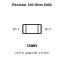
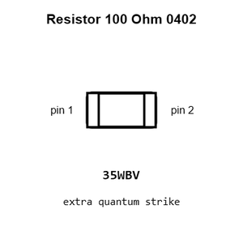
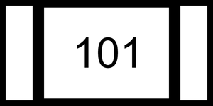
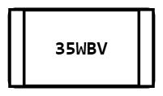
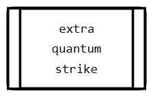
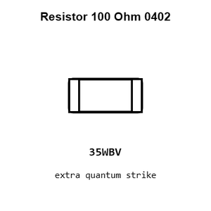
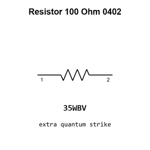

# Resistor 100 Ohm 0402

`electronic_resistor_0402_100_ohm`

Resistor 100 Ohm 0402 is an OOMP electronic resistor definition. It uses the 0402 package or form factor. Its nominal drawing size is 1.0 &#x00D7; 0.5 mm.

## At a glance

| Detail | Value |
| --- | --- |
| OOMP ID | `electronic_resistor_0402_100_ohm` |
| Type | Resistor |
| Package / style | 0402 |
| Nominal size | 1.0 &#x00D7; 0.5 mm |

## Classification

| Level | Value |
| --- | --- |
| 1 | `electronic` |
| 2 | `resistor` |
| 3 | `0402` |
| 4 | `100_ohm` |

## Nominal dimensions

| Measurement | Value |
| --- | ---: |
| Length | 1.0 mm |
| Width | 0.5 mm |

## Identifiers

| Identifier | Value |
| --- | --- |
| Manufacturer part number | `FRC0402F1000TS` |
| LCSC | [`C2906860`](https://www.lcsc.com/product-detail/C2906860.html) |
| LCSC | [`C106232`](https://www.lcsc.com/product-detail/C106232.html) |
| LCSC | [`C2906884`](https://www.lcsc.com/product-detail/C2906884.html) |

## Used in projects

| Project | Quantity | References | Explore |
| --- | ---: | --- | --- |
| [Project adafruit/Adafruit-Mini-Sparkle-Motion-PCB Adafruit Mini Sparkle Motion current](https://github.com/adafruit/Adafruit-Mini-Sparkle-Motion-PCB/blob/main/Adafruit%20Mini%20Sparkle%20Motion.brd) | 2 | R13, R14 | [Board explorer](https://oomlout.github.io/oomp_electronic_version_5/parts/oomp_project_github_adafruit_adafruit_mini_sparkle_motion_pcb_adafruit_mini_sparkle_motion_current/board_explorer.html) · [OOMP project](https://github.com/oomlout/oomp_electronic_version_5/tree/main/parts/oomp_project_github_adafruit_adafruit_mini_sparkle_motion_pcb_adafruit_mini_sparkle_motion_current) |
| [Project adafruit/Adafruit-Pixel-Shifter-PCB Adafruit Pixel Shifter current](https://github.com/adafruit/Adafruit-Pixel-Shifter-PCB/blob/main/Adafruit%20Pixel%20Shifter.brd) | 3 | R1, R2, R3 | [Board explorer](https://oomlout.github.io/oomp_electronic_version_5/parts/oomp_project_github_adafruit_adafruit_pixel_shifter_pcb_adafruit_pixel_shifter_current/board_explorer.html) · [OOMP project](https://github.com/oomlout/oomp_electronic_version_5/tree/main/parts/oomp_project_github_adafruit_adafruit_pixel_shifter_pcb_adafruit_pixel_shifter_current) |
| [Project adafruit/Adafruit-RP2040-Prop-Maker-Feather-PCB Adafruit Feather RP2040 Prop Maker current](https://github.com/adafruit/Adafruit-RP2040-Prop-Maker-Feather-PCB/blob/main/Adafruit%20Feather%20RP2040%20Prop-Maker.brd) | 1 | R19 | [Board explorer](https://oomlout.github.io/oomp_electronic_version_5/parts/oomp_project_github_adafruit_adafruit_rp2040_prop_maker_feather_pcb_adafruit_feather_rp2040_prop_maker_current/board_explorer.html) · [OOMP project](https://github.com/oomlout/oomp_electronic_version_5/tree/main/parts/oomp_project_github_adafruit_adafruit_rp2040_prop_maker_feather_pcb_adafruit_feather_rp2040_prop_maker_current) |
| [Project sparkfun/Lipo_Fuel_Gauge Spark Fun Lipo Fuel Gauge current](https://github.com/sparkfun/Lipo_Fuel_Gauge/blob/master/Hardware/SparkFun_Lipo_Fuel_Gauge.brd) | 1 | R2 | [Board explorer](https://oomlout.github.io/oomp_electronic_version_5/parts/oomp_project_github_sparkfun_lipo_fuel_gauge_spark_fun_lipo_fuel_gauge_current/board_explorer.html) · [OOMP project](https://github.com/oomlout/oomp_electronic_version_5/tree/main/parts/oomp_project_github_sparkfun_lipo_fuel_gauge_spark_fun_lipo_fuel_gauge_current) |
| [Project sparkfun/OBD-II_UART OBD II UART current](https://github.com/sparkfun/OBD-II_UART/blob/master/Hardware/OBD-II-UART.brd) | 2 | R14, R15 | [Board explorer](https://oomlout.github.io/oomp_electronic_version_5/parts/oomp_project_github_sparkfun_obd_ii_uart_obd_ii_uart_current/board_explorer.html) · [OOMP project](https://github.com/oomlout/oomp_electronic_version_5/tree/main/parts/oomp_project_github_sparkfun_obd_ii_uart_obd_ii_uart_current) |
| [Project sparkfun/ProtoSnap-LilyPad_Development_Board Lily Pad Dev current](https://github.com/sparkfun/ProtoSnap-LilyPad_Development_Board/blob/master/Hardware/LilyPad-Dev-v34.brd) | 2 | R4, R5 | [Board explorer](https://oomlout.github.io/oomp_electronic_version_5/parts/oomp_project_github_sparkfun_proto_snap_lily_pad_development_board_lily_pad_dev_current/board_explorer.html) · [OOMP project](https://github.com/oomlout/oomp_electronic_version_5/tree/main/parts/oomp_project_github_sparkfun_proto_snap_lily_pad_development_board_lily_pad_dev_current) |
| [Project sparkfun/SparkFun_Artemis_Global_Tracker Spark Fun Artemis Global Tracker current](https://github.com/sparkfun/SparkFun_Artemis_Global_Tracker/blob/main/Hardware/SparkFun_Artemis_Global_Tracker.brd) | 2 | R10, R11 | [Board explorer](https://oomlout.github.io/oomp_electronic_version_5/parts/oomp_project_github_sparkfun_spark_fun_artemis_global_tracker_spark_fun_artemis_global_tracker_current/board_explorer.html) · [OOMP project](https://github.com/oomlout/oomp_electronic_version_5/tree/main/parts/oomp_project_github_sparkfun_spark_fun_artemis_global_tracker_spark_fun_artemis_global_tracker_current) |
| [Project sparkfun/SparkFun_Audio_Codec_Breakout_WM8960 Stereo Audio Codec Breakout WM8960 current](https://github.com/sparkfun/SparkFun_Audio_Codec_Breakout_WM8960/blob/main/Hardware/Stereo_Audio_Codec_Breakout_WM8960.brd) | 6 | R1, R4, R6, R7, R8, R9 | [Board explorer](https://oomlout.github.io/oomp_electronic_version_5/parts/oomp_project_github_sparkfun_spark_fun_audio_codec_breakout_wm8960_stereo_audio_codec_breakout_wm8960_current/board_explorer.html) · [OOMP project](https://github.com/oomlout/oomp_electronic_version_5/tree/main/parts/oomp_project_github_sparkfun_spark_fun_audio_codec_breakout_wm8960_stereo_audio_codec_breakout_wm8960_current) |
| [Project sparkfun/SparkFun_Thing_Plus_AW-CU488 Spark Fun Azure Wave Module Thing Plus AW CU488 current](https://github.com/sparkfun/SparkFun_Thing_Plus_AW-CU488/blob/main/Hardware/SparkFun_AzureWave_Module_Thing_Plus_AW-CU488.brd) | 1 | R10 | [Board explorer](https://oomlout.github.io/oomp_electronic_version_5/parts/oomp_project_github_sparkfun_spark_fun_thing_plus_aw_cu488_spark_fun_azure_wave_module_thing_plus_aw_cu488_current/board_explorer.html) · [OOMP project](https://github.com/oomlout/oomp_electronic_version_5/tree/main/parts/oomp_project_github_sparkfun_spark_fun_thing_plus_aw_cu488_spark_fun_azure_wave_module_thing_plus_aw_cu488_current) |
| [Project sparkfun/SparkFun_Thing_Plus_NORA-W306 Spark Fun Thing Plus NORA W306 current](https://github.com/sparkfun/SparkFun_Thing_Plus_NORA-W306/blob/main/Hardware/SparkFun_Thing_Plus_NORA_W306.brd) | 4 | R10, R14, R21, R23 | [Board explorer](https://oomlout.github.io/oomp_electronic_version_5/parts/oomp_project_github_sparkfun_spark_fun_thing_plus_nora_w306_spark_fun_thing_plus_nora_w306_current/board_explorer.html) · [OOMP project](https://github.com/oomlout/oomp_electronic_version_5/tree/main/parts/oomp_project_github_sparkfun_spark_fun_thing_plus_nora_w306_spark_fun_thing_plus_nora_w306_current) |

## Files

[KiCad symbol, machine-solder and hand-solder footprints](data/kicad/README.md) · [Availability and source masters](data/kicad/manifest.yaml)

[View this part on GitHub](https://github.com/oomlout/oomp_electronic_version_5/tree/main/parts/electronic_resistor_0402_100_ohm)

[Browse this category](../../navigation/electronic/resistor/0402/README.md)

---

This page is generated from the OOMP part definition by a Roboclick Jinja template. Edit the source taxonomy or template rather than this generated file.