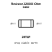
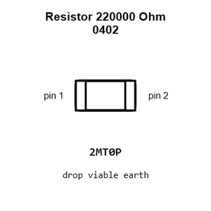
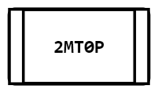
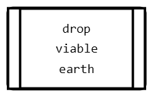
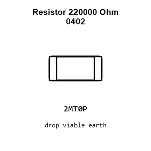
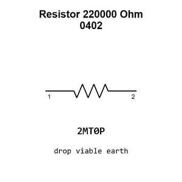

# Resistor 220000 Ohm 0402

`electronic_resistor_0402_220000_ohm`

Resistor 220000 Ohm 0402 is an OOMP electronic resistor definition. It uses the 0402 package or form factor. Its nominal drawing size is 1.0 &#x00D7; 0.5 mm.

## At a glance

| Detail | Value |
| --- | --- |
| OOMP ID | `electronic_resistor_0402_220000_ohm` |
| Type | Resistor |
| Package / style | 0402 |
| Nominal size | 1.0 &#x00D7; 0.5 mm |

## Classification

| Level | Value |
| --- | --- |
| 1 | `electronic` |
| 2 | `resistor` |
| 3 | `0402` |
| 4 | `220000_ohm` |

## Nominal dimensions

| Measurement | Value |
| --- | ---: |
| Length | 1.0 mm |
| Width | 0.5 mm |

## Identifiers

| Identifier | Value |
| --- | --- |
| Manufacturer part number | `FRC0402F2203TS` |
| LCSC | [`C2909335`](https://www.lcsc.com/product-detail/C2909335.html) |
| LCSC | [`C138030`](https://www.lcsc.com/product-detail/C138030.html) |
| LCSC | [`C54920755`](https://www.lcsc.com/product-detail/C54920755.html) |

## Used in projects

| Project | Quantity | References | Explore |
| --- | ---: | --- | --- |
| [Project sparkfun/MicroMod_Artemis_Processor Micro Mod Artemis Processor Board current](https://github.com/sparkfun/MicroMod_Artemis_Processor/blob/master/Hardware/MicroMod-Artemis-ProcessorBoard.brd) | 1 | R15 | [Board explorer](https://oomlout.github.io/oomp_electronic_version_5/parts/oomp_project_github_sparkfun_micro_mod_artemis_processor_micro_mod_artemis_processor_board_current/board_explorer.html) · [OOMP project](https://github.com/oomlout/oomp_electronic_version_5/tree/main/parts/oomp_project_github_sparkfun_micro_mod_artemis_processor_micro_mod_artemis_processor_board_current) |
| [Project sparkfun/OpenLog_Artemis Spark Fun Artemis Open Log current](https://github.com/sparkfun/OpenLog_Artemis/blob/main/Hardware/SparkFun_Artemis_OpenLog.brd) | 2 | R3, R29 | [Board explorer](https://oomlout.github.io/oomp_electronic_version_5/parts/oomp_project_github_sparkfun_open_log_artemis_spark_fun_artemis_open_log_current/board_explorer.html) · [OOMP project](https://github.com/oomlout/oomp_electronic_version_5/tree/main/parts/oomp_project_github_sparkfun_open_log_artemis_spark_fun_artemis_open_log_current) |
| [Project sparkfun/SparkFun_Buck_Regulator_AP63357DV-7 Spark Fun Buck Regulator AP63357 DV 7 Baby Buck5 V current](https://github.com/sparkfun/SparkFun_Buck_Regulator_AP63357DV-7/blob/main/Hardware/BabyBuck5V/SparkFun_Buck_Regulator_AP63357DV-7_BabyBuck5V.brd) | 1 | R1 | [Board explorer](https://oomlout.github.io/oomp_electronic_version_5/parts/oomp_project_github_sparkfun_spark_fun_buck_regulator_ap63357_dv_7_spark_fun_buck_regulator_ap63357_dv_7_baby_buck5_v_current/board_explorer.html) · [OOMP project](https://github.com/oomlout/oomp_electronic_version_5/tree/main/parts/oomp_project_github_sparkfun_spark_fun_buck_regulator_ap63357_dv_7_spark_fun_buck_regulator_ap63357_dv_7_baby_buck5_v_current) |
| [Project sparkfun/SparkFun_Buck_Regulator_AP63357DV-7 Spark Fun Buck Regulator AP63357 DV 7 Buck5 V current](https://github.com/sparkfun/SparkFun_Buck_Regulator_AP63357DV-7/blob/main/Hardware/Buck5V/SparkFun_Buck_Regulator_AP63357DV-7_Buck5V.brd) | 1 | R1 | [Board explorer](https://oomlout.github.io/oomp_electronic_version_5/parts/oomp_project_github_sparkfun_spark_fun_buck_regulator_ap63357_dv_7_spark_fun_buck_regulator_ap63357_dv_7_buck5_v_current/board_explorer.html) · [OOMP project](https://github.com/oomlout/oomp_electronic_version_5/tree/main/parts/oomp_project_github_sparkfun_spark_fun_buck_regulator_ap63357_dv_7_spark_fun_buck_regulator_ap63357_dv_7_buck5_v_current) |

## Files

[KiCad symbol, machine-solder and hand-solder footprints](data/kicad/README.md) · [Availability and source masters](data/kicad/manifest.yaml)

[View this part on GitHub](https://github.com/oomlout/oomp_electronic_version_5/tree/main/parts/electronic_resistor_0402_220000_ohm)

[Browse this category](../../navigation/electronic/resistor/0402/README.md)

---

This page is generated from the OOMP part definition by a Roboclick Jinja template. Edit the source taxonomy or template rather than this generated file.