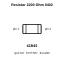
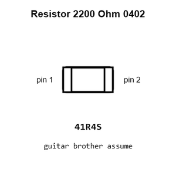
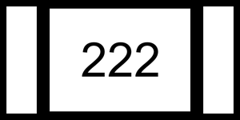
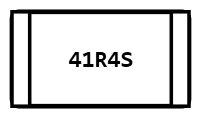
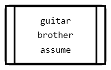
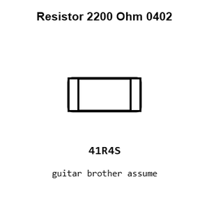
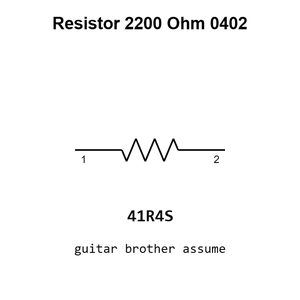

# Resistor 2200 Ohm 0402

`electronic_resistor_0402_2200_ohm`

Resistor 2200 Ohm 0402 is an OOMP electronic resistor definition. It uses the 0402 package or form factor. Its nominal drawing size is 1.0 &#x00D7; 0.5 mm.

## At a glance

| Detail | Value |
| --- | --- |
| OOMP ID | `electronic_resistor_0402_2200_ohm` |
| Type | Resistor |
| Package / style | 0402 |
| Nominal size | 1.0 &#x00D7; 0.5 mm |

## Classification

| Level | Value |
| --- | --- |
| 1 | `electronic` |
| 2 | `resistor` |
| 3 | `0402` |
| 4 | `2200_ohm` |

## Nominal dimensions

| Measurement | Value |
| --- | ---: |
| Length | 1.0 mm |
| Width | 0.5 mm |

## Identifiers

| Identifier | Value |
| --- | --- |
| Manufacturer part number | `FRC0402J222 TS` |
| LCSC | [`C2906920`](https://www.lcsc.com/product-detail/C2906920.html) |
| LCSC | [`C2906865`](https://www.lcsc.com/product-detail/C2906865.html) |
| LCSC | [`C163447`](https://www.lcsc.com/product-detail/C163447.html) |

## Used in projects

| Project | Quantity | References | Explore |
| --- | ---: | --- | --- |
| [Project adafruit/PicoDVI picodvi current](https://github.com/adafruit/PicoDVI/blob/master/hardware/mini_board/picodvi.kicad_pcb) | 3 | R1, R2, R6 | [Board explorer](https://oomlout.github.io/oomp_electronic_version_5/parts/oomp_project_github_adafruit_pico_dvi_mini_board_picodvi_current/board_explorer.html) · [OOMP project](https://github.com/oomlout/oomp_electronic_version_5/tree/main/parts/oomp_project_github_adafruit_pico_dvi_mini_board_picodvi_current) |
| [Project electrolama/pt1 current](https://github.com/electrolama/pt1) | 1 | R4 | [Board explorer](https://oomlout.github.io/oomp_electronic_version_5/parts/oomp_project_github_electrolama_pt1_current/board_explorer.html) · [OOMP project](https://github.com/oomlout/oomp_electronic_version_5/tree/main/parts/oomp_project_github_electrolama_pt1_current) |
| [Project soldered_electronics/Air-quality-sensor-MQ135-breakout-hardware-design MQ135 Breakout current](https://github.com/SolderedElectronics/Air-quality-sensor-MQ135-breakout-hardware-design) | 1 | R4 | [Board explorer](https://oomlout.github.io/oomp_electronic_version_5/parts/oomp_project_github_soldered_electronics_air_quality_sensor_mq135_breakout_hardware_design_sensor_gas_mq135_breakout_current/board_explorer.html) · [OOMP project](https://github.com/oomlout/oomp_electronic_version_5/tree/main/parts/oomp_project_github_soldered_electronics_air_quality_sensor_mq135_breakout_hardware_design_sensor_gas_mq135_breakout_current) |
| [Project soldered_electronics/Air-quality-sensor-MQ135-breakout-qwiic-hardware-design MQ135 Breakout qwiic current](https://github.com/SolderedElectronics/Air-quality-sensor-MQ135-breakout-qwiic-hardware-design) | 1 | R6 | [Board explorer](https://oomlout.github.io/oomp_electronic_version_5/parts/oomp_project_github_soldered_electronics_air_quality_sensor_mq135_breakout_qwiic_hardware_design_sensor_gas_mq135_qwiic_current/board_explorer.html) · [OOMP project](https://github.com/oomlout/oomp_electronic_version_5/tree/main/parts/oomp_project_github_soldered_electronics_air_quality_sensor_mq135_breakout_qwiic_hardware_design_sensor_gas_mq135_qwiic_current) |
| [Project soldered_electronics/Air-quality-sensor-MQ135-breakout-with-easyC-hardware-design MQ135 Breakout easyC current](https://github.com/SolderedElectronics/Air-quality-sensor-MQ135-breakout-with-easyC-hardware-design) | 1 | R6 | [Board explorer](https://oomlout.github.io/oomp_electronic_version_5/parts/oomp_project_github_soldered_electronics_air_quality_sensor_mq135_breakout_with_easy_c_hardware_design_sensor_gas_mq135_easyc_current/board_explorer.html) · [OOMP project](https://github.com/oomlout/oomp_electronic_version_5/tree/main/parts/oomp_project_github_soldered_electronics_air_quality_sensor_mq135_breakout_with_easy_c_hardware_design_sensor_gas_mq135_easyc_current) |
| [Project soldered_electronics/Alcohol--Ethanol-sensor-MQ3-breakout-hardware-design MQ3 Breakout current](https://github.com/SolderedElectronics/Alcohol--Ethanol-sensor-MQ3-breakout-hardware-design) | 1 | R4 | [Board explorer](https://oomlout.github.io/oomp_electronic_version_5/parts/oomp_project_github_soldered_electronics_alcohol_ethanol_sensor_mq3_breakout_hardware_design_sensor_gas_mq3_breakout_current/board_explorer.html) · [OOMP project](https://github.com/oomlout/oomp_electronic_version_5/tree/main/parts/oomp_project_github_soldered_electronics_alcohol_ethanol_sensor_mq3_breakout_hardware_design_sensor_gas_mq3_breakout_current) |
| [Project soldered_electronics/Alcohol--Ethanol-sensor-MQ3-breakout-qwiic-hardware-design MQ3 Breakout qwiic current](https://github.com/SolderedElectronics/Alcohol--Ethanol-sensor-MQ3-breakout-qwiic-hardware-design) | 1 | R6 | [Board explorer](https://oomlout.github.io/oomp_electronic_version_5/parts/oomp_project_github_soldered_electronics_alcohol_ethanol_sensor_mq3_breakout_qwiic_hardware_design_sensor_gas_mq3_qwiic_current/board_explorer.html) · [OOMP project](https://github.com/oomlout/oomp_electronic_version_5/tree/main/parts/oomp_project_github_soldered_electronics_alcohol_ethanol_sensor_mq3_breakout_qwiic_hardware_design_sensor_gas_mq3_qwiic_current) |
| [Project soldered_electronics/Alcohol--Ethanol-sensor-MQ3-breakout-with-easyC-hardware-design MQ3 Breakout easyC current](https://github.com/SolderedElectronics/Alcohol--Ethanol-sensor-MQ3-breakout-with-easyC-hardware-design) | 1 | R6 | [Board explorer](https://oomlout.github.io/oomp_electronic_version_5/parts/oomp_project_github_soldered_electronics_alcohol_ethanol_sensor_mq3_breakout_with_easy_c_hardware_design_sensor_gas_mq3_easyc_current/board_explorer.html) · [OOMP project](https://github.com/oomlout/oomp_electronic_version_5/tree/main/parts/oomp_project_github_soldered_electronics_alcohol_ethanol_sensor_mq3_breakout_with_easy_c_hardware_design_sensor_gas_mq3_easyc_current) |
| [Project soldered_electronics/Ammonia-sensor-MQ137-breakout-hardware-design MQ137 Breakout current](https://github.com/SolderedElectronics/Ammonia-sensor-MQ137-breakout-hardware-design) | 1 | R4 | [Board explorer](https://oomlout.github.io/oomp_electronic_version_5/parts/oomp_project_github_soldered_electronics_ammonia_sensor_mq137_breakout_hardware_design_sensor_gas_mq137_breakout_current/board_explorer.html) · [OOMP project](https://github.com/oomlout/oomp_electronic_version_5/tree/main/parts/oomp_project_github_soldered_electronics_ammonia_sensor_mq137_breakout_hardware_design_sensor_gas_mq137_breakout_current) |
| [Project soldered_electronics/Ammonia-sensor-MQ137-breakout-qwiic-hardware-design MQ137 Breakout qwiic current](https://github.com/SolderedElectronics/Ammonia-sensor-MQ137-breakout-qwiic-hardware-design) | 1 | R6 | [Board explorer](https://oomlout.github.io/oomp_electronic_version_5/parts/oomp_project_github_soldered_electronics_ammonia_sensor_mq137_breakout_qwiic_hardware_design_sensor_gas_mq137_qwiic_current/board_explorer.html) · [OOMP project](https://github.com/oomlout/oomp_electronic_version_5/tree/main/parts/oomp_project_github_soldered_electronics_ammonia_sensor_mq137_breakout_qwiic_hardware_design_sensor_gas_mq137_qwiic_current) |
| [Project soldered_electronics/Ammonia-sensor-MQ137-breakout-with-easyC-hardware-design MQ137 Breakout easyC current](https://github.com/SolderedElectronics/Ammonia-sensor-MQ137-breakout-with-easyC-hardware-design) | 1 | R6 | [Board explorer](https://oomlout.github.io/oomp_electronic_version_5/parts/oomp_project_github_soldered_electronics_ammonia_sensor_mq137_breakout_with_easy_c_hardware_design_sensor_gas_mq137_easyc_current/board_explorer.html) · [OOMP project](https://github.com/oomlout/oomp_electronic_version_5/tree/main/parts/oomp_project_github_soldered_electronics_ammonia_sensor_mq137_breakout_with_easy_c_hardware_design_sensor_gas_mq137_easyc_current) |
| [Project soldered_electronics/Benzene--Toluene--Acetone--Formaldehyde-sensor-MQ138-breakout-hardware-design MQ138 Breakout current](https://github.com/SolderedElectronics/Benzene--Toluene--Acetone--Formaldehyde-sensor-MQ138-breakout-hardware-design) | 1 | R4 | [Board explorer](https://oomlout.github.io/oomp_electronic_version_5/parts/oomp_project_github_soldered_electronics_benzene_toluene_acetone_formaldehyde_sensor_mq138_breakout_hardware_design_sensor_gas_mq138_breakout_current/board_explorer.html) · [OOMP project](https://github.com/oomlout/oomp_electronic_version_5/tree/main/parts/oomp_project_github_soldered_electronics_benzene_toluene_acetone_formaldehyde_sensor_mq138_breakout_hardware_design_sensor_gas_mq138_breakout_current) |
| [Project soldered_electronics/Benzene--Toluene--Acetone--Formaldehyde-sensor-MQ138-breakout-with-easyC-hardware-design MQ138 Breakout easyC current](https://github.com/SolderedElectronics/Benzene--Toluene--Acetone--Formaldehyde-sensor-MQ138-breakout-with-easyC-hardware-design) | 1 | R6 | [Board explorer](https://oomlout.github.io/oomp_electronic_version_5/parts/oomp_project_github_soldered_electronics_benzene_toluene_acetone_formaldehyde_sensor_mq138_breakout_with_easy_c_hardware_design_sensor_gas_mq138_easyc_current/board_explorer.html) · [OOMP project](https://github.com/oomlout/oomp_electronic_version_5/tree/main/parts/oomp_project_github_soldered_electronics_benzene_toluene_acetone_formaldehyde_sensor_mq138_breakout_with_easy_c_hardware_design_sensor_gas_mq138_easyc_current) |
| [Project soldered_electronics/Butane--LPG---Smoke-sensor-MQ2-breakout-hardware-design MQ2 Breakout current](https://github.com/SolderedElectronics/Butane--LPG---Smoke-sensor-MQ2-breakout-hardware-design) | 1 | R4 | [Board explorer](https://oomlout.github.io/oomp_electronic_version_5/parts/oomp_project_github_soldered_electronics_butane_lpg_smoke_sensor_mq2_breakout_hardware_design_sensor_gas_mq2_breakout_current/board_explorer.html) · [OOMP project](https://github.com/oomlout/oomp_electronic_version_5/tree/main/parts/oomp_project_github_soldered_electronics_butane_lpg_smoke_sensor_mq2_breakout_hardware_design_sensor_gas_mq2_breakout_current) |
| [Project soldered_electronics/Butane--LPG---Smoke-sensor-MQ2-breakout-qwiic-hardware-design MQ2 Breakout qwiic current](https://github.com/SolderedElectronics/Butane--LPG---Smoke-sensor-MQ2-breakout-qwiic-hardware-design) | 1 | R6 | [Board explorer](https://oomlout.github.io/oomp_electronic_version_5/parts/oomp_project_github_soldered_electronics_butane_lpg_smoke_sensor_mq2_breakout_qwiic_hardware_design_sensor_gas_mq2_qwiic_current/board_explorer.html) · [OOMP project](https://github.com/oomlout/oomp_electronic_version_5/tree/main/parts/oomp_project_github_soldered_electronics_butane_lpg_smoke_sensor_mq2_breakout_qwiic_hardware_design_sensor_gas_mq2_qwiic_current) |
| [Project soldered_electronics/Butane--LPG---Smoke-sensor-MQ2-breakout-with-easyC-hardware-design MQ2 Breakout easyC current](https://github.com/SolderedElectronics/Butane--LPG---Smoke-sensor-MQ2-breakout-qwiic-hardware-design) | 1 | R6 | [Board explorer](https://oomlout.github.io/oomp_electronic_version_5/parts/oomp_project_github_soldered_electronics_butane_lpg_smoke_sensor_mq2_breakout_with_easy_c_hardware_design_sensor_gas_mq2_easyc_current/board_explorer.html) · [OOMP project](https://github.com/oomlout/oomp_electronic_version_5/tree/main/parts/oomp_project_github_soldered_electronics_butane_lpg_smoke_sensor_mq2_breakout_with_easy_c_hardware_design_sensor_gas_mq2_easyc_current) |
| [Project soldered_electronics/CO--flammable-gasses-sensor-MQ9-breakout-hardware-design MQ9 Breakout current](https://github.com/SolderedElectronics/CO--flammable-gasses-sensor-MQ9-breakout-hardware-design) | 1 | R4 | [Board explorer](https://oomlout.github.io/oomp_electronic_version_5/parts/oomp_project_github_soldered_electronics_co_flammable_gasses_sensor_mq9_breakout_hardware_design_sensor_gas_mq9_breakout_current/board_explorer.html) · [OOMP project](https://github.com/oomlout/oomp_electronic_version_5/tree/main/parts/oomp_project_github_soldered_electronics_co_flammable_gasses_sensor_mq9_breakout_hardware_design_sensor_gas_mq9_breakout_current) |
| [Project soldered_electronics/CO--flammable-gasses-sensor-MQ9-breakout-qwiic-hardware-design MQ9 Breakout qwiic current](https://github.com/SolderedElectronics/CO--flammable-gasses-sensor-MQ9-breakout-qwiic-hardware-design) | 1 | R6 | [Board explorer](https://oomlout.github.io/oomp_electronic_version_5/parts/oomp_project_github_soldered_electronics_co_flammable_gasses_sensor_mq9_breakout_qwiic_hardware_design_sensor_gas_mq9_qwiic_current/board_explorer.html) · [OOMP project](https://github.com/oomlout/oomp_electronic_version_5/tree/main/parts/oomp_project_github_soldered_electronics_co_flammable_gasses_sensor_mq9_breakout_qwiic_hardware_design_sensor_gas_mq9_qwiic_current) |
| [Project soldered_electronics/CO--flammable-gasses-sensor-MQ9-breakout-with-easyC-hardware-design MQ9 Breakout easyC current](https://github.com/SolderedElectronics/CO--flammable-gasses-sensor-MQ9-breakout-with-easyC-hardware-design) | 1 | R6 | [Board explorer](https://oomlout.github.io/oomp_electronic_version_5/parts/oomp_project_github_soldered_electronics_co_flammable_gasses_sensor_mq9_breakout_with_easy_c_hardware_design_sensor_gas_mq9_easyc_current/board_explorer.html) · [OOMP project](https://github.com/oomlout/oomp_electronic_version_5/tree/main/parts/oomp_project_github_soldered_electronics_co_flammable_gasses_sensor_mq9_breakout_with_easy_c_hardware_design_sensor_gas_mq9_easyc_current) |
| [Project soldered_electronics/CO-sensor-MQ7-breakout-hardware-design MQ7 Breakout current](https://github.com/SolderedElectronics/CO-sensor-MQ7-breakout-hardware-design) | 1 | R4 | [Board explorer](https://oomlout.github.io/oomp_electronic_version_5/parts/oomp_project_github_soldered_electronics_co_sensor_mq7_breakout_hardware_design_sensor_gas_mq7_breakout_current/board_explorer.html) · [OOMP project](https://github.com/oomlout/oomp_electronic_version_5/tree/main/parts/oomp_project_github_soldered_electronics_co_sensor_mq7_breakout_hardware_design_sensor_gas_mq7_breakout_current) |
| [Project soldered_electronics/CO-sensor-MQ7-breakout-qwiic-hardware-design MQ7 Breakout qwiic current](https://github.com/SolderedElectronics/CO-sensor-MQ7-breakout-qwiic-hardware-design) | 1 | R6 | [Board explorer](https://oomlout.github.io/oomp_electronic_version_5/parts/oomp_project_github_soldered_electronics_co_sensor_mq7_breakout_qwiic_hardware_design_sensor_gas_mq7_qwiic_current/board_explorer.html) · [OOMP project](https://github.com/oomlout/oomp_electronic_version_5/tree/main/parts/oomp_project_github_soldered_electronics_co_sensor_mq7_breakout_qwiic_hardware_design_sensor_gas_mq7_qwiic_current) |
| [Project soldered_electronics/CO-sensor-MQ7-breakout-with-easyC-hardware-design MQ7 Breakout easyC current](https://github.com/SolderedElectronics/CO-sensor-MQ7-breakout-with-easyC-hardware-design) | 1 | R6 | [Board explorer](https://oomlout.github.io/oomp_electronic_version_5/parts/oomp_project_github_soldered_electronics_co_sensor_mq7_breakout_with_easy_c_hardware_design_sensor_gas_mq7_easyc_current/board_explorer.html) · [OOMP project](https://github.com/oomlout/oomp_electronic_version_5/tree/main/parts/oomp_project_github_soldered_electronics_co_sensor_mq7_breakout_with_easy_c_hardware_design_sensor_gas_mq7_easyc_current) |
| [Project soldered_electronics/GNSS-GPS-L86-M33-breakout-hardware-design L86-M33 GNSS current](https://github.com/SolderedElectronics/GNSS-GPS-L86-M33-breakout-hardware-design) | 2 | R9, R10 | [Board explorer](https://oomlout.github.io/oomp_electronic_version_5/parts/oomp_project_github_soldered_electronics_gnss_gps_l86_m33_breakout_hardware_design_sensor_gnss_l86m33_current/board_explorer.html) · [OOMP project](https://github.com/oomlout/oomp_electronic_version_5/tree/main/parts/oomp_project_github_soldered_electronics_gnss_gps_l86_m33_breakout_hardware_design_sensor_gnss_l86m33_current) |
| [Project soldered_electronics/GNSS-GPS-L86-M33-breakout-with-easyC-hardware-design L86-M33 GNSS easyC current](https://github.com/SolderedElectronics/GNSS-GPS-L86-M33-breakout-with-easyC-hardware-design) | 2 | R9, R10 | [Board explorer](https://oomlout.github.io/oomp_electronic_version_5/parts/oomp_project_github_soldered_electronics_gnss_gps_l86_m33_breakout_with_easy_c_hardware_design_sensor_gnss_l86m33_easyc_current/board_explorer.html) · [OOMP project](https://github.com/oomlout/oomp_electronic_version_5/tree/main/parts/oomp_project_github_soldered_electronics_gnss_gps_l86_m33_breakout_with_easy_c_hardware_design_sensor_gnss_l86m33_easyc_current) |
| [Project soldered_electronics/Hydrogen-sensor-MQ8-breakout-hardware-design MQ8 Breakout current](https://github.com/SolderedElectronics/Hydrogen-sensor-MQ8-breakout-hardware-design) | 1 | R4 | [Board explorer](https://oomlout.github.io/oomp_electronic_version_5/parts/oomp_project_github_soldered_electronics_hydrogen_sensor_mq8_breakout_hardware_design_sensor_gas_mq8_breakout_current/board_explorer.html) · [OOMP project](https://github.com/oomlout/oomp_electronic_version_5/tree/main/parts/oomp_project_github_soldered_electronics_hydrogen_sensor_mq8_breakout_hardware_design_sensor_gas_mq8_breakout_current) |
| [Project soldered_electronics/Hydrogen-sensor-MQ8-breakout-qwiic-hardware-design MQ8 Breakout qwiic current](https://github.com/SolderedElectronics/Hydrogen-sensor-MQ8-breakout-qwiic-hardware-design) | 1 | R6 | [Board explorer](https://oomlout.github.io/oomp_electronic_version_5/parts/oomp_project_github_soldered_electronics_hydrogen_sensor_mq8_breakout_qwiic_hardware_design_sensor_gas_mq8_qwiic_current/board_explorer.html) · [OOMP project](https://github.com/oomlout/oomp_electronic_version_5/tree/main/parts/oomp_project_github_soldered_electronics_hydrogen_sensor_mq8_breakout_qwiic_hardware_design_sensor_gas_mq8_qwiic_current) |
| [Project soldered_electronics/Hydrogen-sensor-MQ8-breakout-with-easyC-hardware-design MQ8 Breakout easyC current](https://github.com/SolderedElectronics/Hydrogen-sensor-MQ8-breakout-with-easyC-hardware-design) | 1 | R6 | [Board explorer](https://oomlout.github.io/oomp_electronic_version_5/parts/oomp_project_github_soldered_electronics_hydrogen_sensor_mq8_breakout_with_easy_c_hardware_design_sensor_gas_mq8_easyc_current/board_explorer.html) · [OOMP project](https://github.com/oomlout/oomp_electronic_version_5/tree/main/parts/oomp_project_github_soldered_electronics_hydrogen_sensor_mq8_breakout_with_easy_c_hardware_design_sensor_gas_mq8_easyc_current) |
| [Project soldered_electronics/Hydrogen-Sulfide-sensor-MQ136-breakout-hardware-design MQ136 Breakout current](https://github.com/SolderedElectronics/Hydrogen-Sulfide-sensor-MQ136-breakout-hardware-design) | 1 | R4 | [Board explorer](https://oomlout.github.io/oomp_electronic_version_5/parts/oomp_project_github_soldered_electronics_hydrogen_sulfide_sensor_mq136_breakout_hardware_design_sensor_gas_mq136_breakout_current/board_explorer.html) · [OOMP project](https://github.com/oomlout/oomp_electronic_version_5/tree/main/parts/oomp_project_github_soldered_electronics_hydrogen_sulfide_sensor_mq136_breakout_hardware_design_sensor_gas_mq136_breakout_current) |
| [Project soldered_electronics/Hydrogen-Sulfide-sensor-MQ136-breakout-with-easyC-hardware-design MQ136 Breakout easyC current](https://github.com/SolderedElectronics/Hydrogen-Sulfide-sensor-MQ136-breakout-with-easyC-hardware-design) | 1 | R6 | [Board explorer](https://oomlout.github.io/oomp_electronic_version_5/parts/oomp_project_github_soldered_electronics_hydrogen_sulfide_sensor_mq136_breakout_with_easy_c_hardware_design_sensor_gas_mq136_easyc_current/board_explorer.html) · [OOMP project](https://github.com/oomlout/oomp_electronic_version_5/tree/main/parts/oomp_project_github_soldered_electronics_hydrogen_sulfide_sensor_mq136_breakout_with_easy_c_hardware_design_sensor_gas_mq136_easyc_current) |
| [Project soldered_electronics/LPG--Butane-sensor-MQ6-breakout-hardware-design MQ6 Breakout current](https://github.com/SolderedElectronics/LPG--Butane-sensor-MQ6-breakout-hardware-design) | 1 | R4 | [Board explorer](https://oomlout.github.io/oomp_electronic_version_5/parts/oomp_project_github_soldered_electronics_lpg_butane_sensor_mq6_breakout_hardware_design_sensor_gas_mq6_breakout_current/board_explorer.html) · [OOMP project](https://github.com/oomlout/oomp_electronic_version_5/tree/main/parts/oomp_project_github_soldered_electronics_lpg_butane_sensor_mq6_breakout_hardware_design_sensor_gas_mq6_breakout_current) |
| [Project soldered_electronics/LPG--Butane-sensor-MQ6-breakout-qwiic-hardware-design MQ6 Breakout qwiic current](https://github.com/SolderedElectronics/LPG--Butane-sensor-MQ6-breakout-qwiic-hardware-design) | 1 | R6 | [Board explorer](https://oomlout.github.io/oomp_electronic_version_5/parts/oomp_project_github_soldered_electronics_lpg_butane_sensor_mq6_breakout_qwiic_hardware_design_sensor_gas_mq6_qwiic_current/board_explorer.html) · [OOMP project](https://github.com/oomlout/oomp_electronic_version_5/tree/main/parts/oomp_project_github_soldered_electronics_lpg_butane_sensor_mq6_breakout_qwiic_hardware_design_sensor_gas_mq6_qwiic_current) |
| [Project soldered_electronics/LPG--Butane-sensor-MQ6-breakout-with-easyC-hardware-design MQ6 Breakout easyC current](https://github.com/SolderedElectronics/LPG--Butane-sensor-MQ6-breakout-with-easyC-hardware-design) | 1 | R6 | [Board explorer](https://oomlout.github.io/oomp_electronic_version_5/parts/oomp_project_github_soldered_electronics_lpg_butane_sensor_mq6_breakout_with_easy_c_hardware_design_sensor_gas_mq6_easyc_current/board_explorer.html) · [OOMP project](https://github.com/oomlout/oomp_electronic_version_5/tree/main/parts/oomp_project_github_soldered_electronics_lpg_butane_sensor_mq6_breakout_with_easy_c_hardware_design_sensor_gas_mq6_easyc_current) |
| [Project soldered_electronics/Methane.-CNG-sensor-MQ4-breakout-hardware-design MQ4 Breakout current](https://github.com/SolderedElectronics/Methane.-CNG-sensor-MQ4-breakout-hardware-design) | 1 | R4 | [Board explorer](https://oomlout.github.io/oomp_electronic_version_5/parts/oomp_project_github_soldered_electronics_methane_cng_sensor_mq4_breakout_hardware_design_sensor_gas_mq4_breakout_current/board_explorer.html) · [OOMP project](https://github.com/oomlout/oomp_electronic_version_5/tree/main/parts/oomp_project_github_soldered_electronics_methane_cng_sensor_mq4_breakout_hardware_design_sensor_gas_mq4_breakout_current) |
| [Project soldered_electronics/Methane--CNG-sensor-MQ4-breakout-qwiic-hardware-design MQ4 Breakout qwiic current](https://github.com/SolderedElectronics/Methane--CNG-sensor-MQ4-breakout-qwiic-hardware-design) | 1 | R6 | [Board explorer](https://oomlout.github.io/oomp_electronic_version_5/parts/oomp_project_github_soldered_electronics_methane_cng_sensor_mq4_breakout_qwiic_hardware_design_sensor_gas_mq4_qwiic_current/board_explorer.html) · [OOMP project](https://github.com/oomlout/oomp_electronic_version_5/tree/main/parts/oomp_project_github_soldered_electronics_methane_cng_sensor_mq4_breakout_qwiic_hardware_design_sensor_gas_mq4_qwiic_current) |
| [Project soldered_electronics/Methane--CNG-sensor-MQ4-breakout-with-easyC-hardware-design MQ4 Breakout easyC current](https://github.com/SolderedElectronics/Methane--CNG-sensor-MQ4-breakout-with-easyC-hardware-design) | 1 | R6 | [Board explorer](https://oomlout.github.io/oomp_electronic_version_5/parts/oomp_project_github_soldered_electronics_methane_cng_sensor_mq4_breakout_with_easy_c_hardware_design_sensor_gas_mq4_easyc_current/board_explorer.html) · [OOMP project](https://github.com/oomlout/oomp_electronic_version_5/tree/main/parts/oomp_project_github_soldered_electronics_methane_cng_sensor_mq4_breakout_with_easy_c_hardware_design_sensor_gas_mq4_easyc_current) |
| [Project soldered_electronics/Methane--Natural-gas-sensor-MQ214-breakout-hardware-design MQ214 Breakout current](https://github.com/SolderedElectronics/Methane--Natural-gas-sensor-MQ214-breakout-hardware-design) | 1 | R4 | [Board explorer](https://oomlout.github.io/oomp_electronic_version_5/parts/oomp_project_github_soldered_electronics_methane_natural_gas_sensor_mq214_breakout_hardware_design_sensor_gas_mq214_breakout_current/board_explorer.html) · [OOMP project](https://github.com/oomlout/oomp_electronic_version_5/tree/main/parts/oomp_project_github_soldered_electronics_methane_natural_gas_sensor_mq214_breakout_hardware_design_sensor_gas_mq214_breakout_current) |
| [Project soldered_electronics/Methane--Natural-gas-sensor-MQ214-breakout-with-easyC-hardware-design MQ214 Breakout easyC current](https://github.com/SolderedElectronics/Methane--Natural-gas-sensor-MQ214-breakout-with-easyC-hardware-design) | 1 | R6 | [Board explorer](https://oomlout.github.io/oomp_electronic_version_5/parts/oomp_project_github_soldered_electronics_methane_natural_gas_sensor_mq214_breakout_with_easy_c_hardware_design_sensor_gas_mq214_easyc_current/board_explorer.html) · [OOMP project](https://github.com/oomlout/oomp_electronic_version_5/tree/main/parts/oomp_project_github_soldered_electronics_methane_natural_gas_sensor_mq214_breakout_with_easy_c_hardware_design_sensor_gas_mq214_easyc_current) |
| [Project soldered_electronics/Natural-gas--LPG-sensor-MQ5-breakout-hardware-design MQ5 Breakout current](https://github.com/SolderedElectronics/Natural-gas--LPG-sensor-MQ5-breakout-hardware-design) | 1 | R4 | [Board explorer](https://oomlout.github.io/oomp_electronic_version_5/parts/oomp_project_github_soldered_electronics_natural_gas_lpg_sensor_mq5_breakout_hardware_design_sensor_gas_mq5_breakout_current/board_explorer.html) · [OOMP project](https://github.com/oomlout/oomp_electronic_version_5/tree/main/parts/oomp_project_github_soldered_electronics_natural_gas_lpg_sensor_mq5_breakout_hardware_design_sensor_gas_mq5_breakout_current) |
| [Project soldered_electronics/Natural-gas--LPG-sensor-MQ5-breakout-qwiic-hardware-design MQ5 Breakout qwiic current](https://github.com/SolderedElectronics/Natural-gas--LPG-sensor-MQ5-breakout-qwiic-hardware-design) | 1 | R6 | [Board explorer](https://oomlout.github.io/oomp_electronic_version_5/parts/oomp_project_github_soldered_electronics_natural_gas_lpg_sensor_mq5_breakout_qwiic_hardware_design_sensor_gas_mq5_qwiic_current/board_explorer.html) · [OOMP project](https://github.com/oomlout/oomp_electronic_version_5/tree/main/parts/oomp_project_github_soldered_electronics_natural_gas_lpg_sensor_mq5_breakout_qwiic_hardware_design_sensor_gas_mq5_qwiic_current) |
| [Project soldered_electronics/Natural-gas--LPG-sensor-MQ5-breakout-with-easyC-hardware-design MQ5 Breakout easyC current](https://github.com/SolderedElectronics/Natural-gas--LPG-sensor-MQ5-breakout-with-easyC-hardware-design) | 1 | R6 | [Board explorer](https://oomlout.github.io/oomp_electronic_version_5/parts/oomp_project_github_soldered_electronics_natural_gas_lpg_sensor_mq5_breakout_with_easy_c_hardware_design_sensor_gas_mq5_easyc_current/board_explorer.html) · [OOMP project](https://github.com/oomlout/oomp_electronic_version_5/tree/main/parts/oomp_project_github_soldered_electronics_natural_gas_lpg_sensor_mq5_breakout_with_easy_c_hardware_design_sensor_gas_mq5_easyc_current) |
| [Project soldered_electronics/Obstacle-sensor-qwiic-hardware-design Obstacle Sensor qwiic current](https://github.com/SolderedElectronics/Obstacle-sensor-qwiic-hardware-design) | 1 | R3 | [Board explorer](https://oomlout.github.io/oomp_electronic_version_5/parts/oomp_project_github_soldered_electronics_obstacle_sensor_qwiic_hardware_design_sensor_obstacle_qwiic_current/board_explorer.html) · [OOMP project](https://github.com/oomlout/oomp_electronic_version_5/tree/main/parts/oomp_project_github_soldered_electronics_obstacle_sensor_qwiic_hardware_design_sensor_obstacle_qwiic_current) |
| [Project soldered_electronics/Obstacle-sensor-TCRT5000-breakout-hardware-design Obstacle Sensor TCRT5000 current](https://github.com/SolderedElectronics/Obstacle-sensor-TCRT5000-breakout-hardware-design) | 1 | R5 | [Board explorer](https://oomlout.github.io/oomp_electronic_version_5/parts/oomp_project_github_soldered_electronics_obstacle_sensor_tcrt5000_breakout_hardware_design_sensor_obstacle_tcrt5000_current/board_explorer.html) · [OOMP project](https://github.com/oomlout/oomp_electronic_version_5/tree/main/parts/oomp_project_github_soldered_electronics_obstacle_sensor_tcrt5000_breakout_hardware_design_sensor_obstacle_tcrt5000_current) |
| [Project soldered_electronics/Obstacle-sensor-with-easyC-hardware-design Obstacle Sensor easyC current](https://github.com/SolderedElectronics/Obstacle-sensor-with-easyC-hardware-design) | 1 | R3 | [Board explorer](https://oomlout.github.io/oomp_electronic_version_5/parts/oomp_project_github_soldered_electronics_obstacle_sensor_with_easy_c_hardware_design_sensor_obstacle_easyc_current/board_explorer.html) · [OOMP project](https://github.com/oomlout/oomp_electronic_version_5/tree/main/parts/oomp_project_github_soldered_electronics_obstacle_sensor_with_easy_c_hardware_design_sensor_obstacle_easyc_current) |
| [Project soldered_electronics/Ozone-sensor-MQ131-breakout-hardware-design MQ131 Breakout current](https://github.com/SolderedElectronics/Ozone-sensor-MQ131-breakout-hardware-design) | 1 | R4 | [Board explorer](https://oomlout.github.io/oomp_electronic_version_5/parts/oomp_project_github_soldered_electronics_ozone_sensor_mq131_breakout_hardware_design_sensor_gas_mq131_breakout_current/board_explorer.html) · [OOMP project](https://github.com/oomlout/oomp_electronic_version_5/tree/main/parts/oomp_project_github_soldered_electronics_ozone_sensor_mq131_breakout_hardware_design_sensor_gas_mq131_breakout_current) |
| [Project soldered_electronics/Ozone-sensor-MQ131-breakout-qwiic-hardware-design MQ131 Breakout qwiic current](https://github.com/SolderedElectronics/Ozone-sensor-MQ131-breakout-qwiic-hardware-design) | 1 | R6 | [Board explorer](https://oomlout.github.io/oomp_electronic_version_5/parts/oomp_project_github_soldered_electronics_ozone_sensor_mq131_breakout_qwiic_hardware_design_sensor_gas_mq131_qwiic_current/board_explorer.html) · [OOMP project](https://github.com/oomlout/oomp_electronic_version_5/tree/main/parts/oomp_project_github_soldered_electronics_ozone_sensor_mq131_breakout_qwiic_hardware_design_sensor_gas_mq131_qwiic_current) |
| [Project soldered_electronics/Ozone-sensor-MQ131-breakout-with-easyC-hardware-design MQ131 Breakout easyC current](https://github.com/SolderedElectronics/Ozone-sensor-MQ131-breakout-with-easyC-hardware-design) | 1 | R6 | [Board explorer](https://oomlout.github.io/oomp_electronic_version_5/parts/oomp_project_github_soldered_electronics_ozone_sensor_mq131_breakout_with_easy_c_hardware_design_sensor_gas_mq131_easyc_current/board_explorer.html) · [OOMP project](https://github.com/oomlout/oomp_electronic_version_5/tree/main/parts/oomp_project_github_soldered_electronics_ozone_sensor_mq131_breakout_with_easy_c_hardware_design_sensor_gas_mq131_easyc_current) |
| [Project soldered_electronics/PIR-Movement-sensor-board-qwiic-hardware-design PIR Movement Sensor qwiic current](https://github.com/SolderedElectronics/PIR-Movement-sensor-board-qwiic-hardware-design) | 1 | R1 | [Board explorer](https://oomlout.github.io/oomp_electronic_version_5/parts/oomp_project_github_soldered_electronics_pir_movement_sensor_board_qwiic_hardware_design_sensor_pir_movement_qwiic_current/board_explorer.html) · [OOMP project](https://github.com/oomlout/oomp_electronic_version_5/tree/main/parts/oomp_project_github_soldered_electronics_pir_movement_sensor_board_qwiic_hardware_design_sensor_pir_movement_qwiic_current) |
| [Project soldered_electronics/PIR-Movement-sensor-board-with-easyC-hardware-design PIR Movement Sensor easyC current](https://github.com/SolderedElectronics/PIR-Movement-sensor-board-with-easyC-hardware-design) | 1 | R1 | [Board explorer](https://oomlout.github.io/oomp_electronic_version_5/parts/oomp_project_github_soldered_electronics_pir_movement_sensor_board_with_easy_c_hardware_design_sensor_pir_movement_easyc_current/board_explorer.html) · [OOMP project](https://github.com/oomlout/oomp_electronic_version_5/tree/main/parts/oomp_project_github_soldered_electronics_pir_movement_sensor_board_with_easy_c_hardware_design_sensor_pir_movement_easyc_current) |
| [Project soldered_electronics/Simple-fire-sensor-board-hardware-design Simple Fire Sensor current](https://github.com/SolderedElectronics/Simple-fire-sensor-board-hardware-design) | 1 | R3 | [Board explorer](https://oomlout.github.io/oomp_electronic_version_5/parts/oomp_project_github_soldered_electronics_simple_fire_sensor_board_hardware_design_sensor_fire_simple_current/board_explorer.html) · [OOMP project](https://github.com/oomlout/oomp_electronic_version_5/tree/main/parts/oomp_project_github_soldered_electronics_simple_fire_sensor_board_hardware_design_sensor_fire_simple_current) |
| [Project soldered_electronics/Simple-fire-sensor-board-qwiic-hardware-design Simple Fire Sensor qwiic current](https://github.com/SolderedElectronics/Simple-fire-sensor-board-qwiic-hardware-design) | 1 | R2 | [Board explorer](https://oomlout.github.io/oomp_electronic_version_5/parts/oomp_project_github_soldered_electronics_simple_fire_sensor_board_qwiic_hardware_design_sensor_fire_simple_qwiic_current/board_explorer.html) · [OOMP project](https://github.com/oomlout/oomp_electronic_version_5/tree/main/parts/oomp_project_github_soldered_electronics_simple_fire_sensor_board_qwiic_hardware_design_sensor_fire_simple_qwiic_current) |
| [Project soldered_electronics/Simple-fire-sensor-board-with-easyC-hardware-design Simple Fire Sensor easyC current](https://github.com/SolderedElectronics/Simple-fire-sensor-board-with-easyC-hardware-design) | 1 | R2 | [Board explorer](https://oomlout.github.io/oomp_electronic_version_5/parts/oomp_project_github_soldered_electronics_simple_fire_sensor_board_with_easy_c_hardware_design_sensor_fire_simple_easyc_current/board_explorer.html) · [OOMP project](https://github.com/oomlout/oomp_electronic_version_5/tree/main/parts/oomp_project_github_soldered_electronics_simple_fire_sensor_board_with_easy_c_hardware_design_sensor_fire_simple_easyc_current) |
| [Project soldered_electronics/Simple-light-sensor-board-hardware-design Simple Light Sensor current](https://github.com/SolderedElectronics/Simple-light-sensor-board-hardware-design) | 1 | R3 | [Board explorer](https://oomlout.github.io/oomp_electronic_version_5/parts/oomp_project_github_soldered_electronics_simple_light_sensor_board_hardware_design_sensor_light_simple_current/board_explorer.html) · [OOMP project](https://github.com/oomlout/oomp_electronic_version_5/tree/main/parts/oomp_project_github_soldered_electronics_simple_light_sensor_board_hardware_design_sensor_light_simple_current) |
| [Project soldered_electronics/Simple-light-sensor-board-qwiic-hardware-design Simple Light Sensor qwiic current](https://github.com/SolderedElectronics/Simple-light-sensor-board-qwiic-hardware-design) | 1 | R2 | [Board explorer](https://oomlout.github.io/oomp_electronic_version_5/parts/oomp_project_github_soldered_electronics_simple_light_sensor_board_qwiic_hardware_design_sensor_light_simple_qwiic_current/board_explorer.html) · [OOMP project](https://github.com/oomlout/oomp_electronic_version_5/tree/main/parts/oomp_project_github_soldered_electronics_simple_light_sensor_board_qwiic_hardware_design_sensor_light_simple_qwiic_current) |
| [Project soldered_electronics/Simple-light-sensor-board-with-easyC-hardware-design Simple Light Sensor easyC current](https://github.com/SolderedElectronics/Simple-light-sensor-board-with-easyC-hardware-design) | 1 | R2 | [Board explorer](https://oomlout.github.io/oomp_electronic_version_5/parts/oomp_project_github_soldered_electronics_simple_light_sensor_board_with_easy_c_hardware_design_sensor_light_simple_easyc_current/board_explorer.html) · [OOMP project](https://github.com/oomlout/oomp_electronic_version_5/tree/main/parts/oomp_project_github_soldered_electronics_simple_light_sensor_board_with_easy_c_hardware_design_sensor_light_simple_easyc_current) |
| [Project soldered_electronics/VOC-sensor-MQ138-breakout-hardware-design MQ138 Breakout current](https://github.com/SolderedElectronics/VOC-sensor-MQ138-breakout-hardware-design) | 1 | R4 | [Board explorer](https://oomlout.github.io/oomp_electronic_version_5/parts/oomp_project_github_soldered_electronics_voc_sensor_mq138_breakout_hardware_design_sensor_gas_mq138_breakout_current/board_explorer.html) · [OOMP project](https://github.com/oomlout/oomp_electronic_version_5/tree/main/parts/oomp_project_github_soldered_electronics_voc_sensor_mq138_breakout_hardware_design_sensor_gas_mq138_breakout_current) |
| [Project sparkfun/Lipo_Fuel_Gauge Spark Fun Lipo Fuel Gauge current](https://github.com/sparkfun/Lipo_Fuel_Gauge/blob/master/Hardware/SparkFun_Lipo_Fuel_Gauge.brd) | 4 | R3, R4, R5, R6 | [Board explorer](https://oomlout.github.io/oomp_electronic_version_5/parts/oomp_project_github_sparkfun_lipo_fuel_gauge_spark_fun_lipo_fuel_gauge_current/board_explorer.html) · [OOMP project](https://github.com/oomlout/oomp_electronic_version_5/tree/main/parts/oomp_project_github_sparkfun_lipo_fuel_gauge_spark_fun_lipo_fuel_gauge_current) |
| [Project sparkfun/MicroMod_ESP32_Processor Spark Fun Micro Mod ESP32 current](https://github.com/sparkfun/MicroMod_ESP32_Processor/blob/master/Hardware/SparkFun_MicroMod_ESP32.brd) | 1 | R5 | [Board explorer](https://oomlout.github.io/oomp_electronic_version_5/parts/oomp_project_github_sparkfun_micro_mod_esp32_processor_spark_fun_micro_mod_esp32_current/board_explorer.html) · [OOMP project](https://github.com/oomlout/oomp_electronic_version_5/tree/main/parts/oomp_project_github_sparkfun_micro_mod_esp32_processor_spark_fun_micro_mod_esp32_current) |
| [Project sparkfun/OpenLog_Artemis Spark Fun Artemis Open Log current](https://github.com/sparkfun/OpenLog_Artemis/blob/main/Hardware/SparkFun_Artemis_OpenLog.brd) | 9 | R1, R4, R40, R41, R44, R45, R46, R47, R48 | [Board explorer](https://oomlout.github.io/oomp_electronic_version_5/parts/oomp_project_github_sparkfun_open_log_artemis_spark_fun_artemis_open_log_current/board_explorer.html) · [OOMP project](https://github.com/oomlout/oomp_electronic_version_5/tree/main/parts/oomp_project_github_sparkfun_open_log_artemis_spark_fun_artemis_open_log_current) |
| [Project sparkfun/Pro_Micro Spark Fun Pro Micro current](https://github.com/sparkfun/Pro_Micro/blob/main/Hardware/v20/SparkFun_Pro_Micro.brd) | 2 | R5, R7 | [Board explorer](https://oomlout.github.io/oomp_electronic_version_5/parts/oomp_project_github_sparkfun_pro_micro_v20_spark_fun_pro_micro_current/board_explorer.html) · [OOMP project](https://github.com/oomlout/oomp_electronic_version_5/tree/main/parts/oomp_project_github_sparkfun_pro_micro_v20_spark_fun_pro_micro_current) |
| [Project sparkfun/RP2040_mikroBUS_Dev_Board RP2040 Mikro BUS current](https://github.com/sparkfun/RP2040_mikroBUS_Dev_Board/blob/main/Hardware/RP2040_MikroBUS.brd) | 2 | R10, R17 | [Board explorer](https://oomlout.github.io/oomp_electronic_version_5/parts/oomp_project_github_sparkfun_rp2040_mikro_bus_dev_board_rp2040_mikro_bus_current/board_explorer.html) · [OOMP project](https://github.com/oomlout/oomp_electronic_version_5/tree/main/parts/oomp_project_github_sparkfun_rp2040_mikro_bus_dev_board_rp2040_mikro_bus_current) |
| [Project sparkfun/SparkFun_6DoF_LSM6DSV16X Spark Fun Micro 6 Do F LSM6 DSV16 X current](https://github.com/sparkfun/SparkFun_6DoF_LSM6DSV16X/blob/main/Hardware/Qwiic%20Micro/SparkFun_Micro_6DoF_LSM6DSV16X.brd) | 3 | R1, R2, R4 | [Board explorer](https://oomlout.github.io/oomp_electronic_version_5/parts/oomp_project_github_sparkfun_spark_fun_6_do_f_lsm6_dsv16_x_spark_fun_micro_6_do_f_lsm6_dsv16_x_current/board_explorer.html) · [OOMP project](https://github.com/oomlout/oomp_electronic_version_5/tree/main/parts/oomp_project_github_sparkfun_spark_fun_6_do_f_lsm6_dsv16_x_spark_fun_micro_6_do_f_lsm6_dsv16_x_current) |
| [Project sparkfun/SparkFun_Audio_Codec_Breakout_WM8960 Stereo Audio Codec Breakout WM8960 current](https://github.com/sparkfun/SparkFun_Audio_Codec_Breakout_WM8960/blob/main/Hardware/Stereo_Audio_Codec_Breakout_WM8960.brd) | 2 | R2, R3 | [Board explorer](https://oomlout.github.io/oomp_electronic_version_5/parts/oomp_project_github_sparkfun_spark_fun_audio_codec_breakout_wm8960_stereo_audio_codec_breakout_wm8960_current/board_explorer.html) · [OOMP project](https://github.com/oomlout/oomp_electronic_version_5/tree/main/parts/oomp_project_github_sparkfun_spark_fun_audio_codec_breakout_wm8960_stereo_audio_codec_breakout_wm8960_current) |
| [Project sparkfun/SparkFun_Buck_Regulator_AP63357DV-7 Spark Fun Buck Regulator AP63357 DV 7 Buck5 V current](https://github.com/sparkfun/SparkFun_Buck_Regulator_AP63357DV-7/blob/main/Hardware/Buck5V/SparkFun_Buck_Regulator_AP63357DV-7_Buck5V.brd) | 1 | R5 | [Board explorer](https://oomlout.github.io/oomp_electronic_version_5/parts/oomp_project_github_sparkfun_spark_fun_buck_regulator_ap63357_dv_7_spark_fun_buck_regulator_ap63357_dv_7_buck5_v_current/board_explorer.html) · [OOMP project](https://github.com/oomlout/oomp_electronic_version_5/tree/main/parts/oomp_project_github_sparkfun_spark_fun_buck_regulator_ap63357_dv_7_spark_fun_buck_regulator_ap63357_dv_7_buck5_v_current) |
| [Project sparkfun/SparkFun_DataLogger_IoT_9DoF Spark Fun Data Logger Io T 9 DOF current](https://github.com/sparkfun/SparkFun_DataLogger_IoT_9DoF/blob/main/Hardware/SparkFun_DataLogger_IoT_9DOF.brd) | 2 | R16, R19 | [Board explorer](https://oomlout.github.io/oomp_electronic_version_5/parts/oomp_project_github_sparkfun_spark_fun_data_logger_io_t_9_do_f_spark_fun_data_logger_io_t_9_dof_current/board_explorer.html) · [OOMP project](https://github.com/oomlout/oomp_electronic_version_5/tree/main/parts/oomp_project_github_sparkfun_spark_fun_data_logger_io_t_9_do_f_spark_fun_data_logger_io_t_9_dof_current) |
| [Project sparkfun/SparkFun_Environmental_Combo_Breakout_ENS160_BME280_QWIIC Spark Fun ENS160 BME280 Breakout current](https://github.com/sparkfun/SparkFun_Environmental_Combo_Breakout_ENS160_BME280_QWIIC/blob/main/Hardware/SparkFun_ENS160_BME280_Breakout.brd) | 2 | R13, R14 | [Board explorer](https://oomlout.github.io/oomp_electronic_version_5/parts/oomp_project_github_sparkfun_spark_fun_environmental_combo_breakout_ens160_bme280_qwiic_spark_fun_ens160_bme280_breakout_current/board_explorer.html) · [OOMP project](https://github.com/oomlout/oomp_electronic_version_5/tree/main/parts/oomp_project_github_sparkfun_spark_fun_environmental_combo_breakout_ens160_bme280_qwiic_spark_fun_ens160_bme280_breakout_current) |
| [Project sparkfun/SparkFun_GNSS_Timing-ZED-F9T Spark Fun GNSS Timing ZED F9 T current](https://github.com/sparkfun/SparkFun_GNSS_Timing-ZED-F9T/blob/main/Hardware/SparkFun_GNSS_Timing-ZED-F9T.brd) | 2 | R19, R20 | [Board explorer](https://oomlout.github.io/oomp_electronic_version_5/parts/oomp_project_github_sparkfun_spark_fun_gnss_timing_zed_f9_t_spark_fun_gnss_timing_zed_f9_t_current/board_explorer.html) · [OOMP project](https://github.com/oomlout/oomp_electronic_version_5/tree/main/parts/oomp_project_github_sparkfun_spark_fun_gnss_timing_zed_f9_t_spark_fun_gnss_timing_zed_f9_t_current) |
| [Project sparkfun/SparkFun_GPS_Dead_Reckoning_ZED-F9R Spark Fun ZED F9 R u FL current](https://github.com/sparkfun/SparkFun_GPS_Dead_Reckoning_ZED-F9R/blob/master/Hardware/UFL/SparkFun_ZED-F9R_v12_uFL.brd) | 2 | R16, R23 | [Board explorer](https://oomlout.github.io/oomp_electronic_version_5/parts/oomp_project_github_sparkfun_spark_fun_gps_dead_reckoning_zed_f9_r_spark_fun_zed_f9_r_u_fl_current/board_explorer.html) · [OOMP project](https://github.com/oomlout/oomp_electronic_version_5/tree/main/parts/oomp_project_github_sparkfun_spark_fun_gps_dead_reckoning_zed_f9_r_spark_fun_zed_f9_r_u_fl_current) |
| [Project sparkfun/SparkFun_MicroMod_LTE_GNSS_Function_Board_u-blox_SARA-R5 Spark Fun Micro Mod Function SARA R5 current](https://github.com/sparkfun/SparkFun_MicroMod_LTE_GNSS_Function_Board_u-blox_SARA-R5/blob/main/Hardware/SparkFun_MicroMod_Function_SARA-R5.brd) | 3 | R6, R10, R49 | [Board explorer](https://oomlout.github.io/oomp_electronic_version_5/parts/oomp_project_github_sparkfun_spark_fun_micro_mod_lte_gnss_function_board_u_blox_sara_r5_spark_fun_micro_mod_function_sara_r5_current/board_explorer.html) · [OOMP project](https://github.com/oomlout/oomp_electronic_version_5/tree/main/parts/oomp_project_github_sparkfun_spark_fun_micro_mod_lte_gnss_function_board_u_blox_sara_r5_spark_fun_micro_mod_function_sara_r5_current) |
| [Project sparkfun/SparkFun_NanoBeacon_Board_-_IN100 Spark Fun Nano Beacon Board IN100 current](https://github.com/sparkfun/SparkFun_NanoBeacon_Board_-_IN100/blob/main/Hardware/NanoBeacon/SparkFun%20NanoBeacon%20Board%20-%20IN100.brd) | 2 | R3, R4 | [Board explorer](https://oomlout.github.io/oomp_electronic_version_5/parts/oomp_project_github_sparkfun_spark_fun_nano_beacon_board_in100_spark_fun_nano_beacon_board_in100_current/board_explorer.html) · [OOMP project](https://github.com/oomlout/oomp_electronic_version_5/tree/main/parts/oomp_project_github_sparkfun_spark_fun_nano_beacon_board_in100_spark_fun_nano_beacon_board_in100_current) |
| [Project sparkfun/SparkFun_NanoBeacon_Board_-_IN100 Spark Fun Nano Beacon Lite Board IN100 current](https://github.com/sparkfun/SparkFun_NanoBeacon_Board_-_IN100/blob/main/Hardware/NanoBeacon%20Lite/SparkFun%20NanoBeacon%20Lite%20Board%20-%20IN100.brd) | 3 | R1, R3, R4 | [Board explorer](https://oomlout.github.io/oomp_electronic_version_5/parts/oomp_project_github_sparkfun_spark_fun_nano_beacon_board_in100_spark_fun_nano_beacon_lite_board_in100_current/board_explorer.html) · [OOMP project](https://github.com/oomlout/oomp_electronic_version_5/tree/main/parts/oomp_project_github_sparkfun_spark_fun_nano_beacon_board_in100_spark_fun_nano_beacon_lite_board_in100_current) |
| [Project sparkfun/SparkFun_Particulate_Matter_Sensor_Breakout_BMV080 Particulate Matter Sensor BMV080 current](https://github.com/sparkfun/SparkFun_Particulate_Matter_Sensor_Breakout_BMV080) | 2 | R3, R5 | [Board explorer](https://oomlout.github.io/oomp_electronic_version_5/parts/oomp_project_github_sparkfun_spark_fun_particulate_matter_sensor_breakout_bmv080_particulate_matter_bmv080_current/board_explorer.html) · [OOMP project](https://github.com/oomlout/oomp_electronic_version_5/tree/main/parts/oomp_project_github_sparkfun_spark_fun_particulate_matter_sensor_breakout_bmv080_particulate_matter_bmv080_current) |
| [Project sparkfun/SparkFun_Pro_Micro-RP2040 Spark Fun Pro Micro RP2040 current](https://github.com/sparkfun/SparkFun_Pro_Micro-RP2040/blob/main/Hardware/SparkFun_ProMicro-RP2040.brd) | 2 | R5, R7 | [Board explorer](https://oomlout.github.io/oomp_electronic_version_5/parts/oomp_project_github_sparkfun_spark_fun_pro_micro_rp2040_spark_fun_pro_micro_rp2040_current/board_explorer.html) · [OOMP project](https://github.com/oomlout/oomp_electronic_version_5/tree/main/parts/oomp_project_github_sparkfun_spark_fun_pro_micro_rp2040_spark_fun_pro_micro_rp2040_current) |
| [Project sparkfun/SparkFun_Qwiic_6DoF_BMI270 Spark Fun Qwiic 6 Do F BMI270 current](https://github.com/sparkfun/SparkFun_Qwiic_6DoF_BMI270/blob/main/Hardware/Qwiic%20Micro/SparkFun_Qwiic_6DoF_BMI270.brd) | 2 | R1, R2 | [Board explorer](https://oomlout.github.io/oomp_electronic_version_5/parts/oomp_project_github_sparkfun_spark_fun_qwiic_6_do_f_bmi270_qwiic_micro_spark_fun_qwiic_6_do_f_bmi270_current/board_explorer.html) · [OOMP project](https://github.com/oomlout/oomp_electronic_version_5/tree/main/parts/oomp_project_github_sparkfun_spark_fun_qwiic_6_do_f_bmi270_qwiic_micro_spark_fun_qwiic_6_do_f_bmi270_current) |
| [Project sparkfun/SparkFun_Qwiic_6DoF_ISM330DHCX Spark Fun 6 Do F ISM330 DHCX Qwiic Micro current](https://github.com/sparkfun/SparkFun_Qwiic_6DoF_ISM330DHCX/blob/main/Hardware/Qwiic%20Micro/SparkFun_6DoF_ISM330DHCX_Qwiic_Micro.brd) | 2 | R1, R2 | [Board explorer](https://oomlout.github.io/oomp_electronic_version_5/parts/oomp_project_github_sparkfun_spark_fun_qwiic_6_do_f_ism330_dhcx_spark_fun_6_do_f_ism330_dhcx_qwiic_micro_current/board_explorer.html) · [OOMP project](https://github.com/oomlout/oomp_electronic_version_5/tree/main/parts/oomp_project_github_sparkfun_spark_fun_qwiic_6_do_f_ism330_dhcx_spark_fun_6_do_f_ism330_dhcx_qwiic_micro_current) |
| [Project sparkfun/SparkFun_Qwiic_9DoF_IMU_Breakout Spark Fun IMU Breakout ICM 20948 current](https://github.com/sparkfun/SparkFun_Qwiic_9DoF_IMU_Breakout/blob/master/Hardware/SparkFun_IMU_Breakout_ICM-20948.brd) | 16 | R10, R11, R12, R13, R14, R15, R16, R17, R18, R19, R20, R21, R22, R23, R24, R25 | [Board explorer](https://oomlout.github.io/oomp_electronic_version_5/parts/oomp_project_github_sparkfun_spark_fun_qwiic_9_do_f_imu_breakout_spark_fun_imu_breakout_icm_20948_current/board_explorer.html) · [OOMP project](https://github.com/oomlout/oomp_electronic_version_5/tree/main/parts/oomp_project_github_sparkfun_spark_fun_qwiic_9_do_f_imu_breakout_spark_fun_imu_breakout_icm_20948_current) |
| [Project sparkfun/SparkFun_Qwiic_Current_Sensor_ADE7953 Qwiic Current Sensor ADE7953 current](https://github.com/sparkfun/SparkFun_Qwiic_Current_Sensor_ADE7953) | 3 | R4, R5, R11 | [Board explorer](https://oomlout.github.io/oomp_electronic_version_5/parts/oomp_project_github_sparkfun_spark_fun_qwiic_current_sensor_ade7953_qwiic_current_sensor_ade7953_current/board_explorer.html) · [OOMP project](https://github.com/oomlout/oomp_electronic_version_5/tree/main/parts/oomp_project_github_sparkfun_spark_fun_qwiic_current_sensor_ade7953_qwiic_current_sensor_ade7953_current) |
| [Project sparkfun/SparkFun_Qwiic_Pocket_Dev_Board_ESP32_C6 Qwiic Pocket Dev ESP32 C6 current](https://github.com/sparkfun/SparkFun_Qwiic_Pocket_Dev_Board_ESP32_C6/blob/main/Hardware/Qwiic_Pocket_Dev_ESP32_C6.brd) | 3 | R2, R3, R4 | [Board explorer](https://oomlout.github.io/oomp_electronic_version_5/parts/oomp_project_github_sparkfun_spark_fun_qwiic_pocket_dev_board_esp32_c6_qwiic_pocket_dev_esp32_c6_current/board_explorer.html) · [OOMP project](https://github.com/oomlout/oomp_electronic_version_5/tree/main/parts/oomp_project_github_sparkfun_spark_fun_qwiic_pocket_dev_board_esp32_c6_qwiic_pocket_dev_esp32_c6_current) |
| [Project sparkfun/SparkFun_Temperature_Sensor-STTS22H Spark Fun Micro Temperature Sensor STTS22 H current](https://github.com/sparkfun/SparkFun_Temperature_Sensor-STTS22H/blob/main/Hardware/Qwiic%20Micro/SparkFun_Micro_Temperature_Sensor-STTS22H.brd) | 3 | R1, R2, R4 | [Board explorer](https://oomlout.github.io/oomp_electronic_version_5/parts/oomp_project_github_sparkfun_spark_fun_temperature_sensor_stts22_h_spark_fun_micro_temperature_sensor_stts22_h_current/board_explorer.html) · [OOMP project](https://github.com/oomlout/oomp_electronic_version_5/tree/main/parts/oomp_project_github_sparkfun_spark_fun_temperature_sensor_stts22_h_spark_fun_micro_temperature_sensor_stts22_h_current) |
| [Project sparkfun/SparkFun_Thing_Plus_MGM240P Thing Plus MGM240 P current](https://github.com/sparkfun/SparkFun_Thing_Plus_MGM240P/blob/main/Hardware/Thing_Plus_MGM240P.brd) | 6 | R7, R8, R11, R12, R15, R16 | [Board explorer](https://oomlout.github.io/oomp_electronic_version_5/parts/oomp_project_github_sparkfun_spark_fun_thing_plus_mgm240_p_thing_plus_mgm240_p_current/board_explorer.html) · [OOMP project](https://github.com/oomlout/oomp_electronic_version_5/tree/main/parts/oomp_project_github_sparkfun_spark_fun_thing_plus_mgm240_p_thing_plus_mgm240_p_current) |
| [Project sparkfun/SparkFun_Thing_Plus_NORA-W306 Spark Fun Thing Plus NORA W306 current](https://github.com/sparkfun/SparkFun_Thing_Plus_NORA-W306/blob/main/Hardware/SparkFun_Thing_Plus_NORA_W306.brd) | 2 | R28, R29 | [Board explorer](https://oomlout.github.io/oomp_electronic_version_5/parts/oomp_project_github_sparkfun_spark_fun_thing_plus_nora_w306_spark_fun_thing_plus_nora_w306_current/board_explorer.html) · [OOMP project](https://github.com/oomlout/oomp_electronic_version_5/tree/main/parts/oomp_project_github_sparkfun_spark_fun_thing_plus_nora_w306_spark_fun_thing_plus_nora_w306_current) |
| [Project sparkfun/SparkFun_Thing_Plus-RP2040 RP2040 Thing Plus current](https://github.com/sparkfun/SparkFun_Thing_Plus-RP2040/blob/main/Hardware/RP2040_Thing_Plus.brd) | 2 | R10, R17 | [Board explorer](https://oomlout.github.io/oomp_electronic_version_5/parts/oomp_project_github_sparkfun_spark_fun_thing_plus_rp2040_rp2040_thing_plus_current/board_explorer.html) · [OOMP project](https://github.com/oomlout/oomp_electronic_version_5/tree/main/parts/oomp_project_github_sparkfun_spark_fun_thing_plus_rp2040_rp2040_thing_plus_current) |
| [Project sparkfun/SparkFun_Triple_Axis_Acclerometer-LIS3DH LIS3DH Qwiic Micro current](https://github.com/sparkfun/SparkFun_Triple_Axis_Acclerometer-LIS3DH/tree/main/Hardware/Micro) | 2 | R1, R6 | [Board explorer](https://oomlout.github.io/oomp_electronic_version_5/parts/oomp_project_github_sparkfun_spark_fun_triple_axis_acclerometer_lis3_dh_lis3dh_qwiic_micro_current/board_explorer.html) · [OOMP project](https://github.com/oomlout/oomp_electronic_version_5/tree/main/parts/oomp_project_github_sparkfun_spark_fun_triple_axis_acclerometer_lis3_dh_lis3dh_qwiic_micro_current) |
| [Project sparkfun/SparkFun_Tsunami_Super_WAV_Trigger_Qwiic Spark Fun Tsunami Qwiic current](https://github.com/sparkfun/SparkFun_Tsunami_Super_WAV_Trigger_Qwiic/blob/main/Hardware/SparkFun_Tsunami_Qwiic.brd) | 2 | R51, R52 | [Board explorer](https://oomlout.github.io/oomp_electronic_version_5/parts/oomp_project_github_sparkfun_spark_fun_tsunami_super_wav_trigger_qwiic_spark_fun_tsunami_qwiic_current/board_explorer.html) · [OOMP project](https://github.com/oomlout/oomp_electronic_version_5/tree/main/parts/oomp_project_github_sparkfun_spark_fun_tsunami_super_wav_trigger_qwiic_spark_fun_tsunami_qwiic_current) |

## Files

[KiCad symbol, machine-solder and hand-solder footprints](data/kicad/README.md) · [Availability and source masters](data/kicad/manifest.yaml)

[View this part on GitHub](https://github.com/oomlout/oomp_electronic_version_5/tree/main/parts/electronic_resistor_0402_2200_ohm)

[Browse this category](../../navigation/electronic/resistor/0402/README.md)

---

This page is generated from the OOMP part definition by a Roboclick Jinja template. Edit the source taxonomy or template rather than this generated file.