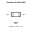
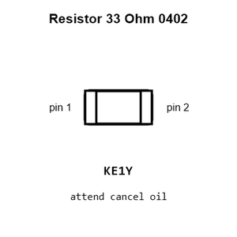
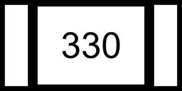
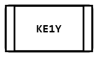
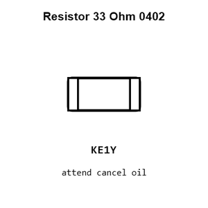
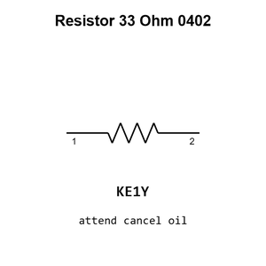

# Resistor 33 Ohm 0402

`electronic_resistor_0402_33_ohm`

Resistor 33 Ohm 0402 is an OOMP electronic resistor definition. It uses the 0402 package or form factor. Its nominal drawing size is 1.0 &#x00D7; 0.5 mm.

## At a glance

| Detail | Value |
| --- | --- |
| OOMP ID | `electronic_resistor_0402_33_ohm` |
| Type | Resistor |
| Package / style | 0402 |
| Nominal size | 1.0 &#x00D7; 0.5 mm |

## Classification

| Level | Value |
| --- | --- |
| 1 | `electronic` |
| 2 | `resistor` |
| 3 | `0402` |
| 4 | `33_ohm` |

## Nominal dimensions

| Measurement | Value |
| --- | ---: |
| Length | 1.0 mm |
| Width | 0.5 mm |

## Identifiers

| Identifier | Value |
| --- | --- |
| Manufacturer part number | `RC0402FR-0733RL` |
| LCSC | [`C138002`](https://www.lcsc.com/product-detail/C138002.html) |
| LCSC | [`C2906868`](https://www.lcsc.com/product-detail/C2906868.html) |
| LCSC | [`C324773`](https://www.lcsc.com/product-detail/C324773.html) |

## Used in projects

| Project | Quantity | References | Explore |
| --- | ---: | --- | --- |
| [Project sparkfun/ProtoSnap-LilyPad_Development_Board Lily Pad Dev current](https://github.com/sparkfun/ProtoSnap-LilyPad_Development_Board/blob/master/Hardware/LilyPad-Dev-v34.brd) | 1 | R6 | [Board explorer](https://oomlout.github.io/oomp_electronic_version_5/parts/oomp_project_github_sparkfun_proto_snap_lily_pad_development_board_lily_pad_dev_current/board_explorer.html) · [OOMP project](https://github.com/oomlout/oomp_electronic_version_5/tree/main/parts/oomp_project_github_sparkfun_proto_snap_lily_pad_development_board_lily_pad_dev_current) |
| [Project sparkfun/SparkFun_GNSS_Function_Board_NEO-M9N Spark Fun GNSS NEO M9 N current](https://github.com/sparkfun/SparkFun_GNSS_Function_Board_NEO-M9N/blob/main/Hardware/SparkFun_GNSS_NEO-M9N.brd) | 1 | R14 | [Board explorer](https://oomlout.github.io/oomp_electronic_version_5/parts/oomp_project_github_sparkfun_spark_fun_gnss_function_board_neo_m9_n_spark_fun_gnss_neo_m9_n_current/board_explorer.html) · [OOMP project](https://github.com/oomlout/oomp_electronic_version_5/tree/main/parts/oomp_project_github_sparkfun_spark_fun_gnss_function_board_neo_m9_n_spark_fun_gnss_neo_m9_n_current) |
| [Project sparkfun/SparkFun_u-blox_MAX-M10S Spark Fun u blox GNSS MAX M10 S current](https://github.com/sparkfun/SparkFun_u-blox_MAX-M10S/blob/main/Hardware/SparkFun%20u-blox%20GNSS%20MAX-M10S.brd) | 1 | R14 | [Board explorer](https://oomlout.github.io/oomp_electronic_version_5/parts/oomp_project_github_sparkfun_spark_fun_u_blox_max_m10_s_spark_fun_u_blox_gnss_max_m10_s_current/board_explorer.html) · [OOMP project](https://github.com/oomlout/oomp_electronic_version_5/tree/main/parts/oomp_project_github_sparkfun_spark_fun_u_blox_max_m10_s_spark_fun_u_blox_gnss_max_m10_s_current) |
| [Project sparkfun/SparkFun_u-Blox_NEO_M9N Spark Fun GPS NEO M9 N SMA current](https://github.com/sparkfun/SparkFun_u-Blox_NEO_M9N/blob/master/Hardware/SparkFun%20GPS%20NEO_M9N_SMA/SparkFun%20GPS%20NEO_M9N_SMA.brd) | 1 | R14 | [Board explorer](https://oomlout.github.io/oomp_electronic_version_5/parts/oomp_project_github_sparkfun_spark_fun_u_blox_neo_m9_n_spark_fun_gps_neo_m9_n_sma_current/board_explorer.html) · [OOMP project](https://github.com/oomlout/oomp_electronic_version_5/tree/main/parts/oomp_project_github_sparkfun_spark_fun_u_blox_neo_m9_n_spark_fun_gps_neo_m9_n_sma_current) |

## Files

[KiCad symbol, machine-solder and hand-solder footprints](data/kicad/README.md) · [Availability and source masters](data/kicad/manifest.yaml)

[View this part on GitHub](https://github.com/oomlout/oomp_electronic_version_5/tree/main/parts/electronic_resistor_0402_33_ohm)

[Browse this category](../../navigation/electronic/resistor/0402/README.md)

---

This page is generated from the OOMP part definition by a Roboclick Jinja template. Edit the source taxonomy or template rather than this generated file.