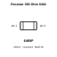
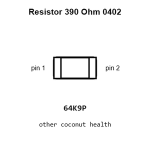
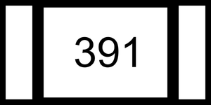
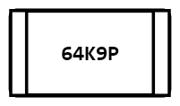
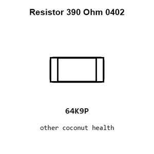
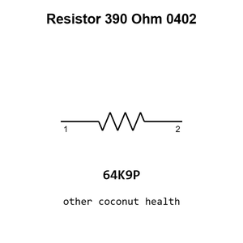

# Resistor 390 Ohm 0402

`electronic_resistor_0402_390_ohm`

Resistor 390 Ohm 0402 is an OOMP electronic resistor definition. It uses the 0402 package or form factor. Its nominal drawing size is 1.0 &#x00D7; 0.5 mm.

## At a glance

| Detail | Value |
| --- | --- |
| OOMP ID | `electronic_resistor_0402_390_ohm` |
| Type | Resistor |
| Package / style | 0402 |
| Nominal size | 1.0 &#x00D7; 0.5 mm |

## Classification

| Level | Value |
| --- | --- |
| 1 | `electronic` |
| 2 | `resistor` |
| 3 | `0402` |
| 4 | `390_ohm` |

## Nominal dimensions

| Measurement | Value |
| --- | ---: |
| Length | 1.0 mm |
| Width | 0.5 mm |

## Identifiers

| Identifier | Value |
| --- | --- |
| Manufacturer part number | `RC0402FR-07390RL` |
| LCSC | [`C137997`](https://www.lcsc.com/product-detail/C137997.html) |
| LCSC | [`C2909353`](https://www.lcsc.com/product-detail/C2909353.html) |
| LCSC | [`C2906937`](https://www.lcsc.com/product-detail/C2906937.html) |

## Used in projects

| Project | Quantity | References | Explore |
| --- | ---: | --- | --- |
| [Project sparkfun/ATmega128RFA1_Dev ATmega128 RFA1 Dev Board current](https://github.com/sparkfun/ATmega128RFA1_Dev/blob/master/hardware/ATmega128RFA1-DevBoard.brd) | 1 | R4 | [Board explorer](https://oomlout.github.io/oomp_electronic_version_5/parts/oomp_project_github_sparkfun_atmega128_rfa1_dev_atmega128_rfa1_dev_board_current/board_explorer.html) · [OOMP project](https://github.com/oomlout/oomp_electronic_version_5/tree/main/parts/oomp_project_github_sparkfun_atmega128_rfa1_dev_atmega128_rfa1_dev_board_current) |
| [Project sparkfun/EL_Sequencer EL Sequencer current](https://github.com/sparkfun/EL_Sequencer/blob/master/Hardware/EL_Sequencer.brd) | 8 | R10, R11, R12, R13, R22, R23, R24, R25 | [Board explorer](https://oomlout.github.io/oomp_electronic_version_5/parts/oomp_project_github_sparkfun_el_sequencer_el_sequencer_current/board_explorer.html) · [OOMP project](https://github.com/oomlout/oomp_electronic_version_5/tree/main/parts/oomp_project_github_sparkfun_el_sequencer_el_sequencer_current) |
| [Project sparkfun/P8X32A_Breakout P8 X32 A Breakout current](https://github.com/sparkfun/P8X32A_Breakout/blob/master/hardware/P8X32A_Breakout.brd) | 1 | R5 | [Board explorer](https://oomlout.github.io/oomp_electronic_version_5/parts/oomp_project_github_sparkfun_p8_x32_a_breakout_p8_x32_a_breakout_current/board_explorer.html) · [OOMP project](https://github.com/oomlout/oomp_electronic_version_5/tree/main/parts/oomp_project_github_sparkfun_p8_x32_a_breakout_p8_x32_a_breakout_current) |
| [Project sparkfun/UBW32 UBW32 MX460 current](https://github.com/sparkfun/UBW32/blob/master/Hardware/UBW32_MX460_v262.brd) | 1 | R13 | [Board explorer](https://oomlout.github.io/oomp_electronic_version_5/parts/oomp_project_github_sparkfun_ubw32_hardware_ubw32_mx460_current/board_explorer.html) · [OOMP project](https://github.com/oomlout/oomp_electronic_version_5/tree/main/parts/oomp_project_github_sparkfun_ubw32_hardware_ubw32_mx460_current) |

## Files

[KiCad symbol, machine-solder and hand-solder footprints](data/kicad/README.md) · [Availability and source masters](data/kicad/manifest.yaml)

[View this part on GitHub](https://github.com/oomlout/oomp_electronic_version_5/tree/main/parts/electronic_resistor_0402_390_ohm)

[Browse this category](../../navigation/electronic/resistor/0402/README.md)

---

This page is generated from the OOMP part definition by a Roboclick Jinja template. Edit the source taxonomy or template rather than this generated file.