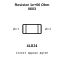
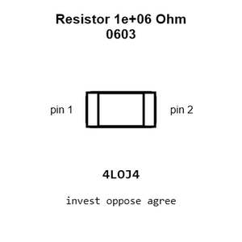
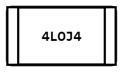
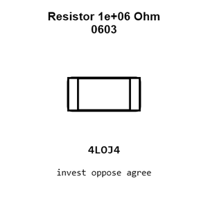
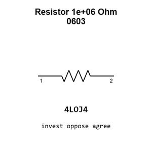

# Resistor 1e+06 Ohm 0603

`electronic_resistor_0603_1000000_ohm`

Resistor 1e+06 Ohm 0603 is an OOMP electronic resistor definition. It uses the 0603 package or form factor. Its nominal drawing size is 1.6 &#x00D7; 0.8 mm.

## At a glance

| Detail | Value |
| --- | --- |
| OOMP ID | `electronic_resistor_0603_1000000_ohm` |
| Type | Resistor |
| Package / style | 0603 |
| Nominal size | 1.6 &#x00D7; 0.8 mm |

## Classification

| Level | Value |
| --- | --- |
| 1 | `electronic` |
| 2 | `resistor` |
| 3 | `0603` |
| 4 | `1000000_ohm` |

## Nominal dimensions

| Measurement | Value |
| --- | ---: |
| Length | 1.6 mm |
| Width | 0.8 mm |

## Identifiers

| Identifier | Value |
| --- | --- |
| Manufacturer part number | `FRC0603F1004TS` |
| LCSC | [`C2907003`](https://www.lcsc.com/product-detail/C2907003.html) |

## Used in projects

| Project | Quantity | References | Explore |
| --- | ---: | --- | --- |
| [Project adafruit/Adafruit-ESP32-S2-Reverse-TFT-Feather-PCB Adafruit Feather ESP32 S2rse TFT current](https://github.com/adafruit/Adafruit-ESP32-S2-Reverse-TFT-Feather-PCB/blob/main/Adafruit%20Feather%20ESP32-S2%20Reverse%20TFT.brd) | 1 | R17 | [Board explorer](https://oomlout.github.io/oomp_electronic_version_5/parts/oomp_project_github_adafruit_adafruit_esp32_s2_reverse_tft_feather_pcb_adafruit_feather_esp32_s2rse_tft_current/board_explorer.html) · [OOMP project](https://github.com/oomlout/oomp_electronic_version_5/tree/main/parts/oomp_project_github_adafruit_adafruit_esp32_s2_reverse_tft_feather_pcb_adafruit_feather_esp32_s2rse_tft_current) |
| [Project adafruit/Adafruit-ESP32-S2-TFT-Feather-PCB Adafruit ESP32 S2 TFT Feather current](https://github.com/adafruit/Adafruit-ESP32-S2-TFT-Feather-PCB/blob/main/Adafruit%20ESP32-S2%20TFT%20Feather.brd) | 1 | R17 | [Board explorer](https://oomlout.github.io/oomp_electronic_version_5/parts/oomp_project_github_adafruit_adafruit_esp32_s2_tft_feather_pcb_adafruit_esp32_s2_tft_feather_current/board_explorer.html) · [OOMP project](https://github.com/oomlout/oomp_electronic_version_5/tree/main/parts/oomp_project_github_adafruit_adafruit_esp32_s2_tft_feather_pcb_adafruit_esp32_s2_tft_feather_current) |
| [Project adafruit/Adafruit-ESP32-S3-Reverse-TFT-Feather-PCB Adafruit ESP32 S3rse TFT Feather current](https://github.com/adafruit/Adafruit-ESP32-S3-Reverse-TFT-Feather-PCB/blob/main/Adafruit%20ESP32-S3%20Reverse%20TFT%20Feather.brd) | 1 | R17 | [Board explorer](https://oomlout.github.io/oomp_electronic_version_5/parts/oomp_project_github_adafruit_adafruit_esp32_s3_reverse_tft_feather_pcb_adafruit_esp32_s3rse_tft_feather_current/board_explorer.html) · [OOMP project](https://github.com/oomlout/oomp_electronic_version_5/tree/main/parts/oomp_project_github_adafruit_adafruit_esp32_s3_reverse_tft_feather_pcb_adafruit_esp32_s3rse_tft_feather_current) |
| [Project adafruit/Adafruit-ESP32-S3-TFT-Feather-PCB Adafruit ESP32 S3 TFT Feather current](https://github.com/adafruit/Adafruit-ESP32-S3-TFT-Feather-PCB/blob/main/Adafruit%20ESP32-S3%20TFT%20Feather.brd) | 1 | R17 | [Board explorer](https://oomlout.github.io/oomp_electronic_version_5/parts/oomp_project_github_adafruit_adafruit_esp32_s3_tft_feather_pcb_adafruit_esp32_s3_tft_feather_current/board_explorer.html) · [OOMP project](https://github.com/oomlout/oomp_electronic_version_5/tree/main/parts/oomp_project_github_adafruit_adafruit_esp32_s3_tft_feather_pcb_adafruit_esp32_s3_tft_feather_current) |
| [Project adafruit/Adafruit-Feather-ESP32-S2-PCB Adafruit Feather ESP32 S2 current](https://github.com/adafruit/Adafruit-Feather-ESP32-S2-PCB/blob/main/Adafruit%20Feather%20ESP32-S2.brd) | 1 | R17 | [Board explorer](https://oomlout.github.io/oomp_electronic_version_5/parts/oomp_project_github_adafruit_adafruit_feather_esp32_s2_pcb_adafruit_feather_esp32_s2_current/board_explorer.html) · [OOMP project](https://github.com/oomlout/oomp_electronic_version_5/tree/main/parts/oomp_project_github_adafruit_adafruit_feather_esp32_s2_pcb_adafruit_feather_esp32_s2_current) |
| [Project adafruit/Adafruit-Feather-ESP32-S3-PCB Adafruit ESP32 S3 8 MB No PSRAM current](https://github.com/adafruit/Adafruit-Feather-ESP32-S3-PCB/blob/main/Adafruit%20ESP32-S3%208MB%20No%20PSRAM.brd) | 1 | R17 | [Board explorer](https://oomlout.github.io/oomp_electronic_version_5/parts/oomp_project_github_adafruit_adafruit_feather_esp32_s3_pcb_adafruit_esp32_s3_8_mb_no_psram_current/board_explorer.html) · [OOMP project](https://github.com/oomlout/oomp_electronic_version_5/tree/main/parts/oomp_project_github_adafruit_adafruit_feather_esp32_s3_pcb_adafruit_esp32_s3_8_mb_no_psram_current) |
| [Project adafruit/Adafruit-LM66200-PCB Adafruit LM66200 Ideal Diode Breakout current](https://github.com/adafruit/Adafruit-LM66200-PCB/blob/main/Adafruit%20LM66200%20Ideal%20Diode%20Breakout.brd) | 1 | R2 | [Board explorer](https://oomlout.github.io/oomp_electronic_version_5/parts/oomp_project_github_adafruit_adafruit_lm66200_pcb_adafruit_lm66200_ideal_diode_breakout_current/board_explorer.html) · [OOMP project](https://github.com/oomlout/oomp_electronic_version_5/tree/main/parts/oomp_project_github_adafruit_adafruit_lm66200_pcb_adafruit_lm66200_ideal_diode_breakout_current) |
| [Project adafruit/Adafruit_MagTag_PCBs Adafruit Mag Tag 2.9in current](https://github.com/adafruit/Adafruit_MagTag_PCBs/blob/main/Adafruit%20MagTag%202.9in.brd) | 3 | R10, R11, R17 | [Board explorer](https://oomlout.github.io/oomp_electronic_version_5/parts/oomp_project_github_adafruit_adafruit_mag_tag_pcbs_adafruit_mag_tag_2_9in_current/board_explorer.html) · [OOMP project](https://github.com/oomlout/oomp_electronic_version_5/tree/main/parts/oomp_project_github_adafruit_adafruit_mag_tag_pcbs_adafruit_mag_tag_2_9in_current) |
| [Project adafruit/Adafruit-MatrixPortal-S3-PCB Adafruit Matrix Portal S3 current](https://github.com/adafruit/Adafruit-MatrixPortal-S3-PCB/blob/main/Adafruit%20MatrixPortal%20S3.brd) | 1 | R17 | [Board explorer](https://oomlout.github.io/oomp_electronic_version_5/parts/oomp_project_github_adafruit_adafruit_matrix_portal_s3_pcb_adafruit_matrix_portal_s3_current/board_explorer.html) · [OOMP project](https://github.com/oomlout/oomp_electronic_version_5/tree/main/parts/oomp_project_github_adafruit_adafruit_matrix_portal_s3_pcb_adafruit_matrix_portal_s3_current) |
| [Project adafruit/Adafruit-MEMENTO-PCB Adafruit MEMENTO Camera Board current](https://github.com/adafruit/Adafruit-MEMENTO-PCB/blob/main/Adafruit%20MEMENTO%20Camera%20Board.brd) | 3 | R10, R11, R17 | [Board explorer](https://oomlout.github.io/oomp_electronic_version_5/parts/oomp_project_github_adafruit_adafruit_memento_pcb_adafruit_memento_camera_board_current/board_explorer.html) · [OOMP project](https://github.com/oomlout/oomp_electronic_version_5/tree/main/parts/oomp_project_github_adafruit_adafruit_memento_pcb_adafruit_memento_camera_board_current) |
| [Project adafruit/Adafruit-Metro-ESP32-S2-PCB Adafruit Metro ESP32 S2 current](https://github.com/adafruit/Adafruit-Metro-ESP32-S2-PCB/blob/master/Adafruit%20Metro%20ESP32-S2.brd) | 1 | R17 | [Board explorer](https://oomlout.github.io/oomp_electronic_version_5/parts/oomp_project_github_adafruit_adafruit_metro_esp32_s2_pcb_adafruit_metro_esp32_s2_current/board_explorer.html) · [OOMP project](https://github.com/oomlout/oomp_electronic_version_5/tree/main/parts/oomp_project_github_adafruit_adafruit_metro_esp32_s2_pcb_adafruit_metro_esp32_s2_current) |
| [Project adafruit/Adafruit-Metro-ESP32-S3-PCB Adafruit Metro ESP32 S3 current](https://github.com/adafruit/Adafruit-Metro-ESP32-S3-PCB/blob/main/Adafruit%20Metro%20ESP32-S3%20Rev%20B.brd) | 1 | R17 | [Board explorer](https://oomlout.github.io/oomp_electronic_version_5/parts/oomp_project_github_adafruit_adafruit_metro_esp32_s3_pcb_adafruit_metro_esp32_s3_current/board_explorer.html) · [OOMP project](https://github.com/oomlout/oomp_electronic_version_5/tree/main/parts/oomp_project_github_adafruit_adafruit_metro_esp32_s3_pcb_adafruit_metro_esp32_s3_current) |
| [Project adafruit/Adafruit-NeoTrellis-M4-PCB-and-Enclosure Adafruit Neo Trellis M4 current](https://github.com/adafruit/Adafruit-NeoTrellis-M4-PCB-and-Enclosure/blob/master/Adafruit%20NeoTrellis%20M4.brd) | 2 | R6, R7 | [Board explorer](https://oomlout.github.io/oomp_electronic_version_5/parts/oomp_project_github_adafruit_adafruit_neo_trellis_m4_pcb_and_enclosure_adafruit_neo_trellis_m4_current/board_explorer.html) · [OOMP project](https://github.com/oomlout/oomp_electronic_version_5/tree/main/parts/oomp_project_github_adafruit_adafruit_neo_trellis_m4_pcb_and_enclosure_adafruit_neo_trellis_m4_current) |
| [Project adafruit/Adafruit-Qualia-S3-RGB666-PCB Adafruit Qualia S3 RGB666 current](https://github.com/adafruit/Adafruit-Qualia-S3-RGB666-PCB/blob/main/Adafruit%20Qualia%20S3%20RGB666.brd) | 1 | R17 | [Board explorer](https://oomlout.github.io/oomp_electronic_version_5/parts/oomp_project_github_adafruit_adafruit_qualia_s3_rgb666_pcb_adafruit_qualia_s3_rgb666_current/board_explorer.html) · [OOMP project](https://github.com/oomlout/oomp_electronic_version_5/tree/main/parts/oomp_project_github_adafruit_adafruit_qualia_s3_rgb666_pcb_adafruit_qualia_s3_rgb666_current) |
| [Project soldered_electronics/Capacitive-soil-sensor-hardware-design Capacitive Soil Sensor current](https://github.com/SolderedElectronics/Capacitive-soil-sensor-hardware-design) | 1 | R1 | [Board explorer](https://oomlout.github.io/oomp_electronic_version_5/parts/oomp_project_github_soldered_electronics_capacitive_soil_sensor_hardware_design_sensor_capacitive_soil_current/board_explorer.html) · [OOMP project](https://github.com/oomlout/oomp_electronic_version_5/tree/main/parts/oomp_project_github_soldered_electronics_capacitive_soil_sensor_hardware_design_sensor_capacitive_soil_current) |
| [Project soldered_electronics/Thermocouple-sensor-AD8495-breakout-hardware-design AD8495 Breakout current](https://github.com/SolderedElectronics/Thermocouple-sensor-AD8495-breakout-hardware-design) | 1 | R1 | [Board explorer](https://oomlout.github.io/oomp_electronic_version_5/parts/oomp_project_github_soldered_electronics_thermocouple_sensor_ad8495_breakout_hardware_design_sensor_thermocouple_ad8495_current/board_explorer.html) · [OOMP project](https://github.com/oomlout/oomp_electronic_version_5/tree/main/parts/oomp_project_github_soldered_electronics_thermocouple_sensor_ad8495_breakout_hardware_design_sensor_thermocouple_ad8495_current) |
| [Project sparkfun/AD8232_Heart_Rate_Monitor AD8232 Heart Rate Monitor current](https://github.com/sparkfun/AD8232_Heart_Rate_Monitor/blob/master/Hardware/AD8232_Heart_Rate_Monitor.brd) | 3 | R6, R7, R9 | [Board explorer](https://oomlout.github.io/oomp_electronic_version_5/parts/oomp_project_github_sparkfun_ad8232_heart_rate_monitor_ad8232_heart_rate_monitor_current/board_explorer.html) · [OOMP project](https://github.com/oomlout/oomp_electronic_version_5/tree/main/parts/oomp_project_github_sparkfun_ad8232_heart_rate_monitor_ad8232_heart_rate_monitor_current) |
| [Project sparkfun/Logomatic Logomatic current](https://github.com/sparkfun/Logomatic/blob/master/Hardware/Logomatic.brd) | 2 | R16, R17 | [Board explorer](https://oomlout.github.io/oomp_electronic_version_5/parts/oomp_project_github_sparkfun_logomatic_logomatic_current/board_explorer.html) · [OOMP project](https://github.com/oomlout/oomp_electronic_version_5/tree/main/parts/oomp_project_github_sparkfun_logomatic_logomatic_current) |
| [Project sparkfun/MicroMod_Function_Ethernet-W5500 Micro Mod Ethernet Function Board W5500 current](https://github.com/sparkfun/MicroMod_Function_Ethernet-W5500/blob/main/Hardware/MicroMod-Ethernet-Function-Board-W5500.brd) | 1 | R1 | [Board explorer](https://oomlout.github.io/oomp_electronic_version_5/parts/oomp_project_github_sparkfun_micro_mod_function_ethernet_w5500_micro_mod_ethernet_function_board_w5500_current/board_explorer.html) · [OOMP project](https://github.com/oomlout/oomp_electronic_version_5/tree/main/parts/oomp_project_github_sparkfun_micro_mod_function_ethernet_w5500_micro_mod_ethernet_function_board_w5500_current) |
| [Project sparkfun/MP3_Player_Shield Spark Fun MP3 Shield current](https://github.com/sparkfun/MP3_Player_Shield/blob/master/hardware/SparkFunMP3Shield.brd) | 1 | R1 | [Board explorer](https://oomlout.github.io/oomp_electronic_version_5/parts/oomp_project_github_sparkfun_mp3_player_shield_spark_fun_mp3_shield_current/board_explorer.html) · [OOMP project](https://github.com/oomlout/oomp_electronic_version_5/tree/main/parts/oomp_project_github_sparkfun_mp3_player_shield_spark_fun_mp3_shield_current) |
| [Project sparkfun/SparkFun_Digi_XBee_Arduino_Shield-USB-C Spark Fun Digi XBee Arduino Shield Qwiic current](https://github.com/sparkfun/SparkFun_Digi_XBee_Arduino_Shield-USB-C/blob/main/Hardware/SparkFun_Digi_XBee_Arduino_Shield_Qwiic.brd) | 1 | R17 | [Board explorer](https://oomlout.github.io/oomp_electronic_version_5/parts/oomp_project_github_sparkfun_spark_fun_digi_xbee_arduino_shield_usb_c_spark_fun_digi_xbee_arduino_shield_qwiic_current/board_explorer.html) · [OOMP project](https://github.com/oomlout/oomp_electronic_version_5/tree/main/parts/oomp_project_github_sparkfun_spark_fun_digi_xbee_arduino_shield_usb_c_spark_fun_digi_xbee_arduino_shield_qwiic_current) |
| [Project sparkfun/SparkFun_IoT_Brushless_Motor_Driver ESP32 BLDC Motor Driver current](https://github.com/sparkfun/SparkFun_IoT_Brushless_Motor_Driver/blob/main/Hardware/ESP32_BLDC_Motor_Driver.brd) | 1 | R4 | [Board explorer](https://oomlout.github.io/oomp_electronic_version_5/parts/oomp_project_github_sparkfun_spark_fun_io_t_brushless_motor_driver_esp32_bldc_motor_driver_current/board_explorer.html) · [OOMP project](https://github.com/oomlout/oomp_electronic_version_5/tree/main/parts/oomp_project_github_sparkfun_spark_fun_io_t_brushless_motor_driver_esp32_bldc_motor_driver_current) |
| [Project sparkfun/SparkFun_LoRaSerial Spark Fun Lo Ra Serial 433 MHz 1 W current](https://github.com/sparkfun/SparkFun_LoRaSerial/blob/main/Hardware/433MHz/SparkFun%20LoRaSerial%20433MHz%20-%201W.brd) | 1 | R28 | [Board explorer](https://oomlout.github.io/oomp_electronic_version_5/parts/oomp_project_github_sparkfun_spark_fun_lo_ra_serial_spark_fun_lo_ra_serial_433_mhz_1_w_current/board_explorer.html) · [OOMP project](https://github.com/oomlout/oomp_electronic_version_5/tree/main/parts/oomp_project_github_sparkfun_spark_fun_lo_ra_serial_spark_fun_lo_ra_serial_433_mhz_1_w_current) |
| [Project sparkfun/SparkFun_LoRaSerial Spark Fun Lo Ra Serial 868 MHz 1 W current](https://github.com/sparkfun/SparkFun_LoRaSerial/blob/main/Hardware/868MHz/SparkFun%20LoRaSerial%20868MHz%20-%201W.brd) | 1 | R28 | [Board explorer](https://oomlout.github.io/oomp_electronic_version_5/parts/oomp_project_github_sparkfun_spark_fun_lo_ra_serial_spark_fun_lo_ra_serial_868_mhz_1_w_current/board_explorer.html) · [OOMP project](https://github.com/oomlout/oomp_electronic_version_5/tree/main/parts/oomp_project_github_sparkfun_spark_fun_lo_ra_serial_spark_fun_lo_ra_serial_868_mhz_1_w_current) |
| [Project sparkfun/SparkFun_LoRaSerial Spark Fun Lo Ra Serial 915 MHz 1 W current](https://github.com/sparkfun/SparkFun_LoRaSerial/blob/main/Hardware/915MHz/SparkFun%20LoRaSerial%20915MHz%20-%201W.brd) | 1 | R28 | [Board explorer](https://oomlout.github.io/oomp_electronic_version_5/parts/oomp_project_github_sparkfun_spark_fun_lo_ra_serial_spark_fun_lo_ra_serial_915_mhz_1_w_current/board_explorer.html) · [OOMP project](https://github.com/oomlout/oomp_electronic_version_5/tree/main/parts/oomp_project_github_sparkfun_spark_fun_lo_ra_serial_spark_fun_lo_ra_serial_915_mhz_1_w_current) |
| [Project sparkfun/SparkFun_RTK_EVK Spark Fun RTK EVK current](https://github.com/sparkfun/SparkFun_RTK_EVK/blob/main/Hardware/SparkFun_RTK_EVK.brd) | 2 | R13, R24 | [Board explorer](https://oomlout.github.io/oomp_electronic_version_5/parts/oomp_project_github_sparkfun_spark_fun_rtk_evk_spark_fun_rtk_evk_current/board_explorer.html) · [OOMP project](https://github.com/oomlout/oomp_electronic_version_5/tree/main/parts/oomp_project_github_sparkfun_spark_fun_rtk_evk_spark_fun_rtk_evk_current) |
| [Project sparkfun/SparkFun_RTK_Facet Spark Fun RTK Facet L Band Main current](https://github.com/sparkfun/SparkFun_RTK_Facet/blob/main/Hardware/Main-LBand/SparkFun%20RTK%20Facet%20L-Band%20-%20Main.brd) | 1 | R13 | [Board explorer](https://oomlout.github.io/oomp_electronic_version_5/parts/oomp_project_github_sparkfun_spark_fun_rtk_facet_spark_fun_rtk_facet_l_band_main_current/board_explorer.html) · [OOMP project](https://github.com/oomlout/oomp_electronic_version_5/tree/main/parts/oomp_project_github_sparkfun_spark_fun_rtk_facet_spark_fun_rtk_facet_l_band_main_current) |
| [Project sparkfun/SparkFun_RTK_Facet Spark Fun RTK Facet Main current](https://github.com/sparkfun/SparkFun_RTK_Facet/blob/main/Hardware/Main/SparkFun%20RTK%20Facet%20-%20Main.brd) | 1 | R13 | [Board explorer](https://oomlout.github.io/oomp_electronic_version_5/parts/oomp_project_github_sparkfun_spark_fun_rtk_facet_spark_fun_rtk_facet_main_current/board_explorer.html) · [OOMP project](https://github.com/oomlout/oomp_electronic_version_5/tree/main/parts/oomp_project_github_sparkfun_spark_fun_rtk_facet_spark_fun_rtk_facet_main_current) |
| [Project sparkfun/SparkFun_RTK_Reference_Station Reference Station current](https://github.com/sparkfun/SparkFun_RTK_Reference_Station/blob/main/Hardware/Reference_Station.brd) | 1 | R24 | [Board explorer](https://oomlout.github.io/oomp_electronic_version_5/parts/oomp_project_github_sparkfun_spark_fun_rtk_reference_station_reference_station_current/board_explorer.html) · [OOMP project](https://github.com/oomlout/oomp_electronic_version_5/tree/main/parts/oomp_project_github_sparkfun_spark_fun_rtk_reference_station_reference_station_current) |
| [Project sparkfun/SparkFun_Satellite_Transceiver-Swarm_M138 Satellite Transceiver Breakout Swarm M138 current](https://github.com/sparkfun/SparkFun_Satellite_Transceiver-Swarm_M138/blob/main/Hardware/Satellite_Transceiver_Breakout__Swarm_M138.brd) | 2 | R22, R24 | [Board explorer](https://oomlout.github.io/oomp_electronic_version_5/parts/oomp_project_github_sparkfun_spark_fun_satellite_transceiver_swarm_m138_satellite_transceiver_breakout_swarm_m138_current/board_explorer.html) · [OOMP project](https://github.com/oomlout/oomp_electronic_version_5/tree/main/parts/oomp_project_github_sparkfun_spark_fun_satellite_transceiver_swarm_m138_satellite_transceiver_breakout_swarm_m138_current) |
| [Project sparkfun/SparkFun_Tsunami_Super_WAV_Trigger_Qwiic Spark Fun Tsunami Qwiic current](https://github.com/sparkfun/SparkFun_Tsunami_Super_WAV_Trigger_Qwiic/blob/main/Hardware/SparkFun_Tsunami_Qwiic.brd) | 1 | R2 | [Board explorer](https://oomlout.github.io/oomp_electronic_version_5/parts/oomp_project_github_sparkfun_spark_fun_tsunami_super_wav_trigger_qwiic_spark_fun_tsunami_qwiic_current/board_explorer.html) · [OOMP project](https://github.com/oomlout/oomp_electronic_version_5/tree/main/parts/oomp_project_github_sparkfun_spark_fun_tsunami_super_wav_trigger_qwiic_spark_fun_tsunami_qwiic_current) |
| [Project sparkfun/SparkFun_XRP_Controller XRP Controller Beta current](https://github.com/sparkfun/SparkFun_XRP_Controller/blob/main/Hardware%20%28Beta%29/XRP_Controller_Beta.brd) | 3 | R10, R11, R14 | [Board explorer](https://oomlout.github.io/oomp_electronic_version_5/parts/oomp_project_github_sparkfun_spark_fun_xrp_controller_xrp_controller_beta_current/board_explorer.html) · [OOMP project](https://github.com/oomlout/oomp_electronic_version_5/tree/main/parts/oomp_project_github_sparkfun_spark_fun_xrp_controller_xrp_controller_beta_current) |
| [Project sparkfun/tsunami Tapestry current](https://github.com/sparkfun/tsunami/blob/master/Hardware/deprecated/Tapestry.brd) | 1 | R29 | [Board explorer](https://oomlout.github.io/oomp_electronic_version_5/parts/oomp_project_github_sparkfun_tsunami_tapestry_current/board_explorer.html) · [OOMP project](https://github.com/oomlout/oomp_electronic_version_5/tree/main/parts/oomp_project_github_sparkfun_tsunami_tapestry_current) |
| [Project sparkfun/tsunami tsunami current](https://github.com/sparkfun/tsunami/blob/master/Hardware/tsunami.brd) | 1 | R2 | [Board explorer](https://oomlout.github.io/oomp_electronic_version_5/parts/oomp_project_github_sparkfun_tsunami_tsunami_current/board_explorer.html) · [OOMP project](https://github.com/oomlout/oomp_electronic_version_5/tree/main/parts/oomp_project_github_sparkfun_tsunami_tsunami_current) |

## Files

[KiCad symbol, machine-solder and hand-solder footprints](data/kicad/README.md) · [Availability and source masters](data/kicad/manifest.yaml)

[View this part on GitHub](https://github.com/oomlout/oomp_electronic_version_5/tree/main/parts/electronic_resistor_0603_1000000_ohm)

[Browse this category](../../navigation/electronic/resistor/0603/README.md)

---

This page is generated from the OOMP part definition by a Roboclick Jinja template. Edit the source taxonomy or template rather than this generated file.