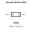
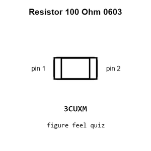
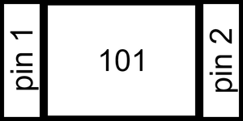
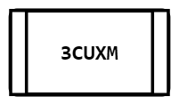
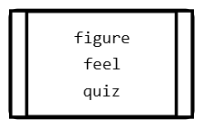
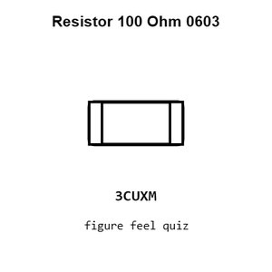
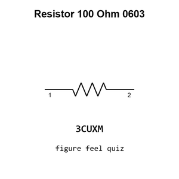

# Resistor 100 Ohm 0603

`electronic_resistor_0603_100_ohm`

Resistor 100 Ohm 0603 is an OOMP electronic resistor definition. It uses the 0603 package or form factor. Its nominal drawing size is 1.6 &#x00D7; 0.8 mm.

## At a glance

| Detail | Value |
| --- | --- |
| OOMP ID | `electronic_resistor_0603_100_ohm` |
| Type | Resistor |
| Package / style | 0603 |
| Nominal size | 1.6 &#x00D7; 0.8 mm |

## Classification

| Level | Value |
| --- | --- |
| 1 | `electronic` |
| 2 | `resistor` |
| 3 | `0603` |
| 4 | `100_ohm` |

## Nominal dimensions

| Measurement | Value |
| --- | ---: |
| Length | 1.6 mm |
| Width | 0.8 mm |

## Identifiers

| Identifier | Value |
| --- | --- |
| Manufacturer part number | `0603WAF1000T5E` |
| LCSC | [`C22775`](https://www.lcsc.com/product-detail/C22775.html) |

## Used in projects

| Project | Quantity | References | Explore |
| --- | ---: | --- | --- |
| [Project adafruit/Adafruit-Circuit-Playground-Express-PCB Adafruit Circuit Playground Express current](https://github.com/adafruit/Adafruit-Circuit-Playground-Express-PCB/blob/master/Adafruit%20Circuit%20Playground%20Express.brd) | 2 | R8, R9 | [Board explorer](https://oomlout.github.io/oomp_electronic_version_5/parts/oomp_project_github_adafruit_adafruit_circuit_playground_express_pcb_adafruit_circuit_playground_express_current/board_explorer.html) · [OOMP project](https://github.com/oomlout/oomp_electronic_version_5/tree/main/parts/oomp_project_github_adafruit_adafruit_circuit_playground_express_pcb_adafruit_circuit_playground_express_current) |
| [Project adafruit/Adafruit-I2S-Audio-Bonnet-for-Raspberry-Pi-PCB Adafruit I2 S Audio UDA1334 Bonnet current](https://github.com/adafruit/Adafruit-I2S-Audio-Bonnet-for-Raspberry-Pi-PCB/blob/master/Adafruit%20I2S%20Audio%20UDA1334%20Bonnet.brd) | 2 | R4, R6 | [Board explorer](https://oomlout.github.io/oomp_electronic_version_5/parts/oomp_project_github_adafruit_adafruit_i2_s_audio_bonnet_for_raspberry_pi_pcb_adafruit_i2_s_audio_uda1334_bonnet_current/board_explorer.html) · [OOMP project](https://github.com/oomlout/oomp_electronic_version_5/tree/main/parts/oomp_project_github_adafruit_adafruit_i2_s_audio_bonnet_for_raspberry_pi_pcb_adafruit_i2_s_audio_uda1334_bonnet_current) |
| [Project adafruit/Adafruit-Infrared-IR-Remote-Transceiver Adafruit Infrared IR Remote Transceiver current](https://github.com/adafruit/Adafruit-Infrared-IR-Remote-Transceiver/blob/main/Adafruit%20Infrared%20IR%20Remote%20Transceiver.brd) | 1 | R4 | [Board explorer](https://oomlout.github.io/oomp_electronic_version_5/parts/oomp_project_github_adafruit_adafruit_infrared_ir_remote_transceiver_adafruit_infrared_ir_remote_transceiver_current/board_explorer.html) · [OOMP project](https://github.com/oomlout/oomp_electronic_version_5/tree/main/parts/oomp_project_github_adafruit_adafruit_infrared_ir_remote_transceiver_adafruit_infrared_ir_remote_transceiver_current) |
| [Project adafruit/Adafruit-MCP9600-PCB Adafruit MCP9600 current](https://github.com/adafruit/Adafruit-MCP9600-PCB/blob/master/Adafruit%20MCP9600.brd) | 2 | R5, R6 | [Board explorer](https://oomlout.github.io/oomp_electronic_version_5/parts/oomp_project_github_adafruit_adafruit_mcp9600_pcb_adafruit_mcp9600_current/board_explorer.html) · [OOMP project](https://github.com/oomlout/oomp_electronic_version_5/tree/main/parts/oomp_project_github_adafruit_adafruit_mcp9600_pcb_adafruit_mcp9600_current) |
| [Project adafruit/Adafruit-NeoPixel-Driver-BFF-PCB Adafruit Neo Pixel Driver BFF current](https://github.com/adafruit/Adafruit-NeoPixel-Driver-BFF-PCB/blob/main/Adafruit_NeoPixel_Driver_BFF.brd) | 1 | R1 | [Board explorer](https://oomlout.github.io/oomp_electronic_version_5/parts/oomp_project_github_adafruit_adafruit_neo_pixel_driver_bff_pcb_adafruit_neo_pixel_driver_bff_current/board_explorer.html) · [OOMP project](https://github.com/oomlout/oomp_electronic_version_5/tree/main/parts/oomp_project_github_adafruit_adafruit_neo_pixel_driver_bff_pcb_adafruit_neo_pixel_driver_bff_current) |
| [Project adafruit/Adafruit-NeoTrellis-M4-PCB-and-Enclosure Adafruit Neo Trellis M4 current](https://github.com/adafruit/Adafruit-NeoTrellis-M4-PCB-and-Enclosure/blob/master/Adafruit%20NeoTrellis%20M4.brd) | 1 | R10 | [Board explorer](https://oomlout.github.io/oomp_electronic_version_5/parts/oomp_project_github_adafruit_adafruit_neo_trellis_m4_pcb_and_enclosure_adafruit_neo_trellis_m4_current/board_explorer.html) · [OOMP project](https://github.com/oomlout/oomp_electronic_version_5/tree/main/parts/oomp_project_github_adafruit_adafruit_neo_trellis_m4_pcb_and_enclosure_adafruit_neo_trellis_m4_current) |
| [Project adafruit/Adafruit-PyGamer-PCB Adafruit Py Gamer current](https://github.com/adafruit/Adafruit-PyGamer-PCB/blob/master/Adafruit%20PyGamer.brd) | 3 | R9, R10, R12 | [Board explorer](https://oomlout.github.io/oomp_electronic_version_5/parts/oomp_project_github_adafruit_adafruit_py_gamer_pcb_adafruit_py_gamer_current/board_explorer.html) · [OOMP project](https://github.com/oomlout/oomp_electronic_version_5/tree/main/parts/oomp_project_github_adafruit_adafruit_py_gamer_pcb_adafruit_py_gamer_current) |
| [Project adafruit/Adafruit-Qualia-S3-RGB666-PCB Adafruit Qualia S3 RGB666 current](https://github.com/adafruit/Adafruit-Qualia-S3-RGB666-PCB/blob/main/Adafruit%20Qualia%20S3%20RGB666.brd) | 1 | R11 | [Board explorer](https://oomlout.github.io/oomp_electronic_version_5/parts/oomp_project_github_adafruit_adafruit_qualia_s3_rgb666_pcb_adafruit_qualia_s3_rgb666_current/board_explorer.html) · [OOMP project](https://github.com/oomlout/oomp_electronic_version_5/tree/main/parts/oomp_project_github_adafruit_adafruit_qualia_s3_rgb666_pcb_adafruit_qualia_s3_rgb666_current) |
| [Project adafruit/Adafruit-Sparkle-Motion-PCB Adafruit Sparkle Motion WLED Friend current](https://github.com/adafruit/Adafruit-Sparkle-Motion-PCB/blob/main/Adafruit%20Sparkle%20Motion%20WLED%20Friend_Rev%20D.brd) | 4 | R13, R14, R15, R16 | [Board explorer](https://oomlout.github.io/oomp_electronic_version_5/parts/oomp_project_github_adafruit_adafruit_sparkle_motion_pcb_adafruit_sparkle_motion_wled_friend_current/board_explorer.html) · [OOMP project](https://github.com/oomlout/oomp_electronic_version_5/tree/main/parts/oomp_project_github_adafruit_adafruit_sparkle_motion_pcb_adafruit_sparkle_motion_wled_friend_current) |
| [Project adafruit/Adafruit-TPS65131-Split-Power-Supply-PCB Adafruit TPS65131 Split Power Supply current](https://github.com/adafruit/Adafruit-TPS65131-Split-Power-Supply-PCB/blob/main/Adafruit%20TPS65131%20Split%20Power%20Supply.brd) | 1 | R7 | [Board explorer](https://oomlout.github.io/oomp_electronic_version_5/parts/oomp_project_github_adafruit_adafruit_tps65131_split_power_supply_pcb_adafruit_tps65131_split_power_supply_current/board_explorer.html) · [OOMP project](https://github.com/oomlout/oomp_electronic_version_5/tree/main/parts/oomp_project_github_adafruit_adafruit_tps65131_split_power_supply_pcb_adafruit_tps65131_split_power_supply_current) |
| [Project adafruit/Pixie-3W-Smart-LED-PCB Pixie current](https://github.com/adafruit/Pixie-3W-Smart-LED-PCB/blob/master/Pixie.brd) | 2 | R7, R9 | [Board explorer](https://oomlout.github.io/oomp_electronic_version_5/parts/oomp_project_github_adafruit_pixie_3_w_smart_led_pcb_pixie_current/board_explorer.html) · [OOMP project](https://github.com/oomlout/oomp_electronic_version_5/tree/main/parts/oomp_project_github_adafruit_pixie_3_w_smart_led_pcb_pixie_current) |
| [Project electrolama/TinyReflowController Tiny Reflow Controller current](https://github.com/electrolama/TinyReflowController/tree/master/hardware/Revision%20A1) | 2 | R2, R3 | [Board explorer](https://oomlout.github.io/oomp_electronic_version_5/parts/oomp_project_github_electrolama_tiny_reflow_controller_tiny_reflow_controller_current/board_explorer.html) · [OOMP project](https://github.com/oomlout/oomp_electronic_version_5/tree/main/parts/oomp_project_github_electrolama_tiny_reflow_controller_tiny_reflow_controller_current) |
| [Project soldered_electronics/Load-cell-ampfilier-HX711-board-hardware-design HX711 Load Cell current](https://github.com/SolderedElectronics/Load-cell-ampfilier-HX711-board-hardware-design) | 2 | R1, R2 | [Board explorer](https://oomlout.github.io/oomp_electronic_version_5/parts/oomp_project_github_soldered_electronics_load_cell_ampfilier_hx711_board_hardware_design_sensor_load_cell_hx711_current/board_explorer.html) · [OOMP project](https://github.com/oomlout/oomp_electronic_version_5/tree/main/parts/oomp_project_github_soldered_electronics_load_cell_ampfilier_hx711_board_hardware_design_sensor_load_cell_hx711_current) |
| [Project soldered_electronics/Load-cell-ampfilier-HX711-board-qwiic-hardware-design HX711 Load Cell qwiic current](https://github.com/SolderedElectronics/Load-cell-amplifier-HX711-board-qwiic-hardware-design) | 2 | R1, R2 | [Board explorer](https://oomlout.github.io/oomp_electronic_version_5/parts/oomp_project_github_soldered_electronics_load_cell_ampfilier_hx711_board_qwiic_hardware_design_sensor_load_cell_hx711_qwiic_current/board_explorer.html) · [OOMP project](https://github.com/oomlout/oomp_electronic_version_5/tree/main/parts/oomp_project_github_soldered_electronics_load_cell_ampfilier_hx711_board_qwiic_hardware_design_sensor_load_cell_hx711_qwiic_current) |
| [Project soldered_electronics/Load-cell-ampfilier-HX711-board-with-easy-C-hardware-design HX711 Load Cell easyC current](https://github.com/SolderedElectronics/Load-cell-ampfilier-HX711-board-with-easy-C-hardware-design) | 2 | R1, R2 | [Board explorer](https://oomlout.github.io/oomp_electronic_version_5/parts/oomp_project_github_soldered_electronics_load_cell_ampfilier_hx711_board_with_easy_c_hardware_design_sensor_load_cell_hx711_easyc_current/board_explorer.html) · [OOMP project](https://github.com/oomlout/oomp_electronic_version_5/tree/main/parts/oomp_project_github_soldered_electronics_load_cell_ampfilier_hx711_board_with_easy_c_hardware_design_sensor_load_cell_hx711_easyc_current) |
| [Project soldered_electronics/Thermocouple-sensor-AD8495-breakout-hardware-design AD8495 Breakout current](https://github.com/SolderedElectronics/Thermocouple-sensor-AD8495-breakout-hardware-design) | 2 | R2, R3 | [Board explorer](https://oomlout.github.io/oomp_electronic_version_5/parts/oomp_project_github_soldered_electronics_thermocouple_sensor_ad8495_breakout_hardware_design_sensor_thermocouple_ad8495_current/board_explorer.html) · [OOMP project](https://github.com/oomlout/oomp_electronic_version_5/tree/main/parts/oomp_project_github_soldered_electronics_thermocouple_sensor_ad8495_breakout_hardware_design_sensor_thermocouple_ad8495_current) |
| [Project sparkfun/2D_Barcode_Scanner_Breakout 2 DBarcode Scanner current](https://github.com/sparkfun/2D_Barcode_Scanner_Breakout/blob/main/Hardware/2DBarcodeScanner.brd) | 1 | R1 | [Board explorer](https://oomlout.github.io/oomp_electronic_version_5/parts/oomp_project_github_sparkfun_2_d_barcode_scanner_breakout_2_dbarcode_scanner_current/board_explorer.html) · [OOMP project](https://github.com/oomlout/oomp_electronic_version_5/tree/main/parts/oomp_project_github_sparkfun_2_d_barcode_scanner_breakout_2_dbarcode_scanner_current) |
| [Project sparkfun/CAN-Bus_Shield Spark Fun CAN Bus Shield current](https://github.com/sparkfun/CAN-Bus_Shield/blob/master/Hardware/SparkFun_CAN-Bus_Shield.brd) | 2 | R10, R12 | [Board explorer](https://oomlout.github.io/oomp_electronic_version_5/parts/oomp_project_github_sparkfun_can_bus_shield_spark_fun_can_bus_shield_current/board_explorer.html) · [OOMP project](https://github.com/oomlout/oomp_electronic_version_5/tree/main/parts/oomp_project_github_sparkfun_can_bus_shield_spark_fun_can_bus_shield_current) |
| [Project sparkfun/Digital_Sandbox Digital Sandbox current](https://github.com/sparkfun/Digital_Sandbox/blob/master/Hardware/DigitalSandbox.brd) | 2 | R19, R21 | [Board explorer](https://oomlout.github.io/oomp_electronic_version_5/parts/oomp_project_github_sparkfun_digital_sandbox_digital_sandbox_current/board_explorer.html) · [OOMP project](https://github.com/oomlout/oomp_electronic_version_5/tree/main/parts/oomp_project_github_sparkfun_digital_sandbox_digital_sandbox_current) |
| [Project sparkfun/HX711-Load-Cell-Amplifier Spark Fun HX711 Load Cell current](https://github.com/sparkfun/HX711-Load-Cell-Amplifier/blob/master/hardware/SparkFun_HX711_Load_Cell.brd) | 2 | R3, R4 | [Board explorer](https://oomlout.github.io/oomp_electronic_version_5/parts/oomp_project_github_sparkfun_hx711_load_cell_amplifier_spark_fun_hx711_load_cell_current/board_explorer.html) · [OOMP project](https://github.com/oomlout/oomp_electronic_version_5/tree/main/parts/oomp_project_github_sparkfun_hx711_load_cell_amplifier_spark_fun_hx711_load_cell_current) |
| [Project sparkfun/ISL29125_Breakout Spark Fun ISL29125 Breakout current](https://github.com/sparkfun/ISL29125_Breakout/blob/master/Hardware/SparkFun_ISL29125_Breakout.brd) | 1 | R1 | [Board explorer](https://oomlout.github.io/oomp_electronic_version_5/parts/oomp_project_github_sparkfun_isl29125_breakout_spark_fun_isl29125_breakout_current/board_explorer.html) · [OOMP project](https://github.com/oomlout/oomp_electronic_version_5/tree/main/parts/oomp_project_github_sparkfun_isl29125_breakout_spark_fun_isl29125_breakout_current) |
| [Project sparkfun/L6470-AutoDriver L6470 Auto Driver current](https://github.com/sparkfun/L6470-AutoDriver/blob/master/Hardware/L6470%20AutoDriver.brd) | 1 | R3 | [Board explorer](https://oomlout.github.io/oomp_electronic_version_5/parts/oomp_project_github_sparkfun_l6470_auto_driver_l6470_auto_driver_current/board_explorer.html) · [OOMP project](https://github.com/oomlout/oomp_electronic_version_5/tree/main/parts/oomp_project_github_sparkfun_l6470_auto_driver_l6470_auto_driver_current) |
| [Project sparkfun/OpenScale Spark Fun open Scale current](https://github.com/sparkfun/OpenScale/blob/master/hardware/SparkFun_openScale.brd) | 2 | R3, R4 | [Board explorer](https://oomlout.github.io/oomp_electronic_version_5/parts/oomp_project_github_sparkfun_open_scale_spark_fun_open_scale_current/board_explorer.html) · [OOMP project](https://github.com/oomlout/oomp_electronic_version_5/tree/main/parts/oomp_project_github_sparkfun_open_scale_spark_fun_open_scale_current) |
| [Project sparkfun/Pocket_AVR_Programmer AVR Pocket Programmer current](https://github.com/sparkfun/Pocket_AVR_Programmer/blob/master/Hardware/AVR-Pocket-Programmer.brd) | 2 | R7, R8 | [Board explorer](https://oomlout.github.io/oomp_electronic_version_5/parts/oomp_project_github_sparkfun_pocket_avr_programmer_avr_pocket_programmer_current/board_explorer.html) · [OOMP project](https://github.com/oomlout/oomp_electronic_version_5/tree/main/parts/oomp_project_github_sparkfun_pocket_avr_programmer_avr_pocket_programmer_current) |
| [Project sparkfun/Power_Delivery_Board-USB-C Spark Fun STUSB4500 USB PD current](https://github.com/sparkfun/Power_Delivery_Board-USB-C/blob/master/Hardware/SparkFun_STUSB4500_USB-PD.brd) | 1 | R6 | [Board explorer](https://oomlout.github.io/oomp_electronic_version_5/parts/oomp_project_github_sparkfun_power_delivery_board_usb_c_spark_fun_stusb4500_usb_pd_current/board_explorer.html) · [OOMP project](https://github.com/oomlout/oomp_electronic_version_5/tree/main/parts/oomp_project_github_sparkfun_power_delivery_board_usb_c_spark_fun_stusb4500_usb_pd_current) |
| [Project sparkfun/ProtoSnap-LilyPad_Development_Board Lily Pad Dev current](https://github.com/sparkfun/ProtoSnap-LilyPad_Development_Board/blob/master/Hardware/LilyPad-Dev-v34.brd) | 5 | R0, R8, R9, R10, R11 | [Board explorer](https://oomlout.github.io/oomp_electronic_version_5/parts/oomp_project_github_sparkfun_proto_snap_lily_pad_development_board_lily_pad_dev_current/board_explorer.html) · [OOMP project](https://github.com/oomlout/oomp_electronic_version_5/tree/main/parts/oomp_project_github_sparkfun_proto_snap_lily_pad_development_board_lily_pad_dev_current) |
| [Project sparkfun/QRE1113_Line_Sensor-Analog QRE1113 Line Sensor Breakout Analog current](https://github.com/sparkfun/QRE1113_Line_Sensor-Analog/blob/master/Hardware/QRE1113%20Line%20Sensor%20Breakout%20-%20Analog.brd) | 1 | R1 | [Board explorer](https://oomlout.github.io/oomp_electronic_version_5/parts/oomp_project_github_sparkfun_qre1113_line_sensor_analog_qre1113_line_sensor_breakout_analog_current/board_explorer.html) · [OOMP project](https://github.com/oomlout/oomp_electronic_version_5/tree/main/parts/oomp_project_github_sparkfun_qre1113_line_sensor_analog_qre1113_line_sensor_breakout_analog_current) |
| [Project sparkfun/QwiicBus_EndPoint Spark Fun Qwiic Bus Endpoint current](https://github.com/sparkfun/QwiicBus_EndPoint/blob/main/Hardware/SparkFun_QwiicBus_Endpoint.brd) | 2 | R2, R5 | [Board explorer](https://oomlout.github.io/oomp_electronic_version_5/parts/oomp_project_github_sparkfun_qwiic_bus_end_point_spark_fun_qwiic_bus_endpoint_current/board_explorer.html) · [OOMP project](https://github.com/oomlout/oomp_electronic_version_5/tree/main/parts/oomp_project_github_sparkfun_qwiic_bus_end_point_spark_fun_qwiic_bus_endpoint_current) |
| [Project sparkfun/Red_V Red Five current](https://github.com/sparkfun/Red_V/blob/master/Hardware/RedFive.brd) | 1 | R8 | [Board explorer](https://oomlout.github.io/oomp_electronic_version_5/parts/oomp_project_github_sparkfun_red_v_red_five_current/board_explorer.html) · [OOMP project](https://github.com/oomlout/oomp_electronic_version_5/tree/main/parts/oomp_project_github_sparkfun_red_v_red_five_current) |
| [Project sparkfun/SparkFun_Buck_Regulator_AP3429A Buck Regulator AP3429 A 1 V8 current](https://github.com/sparkfun/SparkFun_Buck_Regulator_AP3429A/blob/main/Hardware/Buck_Regulator_AP3429A_1V8/Buck_Regulator_AP3429A_1V8.brd) | 1 | R3 | [Board explorer](https://oomlout.github.io/oomp_electronic_version_5/parts/oomp_project_github_sparkfun_spark_fun_buck_regulator_ap3429_a_buck_regulator_ap3429_a_1_v8_current/board_explorer.html) · [OOMP project](https://github.com/oomlout/oomp_electronic_version_5/tree/main/parts/oomp_project_github_sparkfun_spark_fun_buck_regulator_ap3429_a_buck_regulator_ap3429_a_1_v8_current) |
| [Project sparkfun/SparkFun_Differential_I2C_Breakout_PCA9615_Qwiic Spark Fun Differential I2 C Breakout PCA9615 Qwiic current](https://github.com/sparkfun/SparkFun_Differential_I2C_Breakout_PCA9615_Qwiic/blob/master/Hardware/SparkFun_Differential_I2C_Breakout_PCA9615_Qwiic.brd) | 2 | R2, R5 | [Board explorer](https://oomlout.github.io/oomp_electronic_version_5/parts/oomp_project_github_sparkfun_spark_fun_differential_i2_c_breakout_pca9615_qwiic_spark_fun_differential_i2_c_breakout_pca9615_qwiic_current/board_explorer.html) · [OOMP project](https://github.com/oomlout/oomp_electronic_version_5/tree/main/parts/oomp_project_github_sparkfun_spark_fun_differential_i2_c_breakout_pca9615_qwiic_spark_fun_differential_i2_c_breakout_pca9615_qwiic_current) |
| [Project sparkfun/SparkFun_LTE_GNSS_Breakout_SARA-R510M8S Spark Fun LTE GNSS Breakout SARA R510 M8 S current](https://github.com/sparkfun/SparkFun_LTE_GNSS_Breakout_SARA-R510M8S/blob/main/Hardware/SparkFun_LTE_GNSS_Breakout_SARA-R510M8S.brd) | 1 | R33 | [Board explorer](https://oomlout.github.io/oomp_electronic_version_5/parts/oomp_project_github_sparkfun_spark_fun_lte_gnss_breakout_sara_r510_m8_s_spark_fun_lte_gnss_breakout_sara_r510_m8_s_current/board_explorer.html) · [OOMP project](https://github.com/oomlout/oomp_electronic_version_5/tree/main/parts/oomp_project_github_sparkfun_spark_fun_lte_gnss_breakout_sara_r510_m8_s_spark_fun_lte_gnss_breakout_sara_r510_m8_s_current) |
| [Project sparkfun/SparkFun_MicroMod_LTE_GNSS_Function_Board_u-blox_SARA-R5 Spark Fun Micro Mod Function SARA R5 current](https://github.com/sparkfun/SparkFun_MicroMod_LTE_GNSS_Function_Board_u-blox_SARA-R5/blob/main/Hardware/SparkFun_MicroMod_Function_SARA-R5.brd) | 1 | R46 | [Board explorer](https://oomlout.github.io/oomp_electronic_version_5/parts/oomp_project_github_sparkfun_spark_fun_micro_mod_lte_gnss_function_board_u_blox_sara_r5_spark_fun_micro_mod_function_sara_r5_current/board_explorer.html) · [OOMP project](https://github.com/oomlout/oomp_electronic_version_5/tree/main/parts/oomp_project_github_sparkfun_spark_fun_micro_mod_lte_gnss_function_board_u_blox_sara_r5_spark_fun_micro_mod_function_sara_r5_current) |
| [Project sparkfun/SparkFun_MicroMod_Main_Board_Double Spark Fun Main Board Double current](https://github.com/sparkfun/SparkFun_MicroMod_Main_Board_Double/blob/main/Hardware/SparkFun_Main_Board_Double_v22.brd) | 1 | R18 | [Board explorer](https://oomlout.github.io/oomp_electronic_version_5/parts/oomp_project_github_sparkfun_spark_fun_micro_mod_main_board_double_spark_fun_main_board_double_current/board_explorer.html) · [OOMP project](https://github.com/oomlout/oomp_electronic_version_5/tree/main/parts/oomp_project_github_sparkfun_spark_fun_micro_mod_main_board_double_spark_fun_main_board_double_current) |
| [Project sparkfun/SparkFun_MicroMod_Main_Board_Single Spark Fun Main Board Single current](https://github.com/sparkfun/SparkFun_MicroMod_Main_Board_Single/blob/main/Hardware/SparkFun_Main_Board_Single_v21.brd) | 1 | R18 | [Board explorer](https://oomlout.github.io/oomp_electronic_version_5/parts/oomp_project_github_sparkfun_spark_fun_micro_mod_main_board_single_spark_fun_main_board_single_current/board_explorer.html) · [OOMP project](https://github.com/oomlout/oomp_electronic_version_5/tree/main/parts/oomp_project_github_sparkfun_spark_fun_micro_mod_main_board_single_spark_fun_main_board_single_current) |
| [Project sparkfun/SparkFun_MicroMod_Single_Pair_Ethernet_Function_Board_ADIN1110 Spark Fun Micro Mod Function ADIN1110 current](https://github.com/sparkfun/SparkFun_MicroMod_Single_Pair_Ethernet_Function_Board_ADIN1110/blob/main/Hardware/SparkFun_MicroMod_Function_ADIN1110.brd) | 3 | R23, R26, R29 | [Board explorer](https://oomlout.github.io/oomp_electronic_version_5/parts/oomp_project_github_sparkfun_spark_fun_micro_mod_single_pair_ethernet_function_board_adin1110_spark_fun_micro_mod_function_adin1110_current/board_explorer.html) · [OOMP project](https://github.com/oomlout/oomp_electronic_version_5/tree/main/parts/oomp_project_github_sparkfun_spark_fun_micro_mod_single_pair_ethernet_function_board_adin1110_spark_fun_micro_mod_function_adin1110_current) |
| [Project sparkfun/SparkFun_Red-V_Thing_Plus Red VThing Plus current](https://github.com/sparkfun/SparkFun_Red-V_Thing_Plus/blob/master/Hardware/RedVThingPlus.brd) | 1 | R8 | [Board explorer](https://oomlout.github.io/oomp_electronic_version_5/parts/oomp_project_github_sparkfun_spark_fun_red_v_thing_plus_red_vthing_plus_current/board_explorer.html) · [OOMP project](https://github.com/oomlout/oomp_electronic_version_5/tree/main/parts/oomp_project_github_sparkfun_spark_fun_red_v_thing_plus_red_vthing_plus_current) |
| [Project sparkfun/SparkFun_RTK_Facet Spark Fun RTK Facet L Band Main current](https://github.com/sparkfun/SparkFun_RTK_Facet/blob/main/Hardware/Main-LBand/SparkFun%20RTK%20Facet%20L-Band%20-%20Main.brd) | 1 | R43 | [Board explorer](https://oomlout.github.io/oomp_electronic_version_5/parts/oomp_project_github_sparkfun_spark_fun_rtk_facet_spark_fun_rtk_facet_l_band_main_current/board_explorer.html) · [OOMP project](https://github.com/oomlout/oomp_electronic_version_5/tree/main/parts/oomp_project_github_sparkfun_spark_fun_rtk_facet_spark_fun_rtk_facet_l_band_main_current) |
| [Project sparkfun/SparkFun_Tsunami_Super_WAV_Trigger_Qwiic Spark Fun Tsunami Qwiic current](https://github.com/sparkfun/SparkFun_Tsunami_Super_WAV_Trigger_Qwiic/blob/main/Hardware/SparkFun_Tsunami_Qwiic.brd) | 2 | R53, R54 | [Board explorer](https://oomlout.github.io/oomp_electronic_version_5/parts/oomp_project_github_sparkfun_spark_fun_tsunami_super_wav_trigger_qwiic_spark_fun_tsunami_qwiic_current/board_explorer.html) · [OOMP project](https://github.com/oomlout/oomp_electronic_version_5/tree/main/parts/oomp_project_github_sparkfun_spark_fun_tsunami_super_wav_trigger_qwiic_spark_fun_tsunami_qwiic_current) |
| [Project sparkfun/tsunami tsunami current](https://github.com/sparkfun/tsunami/blob/master/Hardware/tsunami.brd) | 5 | R24, R25, R26, R27, R28 | [Board explorer](https://oomlout.github.io/oomp_electronic_version_5/parts/oomp_project_github_sparkfun_tsunami_tsunami_current/board_explorer.html) · [OOMP project](https://github.com/oomlout/oomp_electronic_version_5/tree/main/parts/oomp_project_github_sparkfun_tsunami_tsunami_current) |
| [Project sparkfun/WAV_Trigger wavtrigger current](https://github.com/sparkfun/WAV_Trigger/blob/master/hardware/wavtrigger.brd) | 17 | R11, R12, R13, R15, R18, R21, R22, R23, R24, R33, R34, R35, R36, R37, R38, R39, R40 | [Board explorer](https://oomlout.github.io/oomp_electronic_version_5/parts/oomp_project_github_sparkfun_wav_trigger_wavtrigger_current/board_explorer.html) · [OOMP project](https://github.com/oomlout/oomp_electronic_version_5/tree/main/parts/oomp_project_github_sparkfun_wav_trigger_wavtrigger_current) |

## Files

[KiCad symbol, machine-solder and hand-solder footprints](data/kicad/README.md) · [Availability and source masters](data/kicad/manifest.yaml)

[View this part on GitHub](https://github.com/oomlout/oomp_electronic_version_5/tree/main/parts/electronic_resistor_0603_100_ohm)

[Browse this category](../../navigation/electronic/resistor/0603/README.md)

---

This page is generated from the OOMP part definition by a Roboclick Jinja template. Edit the source taxonomy or template rather than this generated file.