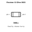
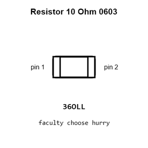
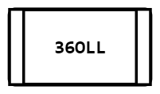
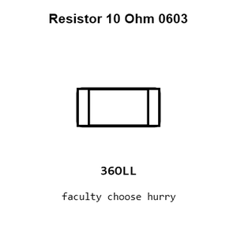
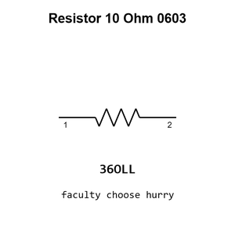

# Resistor 10 Ohm 0603

`electronic_resistor_0603_10_ohm`

Resistor 10 Ohm 0603 is an OOMP electronic resistor definition. It uses the 0603 package or form factor. Its nominal drawing size is 1.6 &#x00D7; 0.8 mm.

## At a glance

| Detail | Value |
| --- | --- |
| OOMP ID | `electronic_resistor_0603_10_ohm` |
| Type | Resistor |
| Package / style | 0603 |
| Nominal size | 1.6 &#x00D7; 0.8 mm |

## Classification

| Level | Value |
| --- | --- |
| 1 | `electronic` |
| 2 | `resistor` |
| 3 | `0603` |
| 4 | `10_ohm` |

## Nominal dimensions

| Measurement | Value |
| --- | ---: |
| Length | 1.6 mm |
| Width | 0.8 mm |

## Identifiers

| Identifier | Value |
| --- | --- |
| Manufacturer part number | `0603WAF100JT5E` |
| LCSC | [`C22859`](https://www.lcsc.com/product-detail/C22859.html) |

## Used in projects

| Project | Quantity | References | Explore |
| --- | ---: | --- | --- |
| [Project adafruit/Adafruit-1.28-240x240-Round-Display-PCB Adafruit 1.28 240x240 Round Display current](https://github.com/adafruit/Adafruit-1.28-240x240-Round-Display-PCB/blob/main/Adafruit%201.28%20240x240%20Round%20Display.brd) | 1 | R5 | [Board explorer](https://oomlout.github.io/oomp_electronic_version_5/parts/oomp_project_github_adafruit_adafruit_1_28_240x240_round_display_pcb_adafruit_1_28_240x240_round_display_current/board_explorer.html) · [OOMP project](https://github.com/oomlout/oomp_electronic_version_5/tree/main/parts/oomp_project_github_adafruit_adafruit_1_28_240x240_round_display_pcb_adafruit_1_28_240x240_round_display_current) |
| [Project adafruit/Adafruit-1.3-inch-240x240-TFT-PCB Adafruit 1.3in 240x240 IPS TFT current](https://github.com/adafruit/Adafruit-1.3-inch-240x240-TFT-PCB/blob/master/Adafruit%201.3in%20240x240%20IPS%20TFT.brd) | 1 | R5 | [Board explorer](https://oomlout.github.io/oomp_electronic_version_5/parts/oomp_project_github_adafruit_adafruit_1_3_inch_240x240_tft_pcb_adafruit_1_3in_240x240_ips_tft_current/board_explorer.html) · [OOMP project](https://github.com/oomlout/oomp_electronic_version_5/tree/main/parts/oomp_project_github_adafruit_adafruit_1_3_inch_240x240_tft_pcb_adafruit_1_3in_240x240_ips_tft_current) |
| [Project adafruit/Adafruit-1.3-inch-240x240-TFT-PCB Adafruit 1.3in 240x240 IPS TFT EYESPI current](https://github.com/adafruit/Adafruit-1.3-inch-240x240-TFT-PCB/blob/master/Adafruit%201.3in%20240x240%20IPS%20TFT%20EYESPI.brd) | 1 | R5 | [Board explorer](https://oomlout.github.io/oomp_electronic_version_5/parts/oomp_project_github_adafruit_adafruit_1_3_inch_240x240_tft_pcb_adafruit_1_3in_240x240_ips_tft_eyespi_current/board_explorer.html) · [OOMP project](https://github.com/oomlout/oomp_electronic_version_5/tree/main/parts/oomp_project_github_adafruit_adafruit_1_3_inch_240x240_tft_pcb_adafruit_1_3in_240x240_ips_tft_eyespi_current) |
| [Project adafruit/Adafruit-1.3in-Color-TFT-Bonnet-PCB Adafruit 1.3in Color TFT Bonnet current](https://github.com/adafruit/Adafruit-1.3in-Color-TFT-Bonnet-PCB/blob/master/Adafruit%201.3in%20Color%20TFT%20Bonnet.brd) | 1 | R5 | [Board explorer](https://oomlout.github.io/oomp_electronic_version_5/parts/oomp_project_github_adafruit_adafruit_1_3in_color_tft_bonnet_pcb_adafruit_1_3in_color_tft_bonnet_current/board_explorer.html) · [OOMP project](https://github.com/oomlout/oomp_electronic_version_5/tree/main/parts/oomp_project_github_adafruit_adafruit_1_3in_color_tft_bonnet_pcb_adafruit_1_3in_color_tft_bonnet_current) |
| [Project adafruit/Adafruit-1.54-inch-240x240-TFT-PCB Adafruit 1.54in 240x240 TFT EYESPI current](https://github.com/adafruit/Adafruit-1.54-inch-240x240-TFT-PCB/blob/master/Adafruit%201.54in%20240x240%20TFT%20EYESPI.brd) | 1 | R5 | [Board explorer](https://oomlout.github.io/oomp_electronic_version_5/parts/oomp_project_github_adafruit_adafruit_1_54_inch_240x240_tft_pcb_adafruit_1_54in_240x240_tft_eyespi_current/board_explorer.html) · [OOMP project](https://github.com/oomlout/oomp_electronic_version_5/tree/main/parts/oomp_project_github_adafruit_adafruit_1_54_inch_240x240_tft_pcb_adafruit_1_54in_240x240_tft_eyespi_current) |
| [Project adafruit/Adafruit-1.54-inch-240x240-TFT-PCB Adafruit 1.54inch 240x240 current](https://github.com/adafruit/Adafruit-1.54-inch-240x240-TFT-PCB/blob/master/Adafruit%201.54inch%20240x240.brd) | 1 | R5 | [Board explorer](https://oomlout.github.io/oomp_electronic_version_5/parts/oomp_project_github_adafruit_adafruit_1_54_inch_240x240_tft_pcb_adafruit_1_54inch_240x240_current/board_explorer.html) · [OOMP project](https://github.com/oomlout/oomp_electronic_version_5/tree/main/parts/oomp_project_github_adafruit_adafruit_1_54_inch_240x240_tft_pcb_adafruit_1_54inch_240x240_current) |
| [Project adafruit/Adafruit-1.69in-280x240-Round-Rectangle-TFT-PCB Adafruit 1.69in 280x240 Round Rectangle TFT current](https://github.com/adafruit/Adafruit-1.69in-280x240-Round-Rectangle-TFT-PCB/blob/main/Adafruit%201.69in%20280x240%20Round%20Rectangle%20TFT.brd) | 1 | R5 | [Board explorer](https://oomlout.github.io/oomp_electronic_version_5/parts/oomp_project_github_adafruit_adafruit_1_69in_280x240_round_rectangle_tft_pcb_adafruit_1_69in_280x240_round_rectangle_tft_current/board_explorer.html) · [OOMP project](https://github.com/oomlout/oomp_electronic_version_5/tree/main/parts/oomp_project_github_adafruit_adafruit_1_69in_280x240_round_rectangle_tft_pcb_adafruit_1_69in_280x240_round_rectangle_tft_current) |
| [Project adafruit/Adafruit-2.4-TFT-FeatherWing-PCB Adafruit 2.4in TFT Feather Wing current](https://github.com/adafruit/Adafruit-2.4-TFT-FeatherWing-PCB/blob/master/Adafruit%202.4in%20TFT%20FeatherWing%20V2.brd) | 4 | R1, R2, R3, R4 | [Board explorer](https://oomlout.github.io/oomp_electronic_version_5/parts/oomp_project_github_adafruit_adafruit_2_4_tft_feather_wing_pcb_adafruit_2_4in_tft_feather_wing_current/board_explorer.html) · [OOMP project](https://github.com/oomlout/oomp_electronic_version_5/tree/main/parts/oomp_project_github_adafruit_adafruit_2_4_tft_feather_wing_pcb_adafruit_2_4in_tft_feather_wing_current) |
| [Project soldered_electronics/Load-cell-ampfilier-HX711-board-hardware-design HX711 Load Cell current](https://github.com/SolderedElectronics/Load-cell-ampfilier-HX711-board-hardware-design) | 1 | R5 | [Board explorer](https://oomlout.github.io/oomp_electronic_version_5/parts/oomp_project_github_soldered_electronics_load_cell_ampfilier_hx711_board_hardware_design_sensor_load_cell_hx711_current/board_explorer.html) · [OOMP project](https://github.com/oomlout/oomp_electronic_version_5/tree/main/parts/oomp_project_github_soldered_electronics_load_cell_ampfilier_hx711_board_hardware_design_sensor_load_cell_hx711_current) |
| [Project soldered_electronics/Load-cell-ampfilier-HX711-board-qwiic-hardware-design HX711 Load Cell qwiic current](https://github.com/SolderedElectronics/Load-cell-amplifier-HX711-board-qwiic-hardware-design) | 1 | R7 | [Board explorer](https://oomlout.github.io/oomp_electronic_version_5/parts/oomp_project_github_soldered_electronics_load_cell_ampfilier_hx711_board_qwiic_hardware_design_sensor_load_cell_hx711_qwiic_current/board_explorer.html) · [OOMP project](https://github.com/oomlout/oomp_electronic_version_5/tree/main/parts/oomp_project_github_soldered_electronics_load_cell_ampfilier_hx711_board_qwiic_hardware_design_sensor_load_cell_hx711_qwiic_current) |
| [Project soldered_electronics/Load-cell-ampfilier-HX711-board-with-easy-C-hardware-design HX711 Load Cell easyC current](https://github.com/SolderedElectronics/Load-cell-ampfilier-HX711-board-with-easy-C-hardware-design) | 1 | R7 | [Board explorer](https://oomlout.github.io/oomp_electronic_version_5/parts/oomp_project_github_soldered_electronics_load_cell_ampfilier_hx711_board_with_easy_c_hardware_design_sensor_load_cell_hx711_easyc_current/board_explorer.html) · [OOMP project](https://github.com/oomlout/oomp_electronic_version_5/tree/main/parts/oomp_project_github_soldered_electronics_load_cell_ampfilier_hx711_board_with_easy_c_hardware_design_sensor_load_cell_hx711_easyc_current) |
| [Project soldered_electronics/PIR-Movement-sensor-board-hardware-design PIR Movement Sensor current](https://github.com/SolderedElectronics/PIR-Movement-sensor-board-hardware-design) | 1 | R4 | [Board explorer](https://oomlout.github.io/oomp_electronic_version_5/parts/oomp_project_github_soldered_electronics_pir_movement_sensor_board_hardware_design_sensor_pir_movement_current/board_explorer.html) · [OOMP project](https://github.com/oomlout/oomp_electronic_version_5/tree/main/parts/oomp_project_github_soldered_electronics_pir_movement_sensor_board_hardware_design_sensor_pir_movement_current) |
| [Project sparkfun/SparkFun_u-blox_NEO-F10N u-blox NEO-F10N current](https://github.com/sparkfun/SparkFun_u-blox_NEO-F10N) | 1 | R3 | [Board explorer](https://oomlout.github.io/oomp_electronic_version_5/parts/oomp_project_github_sparkfun_spark_fun_u_blox_neo_f10_n_ublox_neo_f10n_current/board_explorer.html) · [OOMP project](https://github.com/oomlout/oomp_electronic_version_5/tree/main/parts/oomp_project_github_sparkfun_spark_fun_u_blox_neo_f10_n_ublox_neo_f10n_current) |

## Files

[KiCad symbol, machine-solder and hand-solder footprints](data/kicad/README.md) · [Availability and source masters](data/kicad/manifest.yaml)

[View this part on GitHub](https://github.com/oomlout/oomp_electronic_version_5/tree/main/parts/electronic_resistor_0603_10_ohm)

[Browse this category](../../navigation/electronic/resistor/0603/README.md)

---

This page is generated from the OOMP part definition by a Roboclick Jinja template. Edit the source taxonomy or template rather than this generated file.