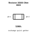
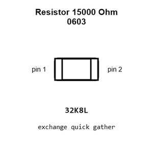
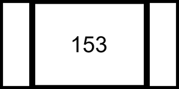
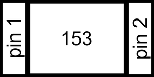
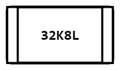
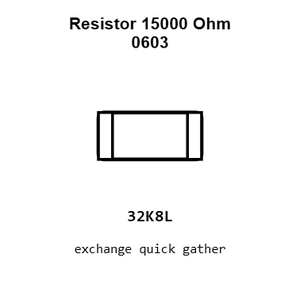
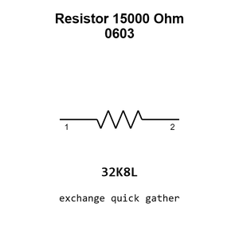

# Resistor 15000 Ohm 0603

`electronic_resistor_0603_15000_ohm`

Resistor 15000 Ohm 0603 is an OOMP electronic resistor definition. It uses the 0603 package or form factor. Its nominal drawing size is 1.6 &#x00D7; 0.8 mm.

## At a glance

| Detail | Value |
| --- | --- |
| OOMP ID | `electronic_resistor_0603_15000_ohm` |
| Type | Resistor |
| Package / style | 0603 |
| Nominal size | 1.6 &#x00D7; 0.8 mm |

## Classification

| Level | Value |
| --- | --- |
| 1 | `electronic` |
| 2 | `resistor` |
| 3 | `0603` |
| 4 | `15000_ohm` |

## Nominal dimensions

| Measurement | Value |
| --- | ---: |
| Length | 1.6 mm |
| Width | 0.8 mm |

## Identifiers

| Identifier | Value |
| --- | --- |
| Manufacturer part number | `FRC0603F1502TS` |
| LCSC | [`C2906995`](https://www.lcsc.com/product-detail/C2906995.html) |

## Used in projects

| Project | Quantity | References | Explore |
| --- | ---: | --- | --- |
| [Project sparkfun/Purpletooth_Jamboree Purpletooth Jamboree current](https://github.com/sparkfun/Purpletooth_Jamboree/blob/master/Hardware/Purpletooth_Jamboree.brd) | 4 | R13, R16, R19, R22 | [Board explorer](https://oomlout.github.io/oomp_electronic_version_5/parts/oomp_project_github_sparkfun_purpletooth_jamboree_purpletooth_jamboree_current/board_explorer.html) · [OOMP project](https://github.com/oomlout/oomp_electronic_version_5/tree/main/parts/oomp_project_github_sparkfun_purpletooth_jamboree_purpletooth_jamboree_current) |
| [Project sparkfun/SparkFun_Temperature_Sensor-STTS22H Spark Fun Temperature Sensor STTS22 H current](https://github.com/sparkfun/SparkFun_Temperature_Sensor-STTS22H/blob/main/Hardware/Qwiic/SparkFun_Temperature_Sensor-STTS22H.brd) | 1 | R8 | [Board explorer](https://oomlout.github.io/oomp_electronic_version_5/parts/oomp_project_github_sparkfun_spark_fun_temperature_sensor_stts22_h_spark_fun_temperature_sensor_stts22_h_current/board_explorer.html) · [OOMP project](https://github.com/oomlout/oomp_electronic_version_5/tree/main/parts/oomp_project_github_sparkfun_spark_fun_temperature_sensor_stts22_h_spark_fun_temperature_sensor_stts22_h_current) |
| [Project sparkfun/tsunami Tapestry current](https://github.com/sparkfun/tsunami/blob/master/Hardware/deprecated/Tapestry.brd) | 1 | R15 | [Board explorer](https://oomlout.github.io/oomp_electronic_version_5/parts/oomp_project_github_sparkfun_tsunami_tapestry_current/board_explorer.html) · [OOMP project](https://github.com/oomlout/oomp_electronic_version_5/tree/main/parts/oomp_project_github_sparkfun_tsunami_tapestry_current) |
| [Project sparkfun/tsunami tsunami current](https://github.com/sparkfun/tsunami/blob/master/Hardware/tsunami.brd) | 1 | R4 | [Board explorer](https://oomlout.github.io/oomp_electronic_version_5/parts/oomp_project_github_sparkfun_tsunami_tsunami_current/board_explorer.html) · [OOMP project](https://github.com/oomlout/oomp_electronic_version_5/tree/main/parts/oomp_project_github_sparkfun_tsunami_tsunami_current) |

## Files

[KiCad symbol, machine-solder and hand-solder footprints](data/kicad/README.md) · [Availability and source masters](data/kicad/manifest.yaml)

[View this part on GitHub](https://github.com/oomlout/oomp_electronic_version_5/tree/main/parts/electronic_resistor_0603_15000_ohm)

[Browse this category](../../navigation/electronic/resistor/0603/README.md)

---

This page is generated from the OOMP part definition by a Roboclick Jinja template. Edit the source taxonomy or template rather than this generated file.