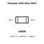
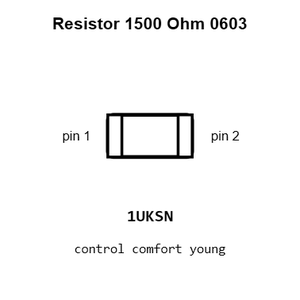
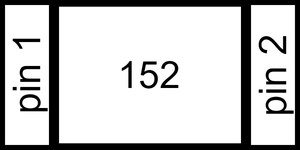
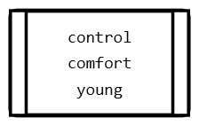
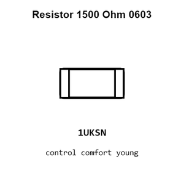
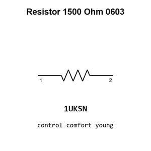

# Resistor 1500 Ohm 0603

`electronic_resistor_0603_1500_ohm`

Resistor 1500 Ohm 0603 is an OOMP electronic resistor definition. It uses the 0603 package or form factor. Its nominal drawing size is 1.6 &#x00D7; 0.8 mm.

## At a glance

| Detail | Value |
| --- | --- |
| OOMP ID | `electronic_resistor_0603_1500_ohm` |
| Type | Resistor |
| Package / style | 0603 |
| Nominal size | 1.6 &#x00D7; 0.8 mm |

## Classification

| Level | Value |
| --- | --- |
| 1 | `electronic` |
| 2 | `resistor` |
| 3 | `0603` |
| 4 | `1500_ohm` |

## Nominal dimensions

| Measurement | Value |
| --- | ---: |
| Length | 1.6 mm |
| Width | 0.8 mm |

## Identifiers

| Identifier | Value |
| --- | --- |
| Manufacturer part number | `FRC0603F1501TS` |
| LCSC | [`C2930050`](https://www.lcsc.com/product-detail/C2930050.html) |

## Used in projects

| Project | Quantity | References | Explore |
| --- | ---: | --- | --- |
| [Project adafruit/Adafruit-Gemma-PCB Adafruit Gemma current](https://github.com/adafruit/Adafruit-Gemma-PCB/blob/master/Adafruit%20Gemma.brd) | 1 | R3 | [Board explorer](https://oomlout.github.io/oomp_electronic_version_5/parts/oomp_project_github_adafruit_adafruit_gemma_pcb_adafruit_gemma_current/board_explorer.html) · [OOMP project](https://github.com/oomlout/oomp_electronic_version_5/tree/main/parts/oomp_project_github_adafruit_adafruit_gemma_pcb_adafruit_gemma_current) |
| [Project adafruit/Adafruit-Trinket-M0-PCB Trinket M0 current](https://github.com/adafruit/Adafruit-Trinket-M0-PCB/blob/master/Trinket%20M0%20rev%20D.brd) | 1 | R1 | [Board explorer](https://oomlout.github.io/oomp_electronic_version_5/parts/oomp_project_github_adafruit_adafruit_trinket_m0_pcb_trinket_m0_current/board_explorer.html) · [OOMP project](https://github.com/oomlout/oomp_electronic_version_5/tree/main/parts/oomp_project_github_adafruit_adafruit_trinket_m0_pcb_trinket_m0_current) |
| [Project adafruit/Adafruit-Trinket-PCB Adafruit Trinket 3.3 V current](https://github.com/adafruit/Adafruit-Trinket-PCB/blob/master/Adafruit%20Trinket%203.3V.brd) | 1 | R3 | [Board explorer](https://oomlout.github.io/oomp_electronic_version_5/parts/oomp_project_github_adafruit_adafruit_trinket_pcb_adafruit_trinket_3_3_v_current/board_explorer.html) · [OOMP project](https://github.com/oomlout/oomp_electronic_version_5/tree/main/parts/oomp_project_github_adafruit_adafruit_trinket_pcb_adafruit_trinket_3_3_v_current) |
| [Project adafruit/Adafruit-Trinket-PCB Adafruit Trinket 3 V micro USB current](https://github.com/adafruit/Adafruit-Trinket-PCB/blob/master/Adafruit%20Trinket%203V%20microUSB.brd) | 1 | R3 | [Board explorer](https://oomlout.github.io/oomp_electronic_version_5/parts/oomp_project_github_adafruit_adafruit_trinket_pcb_adafruit_trinket_3_v_micro_usb_current/board_explorer.html) · [OOMP project](https://github.com/oomlout/oomp_electronic_version_5/tree/main/parts/oomp_project_github_adafruit_adafruit_trinket_pcb_adafruit_trinket_3_v_micro_usb_current) |
| [Project adafruit/Adafruit-Trinket-PCB Adafruit Trinket 5 V current](https://github.com/adafruit/Adafruit-Trinket-PCB/blob/master/Adafruit%20Trinket%205V.brd) | 1 | R3 | [Board explorer](https://oomlout.github.io/oomp_electronic_version_5/parts/oomp_project_github_adafruit_adafruit_trinket_pcb_adafruit_trinket_5_v_current/board_explorer.html) · [OOMP project](https://github.com/oomlout/oomp_electronic_version_5/tree/main/parts/oomp_project_github_adafruit_adafruit_trinket_pcb_adafruit_trinket_5_v_current) |
| [Project adafruit/Adafruit-Trinket-PCB Adafruit Trinket 5 V micro USB current](https://github.com/adafruit/Adafruit-Trinket-PCB/blob/master/Adafruit%20Trinket%205V%20microUSB.brd) | 1 | R3 | [Board explorer](https://oomlout.github.io/oomp_electronic_version_5/parts/oomp_project_github_adafruit_adafruit_trinket_pcb_adafruit_trinket_5_v_micro_usb_current/board_explorer.html) · [OOMP project](https://github.com/oomlout/oomp_electronic_version_5/tree/main/parts/oomp_project_github_adafruit_adafruit_trinket_pcb_adafruit_trinket_5_v_micro_usb_current) |
| [Project sparkfun/Logomatic Logomatic current](https://github.com/sparkfun/Logomatic/blob/master/Hardware/Logomatic.brd) | 1 | R11 | [Board explorer](https://oomlout.github.io/oomp_electronic_version_5/parts/oomp_project_github_sparkfun_logomatic_logomatic_current/board_explorer.html) · [OOMP project](https://github.com/oomlout/oomp_electronic_version_5/tree/main/parts/oomp_project_github_sparkfun_logomatic_logomatic_current) |
| [Project sparkfun/Pocket_AVR_Programmer AVR Pocket Programmer current](https://github.com/sparkfun/Pocket_AVR_Programmer/blob/master/Hardware/AVR-Pocket-Programmer.brd) | 1 | R3 | [Board explorer](https://oomlout.github.io/oomp_electronic_version_5/parts/oomp_project_github_sparkfun_pocket_avr_programmer_avr_pocket_programmer_current/board_explorer.html) · [OOMP project](https://github.com/oomlout/oomp_electronic_version_5/tree/main/parts/oomp_project_github_sparkfun_pocket_avr_programmer_avr_pocket_programmer_current) |
| [Project sparkfun/SparkFun_MicroMod_Single_Pair_Ethernet_Function_Board_ADIN1110 Spark Fun Micro Mod Function ADIN1110 current](https://github.com/sparkfun/SparkFun_MicroMod_Single_Pair_Ethernet_Function_Board_ADIN1110/blob/main/Hardware/SparkFun_MicroMod_Function_ADIN1110.brd) | 2 | R10, R24 | [Board explorer](https://oomlout.github.io/oomp_electronic_version_5/parts/oomp_project_github_sparkfun_spark_fun_micro_mod_single_pair_ethernet_function_board_adin1110_spark_fun_micro_mod_function_adin1110_current/board_explorer.html) · [OOMP project](https://github.com/oomlout/oomp_electronic_version_5/tree/main/parts/oomp_project_github_sparkfun_spark_fun_micro_mod_single_pair_ethernet_function_board_adin1110_spark_fun_micro_mod_function_adin1110_current) |

## Files

[KiCad symbol, machine-solder and hand-solder footprints](data/kicad/README.md) · [Availability and source masters](data/kicad/manifest.yaml)

[View this part on GitHub](https://github.com/oomlout/oomp_electronic_version_5/tree/main/parts/electronic_resistor_0603_1500_ohm)

[Browse this category](../../navigation/electronic/resistor/0603/README.md)

---

This page is generated from the OOMP part definition by a Roboclick Jinja template. Edit the source taxonomy or template rather than this generated file.