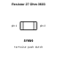
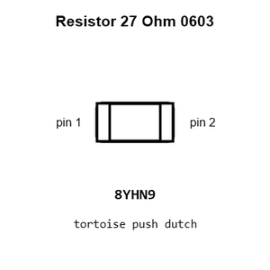
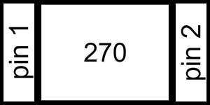
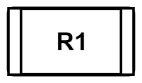
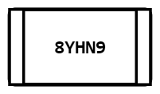
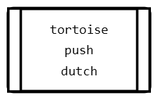
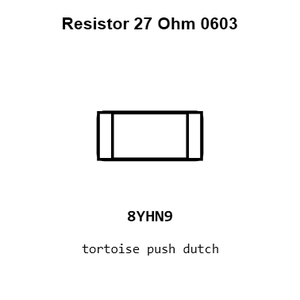
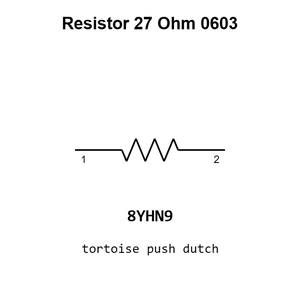

# Resistor 27 Ohm 0603

`electronic_resistor_0603_27_ohm`

Resistor 27 Ohm 0603 is an OOMP electronic resistor definition. It uses the 0603 package or form factor. Its nominal drawing size is 1.6 &#x00D7; 0.8 mm.

## At a glance

| Detail | Value |
| --- | --- |
| OOMP ID | `electronic_resistor_0603_27_ohm` |
| Type | Resistor |
| Package / style | 0603 |
| Nominal size | 1.6 &#x00D7; 0.8 mm |

## Classification

| Level | Value |
| --- | --- |
| 1 | `electronic` |
| 2 | `resistor` |
| 3 | `0603` |
| 4 | `27_ohm` |

## Nominal dimensions

| Measurement | Value |
| --- | ---: |
| Length | 1.6 mm |
| Width | 0.8 mm |

## Identifiers

| Identifier | Value |
| --- | --- |
| Manufacturer part number | `0603WAF270JT5E` |
| LCSC | [`C25190`](https://www.lcsc.com/product-detail/C25190.html) |

## Used in projects

| Project | Quantity | References | Explore |
| --- | ---: | --- | --- |
| [Project adafruit/Adafruit-Feather-RP2040-PCB Adafruit Feather RP2040 current](https://github.com/adafruit/Adafruit-Feather-RP2040-PCB/blob/main/Adafruit%20Feather%20RP2040.brd) | 2 | R9, R10 | [Board explorer](https://oomlout.github.io/oomp_electronic_version_5/parts/oomp_project_github_adafruit_adafruit_feather_rp2040_pcb_adafruit_feather_rp2040_current/board_explorer.html) · [OOMP project](https://github.com/oomlout/oomp_electronic_version_5/tree/main/parts/oomp_project_github_adafruit_adafruit_feather_rp2040_pcb_adafruit_feather_rp2040_current) |
| [Project adafruit/Adafruit-Feather-RP2040-PCB Adafruit Feather RP2040 Original current](https://github.com/adafruit/Adafruit-Feather-RP2040-PCB/blob/main/Adafruit%20Feather%20RP2040%20Original.brd) | 2 | R9, R10 | [Board explorer](https://oomlout.github.io/oomp_electronic_version_5/parts/oomp_project_github_adafruit_adafruit_feather_rp2040_pcb_adafruit_feather_rp2040_original_current/board_explorer.html) · [OOMP project](https://github.com/oomlout/oomp_electronic_version_5/tree/main/parts/oomp_project_github_adafruit_adafruit_feather_rp2040_pcb_adafruit_feather_rp2040_original_current) |
| [Project adafruit/Adafruit-Trinkey-QT2040-PCB Adafruit QT2040 Trinkey current](https://github.com/adafruit/Adafruit-Trinkey-QT2040-PCB/blob/main/Adafruit%20QT2040%20Trinkey.brd) | 2 | R14, R15 | [Board explorer](https://oomlout.github.io/oomp_electronic_version_5/parts/oomp_project_github_adafruit_adafruit_trinkey_qt2040_pcb_adafruit_qt2040_trinkey_current/board_explorer.html) · [OOMP project](https://github.com/oomlout/oomp_electronic_version_5/tree/main/parts/oomp_project_github_adafruit_adafruit_trinkey_qt2040_pcb_adafruit_qt2040_trinkey_current) |
| [Project adafruit/RP2040-Based-Tester-Brains-PCB Adafruit RP2040 Tester Brains current](https://github.com/adafruit/RP2040-Based-Tester-Brains-PCB/blob/main/Adafruit%20RP2040%20Tester%20Brains%20rev%20A.brd) | 4 | R6, R7, R8, R9 | [Board explorer](https://oomlout.github.io/oomp_electronic_version_5/parts/oomp_project_github_adafruit_rp2040_based_tester_brains_pcb_adafruit_rp2040_tester_brains_current/board_explorer.html) · [OOMP project](https://github.com/oomlout/oomp_electronic_version_5/tree/main/parts/oomp_project_github_adafruit_rp2040_based_tester_brains_pcb_adafruit_rp2040_tester_brains_current) |
| [Project sparkfun/Blynk_Board_ESP8266 Spark Fun Blynk Board ESP8266 current](https://github.com/sparkfun/Blynk_Board_ESP8266/blob/master/Hardware/SparkFun-Blynk-Board-ESP8266.brd) | 2 | R13, R14 | [Board explorer](https://oomlout.github.io/oomp_electronic_version_5/parts/oomp_project_github_sparkfun_blynk_board_esp8266_spark_fun_blynk_board_esp8266_current/board_explorer.html) · [OOMP project](https://github.com/oomlout/oomp_electronic_version_5/tree/main/parts/oomp_project_github_sparkfun_blynk_board_esp8266_spark_fun_blynk_board_esp8266_current) |
| [Project sparkfun/ESP32_Thing esp32 thing current](https://github.com/sparkfun/ESP32_Thing/blob/master/Hardware/esp32-thing.brd) | 2 | R13, R14 | [Board explorer](https://oomlout.github.io/oomp_electronic_version_5/parts/oomp_project_github_sparkfun_esp32_thing_esp32_thing_current/board_explorer.html) · [OOMP project](https://github.com/oomlout/oomp_electronic_version_5/tree/main/parts/oomp_project_github_sparkfun_esp32_thing_esp32_thing_current) |
| [Project sparkfun/ESP8266_Thing_Dev ESP8266 Thing Dev current](https://github.com/sparkfun/ESP8266_Thing_Dev/blob/master/Hardware/ESP8266-Thing-Dev.brd) | 2 | R7, R8 | [Board explorer](https://oomlout.github.io/oomp_electronic_version_5/parts/oomp_project_github_sparkfun_esp8266_thing_dev_esp8266_thing_dev_current/board_explorer.html) · [OOMP project](https://github.com/oomlout/oomp_electronic_version_5/tree/main/parts/oomp_project_github_sparkfun_esp8266_thing_dev_esp8266_thing_dev_current) |
| [Project sparkfun/MicroView_USB_Programmer Spark Fun Micro View USB current](https://github.com/sparkfun/MicroView_USB_Programmer/blob/master/Hardware/SparkFun_MicroViewUSB.brd) | 2 | R6, R7 | [Board explorer](https://oomlout.github.io/oomp_electronic_version_5/parts/oomp_project_github_sparkfun_micro_view_usb_programmer_spark_fun_micro_view_usb_current/board_explorer.html) · [OOMP project](https://github.com/oomlout/oomp_electronic_version_5/tree/main/parts/oomp_project_github_sparkfun_micro_view_usb_programmer_spark_fun_micro_view_usb_current) |
| [Project sparkfun/nRF52840_Breakout_MDBT50Q nrf52840 breakout mdbt50q current](https://github.com/sparkfun/nRF52840_Breakout_MDBT50Q/blob/master/Hardware/nrf52840-breakout-mdbt50q.brd) | 2 | R1, R2 | [Board explorer](https://oomlout.github.io/oomp_electronic_version_5/parts/oomp_project_github_sparkfun_n_rf52840_breakout_mdbt50_q_nrf52840_breakout_mdbt50q_current/board_explorer.html) · [OOMP project](https://github.com/oomlout/oomp_electronic_version_5/tree/main/parts/oomp_project_github_sparkfun_n_rf52840_breakout_mdbt50_q_nrf52840_breakout_mdbt50q_current) |
| [Project sparkfun/OpenScale Spark Fun open Scale current](https://github.com/sparkfun/OpenScale/blob/master/hardware/SparkFun_openScale.brd) | 2 | R1, R6 | [Board explorer](https://oomlout.github.io/oomp_electronic_version_5/parts/oomp_project_github_sparkfun_open_scale_spark_fun_open_scale_current/board_explorer.html) · [OOMP project](https://github.com/oomlout/oomp_electronic_version_5/tree/main/parts/oomp_project_github_sparkfun_open_scale_spark_fun_open_scale_current) |
| [Project sparkfun/Pocket_AVR_Programmer AVR Pocket Programmer current](https://github.com/sparkfun/Pocket_AVR_Programmer/blob/master/Hardware/AVR-Pocket-Programmer.brd) | 2 | R1, R2 | [Board explorer](https://oomlout.github.io/oomp_electronic_version_5/parts/oomp_project_github_sparkfun_pocket_avr_programmer_avr_pocket_programmer_current/board_explorer.html) · [OOMP project](https://github.com/oomlout/oomp_electronic_version_5/tree/main/parts/oomp_project_github_sparkfun_pocket_avr_programmer_avr_pocket_programmer_current) |
| [Project sparkfun/Qwiic_GPS-RTK2 Qwiic GPS RTK2 ublox ZED-F9P current](https://github.com/sparkfun/Qwiic_GPS-RTK2/blob/master/Hardware/Qwiic%20GPS-RTK2%20-%20ublox%20ZED-F9P.brd) | 2 | R9, R10 | [Board explorer](https://oomlout.github.io/oomp_electronic_version_5/parts/oomp_project_github_sparkfun_qwiic_gps_rtk2_qwiic_gps_rtk2_ublox_zed_f9_p_current/board_explorer.html) · [OOMP project](https://github.com/oomlout/oomp_electronic_version_5/tree/main/parts/oomp_project_github_sparkfun_qwiic_gps_rtk2_qwiic_gps_rtk2_ublox_zed_f9_p_current) |
| [Project sparkfun/RedBoard Red Board current](https://github.com/sparkfun/RedBoard/blob/master/Hardware/RedBoard.brd) | 2 | R5, R10 | [Board explorer](https://oomlout.github.io/oomp_electronic_version_5/parts/oomp_project_github_sparkfun_red_board_red_board_current/board_explorer.html) · [OOMP project](https://github.com/oomlout/oomp_electronic_version_5/tree/main/parts/oomp_project_github_sparkfun_red_board_red_board_current) |
| [Project sparkfun/SparkFun_GNSS_Combo_Breakout-ZED-F9P_NEO-D9S ZED F9 P NEO D9 S Combo current](https://github.com/sparkfun/SparkFun_GNSS_Combo_Breakout-ZED-F9P_NEO-D9S/blob/main/Hardware/ZED-F9P_NEO-D9S_Combo.brd) | 4 | R9, R10, R15, R16 | [Board explorer](https://oomlout.github.io/oomp_electronic_version_5/parts/oomp_project_github_sparkfun_spark_fun_gnss_combo_breakout_zed_f9_p_neo_d9_s_zed_f9_p_neo_d9_s_combo_current/board_explorer.html) · [OOMP project](https://github.com/oomlout/oomp_electronic_version_5/tree/main/parts/oomp_project_github_sparkfun_spark_fun_gnss_combo_breakout_zed_f9_p_neo_d9_s_zed_f9_p_neo_d9_s_combo_current) |
| [Project sparkfun/SparkFun_GNSS_Dead_Reckoning_ZED-F9K Spark Fun GPS ZED F9 K current](https://github.com/sparkfun/SparkFun_GNSS_Dead_Reckoning_ZED-F9K/blob/main/Hardware/SparkFun_GPS_ZED-F9K.brd) | 2 | R21, R22 | [Board explorer](https://oomlout.github.io/oomp_electronic_version_5/parts/oomp_project_github_sparkfun_spark_fun_gnss_dead_reckoning_zed_f9_k_spark_fun_gps_zed_f9_k_current/board_explorer.html) · [OOMP project](https://github.com/oomlout/oomp_electronic_version_5/tree/main/parts/oomp_project_github_sparkfun_spark_fun_gnss_dead_reckoning_zed_f9_k_spark_fun_gps_zed_f9_k_current) |
| [Project sparkfun/SparkFun_GNSS_Function_Board_NEO-M9N Spark Fun GNSS NEO M9 N current](https://github.com/sparkfun/SparkFun_GNSS_Function_Board_NEO-M9N/blob/main/Hardware/SparkFun_GNSS_NEO-M9N.brd) | 2 | R9, R10 | [Board explorer](https://oomlout.github.io/oomp_electronic_version_5/parts/oomp_project_github_sparkfun_spark_fun_gnss_function_board_neo_m9_n_spark_fun_gnss_neo_m9_n_current/board_explorer.html) · [OOMP project](https://github.com/oomlout/oomp_electronic_version_5/tree/main/parts/oomp_project_github_sparkfun_spark_fun_gnss_function_board_neo_m9_n_spark_fun_gnss_neo_m9_n_current) |
| [Project sparkfun/SparkFun_GPS_Dead_Reckoning_PHat_ZED-F9R Spark Fun ZED F9 R Phat current](https://github.com/sparkfun/SparkFun_GPS_Dead_Reckoning_PHat_ZED-F9R/blob/master/Hardware/SparkFun_ZED-F9R_Phat_v11.brd) | 2 | R17, R18 | [Board explorer](https://oomlout.github.io/oomp_electronic_version_5/parts/oomp_project_github_sparkfun_spark_fun_gps_dead_reckoning_phat_zed_f9_r_spark_fun_zed_f9_r_phat_current/board_explorer.html) · [OOMP project](https://github.com/oomlout/oomp_electronic_version_5/tree/main/parts/oomp_project_github_sparkfun_spark_fun_gps_dead_reckoning_phat_zed_f9_r_spark_fun_zed_f9_r_phat_current) |
| [Project sparkfun/SparkFun_GPS_Dead_Reckoning_ZED-F9R Spark Fun ZED F9 R u FL current](https://github.com/sparkfun/SparkFun_GPS_Dead_Reckoning_ZED-F9R/blob/master/Hardware/UFL/SparkFun_ZED-F9R_v12_uFL.brd) | 2 | R21, R22 | [Board explorer](https://oomlout.github.io/oomp_electronic_version_5/parts/oomp_project_github_sparkfun_spark_fun_gps_dead_reckoning_zed_f9_r_spark_fun_zed_f9_r_u_fl_current/board_explorer.html) · [OOMP project](https://github.com/oomlout/oomp_electronic_version_5/tree/main/parts/oomp_project_github_sparkfun_spark_fun_gps_dead_reckoning_zed_f9_r_spark_fun_zed_f9_r_u_fl_current) |
| [Project sparkfun/SparkFun_RTK_EVK Spark Fun RTK EVK current](https://github.com/sparkfun/SparkFun_RTK_EVK/blob/main/Hardware/SparkFun_RTK_EVK.brd) | 8 | R7, R8, R9, R10, R22, R23, R66, R67 | [Board explorer](https://oomlout.github.io/oomp_electronic_version_5/parts/oomp_project_github_sparkfun_spark_fun_rtk_evk_spark_fun_rtk_evk_current/board_explorer.html) · [OOMP project](https://github.com/oomlout/oomp_electronic_version_5/tree/main/parts/oomp_project_github_sparkfun_spark_fun_rtk_evk_spark_fun_rtk_evk_current) |
| [Project sparkfun/SparkFun_RTK_Facet Spark Fun RTK Facet L Band Main current](https://github.com/sparkfun/SparkFun_RTK_Facet/blob/main/Hardware/Main-LBand/SparkFun%20RTK%20Facet%20L-Band%20-%20Main.brd) | 4 | R27, R28, R39, R40 | [Board explorer](https://oomlout.github.io/oomp_electronic_version_5/parts/oomp_project_github_sparkfun_spark_fun_rtk_facet_spark_fun_rtk_facet_l_band_main_current/board_explorer.html) · [OOMP project](https://github.com/oomlout/oomp_electronic_version_5/tree/main/parts/oomp_project_github_sparkfun_spark_fun_rtk_facet_spark_fun_rtk_facet_l_band_main_current) |
| [Project sparkfun/SparkFun_RTK_Facet Spark Fun RTK Facet Main current](https://github.com/sparkfun/SparkFun_RTK_Facet/blob/main/Hardware/Main/SparkFun%20RTK%20Facet%20-%20Main.brd) | 2 | R27, R28 | [Board explorer](https://oomlout.github.io/oomp_electronic_version_5/parts/oomp_project_github_sparkfun_spark_fun_rtk_facet_spark_fun_rtk_facet_main_current/board_explorer.html) · [OOMP project](https://github.com/oomlout/oomp_electronic_version_5/tree/main/parts/oomp_project_github_sparkfun_spark_fun_rtk_facet_spark_fun_rtk_facet_main_current) |
| [Project sparkfun/SparkFun_RTK_Reference_Station Reference Station current](https://github.com/sparkfun/SparkFun_RTK_Reference_Station/blob/main/Hardware/Reference_Station.brd) | 2 | R7, R8 | [Board explorer](https://oomlout.github.io/oomp_electronic_version_5/parts/oomp_project_github_sparkfun_spark_fun_rtk_reference_station_reference_station_current/board_explorer.html) · [OOMP project](https://github.com/oomlout/oomp_electronic_version_5/tree/main/parts/oomp_project_github_sparkfun_spark_fun_rtk_reference_station_reference_station_current) |
| [Project sparkfun/SparkFun_RTK_Surveyor Spark Fun GPS RTK Surveyor current](https://github.com/sparkfun/SparkFun_RTK_Surveyor/blob/main/Hardware/SparkFun%20GPS%20RTK%20Surveyor.brd) | 2 | R27, R28 | [Board explorer](https://oomlout.github.io/oomp_electronic_version_5/parts/oomp_project_github_sparkfun_spark_fun_rtk_surveyor_spark_fun_gps_rtk_surveyor_current/board_explorer.html) · [OOMP project](https://github.com/oomlout/oomp_electronic_version_5/tree/main/parts/oomp_project_github_sparkfun_spark_fun_rtk_surveyor_spark_fun_gps_rtk_surveyor_current) |
| [Project sparkfun/SparkFun_u-blox_NEO-M8U Spark Fun NEO M8 U current](https://github.com/sparkfun/SparkFun_u-blox_NEO-M8U/blob/master/Hardware/SparkFun%20NEO-M8U.brd) | 2 | R1, R2 | [Board explorer](https://oomlout.github.io/oomp_electronic_version_5/parts/oomp_project_github_sparkfun_spark_fun_u_blox_neo_m8_u_spark_fun_neo_m8_u_current/board_explorer.html) · [OOMP project](https://github.com/oomlout/oomp_electronic_version_5/tree/main/parts/oomp_project_github_sparkfun_spark_fun_u_blox_neo_m8_u_spark_fun_neo_m8_u_current) |
| [Project sparkfun/SparkFun_u-Blox_NEO_M9N Spark Fun GPS NEO M9 N ANT current](https://github.com/sparkfun/SparkFun_u-Blox_NEO_M9N/blob/master/Hardware/SparkFun%20GPS%20NEO_M9N_Chip_Antenna/SparkFun%20GPS%20NEO_M9N_ANT.brd) | 2 | R9, R10 | [Board explorer](https://oomlout.github.io/oomp_electronic_version_5/parts/oomp_project_github_sparkfun_spark_fun_u_blox_neo_m9_n_spark_fun_gps_neo_m9_n_ant_current/board_explorer.html) · [OOMP project](https://github.com/oomlout/oomp_electronic_version_5/tree/main/parts/oomp_project_github_sparkfun_spark_fun_u_blox_neo_m9_n_spark_fun_gps_neo_m9_n_ant_current) |
| [Project sparkfun/SparkFun_u-Blox_NEO_M9N Spark Fun GPS NEO M9 N SMA current](https://github.com/sparkfun/SparkFun_u-Blox_NEO_M9N/blob/master/Hardware/SparkFun%20GPS%20NEO_M9N_SMA/SparkFun%20GPS%20NEO_M9N_SMA.brd) | 2 | R9, R10 | [Board explorer](https://oomlout.github.io/oomp_electronic_version_5/parts/oomp_project_github_sparkfun_spark_fun_u_blox_neo_m9_n_spark_fun_gps_neo_m9_n_sma_current/board_explorer.html) · [OOMP project](https://github.com/oomlout/oomp_electronic_version_5/tree/main/parts/oomp_project_github_sparkfun_spark_fun_u_blox_neo_m9_n_spark_fun_gps_neo_m9_n_sma_current) |
| [Project sparkfun/SparkFun_u-Blox_NEO_M9N Spark Fun GPS NEO M9 N u FL current](https://github.com/sparkfun/SparkFun_u-Blox_NEO_M9N/blob/master/Hardware/SparkFun%20GPS%20NEO_M9N_uFL/SparkFun%20GPS%20NEO_M9N_uFL.brd) | 2 | R9, R10 | [Board explorer](https://oomlout.github.io/oomp_electronic_version_5/parts/oomp_project_github_sparkfun_spark_fun_u_blox_neo_m9_n_spark_fun_gps_neo_m9_n_u_fl_current/board_explorer.html) · [OOMP project](https://github.com/oomlout/oomp_electronic_version_5/tree/main/parts/oomp_project_github_sparkfun_spark_fun_u_blox_neo_m9_n_spark_fun_gps_neo_m9_n_u_fl_current) |

## Files

[KiCad symbol, machine-solder and hand-solder footprints](data/kicad/README.md) · [Availability and source masters](data/kicad/manifest.yaml)

[View this part on GitHub](https://github.com/oomlout/oomp_electronic_version_5/tree/main/parts/electronic_resistor_0603_27_ohm)

[Browse this category](../../navigation/electronic/resistor/0603/README.md)

---

This page is generated from the OOMP part definition by a Roboclick Jinja template. Edit the source taxonomy or template rather than this generated file.