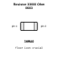
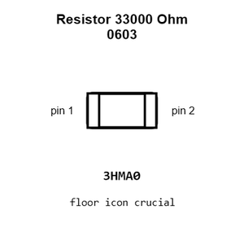
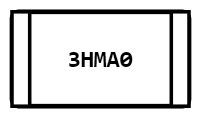
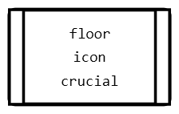
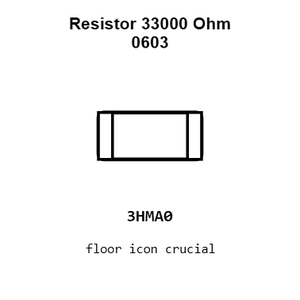
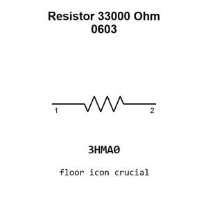

# Resistor 33000 Ohm 0603

`electronic_resistor_0603_33000_ohm`

Resistor 33000 Ohm 0603 is an OOMP electronic resistor definition. It uses the 0603 package or form factor. Its nominal drawing size is 1.6 &#x00D7; 0.8 mm.

## At a glance

| Detail | Value |
| --- | --- |
| OOMP ID | `electronic_resistor_0603_33000_ohm` |
| Type | Resistor |
| Package / style | 0603 |
| Nominal size | 1.6 &#x00D7; 0.8 mm |

## Classification

| Level | Value |
| --- | --- |
| 1 | `electronic` |
| 2 | `resistor` |
| 3 | `0603` |
| 4 | `33000_ohm` |

## Nominal dimensions

| Measurement | Value |
| --- | ---: |
| Length | 1.6 mm |
| Width | 0.8 mm |

## Identifiers

| Identifier | Value |
| --- | --- |
| Manufacturer part number | `0603WAF3302T5E` |
| LCSC | [`C4216`](https://www.lcsc.com/product-detail/C4216.html) |

## Used in projects

| Project | Quantity | References | Explore |
| --- | ---: | --- | --- |
| [Project adafruit/Adafruit-A4988-Breakout-PCB Adafruit A4988 Breakout current](https://github.com/adafruit/Adafruit-A4988-Breakout-PCB/blob/main/Adafruit%20A4988%20Breakout.brd) | 1 | R4 | [Board explorer](https://oomlout.github.io/oomp_electronic_version_5/parts/oomp_project_github_adafruit_adafruit_a4988_breakout_pcb_adafruit_a4988_breakout_current/board_explorer.html) · [OOMP project](https://github.com/oomlout/oomp_electronic_version_5/tree/main/parts/oomp_project_github_adafruit_adafruit_a4988_breakout_pcb_adafruit_a4988_breakout_current) |
| [Project adafruit/Adafruit-High-Power-Infrared-LED-Emitter-PCB IR STEMMA LED Emitter current](https://github.com/adafruit/Adafruit-High-Power-Infrared-LED-Emitter-PCB/blob/main/IR%20STEMMA%20LED%20Emitter.brd) | 1 | R3 | [Board explorer](https://oomlout.github.io/oomp_electronic_version_5/parts/oomp_project_github_adafruit_adafruit_high_power_infrared_led_emitter_pcb_ir_stemma_led_emitter_current/board_explorer.html) · [OOMP project](https://github.com/oomlout/oomp_electronic_version_5/tree/main/parts/oomp_project_github_adafruit_adafruit_high_power_infrared_led_emitter_pcb_ir_stemma_led_emitter_current) |
| [Project adafruit/Adafruit-Infrared-IR-Remote-Transceiver Adafruit Infrared IR Remote Transceiver current](https://github.com/adafruit/Adafruit-Infrared-IR-Remote-Transceiver/blob/main/Adafruit%20Infrared%20IR%20Remote%20Transceiver.brd) | 1 | R3 | [Board explorer](https://oomlout.github.io/oomp_electronic_version_5/parts/oomp_project_github_adafruit_adafruit_infrared_ir_remote_transceiver_adafruit_infrared_ir_remote_transceiver_current/board_explorer.html) · [OOMP project](https://github.com/oomlout/oomp_electronic_version_5/tree/main/parts/oomp_project_github_adafruit_adafruit_infrared_ir_remote_transceiver_adafruit_infrared_ir_remote_transceiver_current) |

## Files

[KiCad symbol, machine-solder and hand-solder footprints](data/kicad/README.md) · [Availability and source masters](data/kicad/manifest.yaml)

[View this part on GitHub](https://github.com/oomlout/oomp_electronic_version_5/tree/main/parts/electronic_resistor_0603_33000_ohm)

[Browse this category](../../navigation/electronic/resistor/0603/README.md)

---

This page is generated from the OOMP part definition by a Roboclick Jinja template. Edit the source taxonomy or template rather than this generated file.