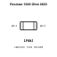
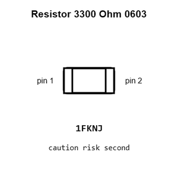
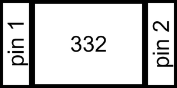
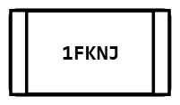
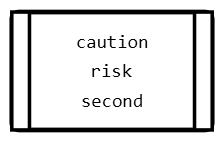
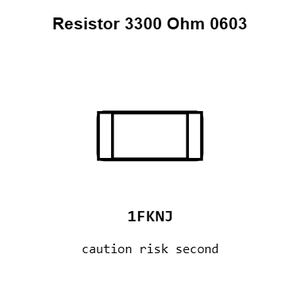
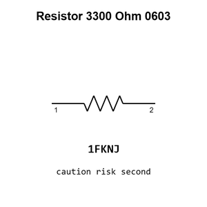

# Resistor 3300 Ohm 0603

`electronic_resistor_0603_3300_ohm`

Resistor 3300 Ohm 0603 is an OOMP electronic resistor definition. It uses the 0603 package or form factor. Its nominal drawing size is 1.6 &#x00D7; 0.8 mm.

## At a glance

| Detail | Value |
| --- | --- |
| OOMP ID | `electronic_resistor_0603_3300_ohm` |
| Type | Resistor |
| Package / style | 0603 |
| Nominal size | 1.6 &#x00D7; 0.8 mm |

## Classification

| Level | Value |
| --- | --- |
| 1 | `electronic` |
| 2 | `resistor` |
| 3 | `0603` |
| 4 | `3300_ohm` |

## Nominal dimensions

| Measurement | Value |
| --- | ---: |
| Length | 1.6 mm |
| Width | 0.8 mm |

## Identifiers

| Identifier | Value |
| --- | --- |
| Manufacturer part number | `0603WAF3301T5E` |
| LCSC | [`C22978`](https://www.lcsc.com/product-detail/C22978.html) |

## Used in projects

| Project | Quantity | References | Explore |
| --- | ---: | --- | --- |
| [Project sparkfun/IOIO-OTG IOIO OTG current](https://github.com/sparkfun/IOIO-OTG/blob/master/Hardware/IOIO-OTG.brd) | 1 | R4 | [Board explorer](https://oomlout.github.io/oomp_electronic_version_5/parts/oomp_project_github_sparkfun_ioio_otg_ioio_otg_current/board_explorer.html) · [OOMP project](https://github.com/oomlout/oomp_electronic_version_5/tree/main/parts/oomp_project_github_sparkfun_ioio_otg_ioio_otg_current) |
| [Project sparkfun/LTC4150_Coulomb_Counter_BOB LTC4150 BOB current](https://github.com/sparkfun/LTC4150_Coulomb_Counter_BOB/blob/master/Hardware/LTC4150_BOB.brd) | 3 | R5, R7, R9 | [Board explorer](https://oomlout.github.io/oomp_electronic_version_5/parts/oomp_project_github_sparkfun_ltc4150_coulomb_counter_bob_ltc4150_bob_current/board_explorer.html) · [OOMP project](https://github.com/oomlout/oomp_electronic_version_5/tree/main/parts/oomp_project_github_sparkfun_ltc4150_coulomb_counter_bob_ltc4150_bob_current) |
| [Project sparkfun/MicroMod_Data_Logging_Carrier Micro Mod Datalogging Carrier Board current](https://github.com/sparkfun/MicroMod_Data_Logging_Carrier/blob/master/Hardware/MicroMod-Datalogging-CarrierBoard.brd) | 1 | R8 | [Board explorer](https://oomlout.github.io/oomp_electronic_version_5/parts/oomp_project_github_sparkfun_micro_mod_data_logging_carrier_micro_mod_datalogging_carrier_board_current/board_explorer.html) · [OOMP project](https://github.com/oomlout/oomp_electronic_version_5/tree/main/parts/oomp_project_github_sparkfun_micro_mod_data_logging_carrier_micro_mod_datalogging_carrier_board_current) |
| [Project sparkfun/MicroMod_Machine_Learning_Carrier Machine Learning MM Carrier current](https://github.com/sparkfun/MicroMod_Machine_Learning_Carrier/blob/master/Hardware/MachineLearning-MM-Carrier.brd) | 1 | R8 | [Board explorer](https://oomlout.github.io/oomp_electronic_version_5/parts/oomp_project_github_sparkfun_micro_mod_machine_learning_carrier_machine_learning_mm_carrier_current/board_explorer.html) · [OOMP project](https://github.com/oomlout/oomp_electronic_version_5/tree/main/parts/oomp_project_github_sparkfun_micro_mod_machine_learning_carrier_machine_learning_mm_carrier_current) |
| [Project sparkfun/SparkFun_GNSS_Combo_Breakout-ZED-F9P_NEO-D9S ZED F9 P NEO D9 S Combo current](https://github.com/sparkfun/SparkFun_GNSS_Combo_Breakout-ZED-F9P_NEO-D9S/blob/main/Hardware/ZED-F9P_NEO-D9S_Combo.brd) | 1 | R32 | [Board explorer](https://oomlout.github.io/oomp_electronic_version_5/parts/oomp_project_github_sparkfun_spark_fun_gnss_combo_breakout_zed_f9_p_neo_d9_s_zed_f9_p_neo_d9_s_combo_current/board_explorer.html) · [OOMP project](https://github.com/oomlout/oomp_electronic_version_5/tree/main/parts/oomp_project_github_sparkfun_spark_fun_gnss_combo_breakout_zed_f9_p_neo_d9_s_zed_f9_p_neo_d9_s_combo_current) |
| [Project sparkfun/SparkFun_GNSS_Dead_Reckoning_ZED-F9K Spark Fun GPS ZED F9 K current](https://github.com/sparkfun/SparkFun_GNSS_Dead_Reckoning_ZED-F9K/blob/main/Hardware/SparkFun_GPS_ZED-F9K.brd) | 3 | R1, R2, R24 | [Board explorer](https://oomlout.github.io/oomp_electronic_version_5/parts/oomp_project_github_sparkfun_spark_fun_gnss_dead_reckoning_zed_f9_k_spark_fun_gps_zed_f9_k_current/board_explorer.html) · [OOMP project](https://github.com/oomlout/oomp_electronic_version_5/tree/main/parts/oomp_project_github_sparkfun_spark_fun_gnss_dead_reckoning_zed_f9_k_spark_fun_gps_zed_f9_k_current) |
| [Project sparkfun/SparkFun_GNSS_Function_Board_NEO-M9N Spark Fun GNSS NEO M9 N current](https://github.com/sparkfun/SparkFun_GNSS_Function_Board_NEO-M9N/blob/main/Hardware/SparkFun_GNSS_NEO-M9N.brd) | 1 | R5 | [Board explorer](https://oomlout.github.io/oomp_electronic_version_5/parts/oomp_project_github_sparkfun_spark_fun_gnss_function_board_neo_m9_n_spark_fun_gnss_neo_m9_n_current/board_explorer.html) · [OOMP project](https://github.com/oomlout/oomp_electronic_version_5/tree/main/parts/oomp_project_github_sparkfun_spark_fun_gnss_function_board_neo_m9_n_spark_fun_gnss_neo_m9_n_current) |
| [Project sparkfun/SparkFun_GPS_Dead_Reckoning_PHat_ZED-F9R Spark Fun ZED F9 R Phat current](https://github.com/sparkfun/SparkFun_GPS_Dead_Reckoning_PHat_ZED-F9R/blob/master/Hardware/SparkFun_ZED-F9R_Phat_v11.brd) | 3 | R16, R19, R20 | [Board explorer](https://oomlout.github.io/oomp_electronic_version_5/parts/oomp_project_github_sparkfun_spark_fun_gps_dead_reckoning_phat_zed_f9_r_spark_fun_zed_f9_r_phat_current/board_explorer.html) · [OOMP project](https://github.com/oomlout/oomp_electronic_version_5/tree/main/parts/oomp_project_github_sparkfun_spark_fun_gps_dead_reckoning_phat_zed_f9_r_spark_fun_zed_f9_r_phat_current) |
| [Project sparkfun/SparkFun_GPS_Dead_Reckoning_ZED-F9R Spark Fun ZED F9 R u FL current](https://github.com/sparkfun/SparkFun_GPS_Dead_Reckoning_ZED-F9R/blob/master/Hardware/UFL/SparkFun_ZED-F9R_v12_uFL.brd) | 3 | R1, R2, R24 | [Board explorer](https://oomlout.github.io/oomp_electronic_version_5/parts/oomp_project_github_sparkfun_spark_fun_gps_dead_reckoning_zed_f9_r_spark_fun_zed_f9_r_u_fl_current/board_explorer.html) · [OOMP project](https://github.com/oomlout/oomp_electronic_version_5/tree/main/parts/oomp_project_github_sparkfun_spark_fun_gps_dead_reckoning_zed_f9_r_spark_fun_zed_f9_r_u_fl_current) |
| [Project sparkfun/SparkFun_LoRaSerial Spark Fun Lo Ra Serial 868 MHz 1 W current](https://github.com/sparkfun/SparkFun_LoRaSerial/blob/main/Hardware/868MHz/SparkFun%20LoRaSerial%20868MHz%20-%201W.brd) | 1 | R2 | [Board explorer](https://oomlout.github.io/oomp_electronic_version_5/parts/oomp_project_github_sparkfun_spark_fun_lo_ra_serial_spark_fun_lo_ra_serial_868_mhz_1_w_current/board_explorer.html) · [OOMP project](https://github.com/oomlout/oomp_electronic_version_5/tree/main/parts/oomp_project_github_sparkfun_spark_fun_lo_ra_serial_spark_fun_lo_ra_serial_868_mhz_1_w_current) |
| [Project sparkfun/SparkFun_u-blox_MAX-M10S Spark Fun u blox GNSS MAX M10 S current](https://github.com/sparkfun/SparkFun_u-blox_MAX-M10S/blob/main/Hardware/SparkFun%20u-blox%20GNSS%20MAX-M10S.brd) | 1 | R5 | [Board explorer](https://oomlout.github.io/oomp_electronic_version_5/parts/oomp_project_github_sparkfun_spark_fun_u_blox_max_m10_s_spark_fun_u_blox_gnss_max_m10_s_current/board_explorer.html) · [OOMP project](https://github.com/oomlout/oomp_electronic_version_5/tree/main/parts/oomp_project_github_sparkfun_spark_fun_u_blox_max_m10_s_spark_fun_u_blox_gnss_max_m10_s_current) |
| [Project sparkfun/SparkFun_u-blox_SAM-M10Q Spark Fun u blox SAM M10 Q current](https://github.com/sparkfun/SparkFun_u-blox_SAM-M10Q/blob/main/Hardware/SparkFun_u-blox_SAM-M10Q.brd) | 1 | R2 | [Board explorer](https://oomlout.github.io/oomp_electronic_version_5/parts/oomp_project_github_sparkfun_spark_fun_u_blox_sam_m10_q_spark_fun_u_blox_sam_m10_q_current/board_explorer.html) · [OOMP project](https://github.com/oomlout/oomp_electronic_version_5/tree/main/parts/oomp_project_github_sparkfun_spark_fun_u_blox_sam_m10_q_spark_fun_u_blox_sam_m10_q_current) |

## Files

[KiCad symbol, machine-solder and hand-solder footprints](data/kicad/README.md) · [Availability and source masters](data/kicad/manifest.yaml)

[View this part on GitHub](https://github.com/oomlout/oomp_electronic_version_5/tree/main/parts/electronic_resistor_0603_3300_ohm)

[Browse this category](../../navigation/electronic/resistor/0603/README.md)

---

This page is generated from the OOMP part definition by a Roboclick Jinja template. Edit the source taxonomy or template rather than this generated file.