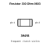
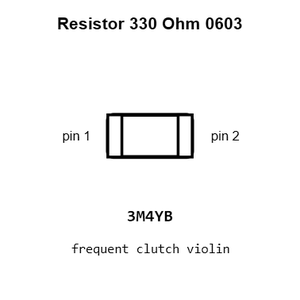
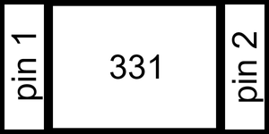
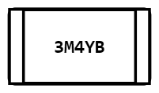
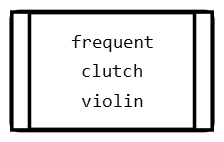
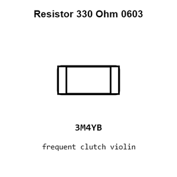
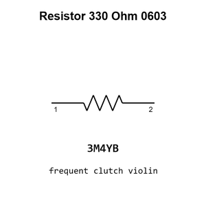

# Resistor 330 Ohm 0603

`electronic_resistor_0603_330_ohm`

Resistor 330 Ohm 0603 is an OOMP electronic resistor definition. It uses the 0603 package or form factor. Its nominal drawing size is 1.6 &#x00D7; 0.8 mm.

## At a glance

| Detail | Value |
| --- | --- |
| OOMP ID | `electronic_resistor_0603_330_ohm` |
| Type | Resistor |
| Package / style | 0603 |
| Nominal size | 1.6 &#x00D7; 0.8 mm |

## Classification

| Level | Value |
| --- | --- |
| 1 | `electronic` |
| 2 | `resistor` |
| 3 | `0603` |
| 4 | `330_ohm` |

## Nominal dimensions

| Measurement | Value |
| --- | ---: |
| Length | 1.6 mm |
| Width | 0.8 mm |

## Identifiers

| Identifier | Value |
| --- | --- |
| Manufacturer part number | `FRC0603F3300TS` |
| LCSC | [`C2933198`](https://www.lcsc.com/product-detail/C2933198.html) |

## Used in projects

| Project | Quantity | References | Explore |
| --- | ---: | --- | --- |
| [Project adafruit/Adafruit-Grand-Central-PCB Adafruit Grand Central M4 Express current](https://github.com/adafruit/Adafruit-Grand-Central-PCB/blob/master/Adafruit%20Grand%20Central%20M4%20Express%20rev%20B.brd) | 1 | R11 | [Board explorer](https://oomlout.github.io/oomp_electronic_version_5/parts/oomp_project_github_adafruit_adafruit_grand_central_pcb_adafruit_grand_central_m4_express_current/board_explorer.html) · [OOMP project](https://github.com/oomlout/oomp_electronic_version_5/tree/main/parts/oomp_project_github_adafruit_adafruit_grand_central_pcb_adafruit_grand_central_m4_express_current) |
| [Project hanqaqa/easyduino ATmega328P Arduino Uno current](https://github.com/Hanqaqa/Easyduino/tree/master/Atmega328p%20Arduino%20Uno) | 1 | R5 | [Board explorer](https://oomlout.github.io/oomp_electronic_version_5/parts/oomp_project_github_hanqaqa_easyduino_atmega328p_arduino_uno_current/board_explorer.html) · [OOMP project](https://github.com/oomlout/oomp_electronic_version_5/tree/main/parts/oomp_project_github_hanqaqa_easyduino_atmega328p_arduino_uno_current) |
| [Project soldered_electronics/Capacitive-soil-sensor-hardware-design Capacitive Soil Sensor current](https://github.com/SolderedElectronics/Capacitive-soil-sensor-hardware-design) | 1 | R3 | [Board explorer](https://oomlout.github.io/oomp_electronic_version_5/parts/oomp_project_github_soldered_electronics_capacitive_soil_sensor_hardware_design_sensor_capacitive_soil_current/board_explorer.html) · [OOMP project](https://github.com/oomlout/oomp_electronic_version_5/tree/main/parts/oomp_project_github_soldered_electronics_capacitive_soil_sensor_hardware_design_sensor_capacitive_soil_current) |
| [Project sparkfun/ADXL345_Eval ADXL345 Eval Board v11 current](https://github.com/sparkfun/ADXL345_Eval/blob/master/hardware/ADXL345_Eval_Board-v11.brd) | 3 | R6, R7, R8 | [Board explorer](https://oomlout.github.io/oomp_electronic_version_5/parts/oomp_project_github_sparkfun_adxl345_eval_adxl345_eval_board_v11_current/board_explorer.html) · [OOMP project](https://github.com/oomlout/oomp_electronic_version_5/tree/main/parts/oomp_project_github_sparkfun_adxl345_eval_adxl345_eval_board_v11_current) |
| [Project sparkfun/Arduino_Pro_Mini_328 Arduino Pro Mini current](https://github.com/sparkfun/Arduino_Pro_Mini_328/blob/master/Hardware/Arduino-Pro-Mini.brd) | 1 | R6 | [Board explorer](https://oomlout.github.io/oomp_electronic_version_5/parts/oomp_project_github_sparkfun_arduino_pro_mini_328_arduino_pro_mini_current/board_explorer.html) · [OOMP project](https://github.com/oomlout/oomp_electronic_version_5/tree/main/parts/oomp_project_github_sparkfun_arduino_pro_mini_328_arduino_pro_mini_current) |
| [Project sparkfun/Blynk_Board_ESP8266 Spark Fun Blynk Board ESP8266 current](https://github.com/sparkfun/Blynk_Board_ESP8266/blob/master/Hardware/SparkFun-Blynk-Board-ESP8266.brd) | 1 | R11 | [Board explorer](https://oomlout.github.io/oomp_electronic_version_5/parts/oomp_project_github_sparkfun_blynk_board_esp8266_spark_fun_blynk_board_esp8266_current/board_explorer.html) · [OOMP project](https://github.com/oomlout/oomp_electronic_version_5/tree/main/parts/oomp_project_github_sparkfun_blynk_board_esp8266_spark_fun_blynk_board_esp8266_current) |
| [Project sparkfun/Digital_Sandbox Digital Sandbox current](https://github.com/sparkfun/Digital_Sandbox/blob/master/Hardware/DigitalSandbox.brd) | 2 | R1, R5 | [Board explorer](https://oomlout.github.io/oomp_electronic_version_5/parts/oomp_project_github_sparkfun_digital_sandbox_digital_sandbox_current/board_explorer.html) · [OOMP project](https://github.com/oomlout/oomp_electronic_version_5/tree/main/parts/oomp_project_github_sparkfun_digital_sandbox_digital_sandbox_current) |
| [Project sparkfun/Easy_Driver Easy Driver current](https://github.com/sparkfun/Easy_Driver/blob/master/Hardware/EasyDriver_v45.brd) | 1 | R7 | [Board explorer](https://oomlout.github.io/oomp_electronic_version_5/parts/oomp_project_github_sparkfun_easy_driver_easy_driver_current/board_explorer.html) · [OOMP project](https://github.com/oomlout/oomp_electronic_version_5/tree/main/parts/oomp_project_github_sparkfun_easy_driver_easy_driver_current) |
| [Project sparkfun/EL_Sequencer EL Sequencer current](https://github.com/sparkfun/EL_Sequencer/blob/master/Hardware/EL_Sequencer.brd) | 16 | R14, R15, R16, R17, R18, R19, R20, R21, R26, R27, R28, R29, R30, R31, R32, R33 | [Board explorer](https://oomlout.github.io/oomp_electronic_version_5/parts/oomp_project_github_sparkfun_el_sequencer_el_sequencer_current/board_explorer.html) · [OOMP project](https://github.com/oomlout/oomp_electronic_version_5/tree/main/parts/oomp_project_github_sparkfun_el_sequencer_el_sequencer_current) |
| [Project sparkfun/Electric_Imp_Shield electric imp shield current](https://github.com/sparkfun/Electric_Imp_Shield/blob/master/Hardware/electric-imp-shield.brd) | 3 | R7, R8, R9 | [Board explorer](https://oomlout.github.io/oomp_electronic_version_5/parts/oomp_project_github_sparkfun_electric_imp_shield_electric_imp_shield_current/board_explorer.html) · [OOMP project](https://github.com/oomlout/oomp_electronic_version_5/tree/main/parts/oomp_project_github_sparkfun_electric_imp_shield_electric_imp_shield_current) |
| [Project sparkfun/ESP32_Thing esp32 thing current](https://github.com/sparkfun/ESP32_Thing/blob/master/Hardware/esp32-thing.brd) | 1 | R8 | [Board explorer](https://oomlout.github.io/oomp_electronic_version_5/parts/oomp_project_github_sparkfun_esp32_thing_esp32_thing_current/board_explorer.html) · [OOMP project](https://github.com/oomlout/oomp_electronic_version_5/tree/main/parts/oomp_project_github_sparkfun_esp32_thing_esp32_thing_current) |
| [Project sparkfun/FT232RL_USB_Breakout FT232 R Breakout current](https://github.com/sparkfun/FT232RL_USB_Breakout/blob/master/Hardware/FT232R-Breakout.brd) | 2 | R1, R2 | [Board explorer](https://oomlout.github.io/oomp_electronic_version_5/parts/oomp_project_github_sparkfun_ft232_rl_usb_breakout_ft232_r_breakout_current/board_explorer.html) · [OOMP project](https://github.com/oomlout/oomp_electronic_version_5/tree/main/parts/oomp_project_github_sparkfun_ft232_rl_usb_breakout_ft232_r_breakout_current) |
| [Project sparkfun/Geiger_Counter Geiger Counter current](https://github.com/sparkfun/Geiger_Counter/blob/master/Hardware/Geiger_Counter.brd) | 2 | R12, R13 | [Board explorer](https://oomlout.github.io/oomp_electronic_version_5/parts/oomp_project_github_sparkfun_geiger_counter_geiger_counter_current/board_explorer.html) · [OOMP project](https://github.com/oomlout/oomp_electronic_version_5/tree/main/parts/oomp_project_github_sparkfun_geiger_counter_geiger_counter_current) |
| [Project sparkfun/LilyPad_Arduino_USB Lilypad Arduino USB current](https://github.com/sparkfun/LilyPad_Arduino_USB/blob/master/Hardware/Lilypad_Arduino_USB.brd) | 4 | R1, R6, R7, R8 | [Board explorer](https://oomlout.github.io/oomp_electronic_version_5/parts/oomp_project_github_sparkfun_lily_pad_arduino_usb_lilypad_arduino_usb_current/board_explorer.html) · [OOMP project](https://github.com/oomlout/oomp_electronic_version_5/tree/main/parts/oomp_project_github_sparkfun_lily_pad_arduino_usb_lilypad_arduino_usb_current) |
| [Project sparkfun/LilyPad_LilyMini_ProtoSnap Lily Mini Protosnap current](https://github.com/sparkfun/LilyPad_LilyMini_ProtoSnap/blob/master/Hardware/LilyMini_Protosnap.brd) | 2 | R2, R5 | [Board explorer](https://oomlout.github.io/oomp_electronic_version_5/parts/oomp_project_github_sparkfun_lily_pad_lily_mini_proto_snap_lily_mini_protosnap_current/board_explorer.html) · [OOMP project](https://github.com/oomlout/oomp_electronic_version_5/tree/main/parts/oomp_project_github_sparkfun_lily_pad_lily_mini_proto_snap_lily_mini_protosnap_current) |
| [Project sparkfun/Logomatic Logomatic current](https://github.com/sparkfun/Logomatic/blob/master/Hardware/Logomatic.brd) | 4 | R3, R4, R5, R15 | [Board explorer](https://oomlout.github.io/oomp_electronic_version_5/parts/oomp_project_github_sparkfun_logomatic_logomatic_current/board_explorer.html) · [OOMP project](https://github.com/oomlout/oomp_electronic_version_5/tree/main/parts/oomp_project_github_sparkfun_logomatic_logomatic_current) |
| [Project sparkfun/MaKeyMaKey makey makey current](https://github.com/sparkfun/MaKeyMaKey/blob/master/Hardware/makey_makey.brd) | 5 | R17, R18, R20, R21, R22 | [Board explorer](https://oomlout.github.io/oomp_electronic_version_5/parts/oomp_project_github_sparkfun_ma_key_ma_key_makey_makey_current/board_explorer.html) · [OOMP project](https://github.com/oomlout/oomp_electronic_version_5/tree/main/parts/oomp_project_github_sparkfun_ma_key_ma_key_makey_makey_current) |
| [Project sparkfun/MIDI_Shield Spark Fun MIDI Shield current](https://github.com/sparkfun/MIDI_Shield/blob/master/Hardware/SparkFun_MIDI_Shield.brd) | 2 | R5, R6 | [Board explorer](https://oomlout.github.io/oomp_electronic_version_5/parts/oomp_project_github_sparkfun_midi_shield_spark_fun_midi_shield_current/board_explorer.html) · [OOMP project](https://github.com/oomlout/oomp_electronic_version_5/tree/main/parts/oomp_project_github_sparkfun_midi_shield_spark_fun_midi_shield_current) |
| [Project sparkfun/MiniGen Spark Fun Mini Gen current](https://github.com/sparkfun/MiniGen/blob/master/Hardware/SparkFun_MiniGen.brd) | 1 | R1 | [Board explorer](https://oomlout.github.io/oomp_electronic_version_5/parts/oomp_project_github_sparkfun_mini_gen_spark_fun_mini_gen_current/board_explorer.html) · [OOMP project](https://github.com/oomlout/oomp_electronic_version_5/tree/main/parts/oomp_project_github_sparkfun_mini_gen_spark_fun_mini_gen_current) |
| [Project sparkfun/Mono_Audio_Amp_Breakout-TPA2005D1 Spark Fun Mono Audio Amp TPA2005 D1 current](https://github.com/sparkfun/Mono_Audio_Amp_Breakout-TPA2005D1/blob/master/Hardware/SparkFun_Mono_Audio_Amp-TPA2005D1.brd) | 1 | R4 | [Board explorer](https://oomlout.github.io/oomp_electronic_version_5/parts/oomp_project_github_sparkfun_mono_audio_amp_breakout_tpa2005_d1_spark_fun_mono_audio_amp_tpa2005_d1_current/board_explorer.html) · [OOMP project](https://github.com/oomlout/oomp_electronic_version_5/tree/main/parts/oomp_project_github_sparkfun_mono_audio_amp_breakout_tpa2005_d1_spark_fun_mono_audio_amp_tpa2005_d1_current) |
| [Project sparkfun/MP3_Player_Shield Spark Fun MP3 Shield current](https://github.com/sparkfun/MP3_Player_Shield/blob/master/hardware/SparkFunMP3Shield.brd) | 1 | R8 | [Board explorer](https://oomlout.github.io/oomp_electronic_version_5/parts/oomp_project_github_sparkfun_mp3_player_shield_spark_fun_mp3_shield_current/board_explorer.html) · [OOMP project](https://github.com/oomlout/oomp_electronic_version_5/tree/main/parts/oomp_project_github_sparkfun_mp3_player_shield_spark_fun_mp3_shield_current) |
| [Project sparkfun/OpenLog OpenLog current](https://github.com/sparkfun/OpenLog/blob/master/hardware/OpenLog.brd) | 1 | R6 | [Board explorer](https://oomlout.github.io/oomp_electronic_version_5/parts/oomp_project_github_sparkfun_open_log_openlog_current/board_explorer.html) · [OOMP project](https://github.com/oomlout/oomp_electronic_version_5/tree/main/parts/oomp_project_github_sparkfun_open_log_openlog_current) |
| [Project sparkfun/Photon_Battery_Shield Photon Battery Shield current](https://github.com/sparkfun/Photon_Battery_Shield/blob/master/Hardware/Photon%20Battery%20Shield.brd) | 1 | R2 | [Board explorer](https://oomlout.github.io/oomp_electronic_version_5/parts/oomp_project_github_sparkfun_photon_battery_shield_photon_battery_shield_current/board_explorer.html) · [OOMP project](https://github.com/oomlout/oomp_electronic_version_5/tree/main/parts/oomp_project_github_sparkfun_photon_battery_shield_photon_battery_shield_current) |
| [Project sparkfun/Pi_Servo_Hat Pi Servo p HAT current](https://github.com/sparkfun/Pi_Servo_Hat/blob/master/Hardware/Pi_Servo_pHAT.brd) | 1 | R12 | [Board explorer](https://oomlout.github.io/oomp_electronic_version_5/parts/oomp_project_github_sparkfun_pi_servo_hat_pi_servo_p_hat_current/board_explorer.html) · [OOMP project](https://github.com/oomlout/oomp_electronic_version_5/tree/main/parts/oomp_project_github_sparkfun_pi_servo_hat_pi_servo_p_hat_current) |
| [Project sparkfun/Pro_Micro Spark Fun Pro Micro current](https://github.com/sparkfun/Pro_Micro/blob/main/Hardware/v13/SparkFun_Pro_Micro.brd) | 2 | R4, R6 | [Board explorer](https://oomlout.github.io/oomp_electronic_version_5/parts/oomp_project_github_sparkfun_pro_micro_spark_fun_pro_micro_current/board_explorer.html) · [OOMP project](https://github.com/oomlout/oomp_electronic_version_5/tree/main/parts/oomp_project_github_sparkfun_pro_micro_spark_fun_pro_micro_current) |
| [Project sparkfun/SAMD21_Dev_Breakout sparkfun samd21 pro breakout current](https://github.com/sparkfun/SAMD21_Dev_Breakout/blob/master/Hardware/sparkfun-samd21-pro-breakout.brd) | 6 | R2, R6, R7, R8, R9, R10 | [Board explorer](https://oomlout.github.io/oomp_electronic_version_5/parts/oomp_project_github_sparkfun_samd21_dev_breakout_sparkfun_samd21_pro_breakout_current/board_explorer.html) · [OOMP project](https://github.com/oomlout/oomp_electronic_version_5/tree/main/parts/oomp_project_github_sparkfun_samd21_dev_breakout_sparkfun_samd21_pro_breakout_current) |
| [Project sparkfun/SAMD21_Mini_Breakout sparkfun samd21 mini breakout current](https://github.com/sparkfun/SAMD21_Mini_Breakout/blob/master/Hardware/sparkfun-samd21-mini-breakout.brd) | 5 | R2, R3, R5, R6, R8 | [Board explorer](https://oomlout.github.io/oomp_electronic_version_5/parts/oomp_project_github_sparkfun_samd21_mini_breakout_sparkfun_samd21_mini_breakout_current/board_explorer.html) · [OOMP project](https://github.com/oomlout/oomp_electronic_version_5/tree/main/parts/oomp_project_github_sparkfun_samd21_mini_breakout_sparkfun_samd21_mini_breakout_current) |
| [Project sparkfun/SAMD51_Thing_Plus SAMD51 Thing Plus current](https://github.com/sparkfun/SAMD51_Thing_Plus/blob/master/Hardware/SAMD51_Thing_Plus.brd) | 1 | R8 | [Board explorer](https://oomlout.github.io/oomp_electronic_version_5/parts/oomp_project_github_sparkfun_samd51_thing_plus_samd51_thing_plus_current/board_explorer.html) · [OOMP project](https://github.com/oomlout/oomp_electronic_version_5/tree/main/parts/oomp_project_github_sparkfun_samd51_thing_plus_samd51_thing_plus_current) |
| [Project sparkfun/Si4703_FM_Tuner_Evaluation_Board Spark Fun Si4703 Eval current](https://github.com/sparkfun/Si4703_FM_Tuner_Evaluation_Board/blob/master/Hardware/SparkFun_Si4703_Eval.brd) | 4 | R9, R10, R11, R12 | [Board explorer](https://oomlout.github.io/oomp_electronic_version_5/parts/oomp_project_github_sparkfun_si4703_fm_tuner_evaluation_board_spark_fun_si4703_eval_current/board_explorer.html) · [OOMP project](https://github.com/oomlout/oomp_electronic_version_5/tree/main/parts/oomp_project_github_sparkfun_si4703_fm_tuner_evaluation_board_spark_fun_si4703_eval_current) |
| [Project sparkfun/SparkFun_Digi_XBee_Arduino_Shield-USB-C Spark Fun Digi XBee Arduino Shield Qwiic current](https://github.com/sparkfun/SparkFun_Digi_XBee_Arduino_Shield-USB-C/blob/main/Hardware/SparkFun_Digi_XBee_Arduino_Shield_Qwiic.brd) | 1 | R10 | [Board explorer](https://oomlout.github.io/oomp_electronic_version_5/parts/oomp_project_github_sparkfun_spark_fun_digi_xbee_arduino_shield_usb_c_spark_fun_digi_xbee_arduino_shield_qwiic_current/board_explorer.html) · [OOMP project](https://github.com/oomlout/oomp_electronic_version_5/tree/main/parts/oomp_project_github_sparkfun_spark_fun_digi_xbee_arduino_shield_usb_c_spark_fun_digi_xbee_arduino_shield_qwiic_current) |
| [Project sparkfun/SparkFun_Digi_XBee_Development_Board Spark Fun Digi XBee Development Board current](https://github.com/sparkfun/SparkFun_Digi_XBee_Development_Board/blob/main/Hardware/SparkFun_Digi_XBee_Development_Board.brd) | 1 | R9 | [Board explorer](https://oomlout.github.io/oomp_electronic_version_5/parts/oomp_project_github_sparkfun_spark_fun_digi_xbee_development_board_spark_fun_digi_xbee_development_board_current/board_explorer.html) · [OOMP project](https://github.com/oomlout/oomp_electronic_version_5/tree/main/parts/oomp_project_github_sparkfun_spark_fun_digi_xbee_development_board_spark_fun_digi_xbee_development_board_current) |
| [Project sparkfun/SparkFun_ESP32_Thing_Plus_DMX_to_LED_Shield Spark Fun ESP32 Thing Plus DMX to LED Shield current](https://github.com/sparkfun/SparkFun_ESP32_Thing_Plus_DMX_to_LED_Shield/blob/master/Hardware/SparkFun%20ESP32%20Thing%20Plus%20DMX%20to%20LED%20Shield.brd) | 2 | R7, R8 | [Board explorer](https://oomlout.github.io/oomp_electronic_version_5/parts/oomp_project_github_sparkfun_spark_fun_esp32_thing_plus_dmx_to_led_shield_spark_fun_esp32_thing_plus_dmx_to_led_shield_current/board_explorer.html) · [OOMP project](https://github.com/oomlout/oomp_electronic_version_5/tree/main/parts/oomp_project_github_sparkfun_spark_fun_esp32_thing_plus_dmx_to_led_shield_spark_fun_esp32_thing_plus_dmx_to_led_shield_current) |
| [Project sparkfun/SparkFun_GNSS_DAN-F10N GNSS DAN-F10N current](https://github.com/sparkfun/SparkFun_GNSS_DAN-F10N) | 1 | R5 | [Board explorer](https://oomlout.github.io/oomp_electronic_version_5/parts/oomp_project_github_sparkfun_spark_fun_gnss_dan_f10_n_gnss_dan_f10n_current/board_explorer.html) · [OOMP project](https://github.com/oomlout/oomp_electronic_version_5/tree/main/parts/oomp_project_github_sparkfun_spark_fun_gnss_dan_f10_n_gnss_dan_f10n_current) |
| [Project sparkfun/SparkFun_IoT_Brushless_Motor_Driver ESP32 BLDC Motor Driver current](https://github.com/sparkfun/SparkFun_IoT_Brushless_Motor_Driver/blob/main/Hardware/ESP32_BLDC_Motor_Driver.brd) | 1 | R15 | [Board explorer](https://oomlout.github.io/oomp_electronic_version_5/parts/oomp_project_github_sparkfun_spark_fun_io_t_brushless_motor_driver_esp32_bldc_motor_driver_current/board_explorer.html) · [OOMP project](https://github.com/oomlout/oomp_electronic_version_5/tree/main/parts/oomp_project_github_sparkfun_spark_fun_io_t_brushless_motor_driver_esp32_bldc_motor_driver_current) |
| [Project sparkfun/SparkFun_LoRaSerial Spark Fun Lo Ra Serial 433 MHz 1 W current](https://github.com/sparkfun/SparkFun_LoRaSerial/blob/main/Hardware/433MHz/SparkFun%20LoRaSerial%20433MHz%20-%201W.brd) | 1 | R12 | [Board explorer](https://oomlout.github.io/oomp_electronic_version_5/parts/oomp_project_github_sparkfun_spark_fun_lo_ra_serial_spark_fun_lo_ra_serial_433_mhz_1_w_current/board_explorer.html) · [OOMP project](https://github.com/oomlout/oomp_electronic_version_5/tree/main/parts/oomp_project_github_sparkfun_spark_fun_lo_ra_serial_spark_fun_lo_ra_serial_433_mhz_1_w_current) |
| [Project sparkfun/SparkFun_LoRaSerial Spark Fun Lo Ra Serial 868 MHz 1 W current](https://github.com/sparkfun/SparkFun_LoRaSerial/blob/main/Hardware/868MHz/SparkFun%20LoRaSerial%20868MHz%20-%201W.brd) | 1 | R12 | [Board explorer](https://oomlout.github.io/oomp_electronic_version_5/parts/oomp_project_github_sparkfun_spark_fun_lo_ra_serial_spark_fun_lo_ra_serial_868_mhz_1_w_current/board_explorer.html) · [OOMP project](https://github.com/oomlout/oomp_electronic_version_5/tree/main/parts/oomp_project_github_sparkfun_spark_fun_lo_ra_serial_spark_fun_lo_ra_serial_868_mhz_1_w_current) |
| [Project sparkfun/SparkFun_LoRaSerial Spark Fun Lo Ra Serial 915 MHz 1 W current](https://github.com/sparkfun/SparkFun_LoRaSerial/blob/main/Hardware/915MHz/SparkFun%20LoRaSerial%20915MHz%20-%201W.brd) | 1 | R12 | [Board explorer](https://oomlout.github.io/oomp_electronic_version_5/parts/oomp_project_github_sparkfun_spark_fun_lo_ra_serial_spark_fun_lo_ra_serial_915_mhz_1_w_current/board_explorer.html) · [OOMP project](https://github.com/oomlout/oomp_electronic_version_5/tree/main/parts/oomp_project_github_sparkfun_spark_fun_lo_ra_serial_spark_fun_lo_ra_serial_915_mhz_1_w_current) |
| [Project sparkfun/SparkFun_RTK_Surveyor Spark Fun GPS RTK Surveyor current](https://github.com/sparkfun/SparkFun_RTK_Surveyor/blob/main/Hardware/SparkFun%20GPS%20RTK%20Surveyor.brd) | 3 | R10, R12, R34 | [Board explorer](https://oomlout.github.io/oomp_electronic_version_5/parts/oomp_project_github_sparkfun_spark_fun_rtk_surveyor_spark_fun_gps_rtk_surveyor_current/board_explorer.html) · [OOMP project](https://github.com/oomlout/oomp_electronic_version_5/tree/main/parts/oomp_project_github_sparkfun_spark_fun_rtk_surveyor_spark_fun_gps_rtk_surveyor_current) |
| [Project sparkfun/SparkFun_Three_Phase_Motor_Driver-TMC6300 Spark Fun TMC6300 Breakout current](https://github.com/sparkfun/SparkFun_Three_Phase_Motor_Driver-TMC6300/blob/main/Hardware/SparkFun_TMC6300_Breakout.brd) | 1 | R14 | [Board explorer](https://oomlout.github.io/oomp_electronic_version_5/parts/oomp_project_github_sparkfun_spark_fun_three_phase_motor_driver_tmc6300_spark_fun_tmc6300_breakout_current/board_explorer.html) · [OOMP project](https://github.com/oomlout/oomp_electronic_version_5/tree/main/parts/oomp_project_github_sparkfun_spark_fun_three_phase_motor_driver_tmc6300_spark_fun_tmc6300_breakout_current) |
| [Project sparkfun/tsunami Tapestry current](https://github.com/sparkfun/tsunami/blob/master/Hardware/deprecated/Tapestry.brd) | 1 | R7 | [Board explorer](https://oomlout.github.io/oomp_electronic_version_5/parts/oomp_project_github_sparkfun_tsunami_tapestry_current/board_explorer.html) · [OOMP project](https://github.com/oomlout/oomp_electronic_version_5/tree/main/parts/oomp_project_github_sparkfun_tsunami_tapestry_current) |
| [Project sparkfun/tsunami tsunami current](https://github.com/sparkfun/tsunami/blob/master/Hardware/tsunami.brd) | 1 | R13 | [Board explorer](https://oomlout.github.io/oomp_electronic_version_5/parts/oomp_project_github_sparkfun_tsunami_tsunami_current/board_explorer.html) · [OOMP project](https://github.com/oomlout/oomp_electronic_version_5/tree/main/parts/oomp_project_github_sparkfun_tsunami_tsunami_current) |
| [Project sparkfun/VoiceBox_Shield Spark Fun Voice Box Shield current](https://github.com/sparkfun/VoiceBox_Shield/blob/master/Hardware/SparkFun_VoiceBox_Shield.brd) | 1 | R13 | [Board explorer](https://oomlout.github.io/oomp_electronic_version_5/parts/oomp_project_github_sparkfun_voice_box_shield_spark_fun_voice_box_shield_current/board_explorer.html) · [OOMP project](https://github.com/oomlout/oomp_electronic_version_5/tree/main/parts/oomp_project_github_sparkfun_voice_box_shield_spark_fun_voice_box_shield_current) |
| [Project sparkfun/WAV_Trigger wavtrigger current](https://github.com/sparkfun/WAV_Trigger/blob/master/hardware/wavtrigger.brd) | 1 | R19 | [Board explorer](https://oomlout.github.io/oomp_electronic_version_5/parts/oomp_project_github_sparkfun_wav_trigger_wavtrigger_current/board_explorer.html) · [OOMP project](https://github.com/oomlout/oomp_electronic_version_5/tree/main/parts/oomp_project_github_sparkfun_wav_trigger_wavtrigger_current) |

## Files

[KiCad symbol, machine-solder and hand-solder footprints](data/kicad/README.md) · [Availability and source masters](data/kicad/manifest.yaml)

[View this part on GitHub](https://github.com/oomlout/oomp_electronic_version_5/tree/main/parts/electronic_resistor_0603_330_ohm)

[Browse this category](../../navigation/electronic/resistor/0603/README.md)

---

This page is generated from the OOMP part definition by a Roboclick Jinja template. Edit the source taxonomy or template rather than this generated file.