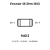
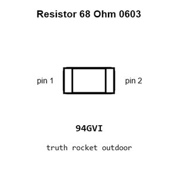
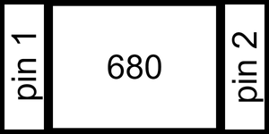
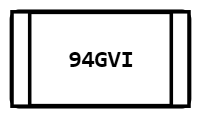
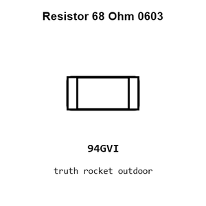
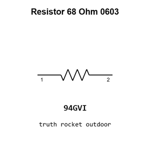

# Resistor 68 Ohm 0603

`electronic_resistor_0603_68_ohm`

Resistor 68 Ohm 0603 is an OOMP electronic resistor definition. It uses the 0603 package or form factor. Its nominal drawing size is 1.6 &#x00D7; 0.8 mm.

## At a glance

| Detail | Value |
| --- | --- |
| OOMP ID | `electronic_resistor_0603_68_ohm` |
| Type | Resistor |
| Package / style | 0603 |
| Nominal size | 1.6 &#x00D7; 0.8 mm |

## Classification

| Level | Value |
| --- | --- |
| 1 | `electronic` |
| 2 | `resistor` |
| 3 | `0603` |
| 4 | `68_ohm` |

## Nominal dimensions

| Measurement | Value |
| --- | ---: |
| Length | 1.6 mm |
| Width | 0.8 mm |

## Identifiers

| Identifier | Value |
| --- | --- |
| Manufacturer part number | `0603WAF680JT5E` |
| LCSC | [`C27592`](https://www.lcsc.com/product-detail/C27592.html) |

## Used in projects

| Project | Quantity | References | Explore |
| --- | ---: | --- | --- |
| [Project adafruit/Adafruit-2.8-TFT-Shield-v2-PCB Adafruit TFT 2.8in Resistive Touchshield current](https://github.com/adafruit/Adafruit-2.8-TFT-Shield-v2-PCB/blob/master/Adafruit%20TFT%202.8in%20Resistive%20Touchshield%20rev%20E.brd) | 4 | R1, R2, R3, R4 | [Board explorer](https://oomlout.github.io/oomp_electronic_version_5/parts/oomp_project_github_adafruit_adafruit_2_8_tft_shield_v2_pcb_adafruit_tft_2_8in_resistive_touchshield_current/board_explorer.html) · [OOMP project](https://github.com/oomlout/oomp_electronic_version_5/tree/main/parts/oomp_project_github_adafruit_adafruit_2_8_tft_shield_v2_pcb_adafruit_tft_2_8in_resistive_touchshield_current) |
| [Project adafruit/Adafruit-Gemma-PCB Adafruit Gemma current](https://github.com/adafruit/Adafruit-Gemma-PCB/blob/master/Adafruit%20Gemma.brd) | 2 | R1, R2 | [Board explorer](https://oomlout.github.io/oomp_electronic_version_5/parts/oomp_project_github_adafruit_adafruit_gemma_pcb_adafruit_gemma_current/board_explorer.html) · [OOMP project](https://github.com/oomlout/oomp_electronic_version_5/tree/main/parts/oomp_project_github_adafruit_adafruit_gemma_pcb_adafruit_gemma_current) |
| [Project adafruit/Adafruit-I2S-MEMS-Microphone-Breakout-PCB Adafruit I2 S MEMS Microphone Breakout ICS 43434 current](https://github.com/adafruit/Adafruit-I2S-MEMS-Microphone-Breakout-PCB/blob/main/Adafruit%20I2S%20MEMS%20Microphone%20Breakout%20-%20ICS-43434.brd) | 1 | R1 | [Board explorer](https://oomlout.github.io/oomp_electronic_version_5/parts/oomp_project_github_adafruit_adafruit_i2_s_mems_microphone_breakout_pcb_adafruit_i2_s_mems_microphone_breakout_ics_43434_current/board_explorer.html) · [OOMP project](https://github.com/oomlout/oomp_electronic_version_5/tree/main/parts/oomp_project_github_adafruit_adafruit_i2_s_mems_microphone_breakout_pcb_adafruit_i2_s_mems_microphone_breakout_ics_43434_current) |
| [Project adafruit/Adafruit-I2S-Microphone-Breakout-PCB Adafruit I2 S Mic SPK0415 HM4 H current](https://github.com/adafruit/Adafruit-I2S-Microphone-Breakout-PCB/blob/master/Adafruit%20I2S%20Mic%20SPK0415HM4H.brd) | 1 | R1 | [Board explorer](https://oomlout.github.io/oomp_electronic_version_5/parts/oomp_project_github_adafruit_adafruit_i2_s_microphone_breakout_pcb_adafruit_i2_s_mic_spk0415_hm4_h_current/board_explorer.html) · [OOMP project](https://github.com/oomlout/oomp_electronic_version_5/tree/main/parts/oomp_project_github_adafruit_adafruit_i2_s_microphone_breakout_pcb_adafruit_i2_s_mic_spk0415_hm4_h_current) |

## Files

[KiCad symbol, machine-solder and hand-solder footprints](data/kicad/README.md) · [Availability and source masters](data/kicad/manifest.yaml)

[View this part on GitHub](https://github.com/oomlout/oomp_electronic_version_5/tree/main/parts/electronic_resistor_0603_68_ohm)

[Browse this category](../../navigation/electronic/resistor/0603/README.md)

---

This page is generated from the OOMP part definition by a Roboclick Jinja template. Edit the source taxonomy or template rather than this generated file.