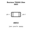
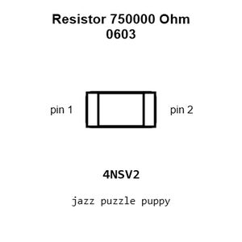
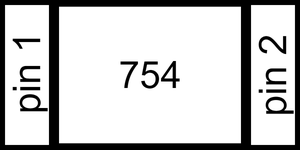
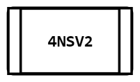
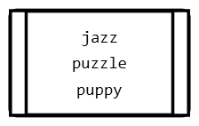
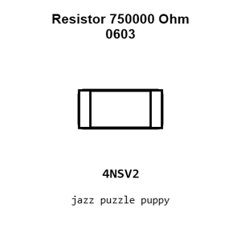
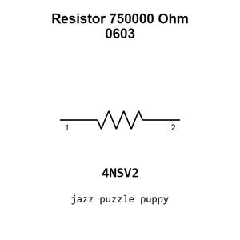

# Resistor 750000 Ohm 0603

`electronic_resistor_0603_750000_ohm`

Resistor 750000 Ohm 0603 is an OOMP electronic resistor definition. It uses the 0603 package or form factor. Its nominal drawing size is 1.6 &#x00D7; 0.8 mm.

## At a glance

| Detail | Value |
| --- | --- |
| OOMP ID | `electronic_resistor_0603_750000_ohm` |
| Type | Resistor |
| Package / style | 0603 |
| Nominal size | 1.6 &#x00D7; 0.8 mm |

## Classification

| Level | Value |
| --- | --- |
| 1 | `electronic` |
| 2 | `resistor` |
| 3 | `0603` |
| 4 | `750000_ohm` |

## Nominal dimensions

| Measurement | Value |
| --- | ---: |
| Length | 1.6 mm |
| Width | 0.8 mm |

## Identifiers

| Identifier | Value |
| --- | --- |
| Manufacturer part number | `0603WAF7503T5E` |
| LCSC | [`C23240`](https://www.lcsc.com/product-detail/C23240.html) |

## Used in projects

| Project | Quantity | References | Explore |
| --- | ---: | --- | --- |
| [Project adafruit/Adafruit-TPS65131-Split-Power-Supply-PCB Adafruit TPS65131 Split Power Supply current](https://github.com/adafruit/Adafruit-TPS65131-Split-Power-Supply-PCB/blob/main/Adafruit%20TPS65131%20Split%20Power%20Supply.brd) | 1 | R3 | [Board explorer](https://oomlout.github.io/oomp_electronic_version_5/parts/oomp_project_github_adafruit_adafruit_tps65131_split_power_supply_pcb_adafruit_tps65131_split_power_supply_current/board_explorer.html) · [OOMP project](https://github.com/oomlout/oomp_electronic_version_5/tree/main/parts/oomp_project_github_adafruit_adafruit_tps65131_split_power_supply_pcb_adafruit_tps65131_split_power_supply_current) |
| [Project sparkfun/SparkFun_Pulse_Oximeter_Heart_Rate_Sensor Spark Fun Pulse Oximeter Heart Rate Sensor current](https://github.com/sparkfun/SparkFun_Pulse_Oximeter_Heart_Rate_Sensor/blob/master/Hardware/SparkFun_Pulse_Oximeter_Heart-Rate_Sensor.brd) | 1 | R3 | [Board explorer](https://oomlout.github.io/oomp_electronic_version_5/parts/oomp_project_github_sparkfun_spark_fun_pulse_oximeter_heart_rate_sensor_spark_fun_pulse_oximeter_heart_rate_sensor_current/board_explorer.html) · [OOMP project](https://github.com/oomlout/oomp_electronic_version_5/tree/main/parts/oomp_project_github_sparkfun_spark_fun_pulse_oximeter_heart_rate_sensor_spark_fun_pulse_oximeter_heart_rate_sensor_current) |

## Files

[KiCad symbol, machine-solder and hand-solder footprints](data/kicad/README.md) · [Availability and source masters](data/kicad/manifest.yaml)

[View this part on GitHub](https://github.com/oomlout/oomp_electronic_version_5/tree/main/parts/electronic_resistor_0603_750000_ohm)

[Browse this category](../../navigation/electronic/resistor/0603/README.md)

---

This page is generated from the OOMP part definition by a Roboclick Jinja template. Edit the source taxonomy or template rather than this generated file.