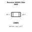
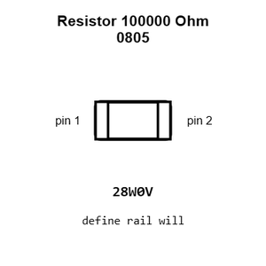
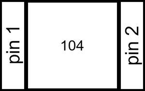
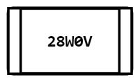
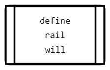
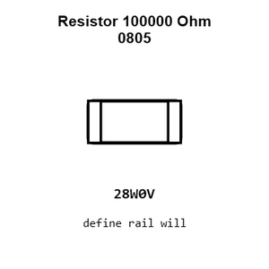
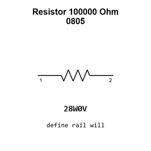

# Resistor 100000 Ohm 0805

`electronic_resistor_0805_100000_ohm`

Resistor 100000 Ohm 0805 is an OOMP electronic resistor definition. It uses the 0805 package or form factor. Its nominal drawing size is 2.0 &#x00D7; 1.25 mm.

## At a glance

| Detail | Value |
| --- | --- |
| OOMP ID | `electronic_resistor_0805_100000_ohm` |
| Type | Resistor |
| Package / style | 0805 |
| Nominal size | 2.0 &#x00D7; 1.25 mm |

## Classification

| Level | Value |
| --- | --- |
| 1 | `electronic` |
| 2 | `resistor` |
| 3 | `0805` |
| 4 | `100000_ohm` |

## Nominal dimensions

| Measurement | Value |
| --- | ---: |
| Length | 2.0 mm |
| Width | 1.25 mm |

## Identifiers

| Identifier | Value |
| --- | --- |
| Manufacturer part number | `0805W8F1003T5E` |
| LCSC | [`C149504`](https://www.lcsc.com/product-detail/C149504.html) |

## Used in projects

| Project | Quantity | References | Explore |
| --- | ---: | --- | --- |
| [Project adafruit/Adafruit-96x64-RGB-OLED-Breakout-PCB Adafruit 96x64 RGB OLED Breakout current](https://github.com/adafruit/Adafruit-96x64-RGB-OLED-Breakout-PCB/blob/master/Adafruit%2096x64%20RGB%20OLED%20Breakout%20v2.0.brd) | 1 | R1 | [Board explorer](https://oomlout.github.io/oomp_electronic_version_5/parts/oomp_project_github_adafruit_adafruit_96x64_rgb_oled_breakout_pcb_adafruit_96x64_rgb_oled_breakout_current/board_explorer.html) · [OOMP project](https://github.com/oomlout/oomp_electronic_version_5/tree/main/parts/oomp_project_github_adafruit_adafruit_96x64_rgb_oled_breakout_pcb_adafruit_96x64_rgb_oled_breakout_current) |
| [Project adafruit/Adafruit-E-Paper-Display-Breakout-PCBs Adafruit 1.54in e Ink Breakout current](https://github.com/adafruit/Adafruit-E-Paper-Display-Breakout-PCBs/blob/master/Adafruit%201.54in%20eInk%20Breakout.brd) | 5 | R1, R2, R3, R5, R6 | [Board explorer](https://oomlout.github.io/oomp_electronic_version_5/parts/oomp_project_github_adafruit_adafruit_e_paper_display_breakout_pcbs_adafruit_1_54in_e_ink_breakout_current/board_explorer.html) · [OOMP project](https://github.com/oomlout/oomp_electronic_version_5/tree/main/parts/oomp_project_github_adafruit_adafruit_e_paper_display_breakout_pcbs_adafruit_1_54in_e_ink_breakout_current) |
| [Project adafruit/Adafruit-E-Paper-Display-Breakout-PCBs Adafruit 1.54in e Ink Breakout with EYESPI current](https://github.com/adafruit/Adafruit-E-Paper-Display-Breakout-PCBs/blob/master/Adafruit%201.54in%20eInk%20Breakout%20with%20EYESPI.brd) | 5 | R1, R2, R3, R5, R6 | [Board explorer](https://oomlout.github.io/oomp_electronic_version_5/parts/oomp_project_github_adafruit_adafruit_e_paper_display_breakout_pcbs_adafruit_1_54in_e_ink_breakout_with_eyespi_current/board_explorer.html) · [OOMP project](https://github.com/oomlout/oomp_electronic_version_5/tree/main/parts/oomp_project_github_adafruit_adafruit_e_paper_display_breakout_pcbs_adafruit_1_54in_e_ink_breakout_with_eyespi_current) |
| [Project adafruit/Adafruit-E-Paper-Display-Breakout-PCBs Adafruit 2.13in Tri Color e Ink Display current](https://github.com/adafruit/Adafruit-E-Paper-Display-Breakout-PCBs/blob/master/Adafruit%202.13in%20Tri-Color%20eInk%20Display.brd) | 5 | R1, R2, R3, R5, R6 | [Board explorer](https://oomlout.github.io/oomp_electronic_version_5/parts/oomp_project_github_adafruit_adafruit_e_paper_display_breakout_pcbs_adafruit_2_13in_tri_color_e_ink_display_current/board_explorer.html) · [OOMP project](https://github.com/oomlout/oomp_electronic_version_5/tree/main/parts/oomp_project_github_adafruit_adafruit_e_paper_display_breakout_pcbs_adafruit_2_13in_tri_color_e_ink_display_current) |
| [Project adafruit/Adafruit-E-Paper-Display-Breakout-PCBs Adafruit 2.7in Tri Color e Ink Display current](https://github.com/adafruit/Adafruit-E-Paper-Display-Breakout-PCBs/blob/master/Adafruit%202.7in%20Tri-Color%20eInk%20Display.brd) | 5 | R1, R2, R3, R5, R6 | [Board explorer](https://oomlout.github.io/oomp_electronic_version_5/parts/oomp_project_github_adafruit_adafruit_e_paper_display_breakout_pcbs_adafruit_2_7in_tri_color_e_ink_display_current/board_explorer.html) · [OOMP project](https://github.com/oomlout/oomp_electronic_version_5/tree/main/parts/oomp_project_github_adafruit_adafruit_e_paper_display_breakout_pcbs_adafruit_2_7in_tri_color_e_ink_display_current) |
| [Project adafruit/Adafruit-E-Paper-Display-Breakout-PCBs Adafruit 2.9in e Ink Display current](https://github.com/adafruit/Adafruit-E-Paper-Display-Breakout-PCBs/blob/master/Adafruit%202.9in%20eInk%20Display.brd) | 5 | R1, R2, R3, R5, R6 | [Board explorer](https://oomlout.github.io/oomp_electronic_version_5/parts/oomp_project_github_adafruit_adafruit_e_paper_display_breakout_pcbs_adafruit_2_9in_e_ink_display_current/board_explorer.html) · [OOMP project](https://github.com/oomlout/oomp_electronic_version_5/tree/main/parts/oomp_project_github_adafruit_adafruit_e_paper_display_breakout_pcbs_adafruit_2_9in_e_ink_display_current) |
| [Project adafruit/Adafruit-LM3671-Buck-Converter-PCB Adafruit LM3671 Buck current](https://github.com/adafruit/Adafruit-LM3671-Buck-Converter-PCB/blob/master/Adafruit%20LM3671%20Buck.brd) | 1 | R1 | [Board explorer](https://oomlout.github.io/oomp_electronic_version_5/parts/oomp_project_github_adafruit_adafruit_lm3671_buck_converter_pcb_adafruit_lm3671_buck_current/board_explorer.html) · [OOMP project](https://github.com/oomlout/oomp_electronic_version_5/tree/main/parts/oomp_project_github_adafruit_adafruit_lm3671_buck_converter_pcb_adafruit_lm3671_buck_current) |
| [Project adafruit/Adafruit-MAX9814-AGC-Microphone-PCB Adafruit MAX9814 current](https://github.com/adafruit/Adafruit-MAX9814-AGC-Microphone-PCB/blob/master/Adafruit%20MAX9814.brd) | 1 | R2 | [Board explorer](https://oomlout.github.io/oomp_electronic_version_5/parts/oomp_project_github_adafruit_adafruit_max9814_agc_microphone_pcb_adafruit_max9814_current/board_explorer.html) · [OOMP project](https://github.com/oomlout/oomp_electronic_version_5/tree/main/parts/oomp_project_github_adafruit_adafruit_max9814_agc_microphone_pcb_adafruit_max9814_current) |
| [Project adafruit/Adafruit_Microtouch Microtouch current](https://github.com/adafruit/Adafruit_Microtouch/blob/master/PCB/microtouch.brd) | 3 | R6, R12, R13 | [Board explorer](https://oomlout.github.io/oomp_electronic_version_5/parts/oomp_project_github_adafruit_adafruit_microtouch_microtouch_current/board_explorer.html) · [OOMP project](https://github.com/oomlout/oomp_electronic_version_5/tree/main/parts/oomp_project_github_adafruit_adafruit_microtouch_microtouch_current) |
| [Project adafruit/Adafruit-MPR121-PCB Adafruit MPR121 Breakout current](https://github.com/adafruit/Adafruit-MPR121-PCB/blob/master/Adafruit%20MPR121%20Breakout.brd) | 1 | R6 | [Board explorer](https://oomlout.github.io/oomp_electronic_version_5/parts/oomp_project_github_adafruit_adafruit_mpr121_pcb_adafruit_mpr121_breakout_current/board_explorer.html) · [OOMP project](https://github.com/oomlout/oomp_electronic_version_5/tree/main/parts/oomp_project_github_adafruit_adafruit_mpr121_pcb_adafruit_mpr121_breakout_current) |

## Files

[KiCad symbol, machine-solder and hand-solder footprints](data/kicad/README.md) · [Availability and source masters](data/kicad/manifest.yaml)

[View this part on GitHub](https://github.com/oomlout/oomp_electronic_version_5/tree/main/parts/electronic_resistor_0805_100000_ohm)

[Browse this category](../../navigation/electronic/resistor/0805/README.md)

---

This page is generated from the OOMP part definition by a Roboclick Jinja template. Edit the source taxonomy or template rather than this generated file.