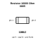
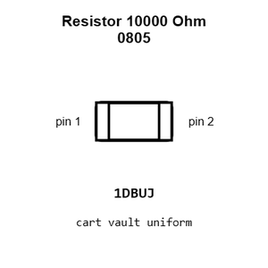
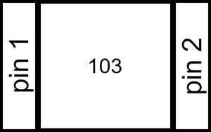
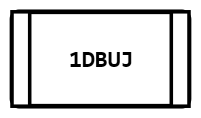
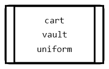
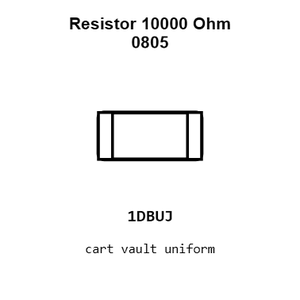
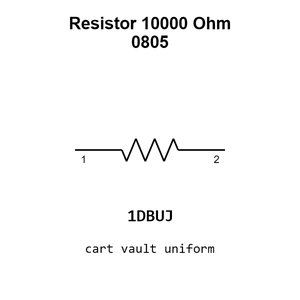

# Resistor 10000 Ohm 0805

`electronic_resistor_0805_10000_ohm`

Resistor 10000 Ohm 0805 is an OOMP electronic resistor definition. It uses the 0805 package or form factor. Its nominal drawing size is 2.0 &#x00D7; 1.25 mm.

## At a glance

| Detail | Value |
| --- | --- |
| OOMP ID | `electronic_resistor_0805_10000_ohm` |
| Type | Resistor |
| Package / style | 0805 |
| Nominal size | 2.0 &#x00D7; 1.25 mm |

## Classification

| Level | Value |
| --- | --- |
| 1 | `electronic` |
| 2 | `resistor` |
| 3 | `0805` |
| 4 | `10000_ohm` |

## Nominal dimensions

| Measurement | Value |
| --- | ---: |
| Length | 2.0 mm |
| Width | 1.25 mm |

## Identifiers

| Identifier | Value |
| --- | --- |
| Manufacturer part number | `0805W8F1002T5E` |
| LCSC | [`C17414`](https://www.lcsc.com/product-detail/C17414.html) |

## Used in projects

| Project | Quantity | References | Explore |
| --- | ---: | --- | --- |
| [Project adafruit/2.8-TFT-Breakout-PCB Adafruit 2.8 TFT Breakout current](https://github.com/adafruit/2.8-TFT-Breakout-PCB/blob/master/Adafruit%202.8%20TFT%20Breakout%20v2.brd) | 6 | R6, R8, R9, R10, R11, R12 | [Board explorer](https://oomlout.github.io/oomp_electronic_version_5/parts/oomp_project_github_adafruit_2_8_tft_breakout_pcb_adafruit_2_8_tft_breakout_current/board_explorer.html) · [OOMP project](https://github.com/oomlout/oomp_electronic_version_5/tree/main/parts/oomp_project_github_adafruit_2_8_tft_breakout_pcb_adafruit_2_8_tft_breakout_current) |
| [Project adafruit/4-Channel-Level-Shifter-PCB Adafruit FET 4 Channel Shifter current](https://github.com/adafruit/4-Channel-Level-Shifter-PCB/blob/master/Adafruit%20FET%204-Channel%20Shifter.brd) | 8 | R1, R2, R3, R4, R5, R6, R7, R8 | [Board explorer](https://oomlout.github.io/oomp_electronic_version_5/parts/oomp_project_github_adafruit_4_channel_level_shifter_pcb_adafruit_fet_4_channel_shifter_current/board_explorer.html) · [OOMP project](https://github.com/oomlout/oomp_electronic_version_5/tree/main/parts/oomp_project_github_adafruit_4_channel_level_shifter_pcb_adafruit_fet_4_channel_shifter_current) |
| [Project adafruit/Adafruit-128x32-I2C-OLED-Breakout-PCB Adafruit OLED 128x32 Mono I2 C current](https://github.com/adafruit/Adafruit-128x32-I2C-OLED-Breakout-PCB/blob/master/Adafruit%20OLED%20128x32%20Mono%20I2C.brd) | 5 | R4, R5, R7, R8, R9 | [Board explorer](https://oomlout.github.io/oomp_electronic_version_5/parts/oomp_project_github_adafruit_adafruit_128x32_i2_c_oled_breakout_pcb_adafruit_oled_128x32_mono_i2_c_current/board_explorer.html) · [OOMP project](https://github.com/oomlout/oomp_electronic_version_5/tree/main/parts/oomp_project_github_adafruit_adafruit_128x32_i2_c_oled_breakout_pcb_adafruit_oled_128x32_mono_i2_c_current) |
| [Project adafruit/Adafruit-128x64-Monochrome-OLED-PCB 128x64 Mono OLED PCB current](https://github.com/adafruit/Adafruit-128x64-Monochrome-OLED-PCB/blob/master/Adafruit%20128x64%20Mono%20OLED%20PCB.brd) | 3 | R1, R2, R3 | [Board explorer](https://oomlout.github.io/oomp_electronic_version_5/parts/oomp_project_github_adafruit_adafruit_128x64_monochrome_oled_pcb_128x64_mono_oled_current/board_explorer.html) · [OOMP project](https://github.com/oomlout/oomp_electronic_version_5/tree/main/parts/oomp_project_github_adafruit_adafruit_128x64_monochrome_oled_pcb_128x64_mono_oled_current) |
| [Project adafruit/Adafruit-128x64-Monochrome-OLED-PCB 128x64 Mono OLED PCB v2 current](https://github.com/adafruit/Adafruit-128x64-Monochrome-OLED-PCB/blob/master/Adafruit%20128x64%20Mono%20OLED%20PCB%20v2.brd) | 8 | R2, R4, R5, R6, R11, R12, R13, R14 | [Board explorer](https://oomlout.github.io/oomp_electronic_version_5/parts/oomp_project_github_adafruit_adafruit_128x64_monochrome_oled_pcb_128x64_mono_oled_v2_current/board_explorer.html) · [OOMP project](https://github.com/oomlout/oomp_electronic_version_5/tree/main/parts/oomp_project_github_adafruit_adafruit_128x64_monochrome_oled_pcb_128x64_mono_oled_v2_current) |
| [Project adafruit/Adafruit-128x64-OLED-Bonnet-for-Raspberry-Pi-PCB Adafruit 128x64 OLED Bonnet current](https://github.com/adafruit/Adafruit-128x64-OLED-Bonnet-for-Raspberry-Pi-PCB/blob/master/Adafruit%20128x64%20OLED%20Bonnet.brd) | 1 | R1 | [Board explorer](https://oomlout.github.io/oomp_electronic_version_5/parts/oomp_project_github_adafruit_adafruit_128x64_oled_bonnet_for_raspberry_pi_pcb_adafruit_128x64_oled_bonnet_current/board_explorer.html) · [OOMP project](https://github.com/oomlout/oomp_electronic_version_5/tree/main/parts/oomp_project_github_adafruit_adafruit_128x64_oled_bonnet_for_raspberry_pi_pcb_adafruit_128x64_oled_bonnet_current) |
| [Project adafruit/Adafruit-16-Channel-PWM-Servo-Driver-PCB Adafruit PCA9685 current](https://github.com/adafruit/Adafruit-16-Channel-PWM-Servo-Driver-PCB/blob/master/Adafruit%20PCA9685.brd) | 9 | R1, R2, R3, R4, R5, R6, R7, R8, R9 | [Board explorer](https://oomlout.github.io/oomp_electronic_version_5/parts/oomp_project_github_adafruit_adafruit_16_channel_pwm_servo_driver_pcb_adafruit_pca9685_current/board_explorer.html) · [OOMP project](https://github.com/oomlout/oomp_electronic_version_5/tree/main/parts/oomp_project_github_adafruit_adafruit_16_channel_pwm_servo_driver_pcb_adafruit_pca9685_current) |
| [Project adafruit/Adafruit-16-channel-PWM-Servo-Shield Adafruit PWM Servo Shield current](https://github.com/adafruit/Adafruit-16-channel-PWM-Servo-Shield/blob/master/Adafruit%20PWM%20Servo%20Shield.brd) | 3 | R3, R4, R7 | [Board explorer](https://oomlout.github.io/oomp_electronic_version_5/parts/oomp_project_github_adafruit_adafruit_16_channel_pwm_servo_shield_adafruit_pwm_servo_shield_current/board_explorer.html) · [OOMP project](https://github.com/oomlout/oomp_electronic_version_5/tree/main/parts/oomp_project_github_adafruit_adafruit_16_channel_pwm_servo_shield_adafruit_pwm_servo_shield_current) |
| [Project adafruit/Adafruit-1.3in-Color-TFT-Bonnet-PCB Adafruit 1.3in Color TFT Bonnet current](https://github.com/adafruit/Adafruit-1.3in-Color-TFT-Bonnet-PCB/blob/master/Adafruit%201.3in%20Color%20TFT%20Bonnet.brd) | 8 | R1, R3, R11, R12, R13, R14, R16, R18 | [Board explorer](https://oomlout.github.io/oomp_electronic_version_5/parts/oomp_project_github_adafruit_adafruit_1_3in_color_tft_bonnet_pcb_adafruit_1_3in_color_tft_bonnet_current/board_explorer.html) · [OOMP project](https://github.com/oomlout/oomp_electronic_version_5/tree/main/parts/oomp_project_github_adafruit_adafruit_1_3in_color_tft_bonnet_pcb_adafruit_1_3in_color_tft_bonnet_current) |
| [Project adafruit/Adafruit-1.8-TFT-Shield-PCB Adafruit 1.8 TFTshield current](https://github.com/adafruit/Adafruit-1.8-TFT-Shield-PCB/blob/master/Adafruit%201.8%20TFTshield.brd) | 1 | R6 | [Board explorer](https://oomlout.github.io/oomp_electronic_version_5/parts/oomp_project_github_adafruit_adafruit_1_8_tft_shield_pcb_adafruit_1_8_tftshield_current/board_explorer.html) · [OOMP project](https://github.com/oomlout/oomp_electronic_version_5/tree/main/parts/oomp_project_github_adafruit_adafruit_1_8_tft_shield_pcb_adafruit_1_8_tftshield_current) |
| [Project adafruit/Adafruit-2.0-inch-240x320-TFT-PCB Adafruit 2.0 inch 240x320 IPS TFT current](https://github.com/adafruit/Adafruit-2.0-inch-240x320-TFT-PCB/blob/master/Adafruit%202.0%20inch%20240x320%20IPS%20TFT.brd) | 4 | R2, R5, R7, R8 | [Board explorer](https://oomlout.github.io/oomp_electronic_version_5/parts/oomp_project_github_adafruit_adafruit_2_0_inch_240x320_tft_pcb_adafruit_2_0_inch_240x320_ips_tft_current/board_explorer.html) · [OOMP project](https://github.com/oomlout/oomp_electronic_version_5/tree/main/parts/oomp_project_github_adafruit_adafruit_2_0_inch_240x320_tft_pcb_adafruit_2_0_inch_240x320_ips_tft_current) |
| [Project adafruit/Adafruit-2.0-inch-240x320-TFT-PCB Adafruit EYESPI 2.0 Inch 240x320 IPS TFT current](https://github.com/adafruit/Adafruit-2.0-inch-240x320-TFT-PCB/blob/master/Adafruit%20EYESPI%202.0%20Inch%20240x320%20IPS%20TFT.brd) | 4 | R2, R5, R7, R8 | [Board explorer](https://oomlout.github.io/oomp_electronic_version_5/parts/oomp_project_github_adafruit_adafruit_2_0_inch_240x320_tft_pcb_adafruit_eyespi_2_0_inch_240x320_ips_tft_current/board_explorer.html) · [OOMP project](https://github.com/oomlout/oomp_electronic_version_5/tree/main/parts/oomp_project_github_adafruit_adafruit_2_0_inch_240x320_tft_pcb_adafruit_eyespi_2_0_inch_240x320_ips_tft_current) |
| [Project adafruit/Adafruit-2.8-TFT-Shield-v2-PCB Adafruit tftcaptouchshield current](https://github.com/adafruit/Adafruit-2.8-TFT-Shield-v2-PCB/blob/master/Adafruit%20tftcaptouchshield%20rev%20C.brd) | 6 | R6, R8, R13, R14, R15, R16 | [Board explorer](https://oomlout.github.io/oomp_electronic_version_5/parts/oomp_project_github_adafruit_adafruit_2_8_tft_shield_v2_pcb_adafruit_tftcaptouchshield_current/board_explorer.html) · [OOMP project](https://github.com/oomlout/oomp_electronic_version_5/tree/main/parts/oomp_project_github_adafruit_adafruit_2_8_tft_shield_v2_pcb_adafruit_tftcaptouchshield_current) |
| [Project adafruit/Adafruit-2.8-TFT-Shield-v2-PCB Adafruit tfttouchshield current](https://github.com/adafruit/Adafruit-2.8-TFT-Shield-v2-PCB/blob/master/Adafruit%20tfttouchshield%20v2.2.brd) | 3 | R6, R7, R8 | [Board explorer](https://oomlout.github.io/oomp_electronic_version_5/parts/oomp_project_github_adafruit_adafruit_2_8_tft_shield_v2_pcb_adafruit_tfttouchshield_current/board_explorer.html) · [OOMP project](https://github.com/oomlout/oomp_electronic_version_5/tree/main/parts/oomp_project_github_adafruit_adafruit_2_8_tft_shield_v2_pcb_adafruit_tfttouchshield_current) |
| [Project adafruit/Adafruit-2.8-TFT-with-Capacitive-Touch-PCB Adafruit 2.8 inch TFT w Capacitive Touch current](https://github.com/adafruit/Adafruit-2.8-TFT-with-Capacitive-Touch-PCB/blob/master/Adafruit%202.8%20inch%20TFT%20w%20Capacitive%20Touch.brd) | 10 | R6, R8, R9, R10, R11, R12, R13, R14, R15, R16 | [Board explorer](https://oomlout.github.io/oomp_electronic_version_5/parts/oomp_project_github_adafruit_adafruit_2_8_tft_with_capacitive_touch_pcb_adafruit_2_8_inch_tft_w_capacitive_touch_current/board_explorer.html) · [OOMP project](https://github.com/oomlout/oomp_electronic_version_5/tree/main/parts/oomp_project_github_adafruit_adafruit_2_8_tft_with_capacitive_touch_pcb_adafruit_2_8_inch_tft_w_capacitive_touch_current) |
| [Project adafruit/Adafruit-40-pin-TFT-Friend Adafruit 40pin TFT friend current](https://github.com/adafruit/Adafruit-40-pin-TFT-Friend/blob/master/Adafruit%2040pin%20TFT%20friend.brd) | 1 | R1 | [Board explorer](https://oomlout.github.io/oomp_electronic_version_5/parts/oomp_project_github_adafruit_adafruit_40_pin_tft_friend_adafruit_40pin_tft_friend_current/board_explorer.html) · [OOMP project](https://github.com/oomlout/oomp_electronic_version_5/tree/main/parts/oomp_project_github_adafruit_adafruit_40_pin_tft_friend_adafruit_40pin_tft_friend_current) |
| [Project adafruit/Adafruit-5-HDMI-Backpack-PCB Adafruit 5in HDMI Backpack current](https://github.com/adafruit/Adafruit-5-HDMI-Backpack-PCB/blob/master/Adafruit%205in%20HDMI%20Backpack.brd) | 7 | R1, R2, R3, R4, R5, R13, R18 | [Board explorer](https://oomlout.github.io/oomp_electronic_version_5/parts/oomp_project_github_adafruit_adafruit_5_hdmi_backpack_pcb_adafruit_5in_hdmi_backpack_current/board_explorer.html) · [OOMP project](https://github.com/oomlout/oomp_electronic_version_5/tree/main/parts/oomp_project_github_adafruit_adafruit_5_hdmi_backpack_pcb_adafruit_5in_hdmi_backpack_current) |
| [Project adafruit/Adafruit-96x64-RGB-OLED-Breakout-PCB Adafruit 96x64 RGB OLED Breakout current](https://github.com/adafruit/Adafruit-96x64-RGB-OLED-Breakout-PCB/blob/master/Adafruit%2096x64%20RGB%20OLED%20Breakout%20v2.0.brd) | 1 | R2 | [Board explorer](https://oomlout.github.io/oomp_electronic_version_5/parts/oomp_project_github_adafruit_adafruit_96x64_rgb_oled_breakout_pcb_adafruit_96x64_rgb_oled_breakout_current/board_explorer.html) · [OOMP project](https://github.com/oomlout/oomp_electronic_version_5/tree/main/parts/oomp_project_github_adafruit_adafruit_96x64_rgb_oled_breakout_pcb_adafruit_96x64_rgb_oled_breakout_current) |
| [Project adafruit/Adafruit-9-DOF-and-10-DOF-PCBs Adafuit 10 DOF current](https://github.com/adafruit/Adafruit-9-DOF-and-10-DOF-PCBs/blob/master/Adafuit_10DOF.brd) | 7 | R1, R2, R3, R4, R5, R6, R7 | [Board explorer](https://oomlout.github.io/oomp_electronic_version_5/parts/oomp_project_github_adafruit_adafruit_9_dof_and_10_dof_pcbs_adafuit_10_dof_current/board_explorer.html) · [OOMP project](https://github.com/oomlout/oomp_electronic_version_5/tree/main/parts/oomp_project_github_adafruit_adafruit_9_dof_and_10_dof_pcbs_adafuit_10_dof_current) |
| [Project adafruit/Adafruit-9-DOF-and-10-DOF-PCBs Adafuit 9 DOF current](https://github.com/adafruit/Adafruit-9-DOF-and-10-DOF-PCBs/blob/master/Adafuit_9DOF.brd) | 7 | R1, R2, R3, R4, R5, R6, R7 | [Board explorer](https://oomlout.github.io/oomp_electronic_version_5/parts/oomp_project_github_adafruit_adafruit_9_dof_and_10_dof_pcbs_adafuit_9_dof_current/board_explorer.html) · [OOMP project](https://github.com/oomlout/oomp_electronic_version_5/tree/main/parts/oomp_project_github_adafruit_adafruit_9_dof_and_10_dof_pcbs_adafuit_9_dof_current) |
| [Project adafruit/Adafruit-Animated-Eyes-Bonnet-PCB Adafruit Eyes Bonnet current](https://github.com/adafruit/Adafruit-Animated-Eyes-Bonnet-PCB/blob/master/Adafruit%20Eyes%20Bonnet.brd) | 1 | R4 | [Board explorer](https://oomlout.github.io/oomp_electronic_version_5/parts/oomp_project_github_adafruit_adafruit_animated_eyes_bonnet_pcb_adafruit_eyes_bonnet_current/board_explorer.html) · [OOMP project](https://github.com/oomlout/oomp_electronic_version_5/tree/main/parts/oomp_project_github_adafruit_adafruit_animated_eyes_bonnet_pcb_adafruit_eyes_bonnet_current) |
| [Project adafruit/Adafruit_Atmega32u4_Breakout_Board ATmega32u4 Breakout current](https://github.com/adafruit/Adafruit_Atmega32u4_Breakout_Board/blob/master/atmega32u4bb.brd) | 1 | R4 | [Board explorer](https://oomlout.github.io/oomp_electronic_version_5/parts/oomp_project_github_adafruit_adafruit_atmega32u4_breakout_board_atmega32u4_breakout_current/board_explorer.html) · [OOMP project](https://github.com/oomlout/oomp_electronic_version_5/tree/main/parts/oomp_project_github_adafruit_adafruit_atmega32u4_breakout_board_atmega32u4_breakout_current) |
| [Project adafruit/Adafruit-Bluefruit-LE-USB-Friend-and-Sniffer-PCB Adafruit Bluefruit LE USB Friend current](https://github.com/adafruit/Adafruit-Bluefruit-LE-USB-Friend-and-Sniffer-PCB/blob/master/Adafruit%20Bluefruit%20LE%20USB%20Friend.brd) | 2 | R5, R6 | [Board explorer](https://oomlout.github.io/oomp_electronic_version_5/parts/oomp_project_github_adafruit_adafruit_bluefruit_le_usb_friend_and_sniffer_pcb_adafruit_bluefruit_le_usb_friend_current/board_explorer.html) · [OOMP project](https://github.com/oomlout/oomp_electronic_version_5/tree/main/parts/oomp_project_github_adafruit_adafruit_bluefruit_le_usb_friend_and_sniffer_pcb_adafruit_bluefruit_le_usb_friend_current) |
| [Project adafruit/Adafruit-BME280-Breakout-PCB Adafruit BME280 current](https://github.com/adafruit/Adafruit-BME280-Breakout-PCB/blob/master/Adafruit%20BME280.brd) | 5 | R1, R2, R4, R7, R8 | [Board explorer](https://oomlout.github.io/oomp_electronic_version_5/parts/oomp_project_github_adafruit_adafruit_bme280_breakout_pcb_adafruit_bme280_current/board_explorer.html) · [OOMP project](https://github.com/oomlout/oomp_electronic_version_5/tree/main/parts/oomp_project_github_adafruit_adafruit_bme280_breakout_pcb_adafruit_bme280_current) |
| [Project adafruit/Adafruit-BMP085-PCB Adafruit BMP085 current](https://github.com/adafruit/Adafruit-BMP085-PCB/blob/master/Adafruit_BMP085.brd) | 4 | R1, R2, R3, R4 | [Board explorer](https://oomlout.github.io/oomp_electronic_version_5/parts/oomp_project_github_adafruit_adafruit_bmp085_pcb_adafruit_bmp085_current/board_explorer.html) · [OOMP project](https://github.com/oomlout/oomp_electronic_version_5/tree/main/parts/oomp_project_github_adafruit_adafruit_bmp085_pcb_adafruit_bmp085_current) |
| [Project adafruit/Adafruit-BMP280-Breakout-PCB Adafruit BMP280 current](https://github.com/adafruit/Adafruit-BMP280-Breakout-PCB/blob/master/Adafruit%20BMP280.brd) | 5 | R1, R2, R4, R7, R8 | [Board explorer](https://oomlout.github.io/oomp_electronic_version_5/parts/oomp_project_github_adafruit_adafruit_bmp280_breakout_pcb_adafruit_bmp280_current/board_explorer.html) · [OOMP project](https://github.com/oomlout/oomp_electronic_version_5/tree/main/parts/oomp_project_github_adafruit_adafruit_bmp280_breakout_pcb_adafruit_bmp280_current) |
| [Project adafruit/Adafruit-BNO055-Breakout-PCB Adafruit BNO055 current](https://github.com/adafruit/Adafruit-BNO055-Breakout-PCB/blob/master/Adafruit%20BNO055.brd) | 8 | R3, R4, R5, R6, R7, R8, R9, R10 | [Board explorer](https://oomlout.github.io/oomp_electronic_version_5/parts/oomp_project_github_adafruit_adafruit_bno055_breakout_pcb_adafruit_bno055_current/board_explorer.html) · [OOMP project](https://github.com/oomlout/oomp_electronic_version_5/tree/main/parts/oomp_project_github_adafruit_adafruit_bno055_breakout_pcb_adafruit_bno055_current) |
| [Project adafruit/Adafruit-DC-Stepper-Motor-HAT-PCB Adafruit Motor HAT current](https://github.com/adafruit/Adafruit-DC-Stepper-Motor-HAT-PCB/blob/master/Adafruit%20Motor%20HAT%20rev%20A.brd) | 5 | R4, R5, R6, R8, R9 | [Board explorer](https://oomlout.github.io/oomp_electronic_version_5/parts/oomp_project_github_adafruit_adafruit_dc_stepper_motor_hat_pcb_adafruit_motor_hat_current/board_explorer.html) · [OOMP project](https://github.com/oomlout/oomp_electronic_version_5/tree/main/parts/oomp_project_github_adafruit_adafruit_dc_stepper_motor_hat_pcb_adafruit_motor_hat_current) |
| [Project adafruit/Adafruit-DRV2605-PCB Adafruit DRV2605 L current](https://github.com/adafruit/Adafruit-DRV2605-PCB/blob/master/Adafruit%20DRV2605L.brd) | 2 | R1, R2 | [Board explorer](https://oomlout.github.io/oomp_electronic_version_5/parts/oomp_project_github_adafruit_adafruit_drv2605_pcb_adafruit_drv2605_l_current/board_explorer.html) · [OOMP project](https://github.com/oomlout/oomp_electronic_version_5/tree/main/parts/oomp_project_github_adafruit_adafruit_drv2605_pcb_adafruit_drv2605_l_current) |
| [Project adafruit/Adafruit-DS3231-Precision-RTC-Breakout-PCB Adafruit DS3231 RTC Breakout current](https://github.com/adafruit/Adafruit-DS3231-Precision-RTC-Breakout-PCB/blob/master/Adafruit%20DS3231%20RTC%20Breakout.brd) | 2 | R1, R2 | [Board explorer](https://oomlout.github.io/oomp_electronic_version_5/parts/oomp_project_github_adafruit_adafruit_ds3231_precision_rtc_breakout_pcb_adafruit_ds3231_rtc_breakout_current/board_explorer.html) · [OOMP project](https://github.com/oomlout/oomp_electronic_version_5/tree/main/parts/oomp_project_github_adafruit_adafruit_ds3231_precision_rtc_breakout_pcb_adafruit_ds3231_rtc_breakout_current) |
| [Project adafruit/Adafruit-Flora-TCS34725-Color-Sensor-PCB Adafruit Flora TCS34725 current](https://github.com/adafruit/Adafruit-Flora-TCS34725-Color-Sensor-PCB/blob/master/Adafruit%20Flora%20TCS34725.brd) | 3 | R1, R2, R6 | [Board explorer](https://oomlout.github.io/oomp_electronic_version_5/parts/oomp_project_github_adafruit_adafruit_flora_tcs34725_color_sensor_pcb_adafruit_flora_tcs34725_current/board_explorer.html) · [OOMP project](https://github.com/oomlout/oomp_electronic_version_5/tree/main/parts/oomp_project_github_adafruit_adafruit_flora_tcs34725_color_sensor_pcb_adafruit_flora_tcs34725_current) |
| [Project adafruit/Adafruit-I2C-SPI-LCD-Backpack-PCB I2C SPI LCD Backpack current](https://github.com/adafruit/Adafruit-I2C-SPI-LCD-Backpack-PCB/blob/master/i2cspilcdbackpack.brd) | 5 | R1, R2, R3, R6, R7 | [Board explorer](https://oomlout.github.io/oomp_electronic_version_5/parts/oomp_project_github_adafruit_adafruit_i2_c_spi_lcd_backpack_pcb_i2c_spi_lcd_backpack_current/board_explorer.html) · [OOMP project](https://github.com/oomlout/oomp_electronic_version_5/tree/main/parts/oomp_project_github_adafruit_adafruit_i2_c_spi_lcd_backpack_pcb_i2c_spi_lcd_backpack_current) |
| [Project adafruit/Adafruit-INA219-Current-Sensor-PCB Adafruit INA219 Cur Power Monitor current](https://github.com/adafruit/Adafruit-INA219-Current-Sensor-PCB/blob/master/Adafruit_INA219_CurPowerMonitor.brd) | 4 | R1, R2, R3, R4 | [Board explorer](https://oomlout.github.io/oomp_electronic_version_5/parts/oomp_project_github_adafruit_adafruit_ina219_current_sensor_pcb_adafruit_ina219_cur_power_monitor_current/board_explorer.html) · [OOMP project](https://github.com/oomlout/oomp_electronic_version_5/tree/main/parts/oomp_project_github_adafruit_adafruit_ina219_current_sensor_pcb_adafruit_ina219_cur_power_monitor_current) |
| [Project adafruit/Adafruit-LED-Backpacks Adafruit 0.54 Alphanumeric current](https://github.com/adafruit/Adafruit-LED-Backpacks/blob/master/Adafruit%200.54%20Alphanumeric%20v0.1.brd) | 2 | R1, R2 | [Board explorer](https://oomlout.github.io/oomp_electronic_version_5/parts/oomp_project_github_adafruit_adafruit_led_backpacks_adafruit_0_54_alphanumeric_current/board_explorer.html) · [OOMP project](https://github.com/oomlout/oomp_electronic_version_5/tree/main/parts/oomp_project_github_adafruit_adafruit_led_backpacks_adafruit_0_54_alphanumeric_current) |
| [Project adafruit/Adafruit-LED-Backpacks Adafruit 16x8 Monochrome LED Backpack current](https://github.com/adafruit/Adafruit-LED-Backpacks/blob/master/Adafruit%2016x8%20Monochrome%20LED%20Backpack.brd) | 5 | R1, R2, R3, R4, R5 | [Board explorer](https://oomlout.github.io/oomp_electronic_version_5/parts/oomp_project_github_adafruit_adafruit_led_backpacks_adafruit_16x8_monochrome_led_backpack_current/board_explorer.html) · [OOMP project](https://github.com/oomlout/oomp_electronic_version_5/tree/main/parts/oomp_project_github_adafruit_adafruit_led_backpacks_adafruit_16x8_monochrome_led_backpack_current) |
| [Project adafruit/Adafruit-LED-Backpacks Adafruit 1.2in 7 segment current](https://github.com/adafruit/Adafruit-LED-Backpacks/blob/master/Adafruit%201.2in%207-segment.brd) | 2 | R1, R2 | [Board explorer](https://oomlout.github.io/oomp_electronic_version_5/parts/oomp_project_github_adafruit_adafruit_led_backpacks_adafruit_1_2in_7_segment_current/board_explorer.html) · [OOMP project](https://github.com/oomlout/oomp_electronic_version_5/tree/main/parts/oomp_project_github_adafruit_adafruit_led_backpacks_adafruit_1_2in_7_segment_current) |
| [Project adafruit/Adafruit-LED-Backpacks Adafruit 7seg backpack current](https://github.com/adafruit/Adafruit-LED-Backpacks/blob/master/Adafruit%207seg%20backpack.brd) | 2 | R1, R2 | [Board explorer](https://oomlout.github.io/oomp_electronic_version_5/parts/oomp_project_github_adafruit_adafruit_led_backpacks_adafruit_7seg_backpack_current/board_explorer.html) · [OOMP project](https://github.com/oomlout/oomp_electronic_version_5/tree/main/parts/oomp_project_github_adafruit_adafruit_led_backpacks_adafruit_7seg_backpack_current) |
| [Project adafruit/Adafruit-LED-Backpacks Adafruit bicolor 8x8 current](https://github.com/adafruit/Adafruit-LED-Backpacks/blob/master/Adafruit%20bicolor%208x8.brd) | 5 | R1, R2, R3, R4, R5 | [Board explorer](https://oomlout.github.io/oomp_electronic_version_5/parts/oomp_project_github_adafruit_adafruit_led_backpacks_adafruit_bicolor_8x8_current/board_explorer.html) · [OOMP project](https://github.com/oomlout/oomp_electronic_version_5/tree/main/parts/oomp_project_github_adafruit_adafruit_led_backpacks_adafruit_bicolor_8x8_current) |
| [Project adafruit/Adafruit-LED-Backpacks Adafruit bicolor bargraph 24 current](https://github.com/adafruit/Adafruit-LED-Backpacks/blob/master/Adafruit%20bicolor%20bargraph%2024.brd) | 2 | R1, R2 | [Board explorer](https://oomlout.github.io/oomp_electronic_version_5/parts/oomp_project_github_adafruit_adafruit_led_backpacks_adafruit_bicolor_bargraph_24_current/board_explorer.html) · [OOMP project](https://github.com/oomlout/oomp_electronic_version_5/tree/main/parts/oomp_project_github_adafruit_adafruit_led_backpacks_adafruit_bicolor_bargraph_24_current) |
| [Project adafruit/Adafruit-LED-Backpacks Adafruit HT16 K33 breakout current](https://github.com/adafruit/Adafruit-LED-Backpacks/blob/master/Adafruit%20HT16K33%20breakout.brd) | 2 | R1, R2 | [Board explorer](https://oomlout.github.io/oomp_electronic_version_5/parts/oomp_project_github_adafruit_adafruit_led_backpacks_adafruit_ht16_k33_breakout_current/board_explorer.html) · [OOMP project](https://github.com/oomlout/oomp_electronic_version_5/tree/main/parts/oomp_project_github_adafruit_adafruit_led_backpacks_adafruit_ht16_k33_breakout_current) |
| [Project adafruit/Adafruit-LED-Backpacks Adafruit min8x8 backpack current](https://github.com/adafruit/Adafruit-LED-Backpacks/blob/master/Adafruit%20min8x8%20backpack.brd) | 4 | R1, R2, R3, R4 | [Board explorer](https://oomlout.github.io/oomp_electronic_version_5/parts/oomp_project_github_adafruit_adafruit_led_backpacks_adafruit_min8x8_backpack_current/board_explorer.html) · [OOMP project](https://github.com/oomlout/oomp_electronic_version_5/tree/main/parts/oomp_project_github_adafruit_adafruit_led_backpacks_adafruit_min8x8_backpack_current) |
| [Project adafruit/Adafruit-LM4040-Voltage-Reference-PCB Adafruit LM4040 current](https://github.com/adafruit/Adafruit-LM4040-Voltage-Reference-PCB/blob/master/Adafruit%20LM4040.brd) | 2 | R3, R4 | [Board explorer](https://oomlout.github.io/oomp_electronic_version_5/parts/oomp_project_github_adafruit_adafruit_lm4040_voltage_reference_pcb_adafruit_lm4040_current/board_explorer.html) · [OOMP project](https://github.com/oomlout/oomp_electronic_version_5/tree/main/parts/oomp_project_github_adafruit_adafruit_lm4040_voltage_reference_pcb_adafruit_lm4040_current) |
| [Project adafruit/Adafruit-MAX31865-PCB Adafruit MAX31865 current](https://github.com/adafruit/Adafruit-MAX31865-PCB/blob/master/Adafruit%20MAX31865.brd) | 3 | R6, R7, R8 | [Board explorer](https://oomlout.github.io/oomp_electronic_version_5/parts/oomp_project_github_adafruit_adafruit_max31865_pcb_adafruit_max31865_current/board_explorer.html) · [OOMP project](https://github.com/oomlout/oomp_electronic_version_5/tree/main/parts/oomp_project_github_adafruit_adafruit_max31865_pcb_adafruit_max31865_current) |
| [Project adafruit/Adafruit_MCP73833_PCB MCP73833 QFN current](https://github.com/adafruit/Adafruit_MCP73833_PCB/blob/master/MCP73833_QFN_v1.0.brd) | 1 | R7 | [Board explorer](https://oomlout.github.io/oomp_electronic_version_5/parts/oomp_project_github_adafruit_adafruit_mcp73833_pcb_mcp73833_qfn_current/board_explorer.html) · [OOMP project](https://github.com/oomlout/oomp_electronic_version_5/tree/main/parts/oomp_project_github_adafruit_adafruit_mcp73833_pcb_mcp73833_qfn_current) |
| [Project adafruit/Adafruit-METRO-328-PCB Metro Mini current](https://github.com/adafruit/Adafruit-METRO-328-PCB/blob/master/Metro%20Mini%20Rev%20B.brd) | 1 | R8 | [Board explorer](https://oomlout.github.io/oomp_electronic_version_5/parts/oomp_project_github_adafruit_adafruit_metro_328_pcb_metro_mini_current/board_explorer.html) · [OOMP project](https://github.com/oomlout/oomp_electronic_version_5/tree/main/parts/oomp_project_github_adafruit_adafruit_metro_328_pcb_metro_mini_current) |
| [Project adafruit/Adafruit-METRO-328-PCB Metro THM+LDO CP2104 current](https://github.com/adafruit/Adafruit-METRO-328-PCB/blob/master/Metro%20THM%2BLDO%20Rev%20C%20-%20CP2104.brd) | 6 | R7, R8, R13, R14, R15, R16 | [Board explorer](https://oomlout.github.io/oomp_electronic_version_5/parts/oomp_project_github_adafruit_adafruit_metro_328_pcb_metro_thm_ldo_cp2104_current/board_explorer.html) · [OOMP project](https://github.com/oomlout/oomp_electronic_version_5/tree/main/parts/oomp_project_github_adafruit_adafruit_metro_328_pcb_metro_thm_ldo_cp2104_current) |
| [Project adafruit/Adafruit-METRO-328-PCB Metro THM+LDO current](https://github.com/adafruit/Adafruit-METRO-328-PCB/blob/master/Metro%20THM%2BLDO%20Rev%20B.brd) | 6 | R7, R8, R13, R14, R15, R16 | [Board explorer](https://oomlout.github.io/oomp_electronic_version_5/parts/oomp_project_github_adafruit_adafruit_metro_328_pcb_metro_thm_ldo_current/board_explorer.html) · [OOMP project](https://github.com/oomlout/oomp_electronic_version_5/tree/main/parts/oomp_project_github_adafruit_adafruit_metro_328_pcb_metro_thm_ldo_current) |
| [Project adafruit/Adafruit-MicroLipo-PCB Adafruit Micro USB Lipo current](https://github.com/adafruit/Adafruit-MicroLipo-PCB/blob/master/Adafruit%20MicroUSB%20Lipo.brd) | 1 | R3 | [Board explorer](https://oomlout.github.io/oomp_electronic_version_5/parts/oomp_project_github_adafruit_adafruit_micro_lipo_pcb_adafruit_micro_usb_lipo_current/board_explorer.html) · [OOMP project](https://github.com/oomlout/oomp_electronic_version_5/tree/main/parts/oomp_project_github_adafruit_adafruit_micro_lipo_pcb_adafruit_micro_usb_lipo_current) |
| [Project adafruit/Adafruit-MicroLipo-PCB Adafruit Mini Lipo current](https://github.com/adafruit/Adafruit-MicroLipo-PCB/blob/master/Adafruit%20MiniLipo.brd) | 1 | R3 | [Board explorer](https://oomlout.github.io/oomp_electronic_version_5/parts/oomp_project_github_adafruit_adafruit_micro_lipo_pcb_adafruit_mini_lipo_current/board_explorer.html) · [OOMP project](https://github.com/oomlout/oomp_electronic_version_5/tree/main/parts/oomp_project_github_adafruit_adafruit_micro_lipo_pcb_adafruit_mini_lipo_current) |
| [Project adafruit/Adafruit-MicroLipo-PCB Adafruit protrinket backpack current](https://github.com/adafruit/Adafruit-MicroLipo-PCB/blob/master/Adafruit%20protrinket%20backpack.brd) | 1 | R3 | [Board explorer](https://oomlout.github.io/oomp_electronic_version_5/parts/oomp_project_github_adafruit_adafruit_micro_lipo_pcb_adafruit_protrinket_backpack_current/board_explorer.html) · [OOMP project](https://github.com/oomlout/oomp_electronic_version_5/tree/main/parts/oomp_project_github_adafruit_adafruit_micro_lipo_pcb_adafruit_protrinket_backpack_current) |
| [Project adafruit/Adafruit_Microtouch Microtouch current](https://github.com/adafruit/Adafruit_Microtouch/blob/master/PCB/microtouch.brd) | 5 | R3, R4, R14, R15, R16 | [Board explorer](https://oomlout.github.io/oomp_electronic_version_5/parts/oomp_project_github_adafruit_adafruit_microtouch_microtouch_current/board_explorer.html) · [OOMP project](https://github.com/oomlout/oomp_electronic_version_5/tree/main/parts/oomp_project_github_adafruit_adafruit_microtouch_microtouch_current) |
| [Project adafruit/Adafruit-Motor-Shield-V2-PCB Adafruit Motor Shield current](https://github.com/adafruit/Adafruit-Motor-Shield-V2-PCB/blob/master/Adafruit%20Motor%20Shield%20v2.3.brd) | 7 | R1, R2, R3, R5, R6, R7, R8 | [Board explorer](https://oomlout.github.io/oomp_electronic_version_5/parts/oomp_project_github_adafruit_adafruit_motor_shield_v2_pcb_adafruit_motor_shield_current/board_explorer.html) · [OOMP project](https://github.com/oomlout/oomp_electronic_version_5/tree/main/parts/oomp_project_github_adafruit_adafruit_motor_shield_v2_pcb_adafruit_motor_shield_current) |
| [Project adafruit/Adafruit-MPR121-PCB Adafruit MPR121 Breakout current](https://github.com/adafruit/Adafruit-MPR121-PCB/blob/master/Adafruit%20MPR121%20Breakout.brd) | 4 | R1, R2, R3, R4 | [Board explorer](https://oomlout.github.io/oomp_electronic_version_5/parts/oomp_project_github_adafruit_adafruit_mpr121_pcb_adafruit_mpr121_breakout_current/board_explorer.html) · [OOMP project](https://github.com/oomlout/oomp_electronic_version_5/tree/main/parts/oomp_project_github_adafruit_adafruit_mpr121_pcb_adafruit_mpr121_breakout_current) |

## Files

[KiCad symbol, machine-solder and hand-solder footprints](data/kicad/README.md) · [Availability and source masters](data/kicad/manifest.yaml)

[View this part on GitHub](https://github.com/oomlout/oomp_electronic_version_5/tree/main/parts/electronic_resistor_0805_10000_ohm)

[Browse this category](../../navigation/electronic/resistor/0805/README.md)

---

This page is generated from the OOMP part definition by a Roboclick Jinja template. Edit the source taxonomy or template rather than this generated file.