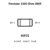
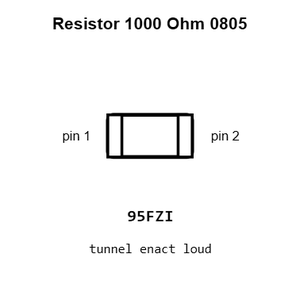
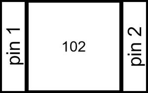
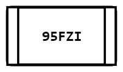
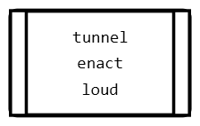
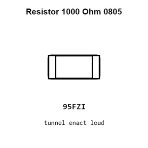
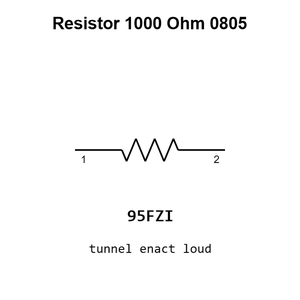

# Resistor 1000 Ohm 0805

`electronic_resistor_0805_1000_ohm`

Resistor 1000 Ohm 0805 is an OOMP electronic resistor definition. It uses the 0805 package or form factor. Its nominal drawing size is 2.0 &#x00D7; 1.25 mm.

## At a glance

| Detail | Value |
| --- | --- |
| OOMP ID | `electronic_resistor_0805_1000_ohm` |
| Type | Resistor |
| Package / style | 0805 |
| Nominal size | 2.0 &#x00D7; 1.25 mm |

## Classification

| Level | Value |
| --- | --- |
| 1 | `electronic` |
| 2 | `resistor` |
| 3 | `0805` |
| 4 | `1000_ohm` |

## Nominal dimensions

| Measurement | Value |
| --- | ---: |
| Length | 2.0 mm |
| Width | 1.25 mm |

## Identifiers

| Identifier | Value |
| --- | --- |
| Manufacturer part number | `0805W8F1001T5E` |
| LCSC | [`C17513`](https://www.lcsc.com/product-detail/C17513.html) |

## Used in projects

| Project | Quantity | References | Explore |
| --- | ---: | --- | --- |
| [Project adafruit/2.8-TFT-Breakout-PCB Adafruit 2.8 TFT Breakout current](https://github.com/adafruit/2.8-TFT-Breakout-PCB/blob/master/Adafruit%202.8%20TFT%20Breakout%20v2.brd) | 2 | R5, R7 | [Board explorer](https://oomlout.github.io/oomp_electronic_version_5/parts/oomp_project_github_adafruit_2_8_tft_breakout_pcb_adafruit_2_8_tft_breakout_current/board_explorer.html) · [OOMP project](https://github.com/oomlout/oomp_electronic_version_5/tree/main/parts/oomp_project_github_adafruit_2_8_tft_breakout_pcb_adafruit_2_8_tft_breakout_current) |
| [Project adafruit/2.8-TFT-Breakout-PCB Adafruit tftlcd8bit current](https://github.com/adafruit/2.8-TFT-Breakout-PCB/blob/master/Adafruit_tftlcd8bit.brd) | 1 | R5 | [Board explorer](https://oomlout.github.io/oomp_electronic_version_5/parts/oomp_project_github_adafruit_2_8_tft_breakout_pcb_adafruit_tftlcd8bit_current/board_explorer.html) · [OOMP project](https://github.com/oomlout/oomp_electronic_version_5/tree/main/parts/oomp_project_github_adafruit_2_8_tft_breakout_pcb_adafruit_tftlcd8bit_current) |
| [Project adafruit/Adafruit_1.8_Inch_TFT_Breakout_PCB 1.8 Inch TFT Breakout current](https://github.com/adafruit/Adafruit_1.8_Inch_TFT_Breakout_PCB/blob/master/jdt1800-bob.brd) | 1 | R2 | [Board explorer](https://oomlout.github.io/oomp_electronic_version_5/parts/oomp_project_github_adafruit_adafruit_1_8_inch_tft_breakout_pcb_1_8_inch_tft_breakout_current/board_explorer.html) · [OOMP project](https://github.com/oomlout/oomp_electronic_version_5/tree/main/parts/oomp_project_github_adafruit_adafruit_1_8_inch_tft_breakout_pcb_1_8_inch_tft_breakout_current) |
| [Project adafruit/Adafruit-1.8-TFT-Shield-PCB Adafruit 1.8 TFTshield current](https://github.com/adafruit/Adafruit-1.8-TFT-Shield-PCB/blob/master/Adafruit%201.8%20TFTshield.brd) | 4 | R2, R3, R8, R9 | [Board explorer](https://oomlout.github.io/oomp_electronic_version_5/parts/oomp_project_github_adafruit_adafruit_1_8_tft_shield_pcb_adafruit_1_8_tftshield_current/board_explorer.html) · [OOMP project](https://github.com/oomlout/oomp_electronic_version_5/tree/main/parts/oomp_project_github_adafruit_adafruit_1_8_tft_shield_pcb_adafruit_1_8_tftshield_current) |
| [Project adafruit/Adafruit_2.8_Inch_TFT_Shield_PCB 2.8 Inch TFT Shield current](https://github.com/adafruit/Adafruit_2.8_Inch_TFT_Shield_PCB/blob/master/tfttouchshield.brd) | 1 | R5 | [Board explorer](https://oomlout.github.io/oomp_electronic_version_5/parts/oomp_project_github_adafruit_adafruit_2_8_inch_tft_shield_pcb_2_8_inch_tft_shield_current/board_explorer.html) · [OOMP project](https://github.com/oomlout/oomp_electronic_version_5/tree/main/parts/oomp_project_github_adafruit_adafruit_2_8_inch_tft_shield_pcb_2_8_inch_tft_shield_current) |
| [Project adafruit/Adafruit-2.8-TFT-Shield-v2-PCB Adafruit tfttouchshield current](https://github.com/adafruit/Adafruit-2.8-TFT-Shield-v2-PCB/blob/master/Adafruit%20tfttouchshield%20v2.2.brd) | 2 | R5, R9 | [Board explorer](https://oomlout.github.io/oomp_electronic_version_5/parts/oomp_project_github_adafruit_adafruit_2_8_tft_shield_v2_pcb_adafruit_tfttouchshield_current/board_explorer.html) · [OOMP project](https://github.com/oomlout/oomp_electronic_version_5/tree/main/parts/oomp_project_github_adafruit_adafruit_2_8_tft_shield_v2_pcb_adafruit_tfttouchshield_current) |
| [Project adafruit/Adafruit-2.8-TFT-with-Capacitive-Touch-PCB Adafruit 2.8 inch TFT w Capacitive Touch current](https://github.com/adafruit/Adafruit-2.8-TFT-with-Capacitive-Touch-PCB/blob/master/Adafruit%202.8%20inch%20TFT%20w%20Capacitive%20Touch.brd) | 1 | R7 | [Board explorer](https://oomlout.github.io/oomp_electronic_version_5/parts/oomp_project_github_adafruit_adafruit_2_8_tft_with_capacitive_touch_pcb_adafruit_2_8_inch_tft_w_capacitive_touch_current/board_explorer.html) · [OOMP project](https://github.com/oomlout/oomp_electronic_version_5/tree/main/parts/oomp_project_github_adafruit_adafruit_2_8_tft_with_capacitive_touch_pcb_adafruit_2_8_inch_tft_w_capacitive_touch_current) |
| [Project adafruit/Adafruit-50pin-to-40pin-TFT-with-AR1100-Adapter-PCB Adafruit 50pin to 40pin TFT with AR1100 Adapter current](https://github.com/adafruit/Adafruit-50pin-to-40pin-TFT-with-AR1100-Adapter-PCB/blob/master/Adafruit%2050pin%20to%2040pin%20TFT%20with%20AR1100%20Adapter.brd) | 2 | R2, R3 | [Board explorer](https://oomlout.github.io/oomp_electronic_version_5/parts/oomp_project_github_adafruit_adafruit_50pin_to_40pin_tft_with_ar1100_adapter_pcb_adafruit_50pin_to_40pin_tft_with_ar1100_adapter_current/board_explorer.html) · [OOMP project](https://github.com/oomlout/oomp_electronic_version_5/tree/main/parts/oomp_project_github_adafruit_adafruit_50pin_to_40pin_tft_with_ar1100_adapter_pcb_adafruit_50pin_to_40pin_tft_with_ar1100_adapter_current) |
| [Project adafruit/Adafruit-5-HDMI-Backpack-PCB Adafruit 5in HDMI Backpack current](https://github.com/adafruit/Adafruit-5-HDMI-Backpack-PCB/blob/master/Adafruit%205in%20HDMI%20Backpack.brd) | 4 | R14, R19, R20, R21 | [Board explorer](https://oomlout.github.io/oomp_electronic_version_5/parts/oomp_project_github_adafruit_adafruit_5_hdmi_backpack_pcb_adafruit_5in_hdmi_backpack_current/board_explorer.html) · [OOMP project](https://github.com/oomlout/oomp_electronic_version_5/tree/main/parts/oomp_project_github_adafruit_adafruit_5_hdmi_backpack_pcb_adafruit_5in_hdmi_backpack_current) |
| [Project adafruit/Adafruit_Atmega32u4_Breakout_Board ATmega32u4 Breakout current](https://github.com/adafruit/Adafruit_Atmega32u4_Breakout_Board/blob/master/atmega32u4bb.brd) | 2 | R3, R5 | [Board explorer](https://oomlout.github.io/oomp_electronic_version_5/parts/oomp_project_github_adafruit_adafruit_atmega32u4_breakout_board_atmega32u4_breakout_current/board_explorer.html) · [OOMP project](https://github.com/oomlout/oomp_electronic_version_5/tree/main/parts/oomp_project_github_adafruit_adafruit_atmega32u4_breakout_board_atmega32u4_breakout_current) |
| [Project adafruit/Adafruit-Bluefruit-LE-USB-Friend-and-Sniffer-PCB Adafruit Bluefruit LE USB Friend current](https://github.com/adafruit/Adafruit-Bluefruit-LE-USB-Friend-and-Sniffer-PCB/blob/master/Adafruit%20Bluefruit%20LE%20USB%20Friend.brd) | 4 | R1, R2, R3, R7 | [Board explorer](https://oomlout.github.io/oomp_electronic_version_5/parts/oomp_project_github_adafruit_adafruit_bluefruit_le_usb_friend_and_sniffer_pcb_adafruit_bluefruit_le_usb_friend_current/board_explorer.html) · [OOMP project](https://github.com/oomlout/oomp_electronic_version_5/tree/main/parts/oomp_project_github_adafruit_adafruit_bluefruit_le_usb_friend_and_sniffer_pcb_adafruit_bluefruit_le_usb_friend_current) |
| [Project adafruit/Adafruit-DC-Stepper-Motor-FeatherWing-PCB Adafruit DC+Stepper Wing current](https://github.com/adafruit/Adafruit-DC-Stepper-Motor-FeatherWing-PCB/blob/master/Adafruit%20DC%2BStepper%20Wing.brd) | 1 | R4 | [Board explorer](https://oomlout.github.io/oomp_electronic_version_5/parts/oomp_project_github_adafruit_adafruit_dc_stepper_motor_feather_wing_pcb_adafruit_dc_stepper_wing_current/board_explorer.html) · [OOMP project](https://github.com/oomlout/oomp_electronic_version_5/tree/main/parts/oomp_project_github_adafruit_adafruit_dc_stepper_motor_feather_wing_pcb_adafruit_dc_stepper_wing_current) |
| [Project adafruit/Adafruit-DC-Stepper-Motor-HAT-PCB Adafruit Motor HAT current](https://github.com/adafruit/Adafruit-DC-Stepper-Motor-HAT-PCB/blob/master/Adafruit%20Motor%20HAT%20rev%20A.brd) | 1 | R7 | [Board explorer](https://oomlout.github.io/oomp_electronic_version_5/parts/oomp_project_github_adafruit_adafruit_dc_stepper_motor_hat_pcb_adafruit_motor_hat_current/board_explorer.html) · [OOMP project](https://github.com/oomlout/oomp_electronic_version_5/tree/main/parts/oomp_project_github_adafruit_adafruit_dc_stepper_motor_hat_pcb_adafruit_motor_hat_current) |
| [Project adafruit/Adafruit-FONA-800-GSM-Breakout-PCB Adafruit FONA 800 GSM Breakout current](https://github.com/adafruit/Adafruit-FONA-800-GSM-Breakout-PCB/blob/master/Adafruit-FONA-800-GSM-Breakout.brd) | 3 | R2, R4, R5 | [Board explorer](https://oomlout.github.io/oomp_electronic_version_5/parts/oomp_project_github_adafruit_adafruit_fona_800_gsm_breakout_pcb_adafruit_fona_800_gsm_breakout_current/board_explorer.html) · [OOMP project](https://github.com/oomlout/oomp_electronic_version_5/tree/main/parts/oomp_project_github_adafruit_adafruit_fona_800_gsm_breakout_pcb_adafruit_fona_800_gsm_breakout_current) |
| [Project adafruit/Adafruit-FT232H-Breakout-PCB Adafruit FT232 H Original current](https://github.com/adafruit/Adafruit-FT232H-Breakout-PCB/blob/master/Adafruit%20FT232H%20Original.brd) | 2 | R3, R4 | [Board explorer](https://oomlout.github.io/oomp_electronic_version_5/parts/oomp_project_github_adafruit_adafruit_ft232_h_breakout_pcb_adafruit_ft232_h_original_current/board_explorer.html) · [OOMP project](https://github.com/oomlout/oomp_electronic_version_5/tree/main/parts/oomp_project_github_adafruit_adafruit_ft232_h_breakout_pcb_adafruit_ft232_h_original_current) |
| [Project adafruit/Adafruit_FTDI-Friend-PCB FTDI Friend Rev A current](https://github.com/adafruit/Adafruit_FTDI-Friend-PCB/blob/master/Adafruit%20FTDI%20Friend%20Rev%20A.brd) | 2 | R2, R3 | [Board explorer](https://oomlout.github.io/oomp_electronic_version_5/parts/oomp_project_github_adafruit_adafruit_ftdi_friend_pcb_ftdi_friend_rev_a_current/board_explorer.html) · [OOMP project](https://github.com/oomlout/oomp_electronic_version_5/tree/main/parts/oomp_project_github_adafruit_adafruit_ftdi_friend_pcb_ftdi_friend_rev_a_current) |
| [Project adafruit/Adafruit_FTDI-Friend-PCB FTDI Friend Rev A rev_a](https://github.com/adafruit/Adafruit_FTDI-Friend-PCB/blob/master/Adafruit%20FTDI%20Friend%20Rev%20A.brd) | 2 | R2, R3 | [Board explorer](https://oomlout.github.io/oomp_electronic_version_5/parts/oomp_project_github_adafruit_adafruit_ftdi_friend_pcb_ftdi_friend_rev_a_rev_a/board_explorer.html) · [OOMP project](https://github.com/oomlout/oomp_electronic_version_5/tree/main/parts/oomp_project_github_adafruit_adafruit_ftdi_friend_pcb_ftdi_friend_rev_a_rev_a) |
| [Project adafruit/Adafruit-GUVA-Analog-UV-Sensor-Breakout-PCB Adafruit GUVA UV Sensor Breakout current](https://github.com/adafruit/Adafruit-GUVA-Analog-UV-Sensor-Breakout-PCB/blob/master/Adafruit%20GUVA%20UV%20Sensor%20Breakout.brd) | 1 | R3 | [Board explorer](https://oomlout.github.io/oomp_electronic_version_5/parts/oomp_project_github_adafruit_adafruit_guva_analog_uv_sensor_breakout_pcb_adafruit_guva_uv_sensor_breakout_current/board_explorer.html) · [OOMP project](https://github.com/oomlout/oomp_electronic_version_5/tree/main/parts/oomp_project_github_adafruit_adafruit_guva_analog_uv_sensor_breakout_pcb_adafruit_guva_uv_sensor_breakout_current) |
| [Project adafruit/Adafruit_MCP73833_PCB MCP73833 QFN current](https://github.com/adafruit/Adafruit_MCP73833_PCB/blob/master/MCP73833_QFN_v1.0.brd) | 1 | RT1 | [Board explorer](https://oomlout.github.io/oomp_electronic_version_5/parts/oomp_project_github_adafruit_adafruit_mcp73833_pcb_mcp73833_qfn_current/board_explorer.html) · [OOMP project](https://github.com/oomlout/oomp_electronic_version_5/tree/main/parts/oomp_project_github_adafruit_adafruit_mcp73833_pcb_mcp73833_qfn_current) |
| [Project adafruit/Adafruit-METRO-328-PCB Metro Mini current](https://github.com/adafruit/Adafruit-METRO-328-PCB/blob/master/Metro%20Mini%20Rev%20B.brd) | 1 | R11 | [Board explorer](https://oomlout.github.io/oomp_electronic_version_5/parts/oomp_project_github_adafruit_adafruit_metro_328_pcb_metro_mini_current/board_explorer.html) · [OOMP project](https://github.com/oomlout/oomp_electronic_version_5/tree/main/parts/oomp_project_github_adafruit_adafruit_metro_328_pcb_metro_mini_current) |
| [Project adafruit/Adafruit-METRO-328-PCB Metro THM+LDO CP2104 current](https://github.com/adafruit/Adafruit-METRO-328-PCB/blob/master/Metro%20THM%2BLDO%20Rev%20C%20-%20CP2104.brd) | 7 | R1, R3, R6, R9, R10, R11, R12 | [Board explorer](https://oomlout.github.io/oomp_electronic_version_5/parts/oomp_project_github_adafruit_adafruit_metro_328_pcb_metro_thm_ldo_cp2104_current/board_explorer.html) · [OOMP project](https://github.com/oomlout/oomp_electronic_version_5/tree/main/parts/oomp_project_github_adafruit_adafruit_metro_328_pcb_metro_thm_ldo_cp2104_current) |
| [Project adafruit/Adafruit-METRO-328-PCB Metro THM+LDO current](https://github.com/adafruit/Adafruit-METRO-328-PCB/blob/master/Metro%20THM%2BLDO%20Rev%20B.brd) | 7 | R1, R3, R6, R9, R10, R11, R12 | [Board explorer](https://oomlout.github.io/oomp_electronic_version_5/parts/oomp_project_github_adafruit_adafruit_metro_328_pcb_metro_thm_ldo_current/board_explorer.html) · [OOMP project](https://github.com/oomlout/oomp_electronic_version_5/tree/main/parts/oomp_project_github_adafruit_adafruit_metro_328_pcb_metro_thm_ldo_current) |
| [Project adafruit/Adafruit-MicroLipo-PCB Adafruit protrinket backpack current](https://github.com/adafruit/Adafruit-MicroLipo-PCB/blob/master/Adafruit%20protrinket%20backpack.brd) | 2 | R1, R2 | [Board explorer](https://oomlout.github.io/oomp_electronic_version_5/parts/oomp_project_github_adafruit_adafruit_micro_lipo_pcb_adafruit_protrinket_backpack_current/board_explorer.html) · [OOMP project](https://github.com/oomlout/oomp_electronic_version_5/tree/main/parts/oomp_project_github_adafruit_adafruit_micro_lipo_pcb_adafruit_protrinket_backpack_current) |
| [Project adafruit/Adafruit_Microtouch Microtouch current](https://github.com/adafruit/Adafruit_Microtouch/blob/master/PCB/microtouch.brd) | 2 | R5, R7 | [Board explorer](https://oomlout.github.io/oomp_electronic_version_5/parts/oomp_project_github_adafruit_adafruit_microtouch_microtouch_current/board_explorer.html) · [OOMP project](https://github.com/oomlout/oomp_electronic_version_5/tree/main/parts/oomp_project_github_adafruit_adafruit_microtouch_microtouch_current) |
| [Project adafruit/Adafruit-Motor-Shield-V2-PCB Adafruit Motor Shield current](https://github.com/adafruit/Adafruit-Motor-Shield-V2-PCB/blob/master/Adafruit%20Motor%20Shield%20v2.3.brd) | 1 | R4 | [Board explorer](https://oomlout.github.io/oomp_electronic_version_5/parts/oomp_project_github_adafruit_adafruit_motor_shield_v2_pcb_adafruit_motor_shield_current/board_explorer.html) · [OOMP project](https://github.com/oomlout/oomp_electronic_version_5/tree/main/parts/oomp_project_github_adafruit_adafruit_motor_shield_v2_pcb_adafruit_motor_shield_current) |
| [Project adafruit/Adafruit-MPR121-PCB Adafruit MPR121 Breakout current](https://github.com/adafruit/Adafruit-MPR121-PCB/blob/master/Adafruit%20MPR121%20Breakout.brd) | 1 | R7 | [Board explorer](https://oomlout.github.io/oomp_electronic_version_5/parts/oomp_project_github_adafruit_adafruit_mpr121_pcb_adafruit_mpr121_breakout_current/board_explorer.html) · [OOMP project](https://github.com/oomlout/oomp_electronic_version_5/tree/main/parts/oomp_project_github_adafruit_adafruit_mpr121_pcb_adafruit_mpr121_breakout_current) |

## Files

[KiCad symbol, machine-solder and hand-solder footprints](data/kicad/README.md) · [Availability and source masters](data/kicad/manifest.yaml)

[View this part on GitHub](https://github.com/oomlout/oomp_electronic_version_5/tree/main/parts/electronic_resistor_0805_1000_ohm)

[Browse this category](../../navigation/electronic/resistor/0805/README.md)

---

This page is generated from the OOMP part definition by a Roboclick Jinja template. Edit the source taxonomy or template rather than this generated file.