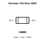
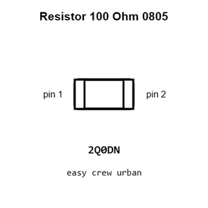
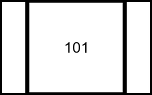
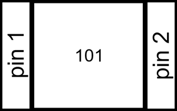
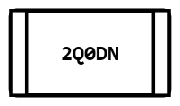
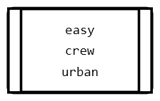
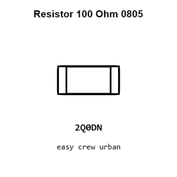
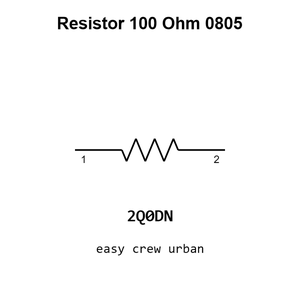

# Resistor 100 Ohm 0805

`electronic_resistor_0805_100_ohm`

Resistor 100 Ohm 0805 is an OOMP electronic resistor definition. It uses the 0805 package or form factor. Its nominal drawing size is 2.0 &#x00D7; 1.25 mm.

## At a glance

| Detail | Value |
| --- | --- |
| OOMP ID | `electronic_resistor_0805_100_ohm` |
| Type | Resistor |
| Package / style | 0805 |
| Nominal size | 2.0 &#x00D7; 1.25 mm |

## Classification

| Level | Value |
| --- | --- |
| 1 | `electronic` |
| 2 | `resistor` |
| 3 | `0805` |
| 4 | `100_ohm` |

## Nominal dimensions

| Measurement | Value |
| --- | ---: |
| Length | 2.0 mm |
| Width | 1.25 mm |

## Identifiers

| Identifier | Value |
| --- | --- |
| Manufacturer part number | `0805W8F1000T5E` |
| LCSC | [`C17408`](https://www.lcsc.com/product-detail/C17408.html) |

## Used in projects

| Project | Quantity | References | Explore |
| --- | ---: | --- | --- |
| [Project adafruit/Adafruit-PAM8302-Mono-Amplifier-PCB Adafruit PAM8302 current](https://github.com/adafruit/Adafruit-PAM8302-Mono-Amplifier-PCB/blob/master/Adafruit%20PAM8302.brd) | 2 | R1, R2 | [Board explorer](https://oomlout.github.io/oomp_electronic_version_5/parts/oomp_project_github_adafruit_adafruit_pam8302_mono_amplifier_pcb_adafruit_pam8302_current/board_explorer.html) · [OOMP project](https://github.com/oomlout/oomp_electronic_version_5/tree/main/parts/oomp_project_github_adafruit_adafruit_pam8302_mono_amplifier_pcb_adafruit_pam8302_current) |
| [Project adafruit/Adafruit-PiTFT-2.2-Inch-HAT-PCB Adafruit 2.2in TFT HAT current](https://github.com/adafruit/Adafruit-PiTFT-2.2-Inch-HAT-PCB/blob/master/Adafruit%202.2in%20TFT%20HAT%20rev%20B.brd) | 4 | R4, R5, R7, R8 | [Board explorer](https://oomlout.github.io/oomp_electronic_version_5/parts/oomp_project_github_adafruit_adafruit_pi_tft_2_2_inch_hat_pcb_adafruit_2_2in_tft_hat_current/board_explorer.html) · [OOMP project](https://github.com/oomlout/oomp_electronic_version_5/tree/main/parts/oomp_project_github_adafruit_adafruit_pi_tft_2_2_inch_hat_pcb_adafruit_2_2in_tft_hat_current) |
| [Project adafruit/Adafruit-PiTFT-Plus-2.8-PCB Adafruit Pi TFT+ 2.8in current](https://github.com/adafruit/Adafruit-PiTFT-Plus-2.8-PCB/blob/master/Adafruit%20PiTFT%2B%202.8in.brd) | 4 | R1, R2, R3, R4 | [Board explorer](https://oomlout.github.io/oomp_electronic_version_5/parts/oomp_project_github_adafruit_adafruit_pi_tft_plus_2_8_pcb_adafruit_pi_tft_2_8in_current/board_explorer.html) · [OOMP project](https://github.com/oomlout/oomp_electronic_version_5/tree/main/parts/oomp_project_github_adafruit_adafruit_pi_tft_plus_2_8_pcb_adafruit_pi_tft_2_8in_current) |
| [Project adafruit/Adafruit-Simple-Soil-Moisture-Sensor-PCB Adafruit Simple Soil Moisture Sensor current](https://github.com/adafruit/Adafruit-Simple-Soil-Moisture-Sensor-PCB/blob/main/Adafruit%20Simple%20Soil%20Moisture%20Sensor.brd) | 1 | R1 | [Board explorer](https://oomlout.github.io/oomp_electronic_version_5/parts/oomp_project_github_adafruit_adafruit_simple_soil_moisture_sensor_pcb_adafruit_simple_soil_moisture_sensor_current/board_explorer.html) · [OOMP project](https://github.com/oomlout/oomp_electronic_version_5/tree/main/parts/oomp_project_github_adafruit_adafruit_simple_soil_moisture_sensor_pcb_adafruit_simple_soil_moisture_sensor_current) |
| [Project adafruit/Adafruit-UDA1334A-I2S-Stereo-DAC-PCB Adafruit UDA1334 I2 S DAC current](https://github.com/adafruit/Adafruit-UDA1334A-I2S-Stereo-DAC-PCB/blob/master/Adafruit%20UDA1334%20I2S%20DAC.brd) | 2 | R4, R6 | [Board explorer](https://oomlout.github.io/oomp_electronic_version_5/parts/oomp_project_github_adafruit_adafruit_uda1334_a_i2_s_stereo_dac_pcb_adafruit_uda1334_i2_s_dac_current/board_explorer.html) · [OOMP project](https://github.com/oomlout/oomp_electronic_version_5/tree/main/parts/oomp_project_github_adafruit_adafruit_uda1334_a_i2_s_stereo_dac_pcb_adafruit_uda1334_i2_s_dac_current) |
| [Project adafruit/Adafruit-VS1053-Breakout-PCB Adafruit VS1053 Breakout current](https://github.com/adafruit/Adafruit-VS1053-Breakout-PCB/blob/master/Adafruit%20VS1053%20Breakout.brd) | 2 | R6, R7 | [Board explorer](https://oomlout.github.io/oomp_electronic_version_5/parts/oomp_project_github_adafruit_adafruit_vs1053_breakout_pcb_adafruit_vs1053_breakout_current/board_explorer.html) · [OOMP project](https://github.com/oomlout/oomp_electronic_version_5/tree/main/parts/oomp_project_github_adafruit_adafruit_vs1053_breakout_pcb_adafruit_vs1053_breakout_current) |

## Files

[KiCad symbol, machine-solder and hand-solder footprints](data/kicad/README.md) · [Availability and source masters](data/kicad/manifest.yaml)

[View this part on GitHub](https://github.com/oomlout/oomp_electronic_version_5/tree/main/parts/electronic_resistor_0805_100_ohm)

[Browse this category](../../navigation/electronic/resistor/0805/README.md)

---

This page is generated from the OOMP part definition by a Roboclick Jinja template. Edit the source taxonomy or template rather than this generated file.