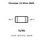
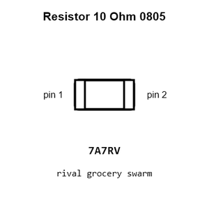
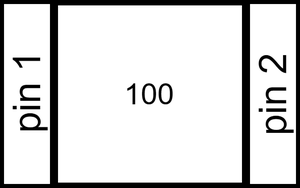
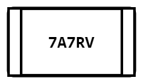
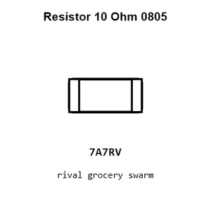
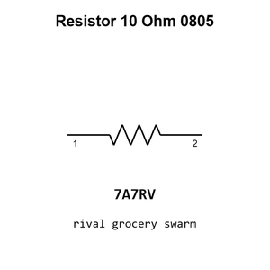

# Resistor 10 Ohm 0805

`electronic_resistor_0805_10_ohm`

Resistor 10 Ohm 0805 is an OOMP electronic resistor definition. It uses the 0805 package or form factor. Its nominal drawing size is 2.0 &#x00D7; 1.25 mm.

## At a glance

| Detail | Value |
| --- | --- |
| OOMP ID | `electronic_resistor_0805_10_ohm` |
| Type | Resistor |
| Package / style | 0805 |
| Nominal size | 2.0 &#x00D7; 1.25 mm |

## Classification

| Level | Value |
| --- | --- |
| 1 | `electronic` |
| 2 | `resistor` |
| 3 | `0805` |
| 4 | `10_ohm` |

## Nominal dimensions

| Measurement | Value |
| --- | ---: |
| Length | 2.0 mm |
| Width | 1.25 mm |

## Identifiers

| Identifier | Value |
| --- | --- |
| Manufacturer part number | `0805W8F100JT5E` |
| LCSC | [`C17415`](https://www.lcsc.com/product-detail/C17415.html) |

## Used in projects

| Project | Quantity | References | Explore |
| --- | ---: | --- | --- |
| [Project adafruit/2.8-TFT-Breakout-PCB Adafruit 2.8 TFT Breakout current](https://github.com/adafruit/2.8-TFT-Breakout-PCB/blob/master/Adafruit%202.8%20TFT%20Breakout%20v2.brd) | 4 | R1, R2, R3, R4 | [Board explorer](https://oomlout.github.io/oomp_electronic_version_5/parts/oomp_project_github_adafruit_2_8_tft_breakout_pcb_adafruit_2_8_tft_breakout_current/board_explorer.html) · [OOMP project](https://github.com/oomlout/oomp_electronic_version_5/tree/main/parts/oomp_project_github_adafruit_2_8_tft_breakout_pcb_adafruit_2_8_tft_breakout_current) |
| [Project adafruit/Adafruit-2.0-inch-240x320-TFT-PCB Adafruit 2.0 inch 240x320 IPS TFT current](https://github.com/adafruit/Adafruit-2.0-inch-240x320-TFT-PCB/blob/master/Adafruit%202.0%20inch%20240x320%20IPS%20TFT.brd) | 1 | R1 | [Board explorer](https://oomlout.github.io/oomp_electronic_version_5/parts/oomp_project_github_adafruit_adafruit_2_0_inch_240x320_tft_pcb_adafruit_2_0_inch_240x320_ips_tft_current/board_explorer.html) · [OOMP project](https://github.com/oomlout/oomp_electronic_version_5/tree/main/parts/oomp_project_github_adafruit_adafruit_2_0_inch_240x320_tft_pcb_adafruit_2_0_inch_240x320_ips_tft_current) |
| [Project adafruit/Adafruit-2.0-inch-240x320-TFT-PCB Adafruit EYESPI 2.0 Inch 240x320 IPS TFT current](https://github.com/adafruit/Adafruit-2.0-inch-240x320-TFT-PCB/blob/master/Adafruit%20EYESPI%202.0%20Inch%20240x320%20IPS%20TFT.brd) | 1 | R1 | [Board explorer](https://oomlout.github.io/oomp_electronic_version_5/parts/oomp_project_github_adafruit_adafruit_2_0_inch_240x320_tft_pcb_adafruit_eyespi_2_0_inch_240x320_ips_tft_current/board_explorer.html) · [OOMP project](https://github.com/oomlout/oomp_electronic_version_5/tree/main/parts/oomp_project_github_adafruit_adafruit_2_0_inch_240x320_tft_pcb_adafruit_eyespi_2_0_inch_240x320_ips_tft_current) |
| [Project adafruit/Adafruit-2.8-TFT-with-Capacitive-Touch-PCB Adafruit 2.8 inch TFT w Capacitive Touch current](https://github.com/adafruit/Adafruit-2.8-TFT-with-Capacitive-Touch-PCB/blob/master/Adafruit%202.8%20inch%20TFT%20w%20Capacitive%20Touch.brd) | 4 | R1, R2, R3, R4 | [Board explorer](https://oomlout.github.io/oomp_electronic_version_5/parts/oomp_project_github_adafruit_adafruit_2_8_tft_with_capacitive_touch_pcb_adafruit_2_8_inch_tft_w_capacitive_touch_current/board_explorer.html) · [OOMP project](https://github.com/oomlout/oomp_electronic_version_5/tree/main/parts/oomp_project_github_adafruit_adafruit_2_8_tft_with_capacitive_touch_pcb_adafruit_2_8_inch_tft_w_capacitive_touch_current) |
| [Project adafruit/Adafruit_FTDI-Friend-PCB FTDI Friend Rev A current](https://github.com/adafruit/Adafruit_FTDI-Friend-PCB/blob/master/Adafruit%20FTDI%20Friend%20Rev%20A.brd) | 2 | R1, R5 | [Board explorer](https://oomlout.github.io/oomp_electronic_version_5/parts/oomp_project_github_adafruit_adafruit_ftdi_friend_pcb_ftdi_friend_rev_a_current/board_explorer.html) · [OOMP project](https://github.com/oomlout/oomp_electronic_version_5/tree/main/parts/oomp_project_github_adafruit_adafruit_ftdi_friend_pcb_ftdi_friend_rev_a_current) |
| [Project adafruit/Adafruit_FTDI-Friend-PCB FTDI Friend Rev A rev_a](https://github.com/adafruit/Adafruit_FTDI-Friend-PCB/blob/master/Adafruit%20FTDI%20Friend%20Rev%20A.brd) | 2 | R1, R5 | [Board explorer](https://oomlout.github.io/oomp_electronic_version_5/parts/oomp_project_github_adafruit_adafruit_ftdi_friend_pcb_ftdi_friend_rev_a_rev_a/board_explorer.html) · [OOMP project](https://github.com/oomlout/oomp_electronic_version_5/tree/main/parts/oomp_project_github_adafruit_adafruit_ftdi_friend_pcb_ftdi_friend_rev_a_rev_a) |

## Files

[KiCad symbol, machine-solder and hand-solder footprints](data/kicad/README.md) · [Availability and source masters](data/kicad/manifest.yaml)

[View this part on GitHub](https://github.com/oomlout/oomp_electronic_version_5/tree/main/parts/electronic_resistor_0805_10_ohm)

[Browse this category](../../navigation/electronic/resistor/0805/README.md)

---

This page is generated from the OOMP part definition by a Roboclick Jinja template. Edit the source taxonomy or template rather than this generated file.