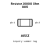
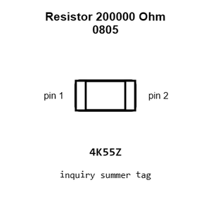
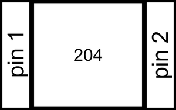
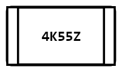
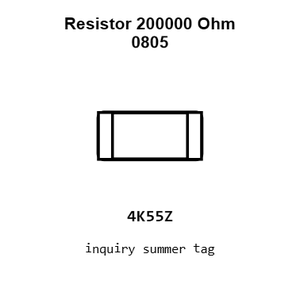
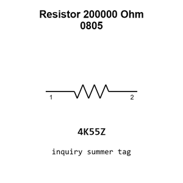

# Resistor 200000 Ohm 0805

`electronic_resistor_0805_200000_ohm`

Resistor 200000 Ohm 0805 is an OOMP electronic resistor definition. It uses the 0805 package or form factor. Its nominal drawing size is 2.0 &#x00D7; 1.25 mm.

## At a glance

| Detail | Value |
| --- | --- |
| OOMP ID | `electronic_resistor_0805_200000_ohm` |
| Type | Resistor |
| Package / style | 0805 |
| Nominal size | 2.0 &#x00D7; 1.25 mm |

## Classification

| Level | Value |
| --- | --- |
| 1 | `electronic` |
| 2 | `resistor` |
| 3 | `0805` |
| 4 | `200000_ohm` |

## Nominal dimensions

| Measurement | Value |
| --- | ---: |
| Length | 2.0 mm |
| Width | 1.25 mm |

## Used in projects

| Project | Quantity | References | Explore |
| --- | ---: | --- | --- |
| [Project adafruit/Adafruit-PowerBoost-1000C Adafruit Power Boost 1000 C current](https://github.com/adafruit/Adafruit-PowerBoost-1000C/blob/master/Adafruit%20PowerBoost%201000C%20Rev%20B.brd) | 2 | R4, R13 | [Board explorer](https://oomlout.github.io/oomp_electronic_version_5/parts/oomp_project_github_adafruit_adafruit_power_boost_1000_c_adafruit_power_boost_1000_c_current/board_explorer.html) · [OOMP project](https://github.com/oomlout/oomp_electronic_version_5/tree/main/parts/oomp_project_github_adafruit_adafruit_power_boost_1000_c_adafruit_power_boost_1000_c_current) |
| [Project adafruit/Adafruit-PowerBoost-1000-PCB Adafruit Power Boost 1000 Basic current](https://github.com/adafruit/Adafruit-PowerBoost-1000-PCB/blob/master/Adafruit%20PowerBoost%201000%20Basic.brd) | 2 | R4, R13 | [Board explorer](https://oomlout.github.io/oomp_electronic_version_5/parts/oomp_project_github_adafruit_adafruit_power_boost_1000_pcb_adafruit_power_boost_1000_basic_current/board_explorer.html) · [OOMP project](https://github.com/oomlout/oomp_electronic_version_5/tree/main/parts/oomp_project_github_adafruit_adafruit_power_boost_1000_pcb_adafruit_power_boost_1000_basic_current) |
| [Project adafruit/Adafruit-PowerBoost-500-Basic-PCB Adafruit Power Boost 500 Basic current](https://github.com/adafruit/Adafruit-PowerBoost-500-Basic-PCB/blob/master/Adafruit%20PowerBoost%20500%20Basic.brd) | 1 | R4 | [Board explorer](https://oomlout.github.io/oomp_electronic_version_5/parts/oomp_project_github_adafruit_adafruit_power_boost_500_basic_pcb_adafruit_power_boost_500_basic_current/board_explorer.html) · [OOMP project](https://github.com/oomlout/oomp_electronic_version_5/tree/main/parts/oomp_project_github_adafruit_adafruit_power_boost_500_basic_pcb_adafruit_power_boost_500_basic_current) |
| [Project adafruit/Adafruit-PowerBoost-500-Charger-PCB Adafruit Power Boost 500 C current](https://github.com/adafruit/Adafruit-PowerBoost-500-Charger-PCB/blob/master/Adafruit%20PowerBoost%20500C.brd) | 1 | R4 | [Board explorer](https://oomlout.github.io/oomp_electronic_version_5/parts/oomp_project_github_adafruit_adafruit_power_boost_500_charger_pcb_adafruit_power_boost_500_c_current/board_explorer.html) · [OOMP project](https://github.com/oomlout/oomp_electronic_version_5/tree/main/parts/oomp_project_github_adafruit_adafruit_power_boost_500_charger_pcb_adafruit_power_boost_500_c_current) |

## Files

[KiCad symbol, machine-solder and hand-solder footprints](data/kicad/README.md) · [Availability and source masters](data/kicad/manifest.yaml)

[View this part on GitHub](https://github.com/oomlout/oomp_electronic_version_5/tree/main/parts/electronic_resistor_0805_200000_ohm)

[Browse this category](../../navigation/electronic/resistor/0805/README.md)

---

This page is generated from the OOMP part definition by a Roboclick Jinja template. Edit the source taxonomy or template rather than this generated file.