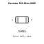
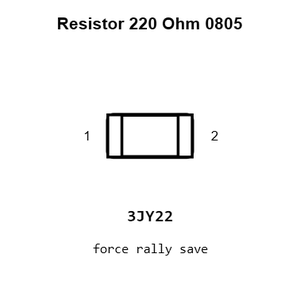
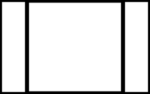
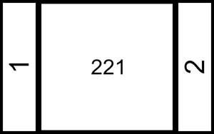
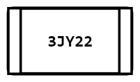
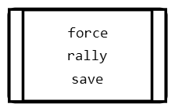
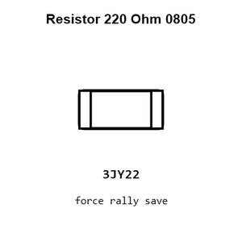
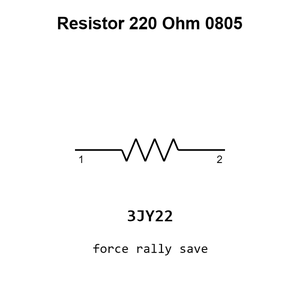

# Resistor 220 Ohm 0805

`electronic_resistor_0805_220_ohm`

Resistor 220 Ohm 0805 is an OOMP electronic resistor definition. It uses the 0805 package or form factor. Its nominal drawing size is 2.0 &#x00D7; 1.25 mm. The definition includes 2 documented pins.

## At a glance

| Detail | Value |
| --- | --- |
| OOMP ID | `electronic_resistor_0805_220_ohm` |
| Type | Resistor |
| Package / style | 0805 |
| Nominal size | 2.0 &#x00D7; 1.25 mm |
| Documented pins | 2 |

## Classification

| Level | Value |
| --- | --- |
| 1 | `electronic` |
| 2 | `resistor` |
| 3 | `0805` |
| 4 | `220_ohm` |

## Nominal dimensions

| Measurement | Value |
| --- | ---: |
| Height | 0.55 mm |
| Length | 2.0 mm |
| Width | 1.25 mm |

## Identifiers

| Identifier | Value |
| --- | --- |
| Manufacturer part number | `0805W8F2200T5E` |
| LCSC | [`C17557`](https://www.lcsc.com/product-detail/C17557.html) |
| JLCPCB | [`C17557`](https://jlcpcb.com/partdetail/18245-0805W8F2200T5E/C17557) |

## Pins

| Pin | Name | Type |
| ---: | --- | --- |
| 1 | 1 | passive |
| 2 | 2 | passive |

## Datasheet

[View the datasheet](data/datasheet.pdf)

## Used in projects

| Project | Quantity | References | Explore |
| --- | ---: | --- | --- |
| [Project adafruit/Adafruit-16-Channel-PWM-Servo-Driver-PCB Adafruit PCA9685 current](https://github.com/adafruit/Adafruit-16-Channel-PWM-Servo-Driver-PCB/blob/master/Adafruit%20PCA9685.brd) | 17 | R10, R11, R12, R13, R14, R15, R16, R17, R18, R19, R20, R21, R22, R23, R24, R25, R26 | [Board explorer](https://oomlout.github.io/oomp_electronic_version_5/parts/oomp_project_github_adafruit_adafruit_16_channel_pwm_servo_driver_pcb_adafruit_pca9685_current/board_explorer.html) · [OOMP project](https://github.com/oomlout/oomp_electronic_version_5/tree/main/parts/oomp_project_github_adafruit_adafruit_16_channel_pwm_servo_driver_pcb_adafruit_pca9685_current) |
| [Project adafruit/Adafruit-1.8-TFT-Shield-PCB Adafruit 1.8 TFTshield current](https://github.com/adafruit/Adafruit-1.8-TFT-Shield-PCB/blob/master/Adafruit%201.8%20TFTshield.brd) | 1 | R5 | [Board explorer](https://oomlout.github.io/oomp_electronic_version_5/parts/oomp_project_github_adafruit_adafruit_1_8_tft_shield_pcb_adafruit_1_8_tftshield_current/board_explorer.html) · [OOMP project](https://github.com/oomlout/oomp_electronic_version_5/tree/main/parts/oomp_project_github_adafruit_adafruit_1_8_tft_shield_pcb_adafruit_1_8_tftshield_current) |
| [Project adafruit/Adafruit-RGB-LCD-shield-PCB RGB LCD Shield current](https://github.com/adafruit/Adafruit-RGB-LCD-shield-PCB/blob/master/adafruit_rgblcdshield.brd) | 1 | RED0 | [Board explorer](https://oomlout.github.io/oomp_electronic_version_5/parts/oomp_project_github_adafruit_adafruit_rgb_lcd_shield_pcb_rgb_lcd_shield_current/board_explorer.html) · [OOMP project](https://github.com/oomlout/oomp_electronic_version_5/tree/main/parts/oomp_project_github_adafruit_adafruit_rgb_lcd_shield_pcb_rgb_lcd_shield_current) |
| [Project adafruit/Adafruit-RGB-LCD-shield-PCB RGB LCD Shield Rev B current](https://github.com/adafruit/Adafruit-RGB-LCD-shield-PCB/blob/master/Adafruit%20RGB%20LCD%20Shield%20Rev%20B.brd) | 1 | RED0 | [Board explorer](https://oomlout.github.io/oomp_electronic_version_5/parts/oomp_project_github_adafruit_adafruit_rgb_lcd_shield_pcb_rgb_lcd_shield_rev_b_current/board_explorer.html) · [OOMP project](https://github.com/oomlout/oomp_electronic_version_5/tree/main/parts/oomp_project_github_adafruit_adafruit_rgb_lcd_shield_pcb_rgb_lcd_shield_rev_b_current) |

## Files

[KiCad symbol, machine-solder and hand-solder footprints](data/kicad/README.md) · [Availability and source masters](data/kicad/manifest.yaml)

[View this part on GitHub](https://github.com/oomlout/oomp_electronic_version_5/tree/main/parts/electronic_resistor_0805_220_ohm)

[Browse this category](../../navigation/electronic/resistor/0805/README.md)

---

This page is generated from the OOMP part definition by a Roboclick Jinja template. Edit the source taxonomy or template rather than this generated file.