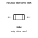
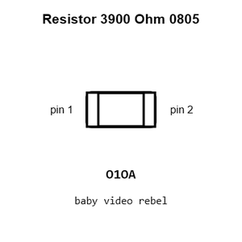
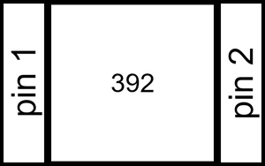
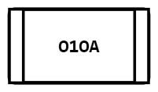
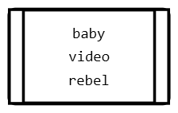
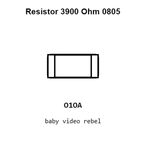
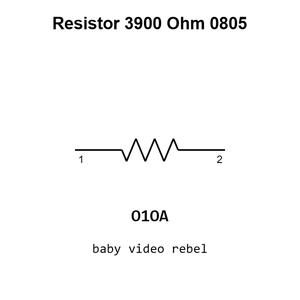

# Resistor 3900 Ohm 0805

`electronic_resistor_0805_3900_ohm`

Resistor 3900 Ohm 0805 is an OOMP electronic resistor definition. It uses the 0805 package or form factor. Its nominal drawing size is 2.0 &#x00D7; 1.25 mm.

## At a glance

| Detail | Value |
| --- | --- |
| OOMP ID | `electronic_resistor_0805_3900_ohm` |
| Type | Resistor |
| Package / style | 0805 |
| Nominal size | 2.0 &#x00D7; 1.25 mm |

## Classification

| Level | Value |
| --- | --- |
| 1 | `electronic` |
| 2 | `resistor` |
| 3 | `0805` |
| 4 | `3900_ohm` |

## Nominal dimensions

| Measurement | Value |
| --- | ---: |
| Length | 2.0 mm |
| Width | 1.25 mm |

## Identifiers

| Identifier | Value |
| --- | --- |
| Manufacturer part number | `FRC0805F3901TS` |
| LCSC | [`C2907252`](https://www.lcsc.com/product-detail/C2907252.html) |

## Used in projects

| Project | Quantity | References | Explore |
| --- | ---: | --- | --- |
| [Project adafruit/Adafruit-DC-Stepper-Motor-HAT-PCB Adafruit Motor HAT current](https://github.com/adafruit/Adafruit-DC-Stepper-Motor-HAT-PCB/blob/master/Adafruit%20Motor%20HAT%20rev%20A.brd) | 3 | R1, R2, R3 | [Board explorer](https://oomlout.github.io/oomp_electronic_version_5/parts/oomp_project_github_adafruit_adafruit_dc_stepper_motor_hat_pcb_adafruit_motor_hat_current/board_explorer.html) · [OOMP project](https://github.com/oomlout/oomp_electronic_version_5/tree/main/parts/oomp_project_github_adafruit_adafruit_dc_stepper_motor_hat_pcb_adafruit_motor_hat_current) |
| [Project adafruit/Adafruit-Perma-Proto-HAT-PCB Adafruit Ha D Proto HAT current](https://github.com/adafruit/Adafruit-Perma-Proto-HAT-PCB/blob/master/Adafruit%20HaD%20Proto%20HAT%20rev%20A.brd) | 3 | R1, R2, R3 | [Board explorer](https://oomlout.github.io/oomp_electronic_version_5/parts/oomp_project_github_adafruit_adafruit_perma_proto_hat_pcb_adafruit_ha_d_proto_hat_current/board_explorer.html) · [OOMP project](https://github.com/oomlout/oomp_electronic_version_5/tree/main/parts/oomp_project_github_adafruit_adafruit_perma_proto_hat_pcb_adafruit_ha_d_proto_hat_current) |
| [Project adafruit/Adafruit-PiTFT-2.2-Inch-HAT-PCB Adafruit 2.2in TFT HAT current](https://github.com/adafruit/Adafruit-PiTFT-2.2-Inch-HAT-PCB/blob/master/Adafruit%202.2in%20TFT%20HAT%20rev%20B.brd) | 3 | R1, R2, R3 | [Board explorer](https://oomlout.github.io/oomp_electronic_version_5/parts/oomp_project_github_adafruit_adafruit_pi_tft_2_2_inch_hat_pcb_adafruit_2_2in_tft_hat_current/board_explorer.html) · [OOMP project](https://github.com/oomlout/oomp_electronic_version_5/tree/main/parts/oomp_project_github_adafruit_adafruit_pi_tft_2_2_inch_hat_pcb_adafruit_2_2in_tft_hat_current) |
| [Project adafruit/Adafruit-PiTFT-Plus-2.8-PCB Adafruit Pi TFT+ 2.8in current](https://github.com/adafruit/Adafruit-PiTFT-Plus-2.8-PCB/blob/master/Adafruit%20PiTFT%2B%202.8in.brd) | 4 | R9, R12, R13, R14 | [Board explorer](https://oomlout.github.io/oomp_electronic_version_5/parts/oomp_project_github_adafruit_adafruit_pi_tft_plus_2_8_pcb_adafruit_pi_tft_2_8in_current/board_explorer.html) · [OOMP project](https://github.com/oomlout/oomp_electronic_version_5/tree/main/parts/oomp_project_github_adafruit_adafruit_pi_tft_plus_2_8_pcb_adafruit_pi_tft_2_8in_current) |
| [Project adafruit/Adafruit-RGB-Matrix-HAT-PCB Adafruit RGB Matrix HAT current](https://github.com/adafruit/Adafruit-RGB-Matrix-HAT-PCB/blob/master/Adafruit%20RGB%20Matrix%20HAT.brd) | 3 | R1, R2, R3 | [Board explorer](https://oomlout.github.io/oomp_electronic_version_5/parts/oomp_project_github_adafruit_adafruit_rgb_matrix_hat_pcb_adafruit_rgb_matrix_hat_current/board_explorer.html) · [OOMP project](https://github.com/oomlout/oomp_electronic_version_5/tree/main/parts/oomp_project_github_adafruit_adafruit_rgb_matrix_hat_pcb_adafruit_rgb_matrix_hat_current) |
| [Project adafruit/Adafruit-Servo-HAT-Bonnet-PCB Adafruit Servo HAT current](https://github.com/adafruit/Adafruit-Servo-HAT-Bonnet-PCB/blob/master/Adafruit%20Servo%20HAT%20rev%20A.brd) | 3 | R1, R2, R3 | [Board explorer](https://oomlout.github.io/oomp_electronic_version_5/parts/oomp_project_github_adafruit_adafruit_servo_hat_bonnet_pcb_adafruit_servo_hat_current/board_explorer.html) · [OOMP project](https://github.com/oomlout/oomp_electronic_version_5/tree/main/parts/oomp_project_github_adafruit_adafruit_servo_hat_bonnet_pcb_adafruit_servo_hat_current) |
| [Project adafruit/Adafruit-Ultimate-GPS Adafruit Ultimate GPS Hat current](https://github.com/adafruit/Adafruit-Ultimate-GPS/blob/master/Adafruit%20Ultimate%20GPS%20Hat.brd) | 3 | R1, R2, R3 | [Board explorer](https://oomlout.github.io/oomp_electronic_version_5/parts/oomp_project_github_adafruit_adafruit_ultimate_gps_adafruit_ultimate_gps_hat_current/board_explorer.html) · [OOMP project](https://github.com/oomlout/oomp_electronic_version_5/tree/main/parts/oomp_project_github_adafruit_adafruit_ultimate_gps_adafruit_ultimate_gps_hat_current) |
| [Project adafruit/Adafruit-Ultimate-GPS-HAT-PCB Adafruit Ultimate GPS HAT current](https://github.com/adafruit/Adafruit-Ultimate-GPS-HAT-PCB/blob/master/Adafruit%20Ultimate%20GPS%20HAT.brd) | 3 | R1, R2, R3 | [Board explorer](https://oomlout.github.io/oomp_electronic_version_5/parts/oomp_project_github_adafruit_adafruit_ultimate_gps_hat_pcb_adafruit_ultimate_gps_hat_current/board_explorer.html) · [OOMP project](https://github.com/oomlout/oomp_electronic_version_5/tree/main/parts/oomp_project_github_adafruit_adafruit_ultimate_gps_hat_pcb_adafruit_ultimate_gps_hat_current) |

## Files

[KiCad symbol, machine-solder and hand-solder footprints](data/kicad/README.md) · [Availability and source masters](data/kicad/manifest.yaml)

[View this part on GitHub](https://github.com/oomlout/oomp_electronic_version_5/tree/main/parts/electronic_resistor_0805_3900_ohm)

[Browse this category](../../navigation/electronic/resistor/0805/README.md)

---

This page is generated from the OOMP part definition by a Roboclick Jinja template. Edit the source taxonomy or template rather than this generated file.