# Resistor 270 Ohm 1206

`electronic_resistor_1206_270_ohm_uni_royal_uniroyal_elec_1206w4f2700t5e`

Resistor 270 Ohm 1206 is an OOMP electronic resistor definition. It uses the 1206 package or form factor. Its nominal drawing size is 3.2 &#x00D7; 1.6 mm. The definition includes 2 documented pins.

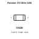

## At a glance

| Detail | Value |
| --- | --- |
| OOMP ID | `electronic_resistor_1206_270_ohm_uni_royal_uniroyal_elec_1206w4f2700t5e` |
| Type | Resistor |
| Package / style | 1206 |
| Nominal size | 3.2 &#x00D7; 1.6 mm |
| Documented pins | 2 |

## Classification

| Level | Value |
| --- | --- |
| 1 | `electronic` |
| 2 | `resistor` |
| 3 | `1206` |
| 4 | `270_ohm` |
| 14 | `uni_royal_uniroyal_elec` |
| 15 | `1206w4f2700t5e` |

## Nominal dimensions

| Measurement | Value |
| --- | ---: |
| Height | 0.55 mm |
| Length | 3.2 mm |
| Width | 1.6 mm |

## Identifiers

| Identifier | Value |
| --- | --- |
| Manufacturer part number | `1206W4F2700T5E` |
| LCSC | [`C4466`](https://www.lcsc.com/product-detail/C4466.html) |
| JLCPCB | [`C4466`](https://jlcpcb.com/partdetail/4873-1206W4F2700T5E/C4466) |

## Pins

| Pin | Name | Type |
| ---: | --- | --- |
| 1 | 1 | passive |
| 2 | 2 | passive |

## Datasheet

[View the datasheet](data/datasheet.pdf)

## Files

[KiCad symbol, machine-solder and hand-solder footprints](data/kicad/README.md) · [Availability and source masters](data/kicad/manifest.yaml)

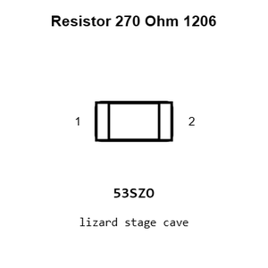

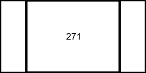

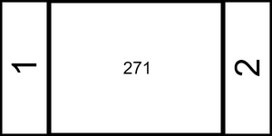

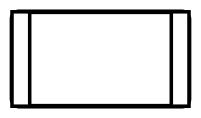

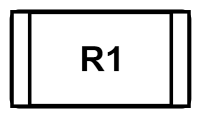

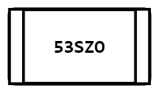

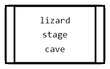

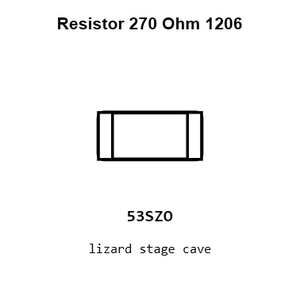

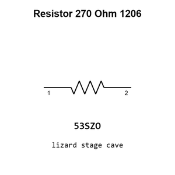

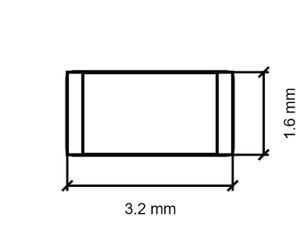

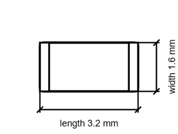

[View this part on GitHub](https://github.com/oomlout/oomp_electronic_version_5/tree/main/parts/electronic_resistor_1206_270_ohm_uni_royal_uniroyal_elec_1206w4f2700t5e)

[Browse this category](../../navigation/electronic/resistor/1206/270_ohm/uni_royal_uniroyal_elec/README.md)

---

This page is generated from the OOMP part definition by a Roboclick Jinja template. Edit the source taxonomy or template rather than this generated file.