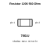
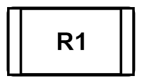
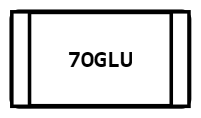
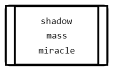
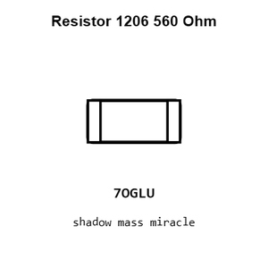
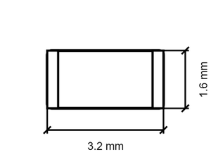
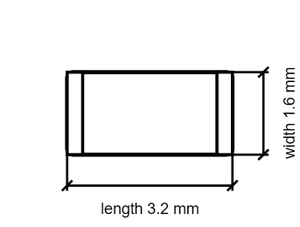

# Resistor 1206 560 Ohm

`electronic_resistor_1206_560_ohm`

Resistor 1206 560 Ohm is an OOMP electronic resistor definition. It uses the 1206 package or form factor. Its nominal drawing size is 3.2 &#x00D7; 1.6 mm.

  
   
  <strong>Pinout</strong> · click for the full-size SVG

## At a glance

| Detail | Value |
| --- | --- |
| OOMP ID | `electronic_resistor_1206_560_ohm` |
| Type | Resistor |
| Package / style | 1206 |
| Nominal size | 3.2 &#x00D7; 1.6 mm |

## Diagram gallery

<table>

  <tr>
  
    <td align="center" width="33%">
       
      <strong>Assembly</strong>
    </td>
  
    <td align="center" width="33%">
       
      <strong>Outline</strong>
    </td>
  
    <td align="center" width="33%">
       
      <strong>Part ID</strong>
    </td>
  
  </tr>

  <tr>
  
    <td align="center" width="33%">
       
      <strong>MD5 alpha</strong>
    </td>
  
    <td align="center" width="33%">
       
      <strong>BIP 39 words</strong>
    </td>
  
    <td align="center" width="33%">
       
      <strong>Square summary</strong>
    </td>
  
  </tr>

  <tr>
  
    <td align="center" width="33%">
       
      <strong>Dimensions</strong>
    </td>
  
    <td align="center" width="33%">
       
      <strong>Dimensions with labels</strong>
    </td>
  
  </tr>

</table>

Each preview links to its full-size vector drawing.

## Classification

| Level | Value |
| --- | --- |
| 1 | `electronic` |
| 2 | `resistor` |
| 3 | `1206` |
| 4 | `560_ohm` |

## Nominal dimensions

| Measurement | Value |
| --- | ---: |
| Length | 3.2 mm |
| Width | 1.6 mm |

## Files

- [Pinout drawing](working_svg_square_pins.svg)
- [Assembly drawing](working_svg_assembly.svg)
- [Outline drawing](working_svg_outline.svg)
- [Part ID drawing](working_svg_part_id.svg)
- [MD5 alpha drawing](working_svg_md5_6_alpha.svg)
- [BIP 39 words drawing](working_svg_bip_39_3_word.svg)
- [Square summary](working_svg_square.svg)
- [Dimensioned drawing](working_svg_dimensioned_titles.svg)

- [Structured definition](working.yaml)

[View this part on GitHub](https://github.com/oomlout/oomp_electronic_version_5/tree/main/parts/electronic_resistor_1206_560_ohm)

---

This page is generated from the OOMP part definition by a Roboclick Jinja template. Edit the source taxonomy or template rather than this generated file.