# Resistor 0.1 Ohm 1210

`electronic_resistor_1210_0_1_ohm`

Resistor 0.1 Ohm 1210 is an OOMP electronic resistor definition. It uses the 1210 package or form factor. Its nominal drawing size is 3.2 &#x00D7; 2.5 mm. The definition includes 2 documented pins.

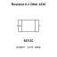

## At a glance

| Detail | Value |
| --- | --- |
| OOMP ID | `electronic_resistor_1210_0_1_ohm` |
| Type | Resistor |
| Package / style | 1210 |
| Nominal size | 3.2 &#x00D7; 2.5 mm |
| Documented pins | 2 |

## Classification

| Level | Value |
| --- | --- |
| 1 | `electronic` |
| 2 | `resistor` |
| 3 | `1210` |
| 4 | `0_1_ohm` |

## Nominal dimensions

| Measurement | Value |
| --- | ---: |
| Length | 3.2 mm |
| Width | 2.5 mm |

## Pins

| Pin | Name | Type |
| ---: | --- | --- |
| 1 | 1 | signal |
| 2 | 2 | signal |

## Used in projects

| Project | Quantity | References | Explore |
| --- | ---: | --- | --- |
| [Project soldered_electronics/Voltage---current-sensor-INA219-breakout-hardware-design INA219 Breakout current](https://github.com/SolderedElectronics/Voltage---current-sensor-INA219-breakout-hardware-design) | 1 | R5 | [Board explorer](https://oomlout.github.io/oomp_electronic_version_5/parts/oomp_project_github_soldered_electronics_voltage_current_sensor_ina219_breakout_hardware_design_sensor_power_ina219_current/board_explorer.html) · [OOMP project](https://github.com/oomlout/oomp_electronic_version_5/tree/main/parts/oomp_project_github_soldered_electronics_voltage_current_sensor_ina219_breakout_hardware_design_sensor_power_ina219_current) |

## Files

[KiCad symbol, machine-solder and hand-solder footprints](data/kicad/README.md) · [Availability and source masters](data/kicad/manifest.yaml)

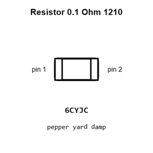

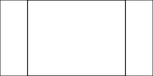

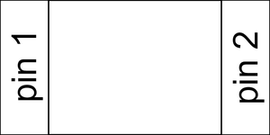

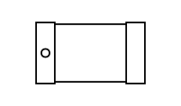

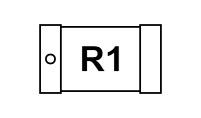

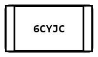

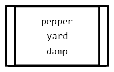

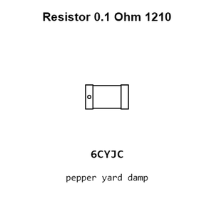

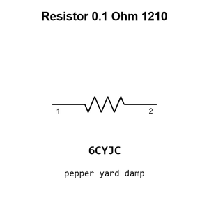

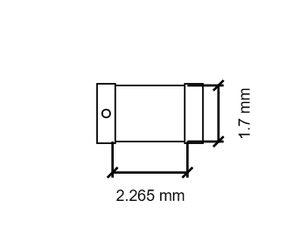

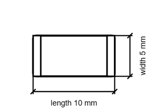

[View this part on GitHub](https://github.com/oomlout/oomp_electronic_version_5/tree/main/parts/electronic_resistor_1210_0_1_ohm)

[Browse this category](../../navigation/electronic/resistor/1210/README.md)

---

This page is generated from the OOMP part definition by a Roboclick Jinja template. Edit the source taxonomy or template rather than this generated file.