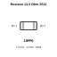
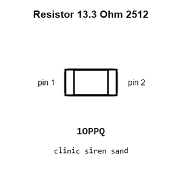
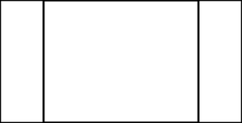
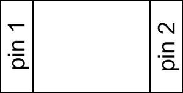
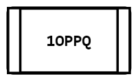
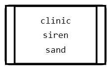
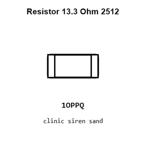
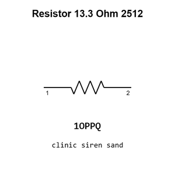
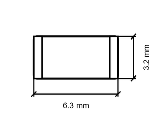
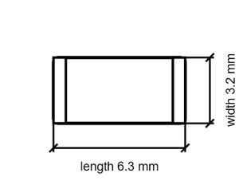

# Resistor 13.3 Ohm 2512

`electronic_resistor_2512_13_3_ohm`

Resistor 13.3 Ohm 2512 is an OOMP electronic resistor definition. It uses the 2512 package or form factor. Its nominal drawing size is 6.3 &#x00D7; 3.2 mm.

## At a glance

| Detail | Value |
| --- | --- |
| OOMP ID | `electronic_resistor_2512_13_3_ohm` |
| Type | Resistor |
| Package / style | 2512 |
| Nominal size | 6.3 &#x00D7; 3.2 mm |

## Classification

| Level | Value |
| --- | --- |
| 1 | `electronic` |
| 2 | `resistor` |
| 3 | `2512` |
| 4 | `13_3_ohm` |

## Nominal dimensions

| Measurement | Value |
| --- | ---: |
| Length | 6.3 mm |
| Width | 3.2 mm |

## Used in projects

| Project | Quantity | References | Explore |
| --- | ---: | --- | --- |
| [Project sparkfun/SparkFun_GNSS_DAN-F10N GNSS DAN-F10N current](https://github.com/sparkfun/SparkFun_GNSS_DAN-F10N) | 1 | R6 | [Board explorer](https://oomlout.github.io/oomp_electronic_version_5/parts/oomp_project_github_sparkfun_spark_fun_gnss_dan_f10_n_gnss_dan_f10n_current/board_explorer.html) · [OOMP project](https://github.com/oomlout/oomp_electronic_version_5/tree/main/parts/oomp_project_github_sparkfun_spark_fun_gnss_dan_f10_n_gnss_dan_f10n_current) |

## Files

[KiCad symbol, machine-solder and hand-solder footprints](data/kicad/README.md) · [Availability and source masters](data/kicad/manifest.yaml)

[View this part on GitHub](https://github.com/oomlout/oomp_electronic_version_5/tree/main/parts/electronic_resistor_2512_13_3_ohm)

[Browse this category](../../navigation/electronic/resistor/2512/README.md)

---

This page is generated from the OOMP part definition by a Roboclick Jinja template. Edit the source taxonomy or template rather than this generated file.