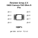
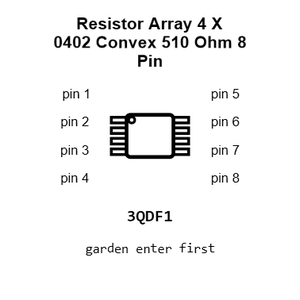
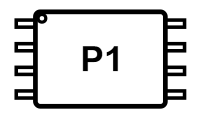
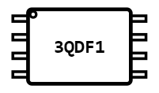
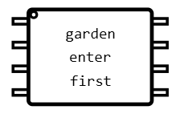
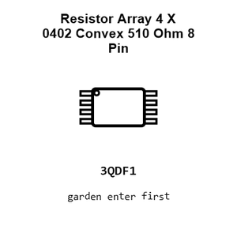
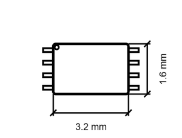
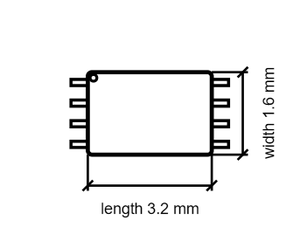

# Resistor Array 4 X 0402 Convex 510 Ohm 8 Pin

`electronic_resistor_array_4_x_0402_convex_510_ohm_8_pin`

Resistor Array 4 X 0402 Convex 510 Ohm 8 Pin is an OOMP electronic resistor array definition. It uses the 4 x 0402 convex package or form factor. Its nominal drawing size is 3.2 &#x00D7; 1.6 mm.

## At a glance

| Detail | Value |
| --- | --- |
| OOMP ID | `electronic_resistor_array_4_x_0402_convex_510_ohm_8_pin` |
| Type | Resistor Array |
| Package / style | 4 x 0402 convex |
| Nominal size | 3.2 &#x00D7; 1.6 mm |

## Classification

| Level | Value |
| --- | --- |
| 1 | `electronic` |
| 2 | `resistor_array` |
| 3 | `4_x_0402_convex` |
| 4 | `510_ohm` |
| 5 | `8_pin` |

## Nominal dimensions

| Measurement | Value |
| --- | ---: |
| Length | 3.2 mm |
| Width | 1.6 mm |

## Files

[View this part on GitHub](https://github.com/oomlout/oomp_electronic_version_5/tree/main/parts/electronic_resistor_array_4_x_0402_convex_510_ohm_8_pin)

---

This page is generated from the OOMP part definition by a Roboclick Jinja template. Edit the source taxonomy or template rather than this generated file.