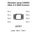
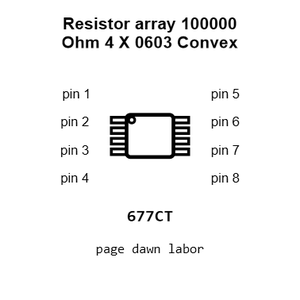
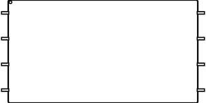
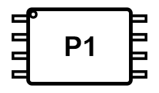
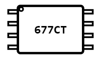
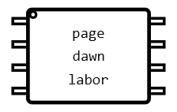
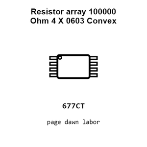
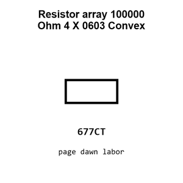
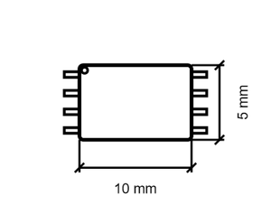
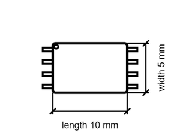

# Resistor array 100000 Ohm 4 X 0603 Convex

`electronic_resistor_array_4_x_0603_convex_100000_ohm_8_pin`

Resistor array 100000 Ohm 4 X 0603 Convex is an OOMP electronic resistor array definition. It uses the 4 x 0603 convex package or form factor. Its nominal drawing size is 10.0 &#x00D7; 5.0 mm.

## At a glance

| Detail | Value |
| --- | --- |
| OOMP ID | `electronic_resistor_array_4_x_0603_convex_100000_ohm_8_pin` |
| Type | Resistor Array |
| Package / style | 4 x 0603 convex |
| Nominal size | 10.0 &#x00D7; 5.0 mm |

## Classification

| Level | Value |
| --- | --- |
| 1 | `electronic` |
| 2 | `resistor_array` |
| 3 | `4_x_0603_convex` |
| 4 | `100000_ohm` |
| 5 | `8_pin` |

## Nominal dimensions

| Measurement | Value |
| --- | ---: |
| Length | 10.0 mm |
| Width | 5.0 mm |

## Files

[KiCad symbol, machine-solder and hand-solder footprints](data/kicad/README.md) · [Availability and source masters](data/kicad/manifest.yaml)

[View this part on GitHub](https://github.com/oomlout/oomp_electronic_version_5/tree/main/parts/electronic_resistor_array_4_x_0603_convex_100000_ohm_8_pin)

[Browse this category](../../navigation/electronic/resistor_array/4_x_0603_convex/100000_ohm/README.md)

---

This page is generated from the OOMP part definition by a Roboclick Jinja template. Edit the source taxonomy or template rather than this generated file.